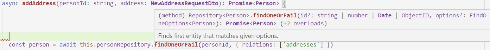

## Operaciones externas
Llamemos _operación externa_ a cualquier operación que se invoca dentro de una VM JS (que puede ser p.ej. una instancia de Node o un browser), y que se resuelve fuera de esa VM.

En un _backend_, algunos casos de operaciones externas son:
- invocación de otro microservicio en un entorno de microservicios
- consultas u operaciones sobre una base de datos
- invocación a funcionalidad en otro sistema (p.ej. un core de negocio, MercadoPago, etc.)

En un _frontend_, toda llamada a backend es una operación externa.


## Procesamiento asincrónico
Cualquier llamada a una operación externa, debe manejar el hecho de que el resultado de esa operación va a llegar sólo eventualmente.

En lo que sigue, usamos una invocación HTTP como ejemplo de operación externa. Donde dice `axios.get(<url>)`, bien podría decir p.ej. `<repository>.findOne(<conditions>)`, o una función desarrollada por nosotros que invoca a alguno de estos.

### async-await
La experiencia nos dice que este código
``` javascript
function someBusinessCode() {
    const response = axios.get(<url>)
    doSomething(response.data)
}
```
falla, porque `response.data` es `undefined`. Un `console.log(response)` nos da esto
```
Promise { <pending> }
``` 
¿qué quiere decir esto? Que el resultado de la operación externa es una **promesa**{: style="color: Crimson"}.  
Una promesa ... ¿de qué? De que _en algún momento_ va a llegar el valor. 

Volviendo a la experiencia, sabemos que a este código le faltan un `await` y un `async`.
``` javascript
async function someBusinessData() {
    const response = await axios.get(<url>)
    return doSomething(response.data)
}
```
Con el `await`, estamos forzando a que la función espere que llegue el valor de la operación externa; recién en ese momento se evalúa la línea siguiente.  
Ahora `response` es lo que estábamos esperando:
``` javascript
{
    status: 200,
    headers: { ... },
    data: { ... },
    ...
}
```
A su vez, toda función donde se hace un `await`, debe ser "marcada" como `async`, para que quienes la invoquen sepan que, a su vez, deben hacer `await` para esperar su resultado.
``` javascript
const businessData = await someBusinessData()
/* ... etc ... */
```

------
**Nota**{: style="color: SteelBlue"}:  
En Node, es especialmente crítico que las llamadas externas no sean bloqueantes.  
Una invocación bloqueande puede frenar **todo** el funcionamiento de una VM, dado que ni JS ni Node manejan multithreading en forma nativa.   
Al poner `await`, o usar promesas, habilitamos a la VM de Node a atender otras consultas hasta que llegue el resultado externo.

------


### Promesas
Estos son dos métodos de un servicio NestJS
``` javascript
  async addAddress(personId: string, address: NewAddressRequestDto): Promise<Person> {
    const person = await this.personRepository.findOneOrFail(personId, { relations: ['addresses'] })
    const newAddress = await this.addressRepository.save(address)
    person.addresses.push(newAddress)
    return this.personRepository.save(person)
  }

  findAddressesByPerson(personId: string): Promise<Address[]> {
    return this.addressRepository.find({ person: { id: toNumber(personId) } })
  }
```
Concentrémonos en el **tipo de respuesta** de estos métodos: son `Promise<...tipo...>`. 

El `findOneOrFail` también responde `Promise`:

y lo mismo pasa con `axios.get`.  
Estas `Promise` son _las mismas_ que las del `console.log` de arriba, cuando no habíamos puesto el `await`. 

Volviendo al ejemplo de la sección anterior, podemos implementarlo usando `Promise` así
``` javascript
function someBusinessData() {
    return axios.get(<url>).then(response => doSomething(response.data))
}
```
notar que la función ya no necesita estar "marcada" con `async`.  
Las Promises son objetos a que se les puede indicar `then` con una función que debe ejecutarse cuando la promesa se resuelve, o sea, cuando llega el resultado de la operación externa.  
A una función que se utiliza de esa forma se la llama "continuación". Por eso se dice que al invocar `then` sobre una `Promise`, se le pasa la continuación.

Quienes invoquen a esta función, pueden seguir un patrón parecido ...
``` javascript
someBusinessData().then(businessData => /* ... etc ... */)
```
... pero _también_ pueden mantener la sintaxis con el `await`.  
Cualquier función que devuelve una `Promise` puede ser llamada usando `await`, no es necesario marcarla con `async`.  
En particular, este es el caso del segundo método en el servicio Nest. El `find` devuelve una `Promise`, el método del servicio se limita a devolver la misma `Promise`. No hace falta poner `async`.  
En el otro método del servicio, el `async` es necesario para que compile, porque se hacen `await` adentro. Recordemos que esto viene desde JS.

En rigor, el dúo `async/await` es (al menos hasta donde sé) un syntax sugar para no tener que andar haciendo `then` todo el tiempo.  
En JS, el uso `async/await` habilita a no mencionar a las `Promise` en el código. En TS, seguimos manteniendo las `Promise` en el valor de retorno de las funciones asincrónicas.


