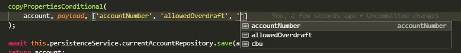

# Tomando datos del payload
En muchos endpoints `POST`, `PUT` o `PATCH`, hay que copiar datos del payload a algún objeto o estructura del servicio.

Veamos este ejemplo de un servicio para agregar una cuenta corriente.
``` typescript
async addCurrentAccount(payload: CurrentAccountDTO): Promise<CurrentAccount> {
    const branch = await this.persistenceService.branchRepository.findOne(
        { where: { branchNumber: payload.branchNumber } }
    )

    if (!branch.isEnabled) {
        throw new BadRequestException(ErrorCode.BRANCH_NOT_ENABLED);
    }

    const newAccount = new CurrentAccount()
    newAccount.accountNumber = payload.accountNumber;
    newAccount.kind = payload.kind;
    newAccount.cbu = payload.cbu;
    newAccount.branch = branch
    newAccount.allowedOverdraft = defaultTo(payload.allowedOverdraft, defaultOverdraft);
    newAccount.balance = 0;

    return await this.currentAccountRepository.save(newAccount); 
}
```

Una de las acciones en este método es volcar los datos del DTO al objeto que se va a persistir. Entre estos datos, hay tres que se vuelcan directamente: `accountNumber`, `kind` y `cbu`. En este caso son tres, que no son tantos. Pero podrían ser muchos más, veamos este extracto de un servicio del Banco.
``` typescript
const { 
    type, state, locality, street, number, floor, department, zip, notes, real, deliveryPhone 
} = payload

/* ... otras cosas ... */

const address = new Address()
address.type = type
address.state = state
address.locality = locality
address.street = street
address.number = number
address.floor = !isNil(floor) ? floor.toString() : null
address.department = department
address.zip = zip.toString()
address.notes = notes
address.real = real
address.deliveryPhone = deliveryPhone
```

Acá ya tenemos 9 datos que se vuelcan directamente del payload al objeto `Address` que se está creando.

En estos casos, también hay algo que se está repitiendo, y que puede mejorarse usando DRY: se están volcando muchos datos de una estructura a otra.

Una situación similar se da en los updates. Veamos el método de update del mismo servicio de cuentas corrientes.
``` typescript
async updateCurrentAccount(id: number, payload: UpdateCurrentAccountDTO): Promise<CurrentAccount> {
    const account = await this.persistenceService.currentAccountRepository.findOne({
        where: { id }
    });
    if (isEmpty(account)) {
        throw new NotFoundException(ErrorCode.ACCOUNT_NOT_FOUND);
    }

    if (!isNil(payload.accountNumber)) {
        account.accountNumber = payload.accountNumber;
    }
    if (!isNil(payload.cbu)) {
        account.cbu = payload.cbu;
    }
    if (!isNil(payload.allowedOverdraft)) {
        account.allowedOverdraft = payload.allowedOverdraft;
    }
    await this.persistenceService.currentAccountRepository.save(account);
    return account;
}
```
En este código, se repite tres veces la lógica de volcar una property del payload al objeto `account`, si tiene un valor válido (en este caso, distinto de `null` o de `undefined`).


## Volcado directo - tres formas
Veamos tres formas distintas de aplicar DRY para el método que agrega una cuenta. En este caso, el volcado de datos del payload a la cuenta no tiene ninguna condición.

En cualquiera de los tres casos, vamos a estar reemplazando estas cuatro líneas del método 
``` typescript
const newAccount = new CurrentAccount()
newAccount.accountNumber = payload.accountNumber;
newAccount.kind = payload.kind;
newAccount.cbu = payload.cbu;
```

### Acceso genérico a cada propiedad
La primera se basa en que se puede acceder a, o modificar, una propiedad de un objeto, con la notación `obj[prop]` en lugar de `obj.prop`. La notación `obj[prop]` es más flexible, porque `prop` puede no ser fija, p.ej. puede ser una variable.

Teniendo esto en cuenta, armamos un array de los _nombres de propiedades_, y para cada uno, volcamos la propiedad correspondiente de `payload` a `newAccount`.
``` typescript
const newAccount = new CurrentAccount();
['accountNumber', 'kind', 'cbu'].forEach(prop => newAccount[prop] = payload[prop]);
```

### Uso de class-transformer + pick
Ya sabemos que usando la función `pick` de `lodash`, se pueden extraer algunas properties de un objeto. Por lo tanto, el resultado de la expresión
``` typescript
pick(payload, ['accountNumber', 'kind', 'cbu'])
```
es un objeto con las tres properties que queremos volcar en el nuevo objeto, p.ej.
``` typescript
{
    accountNumber: '3344499', 
    kind: 'CURRENT_ACCOUNT', 
    cbu: '0410322000408333444599'
}
```
Por otro lado, lo que necesitamos generar es _una instancia_ de `CurrentAccount`, no alcanza con que tenga las properties asignadas. 

Algunas funciones del package `class-transformer` hacen _exactamente_ lo que necesitamos: manejar las transformaciones entre objetos _planos_ (o sea, que no son instancias de una clase), e instancias de una clase, preservando los valores.  
Este package se usa en el `ValidationPipe` de Nest, por eso probablemente ya esté disponible en varios servicios.  
En este caso, el objeto plano es el resultado del `pick`, y la función de `class-transformer` que hace la transformación que necesitamos es `plainToClass`. Por lo tanto, podemos realizar la creación + el volcado de datos de esta forma.
``` typescript
const plainObject = pick(payload, ['accountNumber', 'kind', 'cbu'])
const newAccount = plainToClass(CurrentAccount, plainObject)
```
Ver más detalles en la [doc del package `class-transformer`](https://github.com/typestack/class-transformer#plaintoclass).


### Versión tipada
En las dos versiones anteriores, nos quedó un código más compacto y legible (se puede ver rápidamente qué propiedades del payload pasan sin modificación a la nueva `CurrentAccount`) ... pero con menos chequeos de tipo. En el primer caso, no se hace ningún chequeo. En el segundo, el `pick` chequea que las properties estén en el payload, pero `plainToClass` no verifica que las properties estén en `CurrentAccount`. No existe el package `@types/class-transfomer` (por lo menos a hoy, 28/09/2020).

Conociendo algún vericueto adicional del sistema de tipos de Typescript, se puede definir una función que se encargue del volcado de datos, y que valide que los nombres de properties estén efectivamente en el DTO y también en el objeto donde se van a volcar.

Es más fácil de contar a partir del código. Esta función copia una lista de properties de un objeto `source` a otro `target`.
``` typescript
function copyProperties<T,U>(target: U, source: T, propNames: (keyof (T | U))[]): void {
    propNames.forEach(propName => {
        (target as any)[propName] = source[propName];
    })
}
```

El truco está en el `keyof (T | U)`: si `T` es un tipo, `keyof T` es el tipo que corresponde a los _nombres_ de las properties en `T`. P.ej. si tenemos
``` typescript
class SomeData {
    readonly a: string
    readonly b: string
    readonly c: string
    readonly d: number
}
```
entonces `keyof SomeData` es `'a' | 'b' | 'c' | 'd'`, un tipo que incluye _únicamente_ a esos cuatro strings.
En la función `copyProperties`, se usa `keyof (T | U)`, porque se permite que `target` y `source` puedan ser de tipos distintos, y se toman los `propNames` correspondientes a properties que estén _en los dos_.  
Al usar la función `copyProperties`, toma los tipos `T` y `U` a partir de los objetos que se le pasan, y verifica que los strings sean efectivamente keys de ambos. En nuestro caso, tenemos
``` typescript
const newAccount = new CurrentAccount();
copyProperties<UpdateCurrentAccountDTO>(
    newAccount, payload, ['accountNumber', 'allowedOverdraft', 'cbu']
);
```

### Una frustración
En rigor, a mí me hubiera gustado definir `copyProperties` sin el `any`, así
``` typescript
function copyProperties<T,U>(target: U, source: T, propNames: (keyof (T | U))[]): void {
    propNames.forEach(propName => {
        target[propName] = source[propName];
    })
}
```
Escrito así no compila, por alguna razón que no comprendo. Haciendo el 


## Volcado condicional - más variantes
Pasemos ahora al método que modifica una cuenta, en donde sólo se vuelcan al objeto los datos que efectivamente estén en el payload, o sea, se implementa un volcado _condicional_. Veamos distintas formas de resolverlo.

El código que apuntamos a reemplazar es el siguiente
``` typescript
if (!isNil(payload.accountNumber)) {
    account.accountNumber = payload.accountNumber;
}
if (!isNil(payload.cbu)) {
    account.cbu = payload.cbu;
}
if (!isNil(payload.allowedOverdraft)) {
    account.allowedOverdraft = payload.allowedOverdraft;
}
```

### Acceso genérico a cada propiedad, otra vez
Se puede aplicar la primer solución planteada para el volcado directo, donde ahora lo que hay que hacer para cada property incluye al condicional.
``` typescript
['accountNumber', 'allowedOverdraft', 'cbu'].forEach(propName => {
    if (!isNil(payload[propName])) {
        account[propName] = payload[propName];
    }
});
```
una alternativa es definir la función por separado.
``` typescript
const updateProp = propName => {
    if (!isNil(payload[propName])) {
        account[propName] = payload[propName];
    }
}
['accountNumber', 'allowedOverdraft', 'cbu'].forEach(updateProp);
```

### Función de biblioteca propia
Si se piensa que la operación de volcado condicional de una property es una acción que se repite en distintos servicios, se puede pasar a una función separada en una biblioteca
``` typescript
export function copyPropertyConditional(target: any, source: any, propName: string): void {
    if (!isNil(source[propName])) {
        target[propName] = source[propName];
    }
}
```

Aquí surge un pequeño inconveniente: al sacar la función `copyPropertyConditional` del scope donde están definidos `payload` y `account`, tengo que agregarle dos parámetros a la función. El uso queda así.
``` typescript
['accountNumber', 'allowedOverdraft', 'cbu'].forEach(
    propName => copyPropertyConditional(account, payload, propName)
);
```

Aunque así ya queda bastante compacto, se puede todavía simplificar la expresión que va adentro del `forEach`, definiendo una función aparte como antes, pero ahora la función usa `copyPropertyConditional`.
``` typescript
const updateProp = propName => copyPropertyConditional(account, payload, propName);
['accountNumber', 'allowedOverdraft', 'cbu'].forEach(updateProp);
```
... recordemos que esto es equivalente a
``` typescript
const updateProp = propName => copyPropertyConditional(account, payload, propName);
['accountNumber', 'allowedOverdraft', 'cbu'].forEach(propName => updateProp(propName));
```


### Ramda - una biblioteca bien funcional
Miremos fijo la última variante. El efecto de la función `updateProp` es suministrarle los dos primeros parámetros a la función `copyPropertyConditional`, transformando la función de tres parámetros en una función de un parámetro.

Ese tipo de juegos con funciones está en la visión de la programación funcional, está relacionado con un concepto llamado "currificar" una función.  
La biblioteca [ramda](https://ramdajs.com/) incluye varias herramientas de "estilo funcional" para usar en JS/TS. Entre ellas, una funcion `curry` que podemos usar para lograr, exactamente, el efecto que describimos recién. Queda así:
``` typescript
const updateProp = curry(copyPropertyConditional)(account, payload);
['accountNumber', 'allowedOverdraft', 'cbu'].forEach(updateProp);
```

o en forma bien compacta
``` typescript
['accountNumber', 'allowedOverdraft', 'cbu'].forEach(curry(copyPropertyConditional)(account, payload));
``` 
El hecho de poner `curry(copyPropertyConditional)` en lugar de `copyPropertyConditional`, logra la magia de poder pasarle dos parámetros primero, y que el tercero se lo mande `forEach` para cada nombre de property.


### Alternativa tipada
**Ninguna** de las alternativas anteriores chequea que los nombres de properties estén efectivamente en los objetos que estamos manejando. Para lograr esto, tenemos que armar una función similar a la función tipada que introdujimos antes, con el condicional.
``` typescript
function copyPropertiesConditional<T, U>(target: U, source: T, propNames: (keyof (T | U))[]): void {
    propNames.forEach(propName => {
        if (!isNil(source[propName])) {
            (target as any)[propName] = source[propName];
        }
    })
}
``` 
Además, ahora el `forEach` quedó en la función, con lo cual se simplifica la invocación.
``` typescript
copyPropertiesConditional(
    account, payload, ['accountNumber', 'allowedOverdraft', 'cbu']
);
``` 

Para mi asombro, el VSCode toma la información para el IntelliSense.  


## Para practicar
Hay varios lugares del servicio de personas donde se hacen volcados de varias propiedades, algunos directos y otros condicionales.

Un caso de volcado directo es en `persons.service.ts`, el método `createPerson`.

En el método `update` del mismo servicio, tienen un montón de volcado condicional.

Pasando a `sign-up-request.service.ts`, hay un método `update` enorme. Acá se puede trabajar bastante:
- separarlo en pedazos, a partir de entender las distintas cosas que hace.
- aplicar lo que hablamos en esta página, hay mucho volcado.
