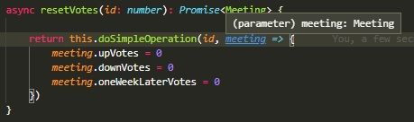

# Operaciones similares
Vamos a un caso en el que un servicio incluye varias operaciones de actualización con una estructura similar.  
Como ejemplo, consideremos un servicio de reuniones, en el cual se pueden registrar votos a partir de una propuesta de reunión, con tres opciones: voto a favor de la reunión en la fecha sugerida, voto a favor de la reunión pero una semana más tarde, voto en contra de la reunión.  
``` typescript
@Entity()
export class Meeting {
    /* ... varias propiedades ... */

    @Column()
    upVotes: number

    @Column()
    downVotes: number

    @Column()
    oneWeekLaterVotes: number
}
``` 

Se definen varios endpoints, cada uno con su correspondiente método de servicio.
``` typescript
async addUpVote(id: number): Promise<Meeting> {
    const meeting = await this.getMeeting(id);
    meeting.upVotes += 1
    try {
        return this.meetingRepository.save(meeting)
    } catch (err) {
        throw new InternalServerErrorException('Could not update meeting ${id}')
    }
}

async addDownVote(id: number): Promise<Meeting> {
    const meeting = await this.getMeeting(id);
    meeting.downVotes += 1
    try {
        return this.meetingRepository.save(meeting)
    } catch (err) {
        throw new InternalServerErrorException('Could not update meeting ${id}')
    }
}

async addOneWeekLaterVote(id: number): Promise<Meeting> {
    const meeting = await this.getMeeting(id);
    meeting.oneWeekLaterVotes += 1
    try {
        return this.meetingRepository.save(meeting)
    } catch (err) {
        throw new InternalServerErrorException('Could not update meeting ${id}')
    }
}

async addManyVotes(id: number, upVotes: number, downVotes: number): Promise<Meeting> {
    const meeting = await this.getMeeting(id);
    meeting.upVotes += upVotes
    meeting.downVotes += downVotes
    try {
        return this.meetingRepository.save(meeting)
    } catch (err) {
        throw new InternalServerErrorException('Could not update meeting ${id}')
    }
}

async resetVotes(id: number): Promise<Meeting> {
    const meeting = await this.getMeeting(id);
    meeting.upVotes = 0
    meeting.downVotes = 0
    meeting.oneWeekLaterVotes = 0
    try {
        return this.meetingRepository.save(meeting)
    } catch (err) {
        throw new InternalServerErrorException('Could not update meeting ${id}')
    }
}
``` 

## Misma estructura, distintas operaciones
No es difícil ver que los cinco métodos presentados comparten una misma estructura:
1. se obtiene un meeting.
1. se hace una modificación al meeting obtenido.
1. se registran las modificaciones al meeting, con un manejo de errores, siempre el mismo.

¿Qué es distinto en cada método?  
La **modificación** que se le hace al meeting. 

Esto es una acción, código que _modifica_ al meeting; no se puede modelar con un valor "fijo" (como un número, un string, un array o una estructura), debe ejecutarse.  
Una opción sencilla en JS/TS para modelar operaciones que deben ejecutarse es mediante _funciones_. Si la operación, como en este caso, consiste en la modificación de un objeto, entonces conviene que reciba al objeto como parámetro.  

P.ej., la operación de sumar un `upVote` se puede representar así.
``` typescript
meeting => meeting.upVote += 1
``` 

La operación correspondiente al `resetVotes` requiere de varias líneas.
``` typescript
meeting => {
    meeting.upVotes = 0
    meeting.downVotes = 0
    meeting.oneWeekLaterVotes = 0
}
``` 

## Recibiendo la operación como parámetro
La "función unificadora" será un método en el servicio (para poder usar el `meetingRepository` sin que se lo tengan que pasar), que reciba como parámetros el `id` _y la operación_. Por lo que hablamos, el segundo parámetro va a ser una función, que recibe un `Meeting`, y en realidad no devuelve nada, el tipo de retorno de esta operación es un `void` nomás.

``` typescript
async doSimpleOperation(id: number, operation: (m: Meeting) => void): Promise<Meeting> { 
    /* ... código ... */
}
``` 

Se ve rápidamente que el segundo parámetro es una función, porque tiene una flecha.

Para ver cómo se usa, transcribamos cómo queda el método `resetVotes` usando esta operación genérica
``` typescript
async resetVotes(id: number): Promise<Meeting> {
    return this.doSimpleOperation(id, meeting => {
        meeting.upVotes = 0
        meeting.downVotes = 0
        meeting.oneWeekLaterVotes = 0
    })
}
``` 

El segundo valor que se le pasa a `doSimpleOperation` es una función, que recibe el meeting y le hace las modificaciones necesarias. De acuerdo al tipo que se le puso al parámetro al definir `doSimpleOperation`, VSCode se da cuenta que el `meeting` de la función definida dentro de `resetVotes` es efectivamente un `Meeting`.




Dentro de la función, hay que hacer los tres pasos indicados más arriba, pero donde el segundo paso consiste en ejecutar la `operation` que llegó por parámetro.

``` typescript
async doSimpleOperation(id: number, operation: (m: Meeting) => void): Promise<Meeting> { 
    // primer paso: se obtiene el meeting
    const meeting = await this.getMeeting(id);
    // segundo paso: se hace la modificación sobre el meeting
    operation(meeting);
    // tercer paso: se registra el meeting modificado
    try {
        return this.meetingRepository.save(meeting)
    } catch (err) {
        throw new InternalServerErrorException('Could not update meeting ${id}')
    }
}
``` 

Para cerrar la explicación, mostramos cómo quedan los cinco métodos usando este nuevo "método unificador".

``` typescript
async addUpVote(id: number): Promise<Meeting> {
    return this.doSimpleOperation(id, meeting => meeting.upVotes += 1)
}

async addDownVote(id: number): Promise<Meeting> {
    return this.doSimpleOperation(id, meeting => meeting.downVotes += 1)
}

async addOneWeekLaterVote(id: number): Promise<Meeting> {
    return this.doSimpleOperation(id, meeting => meeting.oneWeekLaterVotes += 1)
}

async addManyVotes(id: number, upVotes: number, downVotes: number): Promise<Meeting> {
    return this.doSimpleOperation(id, meeting => {
        meeting.upVotes += upVotes
        meeting.downVotes += downVotes
    })
}

async resetVotes(id: number): Promise<Meeting> {        
    return this.doSimpleOperation(id, meeting => {
        meeting.upVotes = 0
        meeting.downVotes = 0
        meeting.oneWeekLaterVotes = 0
    })
}
```


## Comentarios finales
Creo que la implementación a la que se llegó, tiene varias ventajas sobre la inicial, donde tener menos líneas creo que es la menos relevante.
- En la implementación nueva, queda más a la vista cuál es la operación que se hace en cada método.
- Además, si se quiere hacer una operación o validación adicional, alcanza con tocar `doSimpleOperation`. 

Relación con los [design patterns](https://refactoring.guru/design-patterns):  
lo que implementamos es una variante liviana del [Template Method](https://refactoring.guru/design-patterns/template-method), en la que el método `doSimpleOperation` es el template, y lo que cambia de caso a caso, en lugar de ser resuelto en una subclase, es la función que pasamos como parámetro.


## Para practicar
En el servicio de personas, en `sign-up-request.service.ts`, hay varios (realmente varios) métodos que a partir de un `personId`, obtienen la `person`, realizan distintas operaciones sobre `person.signUpRequest`, y registran la `person` modificada. Definir una "función unificadora" y usarla para resolver todos estos métodos.