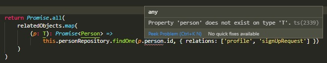
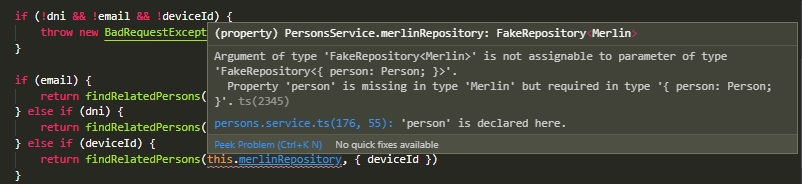

# Buscando similitudes y diferencias
En esta página vamos a trabajar con un ejemplo menos standard, que no cae en un "escenario típico" como fueron os casos anteriores. 
Es un ejemplo en el que hay un método que hace tres cosas ... que son muy parecidas. Veremos cómo definir una función que abstraiga lo que tienen en común, a partir de apreciar similitudes y diferencias.


## El ejemplo
Miremos este método de provider, que trabaja con varios repositorios vinculados a personas.
``` typescript
async find(query: Record<string, string>): Promise<Person[]> {
    const { dni, email, deviceId } = query

    if (!dni && !email && !deviceId) {
        throw new BadRequestException('Unknown query')
    }


    if (email) {
        const profile = await this.profileRepository.find
        ({ relations: ['person'], where: { username: email } })

        return Promise.all(
            profile.map(
                (p: Profile): Promise<Person> =>
                    this.personRepository.findOne
                    (p.person.id, { relations: ['profile', 'signUpRequest'] })
            )
        )
    }

    if (dni) {
        const document = await this.documentRepository.find({
            relations: ['person'],
            where: { number: parseInt(dni, 10) },
        })

        return Promise.all(
            document.map(
                (p: Document): Promise<Person> =>
                    this.personRepository.findOne
                    (p.person.id, { relations: ['profile', 'signUpRequest'] })
            )
        )
    }

    if (deviceId) {
        const signUpRequest = await this.signUpRequestRepository.find({
            relations: ['person'],
            where: { deviceId },
        })

        return Promise.all(
            signUpRequest.map(
                (p: SignUpRequest): Promise<Person> =>
                    this.personRepository.findOne
                    (p.person.id, { relations: ['profile', 'signUpRequest'] })
            )
        )
    }
}
```

¿Cómo podríamos expresar el propósito de este método, lo "que hace"?  
Por lo que se ve, devuelve las personas que están relacionadas con un cierto dato inicial, que puede ser, o bien un `email`, o bien un `dni`, o bien un `deviceId`.  
Adentro de los tres `if` hay un `return`, eso nos indica que es uno de los tres criterios.  

En los tres casos se hace **básicamente lo mismo**: se buscan objetos en una tabla/repositorio relacionada con personas, y se devuelve la lista de las personas relacionadas con cada objeto encontrado, haciendo búsquedas separadas en el repositorio de personas.
P.ej. si el dato inicial es el `dni`, entonces los objetos relacionados son documentos. Se buscan todos los documentos relacionados con ese `dni`, y se devuelve las personas relacionadas con cada documento encontrado. Son dos pasos
1. primero, búsqueda en el repo relacionado
1. después, para cada objeto encontrado en la primera búsqueda, búsqueda en el repo de personas para la persona correspondiente.

Si vemos el código adentro de cada `if`, notamos que son parecidos, pero auch, no iguales.
Para aplicar el principio DRY, deberíamos "sacar" este código a una definición separada, p.ej. una función, e _invocar_ la función tres veces. Entonces la lógica de los dos pasos que señalamos recién, estaría una vez sola en el código: no nos repetimos.


## Viendo las diferencias
Una forma posible para pensar en esta "función unificadora", es partir de uno de los bloques que queremos unificar, y resaltar el texto que es distinto a los otros. 
Yo lo hago "old style": imprimo y pinto con un resaltador.

Para poder pegarlo acá, hice lo mismo copiando el texto en un Google Doc, que respeta los colores del VSCode, y permite resaltar. El resultado del análisis es este.  


Hay dos colores de resaltado: verde y naranja.
- lo verde es un nombre de variable, eso no parece importante.
- lo naranja sí son cosas distintas para cada uno de los tres bloques.
    - el repositorio de los objetos relacionados.
    - la cláusula `where` de la consulta a objetos relacionados.
    - el tipo del objeto relacionado.

Por lo tanto, la "función unificadora" va a tener que tener tres parámetros: repositorio, cláusula `where`, y el tipo. Este último parámetro está indicando que nuestra función va a tener una definición _genérica_ sobre un tipo `T` que es el tipo de los objetos relacionados, o esa, `Profile`, `Document`,  o `SignUpRequest`. 


## Primer versión, sin tipos
Para armar la "función unificadora", podemos simplemente, transcribir el código, reemplazando las partes pintadas de naranja por parámetros, y el nombre de la variable en verde por algo más general. Los tipos ... los podemos dejar para un poco después, arracamos con todo `any` y después ajustamos.

Nos queda esto:
``` typescript
async function findRelatedPersons(repo: any, whereClause: any): Promise<Person[]> {
    const relatedObjects = await repo.find({ relations: ['person'], where: whereClause })

    return Promise.all(
        relatedObjects.map(
            (obj: any): Promise<Person> =>
                this.personRepository.findOne(obj.person.id, {relations: ['profile','signUpRequest']})
        )
    )
}
```

El tipo de retorno ya se puede poner porque es lo mismo que devuelve el método `find`.

Un aspecto a destacar es que **cualquier** expresión (o al menos, casi siempre) se puede reemplazar por un parámetro, sobre todo en lenguajes flexibles como JS/TS. El `whereClause`, que es un objeto como p.ej. `{ number: parseInt(dni, 10) }`, le va a llegar a la función sin problemas. El repositorio, lo mismo. Si fuera una función, también puede llegar como parámetro, más adelante vamos a ver un ejemplo de esto.

Es interesante ver cómo queda el método `find`, usando esta función auxiliar.

``` typescript
async find(query: Record<string, string>): Promise<Person[]> {
    const { dni, email, deviceId } = query

    if (!dni && !email && !deviceId) {
        throw new BadRequestException('Unknown query')
    }

    if (email) {
        return findRelatedPersons(this.profileRepository, { username: email })
    } else if (dni) {
        return findRelatedPersons(this.documentRepository, { number: parseInt(dni, 10) })
    } else if (deviceId) {
        return findRelatedPersons(this.signUpRequestRepository, { deviceId })
    }
}
```

Creo que esta versión es _mucho_ más comprensible que la anterior, una mirada rápida alcanza para entender su propósito. En particular, que es una de tres opciones, y que por lo tanto, si llegan varios query params, va a tomar uno solo.

> **Preguntita**   
> en el caso en que llegue un `dni`, ¿qué pasa primero, se transforma a número con el `parseInt`, o se invoca a la función `findRelatedPersons`?


## Agregamos los tipos
Volvamos a la función `findRelatedPersons`. Nos falta resolver los tipos de los parámetros.

El `repo` es un `Repository` de TypeORM. Repasemos el constructor de `PersonsService`.
``` typescript
@Injectable()
export class PersonsService {
  constructor(
    @InjectRepository(Person)
    private readonly personRepository: Repository<Person>,
    @InjectRepository(Document)
    private readonly documentRepository: Repository<Document>,
    @InjectRepository(Profile)
    private readonly profileRepository: Repository<Profile>,
    @InjectRepository(SignUpRequest)
    private readonly signUpRequestRepository: Repository<SignUpRequest>,
    /* ... varios repos más ... */
  ) {}

  /* ... muchos métodos ... */
}
```

Acá vemos que `Repository` es un tipo genérico, sobre el tipo de lo que almacena ... que es justamente el tipo que resaltamos en naranja al hacer el análisis de código. Este es el tipo `T` por el que tiene que ser genérica _nuestra_ función `findRelatedPersons`.  
Entonces, podríamos hacer algo así

``` typescript
async function findRelatedPersons<T>(repo: Repository<T>, whereClause: any): Promise<Person[]> {
    const relatedObjects = await repo.find({ relations: ['person'], where: whereClause })

    return Promise.all(
        relatedObjects.map(
            (obj: T): Promise<Person> =>
                this.personRepository.findOne(obj.person.id, {relations: ['profile','signUpRequest']})
        )
    )
}
```

Notar sobre todo el `T` dentro del cuerpo de la función: es el tipo del repositorio, si se le pasa el repo de profiles `T` va a ser `Profile`, etc..

Pero, auch, se nos genera un error de tipos.  


A qué se debe el error: si no se pone ninguna condición sobre `T`, TS no puede estar seguro que al objeto relacionado se le pueda pedir `.person`.

Dado que el método original no tiene problemas de tipo, sabemos que `Profile`, `Document` y `SignUpRequest` tienen un atributo `person` de tipo `Person`. Miremos `Document`.
``` typescript
@Entity()
export class Document {
  @PrimaryGeneratedColumn()
  id: number

  @OneToOne(() => Person, person => person.document)
  person: Person

  /* ... más properties ...*/
}
```

Entonces le vamos a pedir a `T` que tenga este atributo, usando lo que vimos al hablar sobre [generics acotados](../typescript/generics-bounded).

``` typescript
async function findRelatedPersons<T extends { person: Person }>
(repo: Repository<T>, whereClause: any): Promise<Person[]> {
    const relatedObjects = await repo.find({ relations: ['person'], where: whereClause })

    return Promise.all(
        relatedObjects.map(
            (obj: T): Promise<Person> =>
                this.personRepository.findOne(obj.person.id, {relations: ['profile','signUpRequest']})
        )
    )
}
```

Listo, se fue el error de tipo. Y sí verifica que el repositorio que le pasemos tiene ser sobre un objeto que incluya un `person: Person`.  


Nos queda `whereClause`. De este lo único que podemos decir es que sea un objeto, o sea, que no sea p.ej. un número o un string. Acá podemos usar la definición genérica de "puede tener atributos cualesquiera" que vimos al [profundizar sobre tipos de interfaces](../typescript/interfaces-in-depth).  
Así llegamos a la forma final de la función.  
``` typescript
async function findRelatedPersons<T extends { person: Person }>
(repo: Repository<T>, whereClause: {[prop: string]: any}): Promise<Person[]> {
    const relatedObjects = await repo.find({ relations: ['person'], where: whereClause })

    return Promise.all(
        relatedObjects.map(
            (obj: T): Promise<Person> =>
                this.personRepository.findOne(obj.person.id, {relations: ['profile','signUpRequest']})
        )
    )
}
```


## ¿Dónde poner la función?
Esta función parece ser bastante particular del método `find`, no resulta probable que la misma lógica se pueda aprovechar en otro lado.

En estos casos, una opción es definir a la función _adentro_ del método `find`, que nos queda así.
``` typescript
async find(query: Record<string, string>): Promise<Person[]> {

    async function findRelatedPersons<T extends { person: Person }>
    (repo: Repository<T>, whereClause: {[prop: string]: any}): Promise<Person[]> {
        const relatedObjects = await repo.find({ relations: ['person'], where: whereClause })

        return Promise.all(
            relatedObjects.map(
                (obj: T): Promise<Person> =>
                    this.personRepository.findOne
                    (obj.person.id, { relations: ['profile','signUpRequest'] })
            )
        )
    }

    const { dni, email, deviceId } = query

    if (!dni && !email && !deviceId) {
        throw new BadRequestException('Unknown query')
    }

    if (email) {
        return findRelatedPersons(this.profileRepository, { username: email })
    } else if (dni) {
        return findRelatedPersons(this.documentRepository, { number: parseInt(dni, 10) })
    } else if (deviceId) {
        return findRelatedPersons(this.signUpRequestRepository, { deviceId })
    }
}
```

## Para practicar
En el mismo `persons.service.ts`, hay otros dos métodos que tienen código al que se puede aplicar una idea similar a la que describimos en esta página.

### Borrado de un objeto relacionado
Uno está en el método `deletePerson`, en el que se lanzan `delete` sobre varios repositorios. En particular, la lógica de borrado de cuatro de ellos es muy parecida, y "factorizable" a una función que se usa cuatro veces. Nos referimos a esta parte:
``` typescript
if (!isNil(person.signUpRequest)) {
    await this.signUpRequestRepository.delete({
    id: person.signUpRequest.id,
    })
}
if (!isNil(person.document)) {
    await this.documentRepository.delete({
    id: person.document.id,
    })
}
if (!isNil(person.contact)) {
    await this.contactRepository.delete({
    id: person.contact.id,
    })
}
if (!isNil(person.social)) {
    await this.socialRepository.delete({
    id: person.social.id,
    })
}
```
El primer llamado podría ser así:
``` typescript
deleteIfExists(person.sigUpRequest, this.signUpRequestRepository)
```

Más abajo en el mismo método, aparece esto
``` typescript
    if (!isNil(profile) && !isNil(profile.facePhi)) {
      await this.facePhiRepository.delete({
        id: profile.facePhi.id,
      })
    }
```
¿Cómo se podría usar la función `deleteIfExists` para que cubra este caso? 
**Hint**: se puede usar la función `get` de `lodash`.

Después de esto, revisar un poco más arriba en el método, hay un `Promise.all` que borra objetos asociados a los affidavit. Ahí hay tres lugares donde se puede 


## Cuatro direcciones
El otro caso está en el método `saveMerlin`. Entre las (varias) cosas que hace, está la consolidación de cuatro direcciones: electoral, laboral, fiscal y otra (`UNKNOWN`).  
En este caso también, se puede armar una función que se use cuatro veces. 
