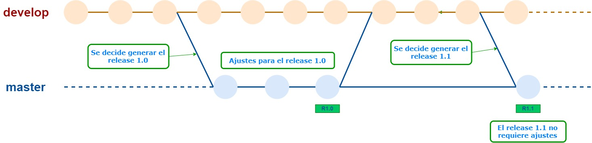
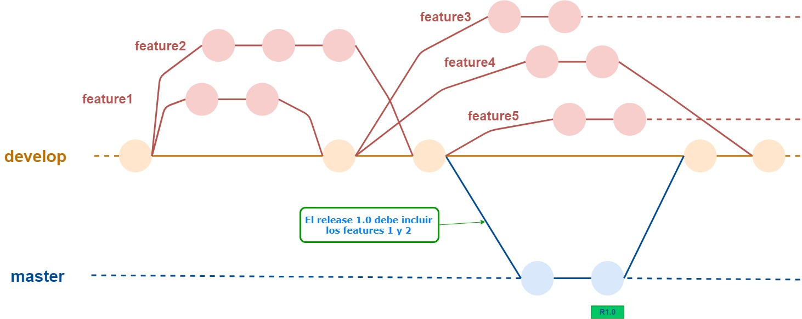
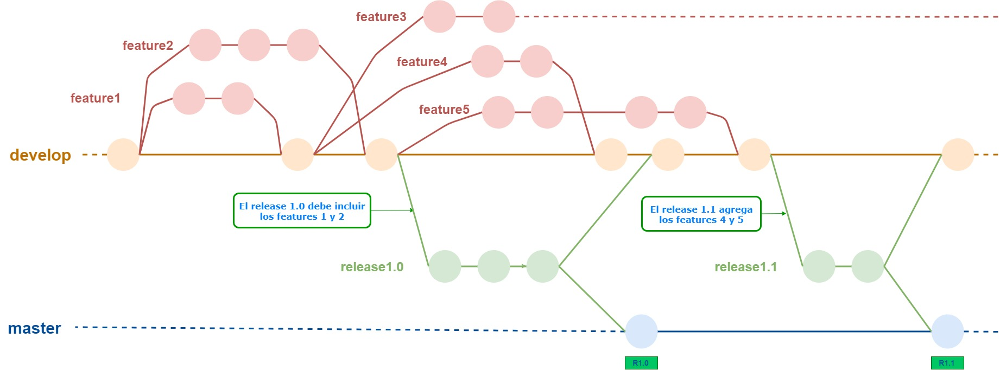

# Modelos de branches
Tener un proyecto de desarrollo en marcha requiere de varias **decisiones**: qué lenguaje (o lenguajes) de programación se va/n a usar, cuáles van a ser los frameworks o librerías más relevantes (lo que incluye decidir si el desarrollo se va a estructurar de acuerdo a un framework o librería, o va a ser más "libre" usando librerías de más bajo nivel), qué forma va a a tener la API si es un backend, cómo se va a empaquetar el producto (p.ej. si se va a hacer un gran backend, o más bien se van a definir pequeños microservicios) y algunas más.  
Obviamente, las decisiones _no son independientes_ entre sí: si elijo usar SpringBoot como framework de backend, eso descarta la posibilidad de usar p.ej. Python como lenguaje.

Entre estas decisiones, está la de cómos e va a trabajar con el repositorio de código. En particular, qué branches se van a definir y cómo se van a usar.
¿Pusheamos todes en el mismo branch, y marcamos cada release con un tag? Caso contrario, ¿definimos un branch por tarea, o mejor un branch por persona? Cuando se termina algo ¿en qué branch se integra?  
Un **modelo de branches** (o estrategia de branches / política de branches / workflow / flujo de trabajo) no es más (ni menos) que la suma de estas decisiones ... más la meta-decisión de respetar las decisiones que se tomaron, claro.  

Las decisiones sobre el modelo de branches a utilizar, también van a estar relacionadas con otras características que se definan para el proyecto.  
En particular, la frecuencia con la que se quieran liberar releases, y el grado de automatización que se pueda organizar para esta tarea.  
Otros factores que influyen sobre la definición de un modelo de branches, son el tamaño esperado del equipo de trabajo, y la criticidad del proyecto (lo que implica -entre otras cosas- qué tan rápido hay que actuar cuando aparece un bug).

### Un panorama en 2020
Hay algunas propuestas de modelos de branches muy difundidas, como [gitflow](https://nvie.com/posts/a-successful-git-branching-model/) y [GitHub Flow](https://guides.github.com/introduction/flow/), que se llaman parecido pero son distintos.  
En el sitio de tutoriales de Atlassian hay [una página sobre el tema](https://www.atlassian.com/git/tutorials/comparing-workflows) bastante extensa.

La posibilidad de pensar en distintos modelos de branches viene de la mano de Git, que ofrece un manejo de branches _mucho más sencillo_ que sus antecesores, en particular SVN. 

### Qué sigue
En esta página, vamos a ir introduciendo paulatinamente los branches que se describen en Gitflow. Algunos de ellos son tremendamente populares, más que Gitflow en sí.  
Al final, vamos a incorporar algunos comentarios sobre GitHub flow.

## Modelo básico - master y develop
Empecemos con un modelo muy sencillo, que incluye solamente dos branches: `master` (o `main`), y `develop`.  

En este modelo, todas las tareas se hacen sobre `develop`.  

Cuando se decide armar un nuevo release, se mergea lo que esté en `develop` sobre `master`, y se empieza a probar el release candidato. 
Si surgen bugs o agregados de último momento, se hacen directamente sobre `master`. Lo que se haga en `develop` después de que se hubiera "abierto" el release, va para el siguiente release. Lo que deba agregarse al release que se está preparando, va en `master`.  
Cuando el release está listo, se agrega un tag en el commit correspondiente, que va a ser el tip de `master` en ese momento. Ese es el código que se va a deployar.

Al separar en un branch aparte la preparación del nuevo release, evitamos que incluya código que en realidad es para releases posteriores, y que puede venir con bugs que estarían "ensuciando" el release en preparación.

Si hubo commits agregados en `master` por bugs o agregados, conviene  mergearlos sobre `develop`, para tener en ese branch todo el código a partir del cual se va a generar la siguiente versión.

Los dos branches, `master` y `develop`, son **permanentes**, o sea, siguen activos durante todo el desarrollo.

Esta imagen intenta mostrar el modelo que describimos recién.  

### Preguntas
Si al cerrar cada release mergeamos `master` sobre `develop`, entonces **todo** el código a partir del cual se genera el siguiente release va a estar en `develop`.   
En este caso, cuando se decide preparar el siguiente release, en lugar de mergear `develop` sobre `master` ¿qué otra operación se puede hacer, que no es `rebase`?

Cuando se mergean los cambios que se hicieron en `master` sobre `develop`, ¿qué precaución conviene que tenga cada desarrollador?

¿Por qué los ajustes de cada release se hacen en `master` y no en `develop`?

En este modelo, ¿se pueden estar preparando dos releases al mismo tiempo?

## Feature branches
Si hay varias personas trabajando sobre un mismo repositorio, aparece la probabilidad de que los cambios que hace una persona afecten el día-a-día del resto. Esto era común en la era pre-Git, y generaba retrasos importantes ... o fomentaba poca interacción con el repositorio, con largos tiempos de sincronización después.

Para evitar estos problemas que surgen de estar tocando una misma base de código todos-todo-el-tiempo, surgió la idea de aislar el ambiente de trabajo de cada desarrollador (o grupo que está trabajando en lo mismo), definiendo un **feature branch** para cada tarea. Esta es una práctica muy extendida actualmente.

Por lo general, estos branches "salen" desde `develop`, y se integran sobre `develop`. Cuando están integrados en `develop` todos los features definidos para un release, se mergea sobre `master` y comienza el proceso de generación de release, como se describió antes.  
La idea es que en `develop` esté integrado todo el código de las tareas finalizadas.

Al contrario de `develop` y `master`, los feature branches son **transitorios**, o sea, tienen una vida limitada. Cuando se mergean sobre `develop`, se dejan de usar.

En este gráfico damos un ejemplo, en el cual los features 1, 2 y 4 están terminados, y por lo tanto esos branches ya no están activos. Los fetures 3 y 5 todavía se están desarrollando, por eso siguen activos.  

Se pueden definir también branches para la corrección de bugs, puede ser un branch por bug, o definir un único branch para corregir varios bugs chicos que están relacionados. En cualquier caso, cuando se terminan de arreglar los bugs definidos, el branch se mergea sobre `develop` y se inactiva.

Notamos que la generación de cada nueva versión surge desde `develop`, que es donde se va integrando el trabajo a medida que se termina cada tarea. 

### Más preguntas
¿Cómo podemos manejar el caso de un feature que está terminado, pero que no queremos incluir en el siguiente release, que debe quedar para más adelante?

¿En qué caso podría tener sentido sacar un feature directamente desde `master`?

¿Con qué forma queda la historia de `develop` si se decide sistemáticamente hacer las integraciones de cada feature usando "squash and merge"?

¿Podría haber algún commit en `develop` que no sea un merge desde un feature o desde `master`?

¿Cómo acotar el riesgo de que un feature cuyo desarrollo lleva mucho tiempo, quede demasiado separado de `develop`, y después resulte muy difícil de mergear?

En el gráfico, el commit de `develop` en el que se integran los cambios hechos en `master`, tiene exactamente el mismo contenido que el del tag `R1.0`? ¿Podría no ser así, o sea que al mergear `master` sobre `develop` sea un merge que realmente integre dos líneas separadas de cambios? ¿En qué caso pasaría eso?

## Release branches
El siguiente paso de sofisticación consiste en separar el proceso de preparación de un release del branch `master`. t

