# Repositorios remotos
Todos los comandos de Git que estudiamos hasta ahora (`add`, `commit`, `reset`, `revert`, `log`, etc.) y en todos los ejemplos y ejercicios que repasamos, interactuamos únicamente con _repositorios locales_. Recordemos, estos son repositorios (con toda la lógica de commits y branches) que están alojados junto al working tree (más precisamente, en la carpeta `.git`).  
En esta página, vamos a incorporar a los _repositorios remotos_ en nuestro estudio de características de Git.

Un repositorio remoto tiene las mismas características que estudiamos sobre los repositorios locales: es básicamente una red de commits, puede incluir branches que son referencias a commits, pueden tener commits huérfanos, etc.. 
También tienen un `HEAD` ... aunque honestamente, no sé para qué se usa.


## Relaciones entre repositorios locales y remotos
Un repositorio local _puede_ estar vinculado a un repositorio remoto, _o no_. 
Para crear un repositorio local en una carpeta, alcanza con ejecutar `git init`.  
Todos los ejemplos que analizamos hasta ahora, se pueden reproducir en repositorios locales no vinculados a remotos.

En esta imagen, se puede observar la creación de un nuevo repositorio local, el agregado de dos commits, y el resultado de ejecutar luego `git log`. Al final se ejecuta `git remote`, el resultado vacío muestra que el repositorio local no está vinculado a ningún repositorio remoto.  
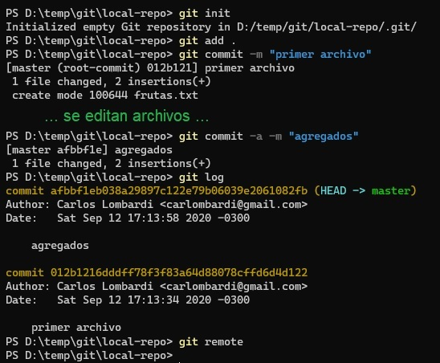


El comando `git clone` realiza tres operaciones: crea un nuevo repositorio local, lo vincula con el repositorio remoto que se indica, y vuelca toda la red de commits y branches del repositorio remoto al local.  
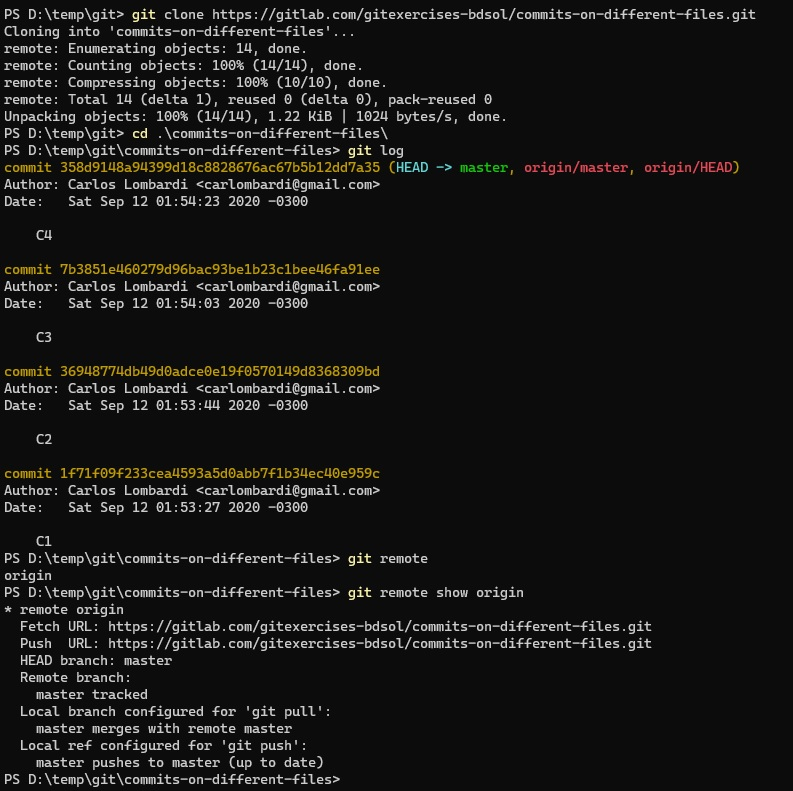  
Podemos ver varias diferencias. 
- El log muestra los branches y HEAD remotos en color rojo, asociándolos con la palabra "origin", p.ej. `origin/master`. 
- La respuesta a `git remote` ahora indica que hay un repositorio remoto llamado `origin`. Ejecutando `git remote show origin`, se puede acceder a información sobre el repo remoto, incluyendo la URL.

Los commits en los repos local y remoto se relacionan porque mantienen los mismos id. Esta es la vista de los commits del repo remoto del que mostramos el clone recién.


### Varios remotos
Un repositorio local puede estar vinculado a _varios_ repositorios remotos.  
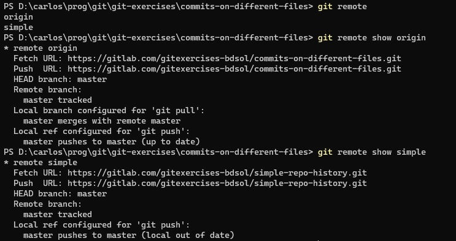  

Para cada repositorio remoto que está vinculado al local, se establece un nombre. El nombre refiere _a la vinculación_, no al repo remoto.  
Al hacer `git clone`, a la vinculación del repo local al remoto que se está clonando, se la llama `origin`. Este es el famoso "origin" que se ve p.ej. en 
```
git push origin master
```
Si tengo más de un remoto, en el `push` puedo indicar a cuál pushear.

Al agregarle más remotos a un local, se puede establecer el nombre que se le va a dar a la vinculación con cada uno.

La técnica de tener varios remotos para un mismo repo local no es algo _tan_ esotérico. P.ej., es usada en [Heroku](https://www.heroku.com/home). Para publicar un repositorio como una app Heroku, se abre un segundo remoto sobre Heroku. Cada push a ese remoto genera un nuevo deploy.   
Se puede usar también para material que se presenta en distintos lugares a medida que se va evolucionando. Se puede abrir un remoto para cada vez que se presenta, ese remoto se le puede publicar a los participantes, y esa versión queda fija aunque el material evolucione en "su" repositorio. Como una variante más brutal de la idea de branch.

Los comandos `git pull` y `git push` sincronizan el repositorio local con un repositorio remoto. Para entender cuál de los remotos si tenemos varios, tenemos que hablar del _upstream_. Antes practiquemos un poco.


### Para experimentar / buscar / pensar
Googleando `git remote add` / `git remote remove`:
- agregar como segundo remoto a un repo local clonado, un repo remoto recién creado.
- pushear el branch actual en el segundo remoto, verificar los resultados.
- lograr que el repo local tenga como remoto _únicamente_ el que se vinculó recién. Verificar que ya no tiene un remoto llamado `origin`.

¿Se puede lograr que haya varios repositorios locales en un mismo equipo, vinculados al mismo repositorio remoto? ¿Cómo se puede lograr?

¿Qué diferencia hay entre estas dos variantes (la única diferencia es el punto del final)?
- `git clone <url_remoto>` 
- `git clone <url_remoto> .` 


### La vinculación a nivel de branches - upstream de un branch
A su vez, cada _branch_ en el repo local puede estar vinculado a un branch en un repositorio remoto. Es el llamado **upstream** del branch local.  
Esta vinculación se establece mediante los comandos `git push -u` o `git branch -u`, donde el `-u` es una forma abreviada para `--set-upstream` (para `git push`) o `--set-upstream-to` (para `git branch`). 

Ese es el branch que se tiene en cuenta en `git status`.
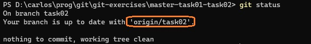  

Comparar con un branch que no tiene upstream.
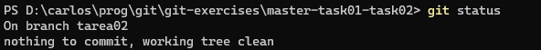  


El upstream es el branch que se actualiza al hacer `git push`, si no se aclara cuál es el remoto/branch a actualizar.  
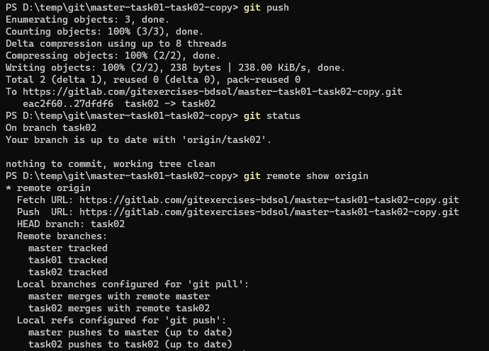  

Lo mismo pasa para `git pull` ... con una sutileza de la que hablaremos más adelante.


### Algunas preguntas/desafíos adicionales
Cuando se _crea_ un branch local ¿está vinculado a algún branch remoto? ¿Cómo se hace en general para establecer el vínculo?

A partir de una copia local de un repositorio remoto de esta forma  
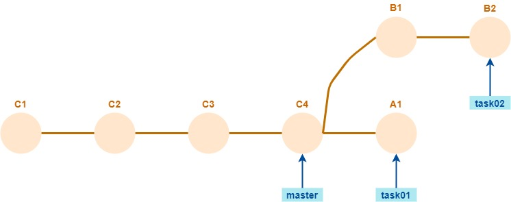  
1. Generar una copia local.
1. Verificar usando `git branch` si se generaron branches locales para cada branch remoto.
1. Ejecutar `git checkout task01`. Notar que no se indicó `-b`. ¿Genera un upstream para el branch local? 
1. Ejecutar `git checkout task03`, o sea, con un nombre que no corresponde a un branch remoto. ¿Qué pasa?
1. Crear un branch que tiene correspondencia remota, p.ej. `git checkout -b task02`. ¿Genera un upstream en este caso? Si no lo genera ¿cómo crear la vinculación con `origin/task02`?
1. Agregar un segundo remoto, contra un repositorio remoto vacío.
1. Hacer push del branch `task02` sobre el segundo remoto, _sin cambiar el upstream_, que tiene que seguir apuntando a `origin`. ¿Cómo se espera que quede el nuevo remoto? Verificar.
1. Actualizar las referencias de los otros branches del repo local en el segundo remoto.
1. Borrar la referencia al segundo remoto, que quede solamente `origin`.
1. Crear branches locales `tarea01` y `tarea02`, cuyos upstream sean los branches `task01` y `task02` de `origin`.
1. Borrar los branches locales `task01` y `task02`.
1. Agregar un commit en `tarea02`, hacer `git push`, verificar que se agregó al branch `task02` del repo remoto.

El repo local termina así:  
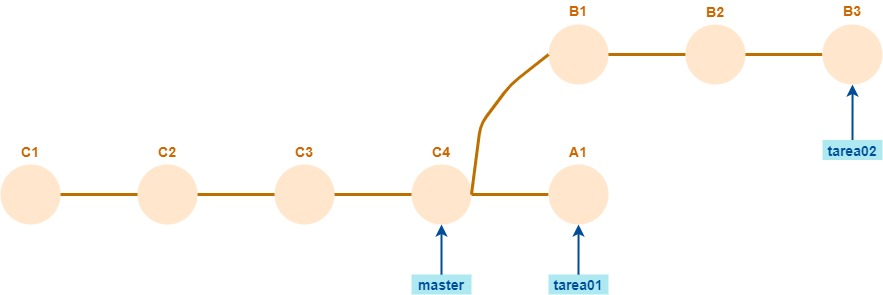  
El repo remoto igual, con los nombres de branch `task01` / `task02` en lugar de `tarea01` / `tarea02`.


## Sincronización - casos sencillos y complejos
Cada operación de sincronización, o sea cada vez que se ejecuta `git pull` o `git push`, hay un repositorio origen y uno destino: cada operación va _en un solo sentido_. El objetivo de la sincronización es que el destino incorpore las novedades incorporadas en el origen. 
- En `git pull`, el repo destino es el local, el objetivo es que tome las novedades del remoto.
- En `git push`, el repo destino es el remoto, el objetivo es que los cambios registrados en el repo local pasen al remoto. 

La sincronización es sencilla cuando alcanza con agregar commits y branches, y mover los branches hacia adelante, como en este caso.  
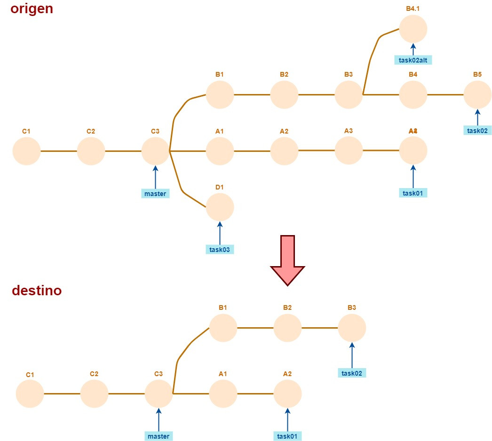  
Como resultado de esta sincronización, el destino va a quedar igual que el origen.

> **Pregunta**  
> Esta operación ¿parecería ser más bien un pull o un push?

Incluso si el origen tiene esta forma  
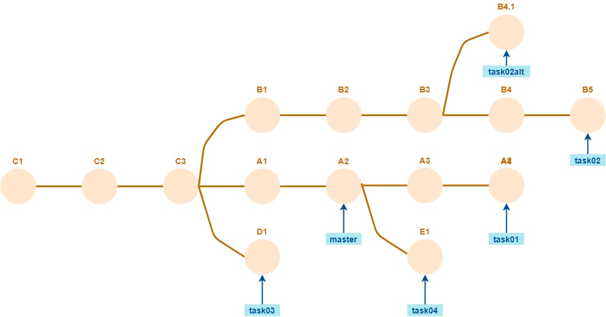  
también la sincronización va a poder hacerse sin problemas. 

También podemos variar el destino  
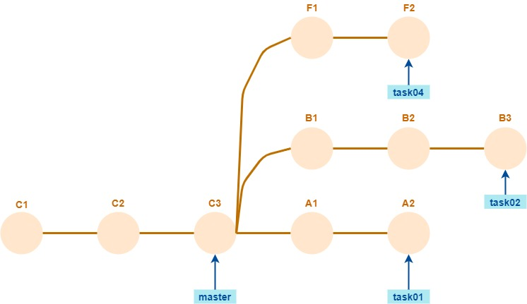  
En este caso, el destino no va a quedar igual que el origen: los commits F1 y F2, y el branch `task04`, van a permanecer en el destino aunque no estén en el origen.


### Pregunta
Si el repo origen tiene esta forma  
  

y el destino esta  
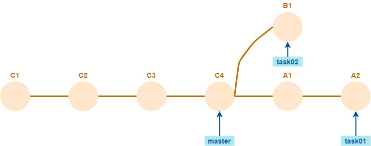  

¿se puede hacer la sincronización sin problemas? ¿Cómo queda el repo destino?
¿Cómo sería la situación invirtiendo los repositorios origen y destino?

Para probarlo en los dos sentidos, a partir de un repositorio remoto de esta forma
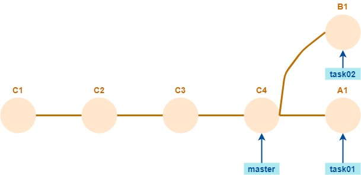  
hacer **tres** copias locales.

Con todas las copias locales generadas, empezamos probando el `pull`. Para eso: primero sobre la copia 1 avanzar en `task02` y pushear, luego sobre la copia 2:
- hacer `git checkout task02`,
- hacer `git checkout task01`,
- agregar un commit en `task01`, 
- hacer `git pull` para traerse las novedades (que no debería haber) sobre el branch `task01`
- hacer `git checkout task02`, y finalmente
- hacer `git pull` para traerse las novedades sobre el branch `task02`.

Ahora probamos el `push`. Sobre la copia 3:
- hacer `git checkout task02`,
- hacer `git checkout task01`,
- agregar un commit en `task01`, 
- hacer `git push` para subir al remoto las novedades sobre el branch `task01`.
- ver cómo quedan los repos local y remoto.
