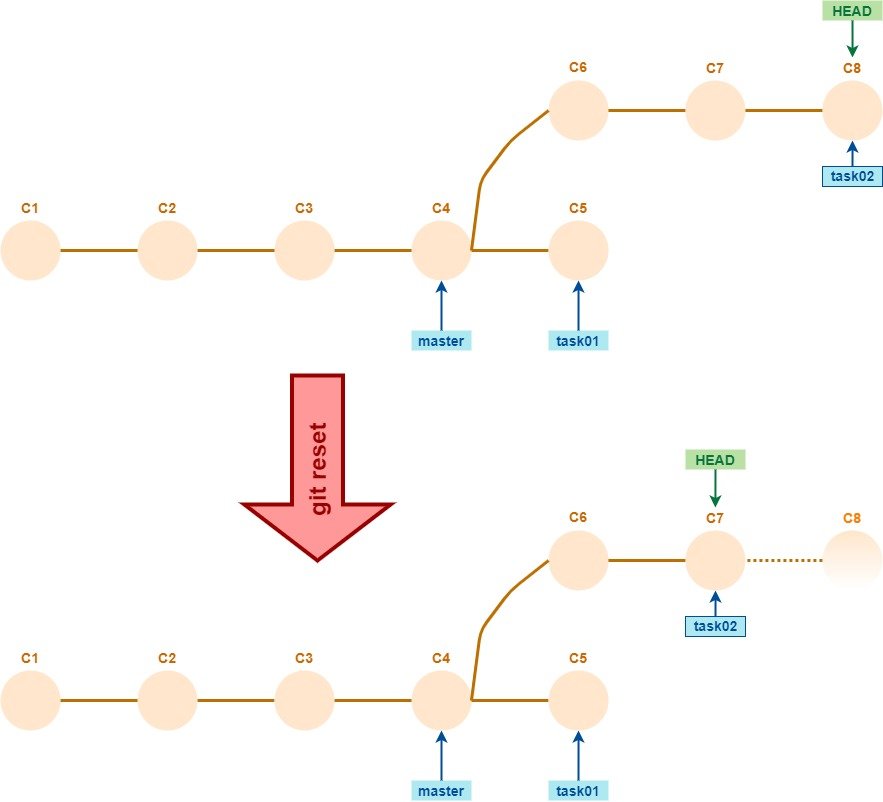
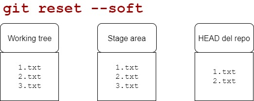

# "Deshaciendo" cambios - reset, revert
Al agregar un commit, podemos considerar que el branch actual y `HEAD` _avanzan_ un paso: se mueven "hacia adelante", apuntando al commit recién creado.  
¿Cómo se hace para lograr un **retroceso** de un branch, para "arrepentirnos" del último commit registrado, borrarlo y volver el tip del branch y `HEAD` "un commit para atrás"?  
Para ser precisos, lo que queremos es que `HEAD` y el branch vuelvan al _parent_ del commit actual.

Mediante `git checkout`, se puede mover `HEAD` al parent ... o a cualquier commit que querramos.
Como toda la información commiteada está en el repo, no se pierde nada salvo lo que pudiera estar _solamente_ en el working tree o en el stage area: lo que ya se commiteó, no se va a perder por andar moviendo `HEAD`. Si vuelvo a mover `HEAD` a un commit conveniente, las versiones actualizadas van a volver a aparecer en el working tree. 
Esto nos sirve para consultar en qué estado estaba el repo en un determinado commit, pero no para mover branches.

Para mover al mismo tiempo el `HEAD` y el branch checkouteado, está `git reset`. Este comando tiene variantes interesantes para ajustar la comprensión sobre los distintos [espacios de Git](./git-espacios). También nos sirve para quitar elementos del stage area. Un super-comando el `git reset`.


## Deshaciendo el último commit - los tres modos de git reset
Un escenario típico de uso de `git reset` es cuando poco después de haber agregado un commit, nos damos cuenta de que nos apresuramos, o que no lo armamos en forma correcta.  
Por lo tanto, queremos que el branch actual y `HEAD` vuelvan "un commit para atrás", o sea

```
git reset HEAD^
```

El efecto que tiene este comando **en el repo** es el siguiente.



(qué pasa con el commit C8 lo vamos a ver más adelante).

Nos falta decidir cómo queremos que queden el working tree y la stage area. Dicho de otra forma, qué queremos hacer con los _cambios_ registrados en el commit que estamos "tirando para atrás". 
Hay tres opciones, a cada una le corresponde una variante del comando `git reset`. 
En resumen, tenemos:
- `git reset --soft HEAD^`: los cambios quedan en el stage area y en el working tree.
- `git reset --mixed HEAD^`: los cambios quedan solamente en el working tree, hay que agregar al stage area lo que se quiera commitear.
- `git reset --hard HEAD^`: los cambios no quedan en ningún lado. En principio, se pierden. En realidad, no se pierden del-todo-del-todo, esto tiene que ver con el status en que queda el commit C8 ... hablaremos sobre esto más adelante.

Las contamos con gráficos que suponen que el commit descartado agrega el archivo `3.txt` a un repo que incluía `1.txt` y `2.txt`.




