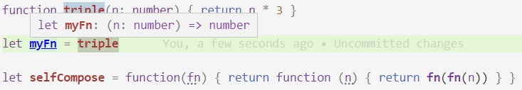
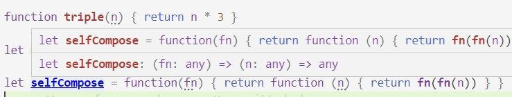
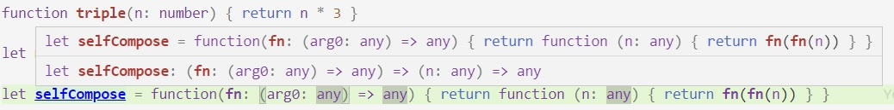

## Funciones en JavaScript

### Funciones por todos lados
Las funciones son un elemento fundamental de JS. 

Para decirlo en términos académicos, las funciones son "ciudadanas de primer orden".  
En criollo: con una función se puede hacer cualquier cosa que se puede hacer con un objeto, un array o número, en particular asignar a una variable, pasar por parámetro, y retornar. Creo que JS es especialmente flexible en este aspecto.

``` javascript
function triple(n) { return n * 3 }
let myFn = triple
function selfCompose(fn) { return function(n)  { return fn(fn(n)) } }

> myFn
[Function: triple]
> myFn(5)
15
> selfCompose
[Function: selfCompose]
> selfCompose(myFn)
[Function]
> selfCompose(myFn)(5)
45
``` 
JS tiene claro qué valores son funciones y cuáles no. Probar `4()`, dice claramente `TypeError: 4 is not a function`. Las funciones se pueden aplicar=evaluar=ejecutar, el resto de los valores no.

En TypeScript (y en lo poco que sé sobre teoría de tipos) los tipos de las funciones son los que tienen flecha.


Este es el tipo que infiere para una función, tiene flecha.


`selfCompose` es una función (flecha de la izquierda), a su vez _lo que devuelve_ es una función (flecha de la derecha).


Este es el resultado de hacer que VSCode infiera los tipos de los parámetros, se da cuenta que el _parámetro_ de `selfCompose` es una función.  
O sea que `selfCompose` es una función ... que _recibe_ una función y _devuelve_ otra función. Lo que decíamos, ciudadanas de primer orden.

------
**Digresión**{: style="color: SteelBlue"} sobre TypeScript:  
si evalúo el tipo de `selfCompose(triple)`, no está usando que `triple` es una función sobre números. ¿Se les ocurre cómo lograr que la inferencia de tipos de TS incorpore esa info?  
De esto vamos a hablar más adelante, cuando pongamos el foco en TS. 

------


El nombre de la función no es **tan** relevante. En rigor, el ejemplo podría arrancar así

``` javascript
let myFn = function(n) { return n * 3 }
``` 
De hecho, la notación `function triple(...) { ... }` (_función con nombre_) es medio un shortcut para `let triple = function(...) { ... }` (_función anónima_).  
Efectivamente es `let`, no `const`, se puede reasignar (es tan poco robusto como suena). Parece que en TypeScript sí son `const` ... aunque no encontré (y miren que busqué) documentación sobre esto.  
La diferencia entre función con nombre y función anónima está relacionada con el alcance; ver [este post en Stack Overflow](https://stackoverflow.com/questions/33040703/proper-use-of-const-for-defining-functions-in-javascript).


### Array functions

Las "array function" son, ni más ni menos, una notación alternativa para definir funciones anónimas.  
Tienen una diferencia _importante_ respecto del uso de `function`: qué valor toman como `this`. 

- En una función definida como `function`, el `this` hay que especificarlo (para esto, la función debe ser invocada usando `call` o `apply`, ver p.ej. en la [doc de MDN](https://developer.mozilla.org/en-US/docs/Web/JavaScript/Reference/Global_Objects/Function/call)), si no se dice nada, toma `undefined`
- Una array function toma el `this` del contexto en donde está **definida**.

``` javascript
class WindowSpec {
    constructor(h, w) { this.height = h; this.width = w }

    area() { return this.height * this.width }

    doubledMaxDimension() {
        const f = () => Math.max(this.height, this.width)
        return f() * 2
    }

    wrongDoubledMaxDimension() {
        const f = function() { return Math.max(this.height, this.width) }
        return f() * 2
    }
}

const spec1 = new WindowSpec(80,50)
```
Con esta definición de clase, el resultado de `spec1.doubledMaxDimension()` es `160`: el `this` es el mismo que en el método `area`. Por otro lado, `spec1.wrongDoubledMaxDimension()` se rompe porque "`Cannot read property 'height' of undefined`".

### Captura de valores

En las array functions, el valor que toma `this` es _capturado_ por la función, que se lo lleva a cualquier lugar en donde se use.  
Para verlo con un ejemplo, agreguemos este método en `WindowSpec`
``` javascript
    doubledMaxDimensionFn() {
        return () => Math.max(this.height, this.width) * 2
    }
```
Notar que `doubledMaxDimensionFn` devuelve una _función_.

En cualquier contexto en el que podemos acceder a la clase, podemos hacer esto
``` javascript
> let spec1 = new WindowSpec(28,45)
undefined
> let f = spec1.doubledMaxDimensionFn()
undefined
> f
[Function]
> f()
90
> spec1.height = 80
80
> f()
160
```
acá se nota que la función que devuelve `doubledMaxDimensionFn` está enganchada a la instancia de `WindowSpec`. Es más, aunque borremos la referencia ...

``` javascript
> spec1 = null
null
> f()
160
```
... el objeto sigue estando capturado por la función. 

Además del `this`, una definición de función (ahora, ya sea arrow o con la palabra reservada `function`) captura cualquier identificador que usa y que está definido en su contexto. Esto puede ser una fuente de _memory leaks_, atención.

------
**Atención**{: style="color: SteelBlue"}:  
Lo que se captura parece ser algo más complejo que las referencias, es más bien el _contexto_. Supongamos que en donde está definido `WindowManager`, se agrega esta definición:
``` javascript
function tripleFn(fn) { return fn() * 3 }
```
Ahora en otro lugar con acceso a estas definiciones, hago lo siguiente
``` javascript
> let spec1 = new WindowSpec(30,45)
WindowSpec { height: 30, width: 45 }
> let f = () => spec1.height + 10
[Function: f]
> tripleFn(f)
120
> spec1.height = 50
50
> tripleFn(f)
180
> spec1 = new WindowSpec(80,45)
WindowSpec { height: 80, width: 45 }
> tripleFn(f)
270
> spec1 = null
null
> tripleFn(f)
TypeError: Cannot read property 'height' of null
```
o sea que la definición de la función capturó el contexto en el que está definido el identificador `spec1`. 

------

Un detalle más: los métodos de una clase son componentes cuyo valor es una función. Como cualquier componente, se puede obtener usando la notación array-like con corchetes.
``` javascript
> let spec1 = new WindowSpec(30,45)
WindowSpec { height: 20, width: 15 }
> spec1['area']
[Function: area]
> spec1['area']()
300
```

## Interface "funcional" de los Arrays

Es posible que no te toque _construir_ funciones que manejen funciones ... pero seguramente si vas a _usar_ código al que le podés pasar funciones.

Un ejemplo muy popular son los métodos de `Array` que reciben una función como parámetro, como `map`, `filter`, `find`, `every`, `some`, y alguno más.

``` javascript
class WindowManager {
  constructor(_maxArea) {
    this.specs = []
    this.maxArea = _maxArea
  }

  addSpec(h,w) { this.specs.push(new WindowSpec(h,w)) }

  allInSize() {
    return this.specs.every(spec => spec.area() <= this.maxArea)
  }
}
```
observar acá que el `this` "viaja" hasta la librería de colecciones, que es la que va a ejecutar la función.


## Caso de estudio: DataCruncher

Para cerrar, damos la definición de una clase que aprovecha el manejo de funciones. 

``` javascript
class DataCruncher {
  constructor() {
    this.functions = []
  }

  addFunction(name,fn) { 
    this.functions.push({name,fn}) 
    // diferencia con this.functions.push(name,fn) 
  }

  maximizerByFunction(dataset) {
    return this.functions.map(({name,fn}) => {
      const maxValue = dataset.reduce((maxV,v) => {
        return fn(maxV) >= fn(v) ? maxV : v
      })
      return { name, dataValue: maxValue, result: fn(maxValue) }
    })
  }

  maxFunctionByValue(dataset) {
    return dataset.map(value => { 
      const maximizerFn = this.functions.reduce((maxSpec,fnSpec) => {
        return maxSpec.fn(value) >= fnSpec.fn(value) ? maxSpec : fnSpec
      })
      return {
        dataValue: value, name: maximizerFn.name, 
        result: maximizerFn.fn(value)
      }
    })
  }
}
```
En este ejemplo aparecen: el armado de un objeto con nombres de atributos implícitos (en `addFunction`), el desarmado de objetos en parámetro de función (el `map` en `maximizerByFunction`), el `reduce`, y las expresiones ternarias.


A un `DataCruncher` se le suministran funciones, junto con un nombre para cada una

``` javascript
const stat1 = new DataCruncher()
stat1.addFunction("abs", (n) => Math.abs(n))
stat1.addFunction("triple", (n) => n * 3)
stat1.addFunction("squared", (n) => n ** 2)
stat1.addFunction("proximity to 4", (n) => 1 / Math.abs(n-4))
```

se le puede pedir, para un dataset (en este ejemplo, un array de números)
- cuál es, para cada función, el elemento del dataset que la maximiza. P.ej. si el dataset es `[-10,-0.9,0.2,2.5,8]`, entonces el elemento que maximiza `abs` es `-10`, el que maximiza `triple` es `8`, y el que maximiza `proximity to 4` es el `2.5`.
- cuál es, para cada elemento del dataset, la función que da un mayor resultado. P.ej., para `0.2` es `triple`, para `8` es `squared`, para -0.9 es `abs`.

``` javascript
> stat1.maximizerByFunction([-10,-0.9,0.2,2.5,8])
[
  { name: 'abs', dataValue: -10, result: 10 },
  { name: 'triple', dataValue: 8, result: 24 },
  { name: 'squared', dataValue: -10, result: 100 },
  {
    name: 'proximity to 4',
    dataValue: 2.5,
    result: 0.6666666666666666
  }
]
> stat1.maxFunctionByValue([-10,-0.9,0.2,2.5,8])
[
  { dataValue: -10, name: 'squared', result: 100 },
  { dataValue: -0.9, name: 'abs', result: 0.9 },
  { dataValue: 0.2, name: 'triple', result: 0.6000000000000001 },
  { dataValue: 2.5, name: 'triple', result: 7.5 },
  { dataValue: 8, name: 'squared', result: 64 }
]
```


## Desafíos
Hay varios, espero que les gusten.

### Usar DataCruncher para analizar objetos 
Usar un `DataCruncher` para analizar instancias de `WindowSpec`, p.ej. poder obtener para un array de WindowSpecs, la más ancha, la más alta, y la de mayor área.

### ControlPanel
Definir una clase `ControlPanel` que ... funcione así
``` javascript
> let spec1 = new WindowSpec(20,10)
> spec1.name = "Hola"
> let cp = new ControlPanel()
> cp.addWarningCondition("too high", () => spec1.height > 100)
> cp.addWarningCondition("name has not 'a'", () => !spec1.name.includes("a"))
> cp.warnings()
[]
> spec1.height = 150
> cp.warnings()
["too high"]
```
o sea, al pedirle los warnings, evalúa cada función, y devuelve los nombres asociados a cada función que devuelva `true`.

### WindowManager
Definir una clase `WindowManager` que ... funcione así
``` javascript
> let mana1 = new WindowManager()
> mana1.addSpec(20,100)
> mana1.addSpec(80,60)
> mana1.addIndicator((spec) => spec.height)
> mana1.addIndicator((spec) => spec.width)
> mana1.allIndicatorsInRange(15,150)
true
> mana1.allIndicatorsInRange(25,150)
false
```
El `addSpec` agrega una WindowSpec con el alto y ancho especificados.  
Cuando se le pregunta `allIndicatorsInRange`, evalúa cada indicador para cada `WindowSpec`; en el ejemplo, alto y ancho de las dos `WindowSpec` agregadas. Si todos los valores obtenidos están en el rango indicado, devuelve `true`, si no, devuelve `false`. En el ejemplo, la última respuesta es `false` porque la altura de la primer `WindowSpec` es `20`, valor fuera del rango [25..150].

### getValue

Definir una función `getValue` que dado un objeto y un nombre, devuelva el valor asociado a ese nombre para el objeto, donde
- para un nombre de método, lo evalúa
- para un nombre de atributo, devuelve el valor del atributo

P.ej. 
``` javascript
> let spec1 = new WindowSpec(20,15)
> getValue(spec1, 'area')
300
> getValue(spec1, 'height')
20
```
¿Cómo distinguir entre método y atributo? A mí me salió usando `typeof`.
