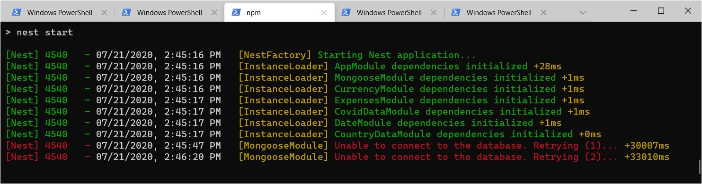

# Conectando Mongoose con Nest
En esta página vamos a seguir los pasos necesarios para que el módulo Nest sobre solicitudes de cuenta obtenga la información desde una base Mongo, utilizando Mongoose como librería de acceso a la BD.

Para esto vamos a tomar como referencia el instructivo _para la versión 6_ de NestJS, que se accede [a partir de la documentación de la versión 6](https://docs.nestjs.com/v6/), y de ahí eligiendo Techniques -> Mongo en el menú de la izquierda.

Vamos a observar cómo se reflejan en un módulo Nest, cada uno de los [cuatro conceptos iniciales](../mongoose/mongoose-cuatro-conceptos.md) de Mongoose.


## Antes de empezar - cargar packages necesarios
En nuestro proyecto TypeScript, debemos incorporar Mongoose, y además, el package específico que define Nest para el soporte de Mongoose.
```
> npm install mongoose --save
> npm install @nestjs/mongoose --save
```

Dado que vamos a usar una versión tipada de Mongoose debemos incorporar el package `@types/mongoose`, o sea.
```
> npm install @types/mongoose --save-dev
```


## Conexión
El soporte de Nest para Mongoose incluye un `MongooseModule`, este es el que hay que incorporar en nuestro módulo principal. La configuración se incluye en el mismo `import`.

``` typescript
@Module({
  imports: [
    AccountRequestModule, 
    MongooseModule.forRoot(
      'mongodb://localhost/accountRequestJs', { useNewUrlParser: true, useUnifiedTopology: true }
    )
  ],
  controllers: [],
  providers: [],
})
export class AppModule {}
```

Nest se encargará de manejar la conexión, o sea, de conectar y desconectar cuando sea necesario.  
Además, observamos que si levantamos la aplicación Nest sin que esté levantada la instancia de Mongo, la inicialización de la app Nest va a quedarse "esperando", y pasados unos segundos, va a poner un mensaje claro al respecto 

Al levantar la instancia de Mongo, la inicialización continúa normalmente.

Este es un pequeño ejemplo adicional de funcionalidad que Nest nos ayuda a manejar en nuestras aplicaciones, por sobre lo que brinda un servidor Web como p.ej. Express.


## Esquema y modelo
La definición del esquema es como en JavaScript
``` typescript
export const AccountRequestSchema = new mongoose.Schema({
    customer: { type: String, required: true },
    status: { type: String, enum: ['Pending', 'Analysing', 'Accepted', 'Rejected'] },
    date: Number,
    requiredApprovals: { type: Number, default: 3 }
})
```

En los módulos en los que querramos utilizar este esquema, tenemos que importar el `MongooseModule`, con una configuración que indique nombre del modelo y nombre del esquema.
``` typescript
@Module({
    imports: [MongooseModule.forFeature([
        { name: 'AccountRequest', schema: AccountRequestSchema }
    ])],
    controllers: [AccountRequestController],
    providers: [AccountRequestService]
})
export class AccountRequestModule { }
```
Esta declaración registra un nuevo modelo con el nombre definido, que va a ser administrado por Nest.

Los providers que quieran acceder a estos modelos, deben incorporarlos usando _inyección de dependencias_, como se indicó al [describir los elementos iniciales de NestJS.](../nestjs-basics/conceptos-iniciales.md).  
Definiremos un _constructor_ en el provider para inyectar la instancia de modelo Mongoose.
``` typescript
export class AccountRequestService {
    constructor(@InjectModel('AccountRequest') 
        private accountRequestModel: Model<any>
    ) {}
    // ... implementation
}
``` 

> **Comentario**  
> En realidad, _no_ nos vamos a conformar con esta definición, porque estamos poniendo un `any`. Vamos a cerrar una primer versión "semi-tipada", y agregar luego los tipos necesarios para poder reemplazar este `any` por un tipo correcto.


## Operaciones - nuestro primer find en NestJS
Las definiciones que hicimos hasta este punto, permiten utilizar el `accountRequestModel`, que accede a la tabla `accountrequests` como se indicó en la [descripción de Mongoose](../mongoose/mongoose-cuatro-conceptos.md).

Con lo cual, nos alcanza con modificar el método del provider que devuelve una lista fija de `AccountRequest`, para que acceda a la base Mongo.

Aquí debemos recordar que lo que devuelve Mongo es una lista _de objetos Document_, que tienen más información que la que seguramente queremos incluir en la respuesta.  
Podemos recurrir a `toObject()` como lo hicimos en Mongoose. Para controlar con precisión qué va a devolver el provider, en lugar de hacer eso, utilizamos un `map` para extraer los datos requeridos.

``` typescript
async getAccountRequests(): Promise<AccountRequest[]> {
    const mongooseData = await this.accountRequestModel.find();
    return mongooseData.map(mongooseReq => {
        return {
            id: mongooseReq._id,
            customer: mongooseReq.customer,
            status: mongooseReq.status,
            requiredApprovals: mongooseReq.requiredApprovals
        }
    })
}
```

Agregamos el `id` a nuestra descripción de un `AccountRequest`.
``` typescript
export interface AccountRequest {
    id: string,
    customer: string,
    status: string,
    requiredApprovals: number
}
```

Para que haya `AccountRequest` que consultar, se pueden agregar utilizando el código JavaScript que elaboramos en el material inicial sobre Mongoose, o bien hacerlo "a mano" desde una consola de Mongo.


## Resumiendo
Así como usamos el `find` sin parámetros, podemos usar todas las otras operaciones sobre modelos que practicamos en el material sobre Mongoose en JavaScript.  
El material de esta página incorpora lo necesario para utilizar Mongoose en un módulo Nest. 
Nos falta ajustar cuestiones relacionadas con tipos, que dejamos para una página aparte. Ahí vamos a incorporar la fecha que viene faltando.


## Para practicar un poco más
Agregar el atributo `receivedApprovals` a `AccountRequest`, de acuerdo a lo sugerido [al final del material sobre Mongoose en JS](../mongoose/esquema-avanzados).

Agregar dos virtuals en el esquema Mongoose: el que indica si una solicitud está definida (ya sea aceptada o rechazada), y el que indica cuántas aprobaciones le faltan (que es `required` - `received`). Agregar los atributos correspondientes en la interface `AccountRequest`, y en el resultado de servicio y request handler.

Utilizar la función `pick` incluida en el package [Lodash](https://lodash.com/) como alternativa para armar los objetos que retorna el servicio; tal como lo hicimos [al armar nuestro primer módulo NestJS](../nestjs-basics/inicio-app.md). 
No olvidar cargar el package `@types/lodash` como `--save-dev` para que funcione correctamente el chequeo de tipos.

