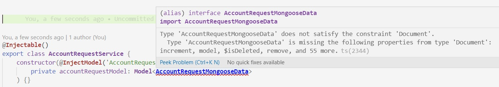
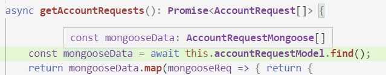

# Tipos - en la API, en el servicio, en la base
En la página anterior, llegamos a integrar Mongoose para obtener las respuestas a un request desde una colección Mongo.

El request es un `Get` para obtener un conjunto de solicitudes de cuenta, donde este es el tipo de una solicitud de cuenta.
``` typescript
export interface AccountRequest {
    id: string,
    customer: string,
    status: string,
    requiredApprovals: number
}
```

Esta información está presente en **tres entornos distintos**.
1. En la _base de datos_, hay una colección en una base Mongo cuyos documentos tienen este formato.
1. En el _servicio_ que levanta los datos para pasárselos al controller.
1. En la _respuesta_ que brinda la aplicación al recibir el request.

Hasta ahora, el formato de los datos es casi idéntico: la única transformación que hace el servicio es traducir el nombre de atributo `_id` por `id`. 

Hay algunos casos en los que puede resultar conveniente romper esta uniformidad entre los datos que se manejan en cada entorno. Este sencillo modelo de solicitudes de cuenta nos provee dos ejemplos.


## Fecha
Uno es la _fecha_ de cada solicitud, que excluimos hasta este momento para poder incorporarla pensando qué tipo conviene manejar para cada entorno.

En _la API_, sobre todo si está pensada para clientes que no manejen lógica de negocio, puede resultar conveniente un formato "listo para presentar". En nuestro caso, un string en formato `YYYY-MM-DD`, que a lo sumo podrá ser reconfigurado por una UI que quiera adoptar un formato distinto.

En _la base_, resulta conveniente manejar un formato que conserve el orden, para simplificar las búsquedas por períodos (p.ej. obtener las solicitudes con fecha entre el 15 de abril y el 22 de junio).  
De acuerdo a este criterio, nos inclinamos a manejar la fecha usando el formato [Unix time](https://en.wikipedia.org/wiki/Unix_time), que es un número; como ya lo expresamos [al describir una forma de manejar las conversiones en Mongoose](../mongoose/esquema-avanzados).  
Como expresamos en esa página, podemos configurar el esquema para que Mongoose haga las conversiones que necesitemos. Una alternativa, que exploraremos en esta página, es que de esta conversión se encarguen los elementos de Nest, o sea el provider y el servicio.

En _el servicio_, si tenemos que hacer manipulaciones con fechas, nos conviene aprovechar las facilidades que brinda la librería [MomentJS](https://momentjs.com/), que ya utilizamos varias veces en esta capacitación.  
Para facilitar este manejo, podemos definir que en el servicio, vamos a manejar las fechas como objetos `moment`.  
Por otro lado, al tomar esta decisión, la responsabilidad del formato que van a tener las fechas en las respuestas (y eventualmente, en los requests que involucren fechas) queda en el controller, lo que define un criterio de división de tareas.
- los controllers se encargan del manejo específico de requests y responses.
- los servicios se encargan de las operaciones que generan y manipulan información, en este caso, de obtenerla de la base Mongo.

En resumen, vamos a manejar tres formatos distintos para la fecha, en cada uno de los entornos:
- en la API: string `YYYY-MM-DD`.
- en el servicio: objetos `moment`.
- en la base: números en formato [Unix time](https://en.wikipedia.org/wiki/Unix_time).


## Status - un enum
El segundo caso a considerar es el _status_ de cada solicitud. En la definición del esquema Mongoose
``` typescript
status: { type: String, enum: ['Pending', 'Analysing', 'Accepted', 'Rejected'] },
``` 
está claro que este dato quedaría correctamente definido como un `enum`.
``` typescript
export enum Status {
    PENDING = 'Pending',
    ANALYSING = 'Analysing',
    ACCEPTED = 'Accepted',
    REJECTED = 'Rejected'
}
```
Por otro lado, ni en una base Mongo, ni en la especificación JSON, existe un concepto análogo al de `enum`. Por lo tanto, tanto para _la API_ como en _la base_, este dato será sencillamente un String.  
En rigor, podemos elegir si en el servicio queremos explicitar o no este `enum`, lo que tiene ventajas (p.ej. al construir un nuevo `AccountRequest`) y desventajas (de conversión de datos).  
Para este ejemplo, definamos que a nivel de servicio vamos a utilizar el `enum` recién definido. Por lo tanto, para este atributo también, los tipos no van a ser homogéneos entre las tres representaciones.


### Enums en los esquemas Mongoose
Al definir el enum de Status, observamos que se produjo una duplicación de información con la definición del esquema Mongoose, que lista las mismas cuatro opciones. Para que quede más elegante, y asegurarnos que quede homogéneo si se agrega un nuevo status, podemos cambiar la definición del esquema de esta forma.
``` typescript
status: { type: String, enum: Object.values(Status) },
``` 


## En resumen: tres interfaces
Fieles al objetivo de no dejar nada `any`, vamos a definir tres tipos distintos, para reflejar las distintas representaciones de una solicitud de cuenta en los tres entornos definidos. Nos queda así:
``` typescript
// en la base
export interface AccountRequestMongooseData {
    customer: string,
    status: string,
    date: number,
    requiredApprovals: number
}

// en el servicio
export interface AccountRequest {
    id: string
    customer: string,
    status: Status,
    date: Moment, 
    requiredApprovals: number
}

// en la API
export interface AccountRequestDto {
    id: string
    customer: string,
    status: string,
    date: string,
    requiredApprovals: number
}
```
Al primero le "falta" el `_id` ... ya veremos por qué.


## El tipo del modelo Mongoose
Teniendo en claro todo esto, podemos volver a la inyección del modelo Mongoose en el provider
``` typescript
export class AccountRequestService {
    constructor(@InjectModel('AccountRequest') 
        private accountRequestModel: Model<any>
    ) {}
    // ... implementation
}
``` 
El objetivo es cambiar ese `any` por el tipo correcto, que nos gustaría que fuera `AccountRequestMongooseData`. Pero no lo acepta.


El tipo que se ponga como parámetro de un modelo Mongoose va a ser el tipo de los documentos que se obtengan al hacer p.ej. un `find`, que como ya vimos, no son los objetos "planos" que definimos nosotros, sino _documentos Mongoose_.  
Por eso, la interface (o clase) que pongamos tiene que extender (o implementar) la interface `Document` de Mongoose.
Lo vamos a resolver de esta forma
``` typescript
export interface AccountRequestMongoose extends mongoose.Document, AccountRequestMongooseData { }
``` 
que aunque es más rebuscada que
``` typescript
export interface AccountRequestMongooseData extends mongoose.Document {
    customer: string,
    status: string,
    date: number,
    requiredApprovals: number
}
``` 
la preferimos porque más adelante vamos a usar `AccountRequestMongooseData`. 

> **Nota**  
> Al extender `mongoose.Document`, también estamos incorporando el atributo `_id`, por eso no hace falta incluirlo en `AccountRequestMongooseData`.

Ahora sí, podemos definir el tipo del modelo Mongoose correctamente.
``` typescript
export class AccountRequestService {
    constructor(@InjectModel('AccountRequest') 
        private accountRequestModel: Model<AccountRequestMongoose>
    ) {}
    // ... implementation
}
``` 


## Cómo queda el código
Ahora que tenemos tres interfaces, en el provider y en el servicio, tenemos que colocar los tipos correctos en los métodos, y hacer las conversiones necesarias.

### En el servicio
En el _servicio_, hay que hacer dos conversiones
- la _fecha_, de número a objeto `moment`.
- el _status_, de string al `enum`.

Para la fecha, usamos la función `moment.utc` de MomentJS, como ya hicimos en las conversiones en Mongoose sobre JS.

Para el status, después de darle muchas vueltas, concluí que lo más sencillo es ...castear, así de feo como suena.  
Se está suponiendo que la información de la base es correcta, en el sentido de que el String del status siempre corresponde a uno de los status definidos. Si no es así, hay que tomar algún recaudo a definir.

El método queda así.
``` typescript
async getAccountRequests(): Promise<AccountRequest[]> {
    const mongooseData = await this.accountRequestModel.find();
    return mongooseData.map(mongooseReq => { return {
        id: mongooseReq._id,
        customer: mongooseReq.customer,
        status: mongooseReq.status as Status,
        date: moment.utc(mongooseReq.date),
        requiredApprovals: mongooseReq.requiredApprovals
    }})
}
``` 
Notar que detecta el tipo adecuado para `mongooseData`.


Se puede verificar que el intellisense y el chequeo de tipos funcionan correctamente, tanto para `mongooseData` como para el valor de retorno del método.

> **Nota**  
> Una alternativa para el status es  
> `status: Status[mongooseReq.status.toUpperCase()]`  
> pero no funciona si está habilitado `strict` o `noImplicitAny` entre los compiler options (o sea, en el `tsconfig.json`).  
> La razón es súper-técnica: si se habilita alguna de estas dos opciones, en principio, sólo soporta _literales_ como índices para buscar en un enum, o entre los keys de un Object type.  
> Para que ande así, también se requiere un casteo:  
> `status: Status[mongooseReq.status.toUpperCase() as keyof typeof Status]`


### En el controller
En principio, se pensaría que también hay que hacer dos conversiones:
- la _fecha_, de objeto `moment` a string.
- el _status_, del `enum` a string.

Pero en realidad, no es necesario transformar el status.  
Hay que recordar que el código que realmente se ejecuta es JavaScript, y en JavaScript no existen los `enums`. Para tipos enum **en el que se indican los valores de cada opción**, el programa JavaScript va a manejar los valores. En nuestro caso los string `Pending`, `Accepted`, etc..

Por lo tanto, nuestro controller puede quedar así
``` typescript
@Get()
async getAccountRequests(): Promise<AccountRequestDto[]> {
    const requests = await this.service.getAccountRequests()
    return requests.map(request => { 
        return { ...request, date: request.date.format('YYYY-MM-DD') } 
    }); 
}
``` 


## Para seguir jugando con el código
Refactorizar las interfaces definidas usando herencia de interfaces.

Probar usando `toObject()` en el servicio. Esto es interesante en particular si se agregan los virtuals indicados en [la página anterior](./mongoose-en-nest.md).