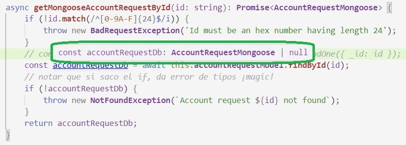
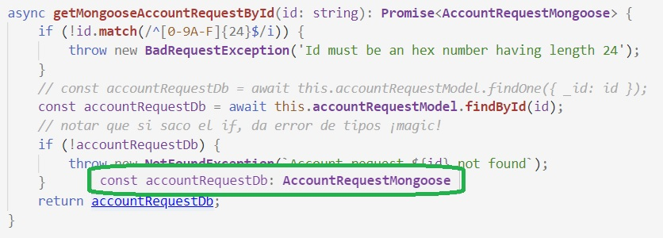

# Operaciones de baja - eliminación de información

## Decisión inicial - baja física o baja lógica
Cuando se presenta la necesidad de implementar operaciones de **baja**, la primer pregunta es si corresponde hacer una _baja física_ o una _baja lógica_, o sea, no eliminar el elemento en cuestión, sino sólo marcarlo como "dado de baja" y dejar de incluirlo en las consultas. La opción de baja lógica permite mantener el vínculo del elemento eliminado con otros elementos que siguen accesibles a la consulta.  
P.ej. al dar de baja un cliente, puede requerirse que siga siendo posible consultar sus operaciones p.ej. en una consulta de todas las operaciones hechas en un determinado día, con la posibilidad de consultar p.ej. el nombre de la entidad que hizo cada operación. Si se cierra una sucursal, probablemente sea necesario poder seguir haciendo consultas de operaciones u otros eventos que involucren a la sucursal cerrada. Estos son casos en que la _baja lógica_ puede ser una buena opción.

Una _baja lógica_ se implementa como una modificación sobre un atributo agregado, luego en las consultas pertinentes, hay que agregar una condición de no incluir los elementos para los que el valor del atributo corresponda a los "dados de baja".

En el resto de esta página, damos indicaciones para operaciones de _baja física_.


## Operaciones de MongoDB/Mongoose
Para las operaciones de baja, Mongoose provee las mismas operaciones definidas en MongoDB; entre ellas, `deleteOne`, `deleteMany`, y `findByIdAndDelete`. Todas ellas se le solicitan _al modelo_. Pueden ver los detalles en [la doc de la API de `Model` de Mongoose](https://mongoosejs.com/docs/api/model.html).

> **Detalle de diseño de Mongoose**  
> Hay una diferencia entre cómo tratamos antes a la [modificación individual](./modificacion-individual) y ahora a la baja.  
> Una modificación individual se puede manejar modificando el _documento_, mientras que las bajas hay que pedírselas siempre al _modelo_. 

Las primeras dos, `deleteOne` y `deleteMany`, tienen una lógica similar a `updateMany`, que describimos al dar el ejemplo de [modificación masiva](./modificacion-masiva), con la diferencia que sólo se les pasa un filtro. Esto es, no hay especificación de modificaciones: los documentos que cumplen con el filtro (para `deleteMany`) o el primero que encuentre (para `deleteOne`), son eliminados.

> **Nota comparativa con SQL**  
> Las bases llamadas "no SQL", y en particular MongoDB, no incluyen el concepto de _transparencia referencial_.  
> Se puede incluir en un documento, un atributo cuyo valor es el id de otro documento, con la idea de foreign key (FK), y también existen operaciones análogas a los `JOIN` (les interesades, pueden consultar sobre _operaciones de agregación_ en MongoDB).  
> Pero no existe un concepto formal de FK ni la posibilidad de restringir eliminaciones para que no queden FK huérfanas. Si un documento que se elimina está referenciado mediante su id en otro documento, ese vínculo queda huérfano.

El `findByIdAndDelete` hace ... lo que dice su nombre, elimina el documento con el id especificado, y lo devuelve. Con lo cual, en principio no haría falta obtener el documento antes de eliminarlo, se hacen las dos operaciones con una única llamada.  
Si no hay un documento con el id indicado, el `findByIdAndDelete` no genera un error, y devuelve `null`. (Vale verificar esto haciendo un test, que es lo que acabo de hacer).


## Validaciones
Vamos a tener en cuenta _tres_ validaciones.

1. no hay ninguna solicitud con el id indicado, lo mismo que sugerimos para la [modificación individual](./modificacion-individual). En este caso, salimos con `404 - Not Found`.
1. el id _no es un identificador válido de MongoDB_. Los identificadores de MongoDB son números hexadecimales de 24 cifras. Si al `findById` se le envía un string que no corresponde con esta especificación, en lugar de devolver null, genera una excepción, que provoca que el endpoint salga con un status code 500, cosa que no queremos. En este caso, salimos con `400 - Bad Request`. 
Para evitar esto, vamos a validar que el id tenga el formato válido, usando expresiones regulares. La expresión regular que caracteriza a los id válidos es `/^[0-9A-F]{24}$/i`, esto quiere decir "exactamente 24 dígitos hexa, nada más (por eso empieza con `^` y termina con `$`), y case unsensitive (eso es el `/i` del final)".
1. las solicitudes aceptadas no se pueden eliminar. Este punto en particular, nos obliga a obtener el documento antes de eliminarlo. En este caso, salimos con `403 - Forbidden`.

Las primeras dos validaciones son compartidas con la modificación individual, por eso armamos un método separado.

``` typescript
async getMongooseAccountRequestById(id: string): Promise<AccountRequestMongoose> {
    if (!id.match(/^[0-9A-F]{24}$/i)) {
        throw new BadRequestException('Id must be an hex number having length 24');
    }
    // const accountRequestDb = await this.accountRequestModel.findOne({ _id: id });
    const accountRequestDb = await this.accountRequestModel.findById(id);
    // notar que si saco el if, da error de tipos ¡magia!
    if (!accountRequestDb) {
        throw new NotFoundException(`Account request ${id} not found`);
    }
    return accountRequestDb;
}
```

Dejamos dos comentarios. El primero es para recordar que `findById` es sólo un shortcut para `findOne`. 
El segundo es una curiosidad interesante: el tipo de `accountRequestDb` es `AccountRequestMongoose | null`. Pero lo estamos devolviendo como `AccountRequestMongoose`, sin la alternativa. TS se da cuenta solito que `null` no puede ser por el `if` previo, que sale con excepción. Magia pura.

A las pruebas me remito.

antes del `if` tiene la alternativa con `null`.


después no.


## A practicar
Armar el endpoint `DELETE`, incluyendo método en el controller. 
Armar tests para los cuatro casos
- operación exitosa.
- id que no corresponde a ningún documento (un valor seguro son 24 ceros).
- id en formato inválido (p.ej. "yonosoyunid")
- solicitud aceptada.

Recordar de lo que vimos en el [test de controller](../test/un-test-de-controller-nest), cómo verificar que una operación asincrónica sale con excepción. ¡No olvidarse el `await` adelante del `expect`! (eso me costó una hora hoy, mientras estoy escribiendo estas notas)