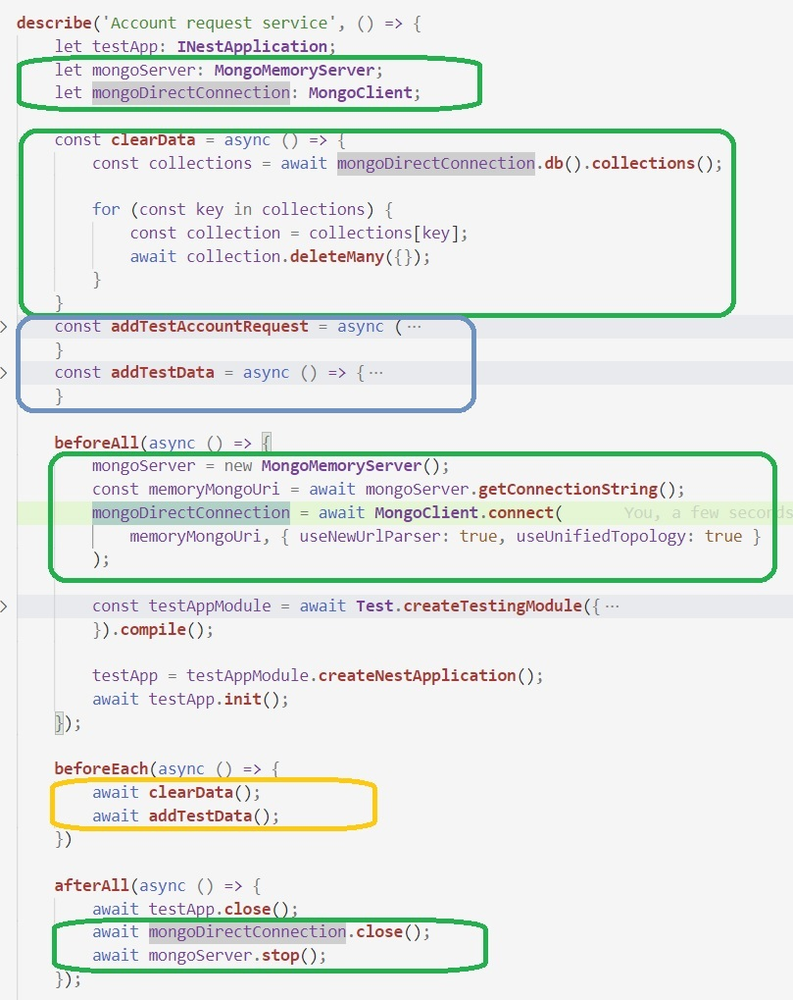
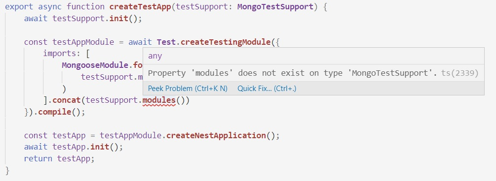
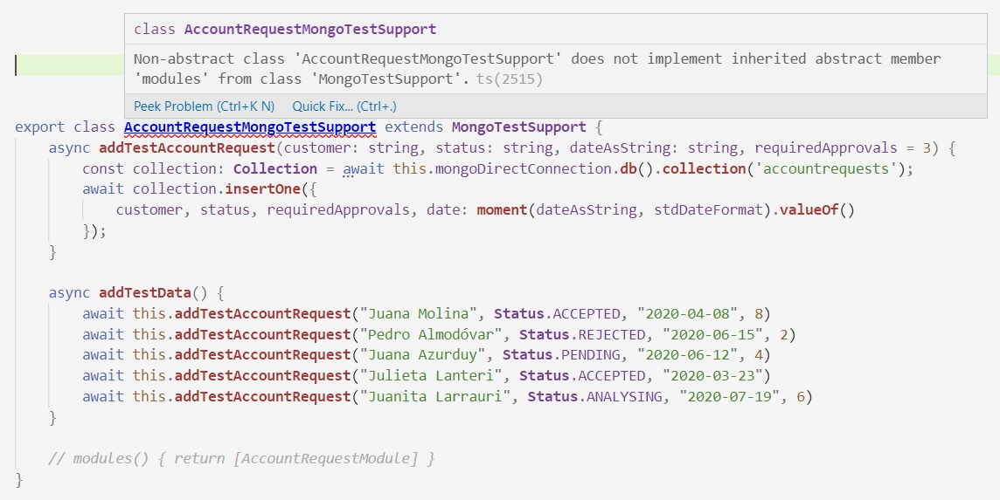

# Extra - refactor en los tests
A medida que agregamos funcionalidad, se nos pueden sumar muchos tests, que tal vez querramos dividir en distintos archivos. 
Pero tenemos un problema: hay **bastante** código de inicialización, que no forma parte de los tests propiamente dichos, sino que es necesario para que los tests corran.

Transcribimos la estructura de una test suite para provider (que también se puede usar para tests de controller), de acuerdo a lo que describimos al [presentar los tests de provider](../test/test-de-providers). De las dos opciones que describimos, elegimos la de utilizar la interfaz de Mongo.

La suite tiene esta forma (sí, es largo).

``` typescript
describe('Account request service', () => {
    let testApp: INestApplication;
    let mongoServer: MongoMemoryServer;
    let mongoDirectConnection: MongoClient;

    const clearData = async () => {
        const collections = await mongoDirectConnection.db().collections();

        for (const key in collections) {
            const collection = collections[key];
            await collection.deleteMany({});
        }
    }
    const addTestAccountRequest = async (
        customer: string, status: string, dateAsString: string, requiredApprovals = 3
    ) => {
        const collection: Collection = await mongoDirectConnection.db().collection('accountrequests');
        await collection.insertOne({ 
            customer, status, requiredApprovals, date: moment(dateAsString, stdDateFormat).valueOf()
        });
    }
    const addTestData = async () => {
        await addTestAccountRequest("Juana Molina", Status.ACCEPTED, "2020-04-08", 8)
        await addTestAccountRequest("Pedro Almodóvar", Status.REJECTED, "2020-06-15", 2)
        await addTestAccountRequest("Juana Azurduy", Status.PENDING, "2020-06-12", 4)
        await addTestAccountRequest("Julieta Lanteri", Status.ACCEPTED, "2020-03-24")
        await addTestAccountRequest("Juanita Larrauri", Status.ANALYSING, "2020-07-19", 6)
    }

    beforeAll(async () => {
        mongoServer = new MongoMemoryServer();
        const memoryMongoUri = await mongoServer.getConnectionString();
        mongoDirectConnection = await MongoClient.connect(
            memoryMongoUri, { useNewUrlParser: true, useUnifiedTopology: true }
        );

        const testAppModule = await Test.createTestingModule({
            imports: [
                AccountRequestModule,
                MongooseModule.forRoot(
                    memoryMongoUri, { useNewUrlParser: true, useUnifiedTopology: true }
                )
            ]
        }).compile();

        testApp = testAppModule.createNestApplication();
        await testApp.init();
    });

    beforeEach(async () => {
        await clearData();
        await addTestData();
    })

    afterAll(async () => {
        await testApp.close();
        await mongoDirectConnection.close();
        await mongoServer.stop();
    });

    // tests
});
```

Si se van agregando tests y queremos partir este archivo en varios, en principio deberíamos repetir **todo** este código. 


## Detectando partes comunes
En el código que mostramos, hay varias partes que son comunes a **cualquier** test que se implemente usando el mock y la interfaz de Mongo, sea sobre solicitudes de cuenta o sobre cualquier otro dominio. Son las que marcamos en verde en el gráfico siguiente, en la que comprimimos algunas secciones para que no se hiciera demasiado largo.



También destacamos el código en el `beforeEach`, que está marcado en amarillo. En este caso, el código de `addTestData` es particular de las solicitudes de cuenta, pero _la estructura_ de que antes de cada test hay que limpiar los datos y volver a generarlos, sí es general. 
Esta situación se encuadra en el _design pattern_ llamado [Template Method](https://refactoring.guru/es/design-patterns/template-method): la estructura es común, mientras que uno de los pasos (la generación de datos) cambia según el dominio que se quiera testear.

Finalmente, las funciones marcadas en azul son (o al menos podrían pensarse como) comunes para los distintos tests que se puedan generar sobre solicitudes de cuenta, pero no para tests sobre otros dominios.


## Separamos el código común en una clase
La estrategia que elegimos parte de la creación de una clase `MongoSupportTest`, que concentre el código común a cualquier dominio.
``` typescript
export class MongoTestSupport {
    mongoServer: MongoMemoryServer;
    mongoDirectConnection: MongoClient;
    memoryMongoUri: string;

    async init() {
        this.mongoServer = new MongoMemoryServer();
        this.memoryMongoUri = await this.mongoServer.getConnectionString();
        this.mongoDirectConnection = await MongoClient.connect(
            this.memoryMongoUri, { useNewUrlParser: true, useUnifiedTopology: true }
        );
    }

    async clearData() {
        const collections = await this.mongoDirectConnection.db().collections();

        for (const key in collections) {
            const collection = collections[key];
            await collection.deleteMany({});
        }
    }

    async clear() {
        await this.clearData();
        await this.addTestData();
    }

    async stop() {
        await this.mongoDirectConnection.close();
        await this.mongoServer.stop();
    }

    async addTestData() {
        return Promise.resolve();
    }
}
```

Los métodos `init`, `clearData`, `clear` y `stop`, se corresponden con las cuatro secciones que marcamos en verde y amarillo, en la estructura del test. A su vez, define como atributos las dos variables que señalamos. 
También se define un método `addTestData` que no hace nada, pero que es invocado en el `clear`. 

Para que se generen los datos que necesitamos, vamos a crear una _subclase_ de `MongoTestSupport`, que incluya las funciones que marcamos en azul en el test.
``` typescript
export class AccountRequestMongoTestSupport extends MongoTestSupport {
    async addTestAccountRequest(customer: string, status: string, dateAsString: string, requiredApprovals = 3) {
        const collection: Collection = await this.mongoDirectConnection.db().collection('accountrequests');
        await collection.insertOne({
            customer, status, requiredApprovals, date: moment(dateAsString, stdDateFormat).valueOf()
        });
    }

    async addTestData() {
        await this.addTestAccountRequest("Juana Molina", Status.ACCEPTED, "2020-04-08", 8)
        await this.addTestAccountRequest("Pedro Almodóvar", Status.REJECTED, "2020-06-15", 2)
        await this.addTestAccountRequest("Juana Azurduy", Status.PENDING, "2020-06-12", 4)
        await this.addTestAccountRequest("Julieta Lanteri", Status.ACCEPTED, "2020-03-23")
        await this.addTestAccountRequest("Juanita Larrauri", Status.ANALYSING, "2020-07-19", 6)
    }
}
```

Esta clase _redefine_ el método `addTestData`. Por lo tanto, cuando se invoque la operación `clear()` sobre una instancia de `AccountRequestMongoTestSupport`, los datos que se generen serán los correspondientes a solicitudes de cuenta. Aquí se nota el uso de la idea de _Template Method_.

Estas clases nos van a permitir achicar bastante la estructura de la test suite.
``` typescript
describe('Account request service - using mongo connection', () => {
    let testApp: INestApplication;
    let testSupport: AccountRequestMongoTestSupport;

    beforeAll(async () => {
        const testSupport = new AccountRequestMongoTestSupport();
        await testSupport.init();

        const testAppModule = await Test.createTestingModule({
            imports: [
                MongooseModule.forRoot(
                    testSupport.memoryMongoUri, { useNewUrlParser: true, useUnifiedTopology: true }
                ),
                AccountRequestModule
            ]
        }).compile();

        const testApp = testAppModule.createNestApplication();
        await testApp.init();
    });

    beforeEach(async () => {
        await testSupport.clear();
    })

    afterAll(async () => {
        await testApp.close();
        await testSupport.stop();
    });

    // tests
});
```
El código que hay que copiar si se quieren armar varias suites sobre solicitudes de cuenta se achicó bastante. 


## Un paso más: creación de la aplicación de test
Para seguir comprimiendo el código a copiar, concentrémonos en la creación de la `testApp`.
``` typescript
const testAppModule = await Test.createTestingModule({
    imports: [
        MongooseModule.forRoot(
            testSupport.memoryMongoUri, { useNewUrlParser: true, useUnifiedTopology: true }
        ),
        AccountRequestModule
    ]
}).compile();

const testApp = testAppModule.createNestApplication();
await testApp.init();
```
Este código es _casi_ todo genérico, lo único particular de las solicitudes de cuenta es la referencia al `AccountRequestModule`. Vemos que este código usa el `testSupport` para obtener la URI del mock de Mongo.

Podemos definir una función que lleva a cabo la creación de la app de test, recibiendo por parámetro el `testSupport`.
```  typescript
export async function createTestApp(testSupport: any) {
    await testSupport.init();

    const testAppModule = await Test.createTestingModule({
        imports: [
            MongooseModule.forRoot(
                testSupport.memoryMongoUri, { useNewUrlParser: true, useUnifiedTopology: true }
            )
        ].concat(testSupport.modules())
    }).compile();

    const testApp = testAppModule.createNestApplication();
    await testApp.init();
    return testApp;
}
``` 
Los módulos del `testAppModule` incorporan a los que defina el `testSupport`. En el caso del `AccountRequestMongoTestSupport`, hay que agregar este método.
```  typescript
    modules() { return [AccountRequestModule] }
``` 

De esta forma, la función `createTestApp` es genérica para cualquier dominio, y definimos que las subclases de `MongoTestSupport` que se generen para cada dominio específico, deben definir el método `modules` para indicar cuáles son los módulos que deben ser incorporados.

La estructura de la suite nos queda, ahora sí, bien cortita.
```  typescript
describe('Account request service - using mongo connection', () => {
    let testApp: INestApplication;
    let testSupport: AccountRequestMongoTestSupport;

    beforeAll(async () => {
        testSupport = new AccountRequestMongoTestSupport();
        testApp = await createTestApp(testSupport);
    });

    beforeEach(async () => {
        await testSupport.clear();
    })

    afterAll(async () => {
        await testApp.close();
        await testSupport.stop();
    });

    // tests
});
``` 
Incluso, para tests para otros dominios, la estructura va a ser igual, y solamente vamos a tener que definir una subclase de `MongoTestSupport` en la que definamos la creación de datos, que es el único aspecto que difiere para distintos dominios. Bastante bien.


## Chiche 1: tipar el parámetro de _createTestApp_ - clase abstracta
El código de `createTestApp` tiene un defecto: no pudimos tipar el parámetro `testSupport`. No le queremos asignar como tipo `AccountRequestMongoTestSupport`, porque queremos que `createTestApp` sirva para **cualquier dominio**. Por otro lado, si ponemos como tipo `MongoTestSupport`, falla la invocación a `modules()`.



El método `modules()` está definido en `AccountRequestMongoTestSupport`, no en `MongoTestSupport`. 
Para que la función `createTestApp` compile, tenemos que agregar el método a la superclase.  
¿Con qué código? Podríamos dejarlo como la lista vacía, diciendo "en principio, no se agrega ningún módulo". 

Pero tenemos otra opción: definir la clase `MongoTestSupport` _abstracta_, y lo mismo para el método `modules()`.

``` typescript
export abstract class MongoTestSupport {
    // lo mismo que antes

    abstract modules()
}
```

Esto implica que cualquier subclase de `MongoTestSupport` **debe** definir el método. Para verificarlo, comentémoslo en `AccountRequestMongoTestSupport`.



O sea, la clase debe implementar el método abstracto heredado.

De esta forma, además de poder tipar el parámetro de `createTestApp`, estamos  **obligando** a toda subclase de `MongoTestSupport` a definir qué módulos debe incorporar.

> **Nota**  
> Se podría haber hecho lo mismo con `addTestData()`: dejar el método abstracto en lugar de definir que no haga nada.


## Chiche 2: crear la instancia dentro de _createTestApp_
Ya de súper-exquisitos, volvamos a mirar el `beforeAll`.
``` typescript
beforeAll(async () => {
    testSupport = new AccountRequestMongoTestSupport();
    testApp = await createTestApp(testSupport);
});
```

La pregunta es si hay una forma de "comprimir" estas dos líneas, en una. Observamos que _las dos_ variables, `testSupport` y `testApp`, se usan más adelante. 

Para esto, vamos a incorporar bastante "ferretería" de TS. En concreto, dos técnicas.

Una es el **object destructuring**: la función `createTestApp` va a devolver un objeto con los atributos `testApp` y `testSupport`, y usando el destructuring vamos a asignar ambos a la vez.
``` typescript
beforeAll(async () => {
    ({ testApp, testSupport } = await createTestApp(<qué_poner_acá>));
});
```

> **Nota**  
> Cuando se usa destructuring para el resultado de una función, _hay que encerrar todo entre paréntesis_, caso contrario no compila.

Nos queda definir el parámetro de la nueva versión de `createTestApp`. Y ahí agregamos la segunda técnica: le vamos a pasar **la clase** por parámetro. O sea, que el `beforeAll` queda así.
``` typescript
beforeAll(async () => {
    ({ testApp, testSupport } = await createTestApp(AccountRequestMongoTestSupport));
});
```
Notar que no dice `new AccountRequestMongoTestSupport()`, ahora dice `AccountRequestMongoTestSupport`. El `new` lo vamos a tener que hacer _adentro_ de `createTestApp`.
Nos falta aprender cómo hacer esto, y además, cómo especificar que el tipo del parámetro va a ser una clase, y además no cualquier clase, sino una que extienda `MongoTestSupport`. Esto está explicado en el [handbook de TS](https://www.typescriptlang.org/docs/handbook/generics.html#using-class-types-in-generics), pero tal vez es más fácil mirando el ejemplo.
``` typescript
export async function createTestApp<T extends MongoTestSupport>(testSupportClass: { new(): T }) {
    const testSupport = new testSupportClass();
    await testSupport.init();

    const testAppModule = await Test.createTestingModule({
        imports: [
            MongooseModule.forRoot(
                testSupport.memoryMongoUri, { useNewUrlParser: true, useUnifiedTopology: true }
            )
        ].concat(testSupport.modules())
    }).compile();

    const testApp = testAppModule.createNestApplication();
    await testApp.init();

    // se devuelve un objeto con los dos atributos
    return { testApp, testSupport };
}
```
La especificación `{ new(): T }` indica que el parámetro es una clase. Al especificar `<T extends MongoTestSupport>`, estamos limitando cuáles pueden ser estas clases. Si no hacemos esta aclaración, no van a compilar las operaciones sobre el `testSupport`.


## Recapitulando
Se hizo largo, espero que valga la pena.

Partimos de la idea de hacer más sencilla la distribución de los tests sobre un mismo dominio (en este caso, solicitudes de cuenta) en distintos archivos. 

Al analizar el código, descubrimos que hay varias cosas que son genéricas para cualquier dominio, no sólo para solicitudes de cuenta; y otras que son específicas de este dominio, pero sirven para cualquier test sobre el mismo. A partir de ahí aplicamos varias técnicas
- definición de una clase para separar código común
- herencia para lo específico de un dominio
- una función que crea la aplicación de test, a la que le llega por parámetro el `testSupport`.
- clase abstracta para forzarnos a definir un método, en este caso `modules()`, en las subclases.
- object destructuring para asignar a la vez `testApp` y `testSupport`.
- pasar una clase por parámetro a una función, cómo tipar el parámetro, y cómo crear una instancia de esa clase dentro de la función.