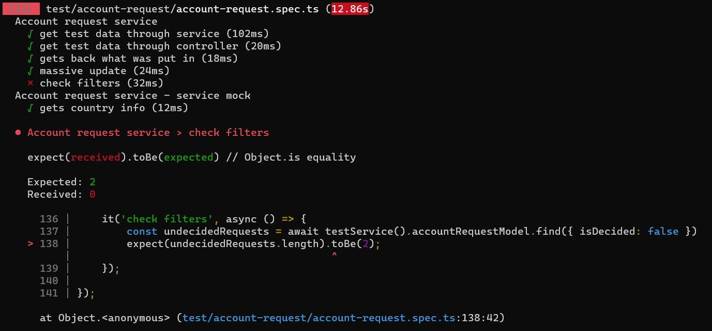

# Modificación masiva
En esta página, vamos a trabajar con un endpoint de _modificación masiva_, o sea, que provoca la modificación simultánea de muchos documentos haciendo un solo pedido. Para esto, vamos a usar una funcionalidad específica que provee MongoDB/Mongoose.

La propuesta es armar un endpoint que le sume uno a la cantidad de aprobaciones necesarias para todas las solicitudes que no estén resueltas (o sea, que su estado sea `Pending` o `Analysing`).


## Modificación masiva en MongoDB/Mongoose
Entre las operaciones que puede hacer un modelo Mongoose, encontramos [updateMany](https://mongoosejs.com/docs/api/model.html#model_Model.updateMany).
Esta operación lleva dos parámetros
- el primero es la especificación de _condiciones_, que definen a cuáles de los documentos se les va a hacer la modificación. 
- el segundo indica qué _modificaciones_ hay que hacerle a cada documento.

Por ejemplo, dado un `EmployeeModel`, para ponerle 40000 de sueldo a los empleados de categoría 3, podemos implementarlo de esta forma
``` typescript
const updateResult = await EmployeeModel.updateMany({ category: 3 }, { salary: 40000 });
```
El resultado es un objeto de esta forma
``` 
{ n: <resultados_del_filtro>, nModified: <documentos_modificados>, ok: <1 ó 0> }
```
el `n` puede ser distinto del `nModified`, porque en el segundo se cuentan solamente los documentos que efectivamente cambiaron algo.
En el ejemplo, si hay empleados de categoría 3 cuyo sueldo era 40000 antes de la modificación, entonces esos van a "sumar" al `n`, pero no al `nModified`. Si hay 10 empleados con categoría 3, de los cuales 2 tenían ya sueldo 40000, entonces el resultado va a ser.
``` javascript
{ n: 10, nModified: 8, ok: 1 }
```

> **Comparación con SQL**  
> Lo que en SQL sería
> ``` SQL
> UPDATE <tabla_coleccion>
> SET <nuevos_valores>
> WHERE <condiciones>
> ```
> en MongoDB/Mongoose nos queda
> ``` 
> <tabla_coleccion>.updateMany(<condiciones>,<nuevos_valores>)
> ``` 


## ¿Cómo se hace para _aumentar_ un valor numérico?
Ahora supongamos que en lugar de _asignar_ 40000 de sueldo, queremos _aumentar_ el sueldo, digamos en 5000 pesos, a los empleados de categoría 3.
Nos gustaría poner
``` typescript
EmployeeModel.updateMany({ category: 3 }, { salary: salary + 5000 });
```
pero así no es. 

Para entender cómo se puede resolver este caso, hay que tener en cuenta que Mongoose delega en MongoDB todas las operaciones, entre ellas el `updateMany`. Por eso nos conviene ir a la [documentación de Mongo](https://docs.mongodb.com/manual/reference/command/update/), que (aunque podría ser más claro) indica que se pueden usar [update operators](https://docs.mongodb.com/manual/reference/operator/update/).  
Los operadores de update son similares a los que vimos de búsqueda, en lugar de 
`{ salary: 40000 }`
pondremos algo de esta forma
`{ salary: {... operadores ...} }`.  
Esto es análogo a lo que hicimos en las búsquedas, al pasar p.ej. de 
`{ requiredApprovals: 4 }`
para el valor fijo 4, a
`{ requiredApprovals: { $gt: 2 } }`
para la condición `>= 2`.  
Los nombres de los operadores de update también empiezan con `$`.

En particular, para modificar un valor numérico, podemos usar el operador `$inc`. Nos queda.
``` typescript
EmployeeModel.updateMany({ category: 3 }, { $inc: { salary: 5000 } });
```


## Los filtros _los resuelve Mongo_
Vayamos ahora a nuestro caso, queremos aumentar en uno el valor de `requiredApprovals` para todas las solicitudes _pendientes_. 
Recordemos que agregamos esta definición en el esquema Mongoose.
``` typescript
AccountRequestSchema.virtual('isDecided').get(
    function(): boolean { 
        return [Status.ACCEPTED, Status.REJECTED].includes(this.status) 
    }
);
```
En principio, esto se puede aprovechar para obtener las solicitudes pendientes. Veámoslo en un find:
``` typescript
it('check filters', async () => {
    const undecidedRequests = await testService().accountRequestModel.find({ isDecided: false })
    expect(undecidedRequests.length).toBe(2);
});
```
(aquí utilicé el servicio-para-test comentado al estudiar alternativas para los [tests de providers](../test/test-de-providers), el juego de datos tiene 5 solicitudes, 3 definidas y 2 pendientes).  

Lamentablemente, esto no funciona como se espera


O sea, no encontró ningún documento. 

La razón es que aunque la búsqueda se le pide a Mongoose, quien resuelve, o sea realiza el fitro de los documentos, _es MongoDB_. La base no conoce el atributo `isDecided`, eso lo agrega Mongoose. Por lo tanto, no puede procesar el pedido de implementar un filtro basado en un atributo que no conoce.

**Moraleja**  
En los filtros no se pueden usar atributos agregados mediante `virtual`, `method`, u otras características _de Mongoose_. Sólo se pueden usar los atributos que están explícitamente definidos en el esquema, que son los que se van a corresponder con los atributos de la colección de MongoDB.

> **Atención**  
> Esto es un reflejo de un fenómeno general: al usar Mongoose, conviene no perder de vista que en realidad es una interfaz a MongoDB, y que MongoDB no conoce los agregados que se puedan hacer a nivel Mongoose.


### Varios status - cómo resolverlo
Por lo tanto, para obtener las solicitudes pendientes, hay que acceder al status. Pero tenemos dos status posibles, ¿cómo hacer? Hay que usar atributos de búsqueda. 
Vamos a ver dos opciones. Las dos funcionan (las probé).

**Opción 1 - `$in`**  
Se puede pedir que el valor de un atributo esté en un conjunto, ver [la documentación](https://docs.mongodb.com/manual/reference/operator/query/in/).
``` typescript
const undecidedRequests = await testService().accountRequestModel.find(
    { status: {$in: [Status.ANALYSING, Status.PENDING]} }
)
```

**Opción 2 - `$or`**  
Una alternativa es armar un "or" entre dos condiciones, ver [la documentación](https://docs.mongodb.com/manual/reference/operator/query/or/).
``` typescript
const undecidedRequests = await testService().accountRequestModel.find(
    { $or: [{ status: Status.ANALYSING }, { status: Status.PENDING} ]}
)
```

> **Nota sobre el `$or`**  
> Notar que la sintaxis del `$or` rompe con la estructura `{ atributo: condiciones }`. Esto es necesario porque las condiciones del `$or` podrían estar relacionadas con distintos atributos.


## Falta hacerlo
Con todos estos elementos, implementar un endpoint que permita realizar la actualización masiva.
- el endpoint tiene que ser un POST, no necesita parámetros.
- el resultado, que incluya la cantidad de solicitudes modificadas, el número nomás.

Lo que vimos sobre la condición, usarlo en el primer parámetro del `updateMany`.

Una vez que ande, agregarle un query param opcional de fecha, para que aplique la actualización solamente a las solicitudes _anteriores_ a esa fecha. Si lo que se pasa no es una fecha, debería salir con un `400 - Bad Request`.  
Para armar la condición, como ya tenemos un `$or`, tal vez haya que usar un `$and` para combinarlo con la condición sobre la fecha.


## Más para practicar
Armar un endpoint que rechace todas las solicitudes que declaran un saldo promedio mayor a 10.000.000, por sospechosas.  
Se puede hacer más flexible, posibilitando poner un monto mínimo menor, mediante un query param. Pero si se pone un valor menor a 3.000.000, salir con status code `403 - Forbidden`. Si se pone cualquier otra cosa como query param, salir con `400 - Bad request`.