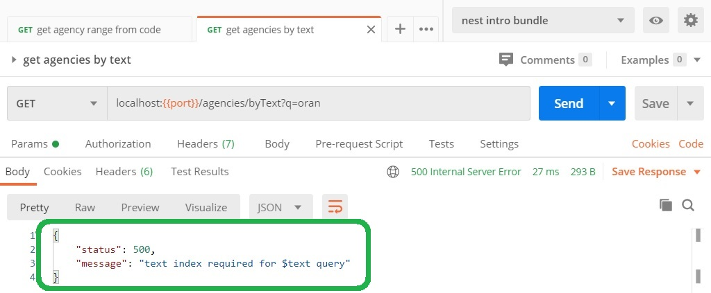

# Uso de índices de BD para acelerar consultas
En esta página vamos a ver algunos (poquitos) elementos sobre cómo se puede aprovechar la idea de _índice_ de BD para acelerar las consultas en una aplicación.  
Lo que se indica en esta página no pretende ser más que una mínima introducción. Los índices, en general y en MongoDB, son un mundo, del que nos limitaremos a presentar un par de paisajes.


## Intro a índices
Los _índices_ son elementos que se agregan en una base de datos para acelerar algunas búsquedas.
Prácticamente todas las BD (o al menos, de las que conozco) incorporan algún concepto de índice.  
Entre las definiciones de diseño de una BD, está la de qué índices crear, de acuerdo a las consultas que se quiera acelerar. 
_Crear un índice es una decisión explícita_, hay que decirle a la BD "creá un índice con tales características" para que las búsquedas que se desea se aceleren.


### Indices "clásicos"
Los índices que llamaré "clásicos" se refieren a uno o varios atributos.   
Para contarlos a partir de un ejemplo, pensemos en nuestra colección de solicitudes de cuenta, y supongamos que queremos acelerar las consultas que permiten acceder a las solicitudes generadas en una determinada fecha. Para esto, le pedimos a Mongo que genere un índice sobre la colección `accountrequests`, sobre el atributo `date`.  
Mongo genera internamente una estructura separada de donde residen los datos, en donde registra las fechas de cada solicitud en forma ordenada, con una referencia de cada fecha al, o a los, documentos que representen solicitudes generadas en esa fecha. Todo esto es interno de Mongo, es la BD quien se encarga de administrar y utilizar los índices. 

Con el índice creado, ante consultas que se hagan por fecha, p.ej. en un provider de Nest
``` typescript
const someDate = /* una fecha */
const dbData = await this.accountRequestModel.find({date: someDate})
```
al procesarlas, Mongo se da cuenta que en lugar de buscar en todos los documentos, puede acceder al índice, ubicar rápidamente la fecha indicada, de ahí ir a los documentos de esa fecha usando las referencias que forman parte del índice, y listo.
En colecciones grandes (digamos, del orden de cientos de miles de documentos en adelante), esto genera una ganancia grande de eficiencia.

A partir de la creación del índice, en cada modificación de la colección (agregar, eliminar o modificar documentos), Mongo se encarga de actualizar los índices que tenga definidos.


### Otros tipos de índices
En los tiempos modernos, se han agregado distintas variantes de índices, siempre con el objetivo de acelerar búsquedas.
Por [lo que voy leyendo en la doc](https://docs.mongodb.com/manual/indexes/), Mongo [incorpora varias de estas variantes](https://docs.mongodb.com/manual/indexes/#index-types), en particular _índices geoespaciales_ e _índices de texto_ para búsquedas "à la Google".


## Qué vamos a hacer
Vamos a trabajar sobre un dominio distinto, el de _sucursales_. Este es el esquema
``` typescript
export const AgencySchema = new mongoose.Schema({
    code: String,
    name: String,
    address: String,
    area: { type: Number, default: 3, min: 10, max: 1000000 }
})
```
y esta es la interfaz que maneja el provider
``` typescript
export interface Agency {
    id: string
    code: string,
    name: string,
    address: string,
    area: number
}
```

Sobre esta colección, vamos a definir dos índices.
1. un índice clásico para el atributo `code`, y apreciar cómo acelera las consultas sobre ese atributo.
1. definir un índice de texto para los atributos `name` y `address`, y apreciar cómo acelera las búsqueda de una sucursal que tenga una palabra en alguno de esos dos atributos.

Para que se note la ganancia de performance, armé una colección con una carga interesante.


La imagen es de la herramienta llamada [Mongo shell](https://docs.mongodb.com/manual/mongo/), que es una consola que nos permite interactuar con una instalación de Mongo (que puede incluir varias bases).
Vamos a usar bastante el Mongo shell, para crear los índices, y para apreciar la ganancia de velocidad en performance.


## Índice clásico
Como dijimos, vamos a definir un índice sobre el atributo `code`. Podemos hacerlo en el Mongo shell, utilizando el comando `createIndex`.
```
> db.manyagencies.createIndex( { code: 1 } )
```
Este comando tiene una cantidad notable de variantes y opciones, que reflejan  variantes en la definición y uso de índices. 
Quienes estén curioses, pueden consultar [la doc](https://docs.mongodb.com/manual/reference/method/db.collection.createIndex/index.html).


Para destacar la ganancia de eficiencia, implementamos este método en el provider de sucursales.
``` typescript
async getRangeByCode(code: string): Promise<Agency[]> {
    const agency = async code => {
        const mongooseResult = await this.agencyModel.findOne({ code }) as AgencyMongoose
        return mongooseToModel(mongooseResult)
    }

    const codeAsNumber = Number(code)
    const result: Agency[] = []
    result.push(await agency(codeAsNumber))
    result.push(await agency(codeAsNumber + 1))
    result.push(await agency(codeAsNumber + 2))
    result.push(await agency(codeAsNumber + 3))
    result.push(await agency(codeAsNumber + 4))
    result.push(await agency(codeAsNumber + 5))
    result.push(await agency(codeAsNumber + 6))
    result.push(await agency(codeAsNumber + 7))
    result.push(await agency(codeAsNumber + 8))
    result.push(await agency(codeAsNumber + 9))
    return result
}
```
Este método hace 10 consultas puntuales por `code`, poniendo un especial cuidado en que se ejecuten en forma secuencial 

La función `mongooseToModel` hace la transformación (mínima) entre el objeto que maneja Mongoose y el que devuelve el provider.

> **Para practicar**, dos propuestas:   
> 1. Pensar cómo sería una implementación que haga las diez consultas en paralelo.  
> 1. Implementar `mongooseToModel`, usando `_.pick`.

Analicemos el resultado de un endpoint que delega en este método de provider.
Apuntando a una colección a la que no se agregó el índice, obtenemos esto:

arriba de 7 segundos. Hice varias pruebas, todas dieron entre 7 y 8.5 segundos.  

Cambiamos a una colección que tiene el índice creado, volvemos a ejecutar. 

epa, cómo mejoramos. Hice varias pruebas, todas dieron debajo de 100 ms.


### Conclusiones y comentarios
Este es el efecto del índice: mejorar la eficiencia de algunas consultas. En este caso, consultas de una sucursal a partir del código.

Es importante destacar que el uso de índices "clásicos" es, en principio, **transparente** respecto del código de la aplicación. 
Esto se ve claramente en el ejemplo: la mejora de performance se verifica para las mismas consultas, y en general el mismo código, utilizado antes de crear el índice. No fue necesario hacer ninguna modificación en el código para obtener el beneficio de la creación del índice.

Mencionamos también que los índices clásicos también brindan mejoras cuando el resultado de una consulta debe obtenerse **ordenado** de cierta forma. En este ejemplo, una consulta de sucursales ordenadas por código va a ser, al menos en muchas ocasiones, mucho más rápida con índice que sin índice.


## Indice de texto
Ahora pensemos en un endpoint para búsqueda de sucursales por texto, que considere el nombre y la dirección. Una especie de búsqueda "a la Google".

Usando lo que aprendimos sobre expresiones regulares, podemos armar este método en el provider
``` typescript
    async getByTextSearch(queryString: string): Promise<Agency[]> {
        const dbResult = await this.agencyModel.find(
            { $or: [
                { name: { $regex: `.*${queryString}.*` } }, 
                { address: { $regex: `.*${queryString}.*` } }
            ] }
        )
        return dbResult.map(mongooseToModel)
    }
```

Esto funciona perfectamente ...

... pero tarda.

Para abordar este caso, vamos a usar un [índice de texto](https://docs.mongodb.com/manual/core/index-text/) de MongoDB.
Creamos el índice usando el Mongo shell
```
> db.manyagencies.createIndex( { name: "text", address: "text" } )
```
corremos la query ... sigue tardando.


### Los índices de texto no son transparentes
Para aprovechar el índice de texto, hay que **cambiar la query**, este índice funciona _solamente_ para una forma especial de `find`, en el cual se usa `$text` para especificar la condición.
``` typescript
async getByTextSearch(queryString: string): Promise<Agency[]> {
    const dbResult = await this.agencyModel.find({ $text: { $search: queryString } })
    return dbResult.map(mongooseToModel)       
}
```

O sea, los índices de texto _no son transparentes_, como sí son los índices "clásicos".
Pero sí son muy útiles.


Tan poco transparente es el manejo de este tipo de índices, que las consultas con condición `$text` **funcionan únicamente** en colecciones que definen un índice de texto. Caso contrario, generan un error.


Hay muchas más condiciones y variantes respecto de los índices de texto, eso está en [la doc](https://docs.mongodb.com/manual/core/index-text/).


## Su turno
La propuesta es usar índices en el manejo de solicitudes de cuenta. Dos propuestas
- definir un índice por fecha, y agregar búsquedas por una fecha, o en un rango de fechas donde el resultado viene ordenado por fecha.
- definir un índice de texto para el cliente.

Una tarea accesoria es generar una colección cargada, para probar.


## Algunos comentarios finales
Dejamos para el final algunos comentarios sueltos, que espero sean de utilidad.

### Los índices no son gratis
Si agregando índices se aceleran las consultas ¿por qué no agregar todos los índices que podrían ser útiles?

La respuesta es: porque los índices tienen costos, en dos sentidos.

El primero, que penalizan la eficiencia de las operaciones de modificación. O sea, al agregar índices, algunas consultas van a andar mucho más rápido, pero al precio de que las actualizaciones funcionen más lento.

Dos factores que inciden en la decisión de usar índices son: el tamaño, y la comparación entre frecuencia de consulta y frecuencia de actualización.
Si se hacen muchas actualizaciones y en proporción, pocas consultas, entonces tal vez no convenga poner índices, y soportar lo que tarden las consultas. Ejemplo típico: logs.
Si se hacen consultas seguido, y la colección es voluminosa, el índice es en principio inescapable, aún sabiendo que se paga una penalidad de performance en las actualizaciones. Ejemplo típico: movimientos, p.ej. de una cuenta.

Hay variantes y alternativas, alguna (la posibilidad de definir documentos anidados en Mongo) la veremos más adelante.
En esta página, sólo queremos mencionar que esta problemática existe, y como lo dice el título, que agregar índices a una colección no es gratis, y debe ser una decisión razonada.


### Dónde especificar qué índices deben crearse
Mongoose incluye una sintaxis para crear índices asociándolos a un esquema, que se describe [en la documentación sobre esquemas](https://mongoosejs.com/docs/guide.html#indexes). 
Si se hace así, cada vez que levanta la aplicación se generan los índices sobre la base de datos sobre la que se esté trabajando. Si la base incluye muchos datos, esto pone una penalidad sobre cada vez que queremos probar algo. La misma documentación de Mongoose indica que esto está pensado para desarrollo pero no para producción.  

**Aclaración importante**: definir o no los índices en el esquema Mongoose _no hace ninguna diferencia_ respecto de la eficiencia. El que resuelve las consultas es Mongo, y si tiene los índices definidos, las consultas van a andar más rápido, es indistinto si Mongoose tiene conocimiento de estos índices o no.

Lo que nos deja la pregunta de dónde definir qué índices hay que, o conviene, definir. Se puede dejar en algún archivo de configuración, distribuirse una base "prearmada" para el entorno de cada dev, etc..

### Detalles sobre el manejo de colecciones voluminosas
Para colecciones que tienen millones de filas, dejar un endpoint que permita obtener **todos** los documentos, algo como
``` typescript
async getAgencies(): Promise<Agency[]> {
    return (await this.agencyModel.find({})).map(mongooseToModel)
}
``` 
es una invitación a los problemas.

Para manejar estos casos, hay varias variantes que se pueden implementar sobre el `find` de Mongo/Mongoose. En particular: 
- `limit()`: máximo de resultados a obtener
- `count()`: cantidad de resultados
- `skip()`: "saltar" una cantidad de resultados.

P.ej. para obtener a lo sumo 500 sucursales, modificamos ligeramente el método anterior.
``` typescript
async getAgencies(): Promise<Agency[]> {
    return (await this.agencyModel.find({}).limit(500)).map(mongooseToModel)
}
``` 

Estas opciones también sirven para implementar _paginación_.


### Algo más sobre el Mongo shell
Para generar una copia de una colección, usé la opción 3 de [este post](https://www.mongodbmanager.com/clone-mongodb-collection). La opción 1 está deprecada. Se portó bien. No copió los índices ... que justo era lo que quería.