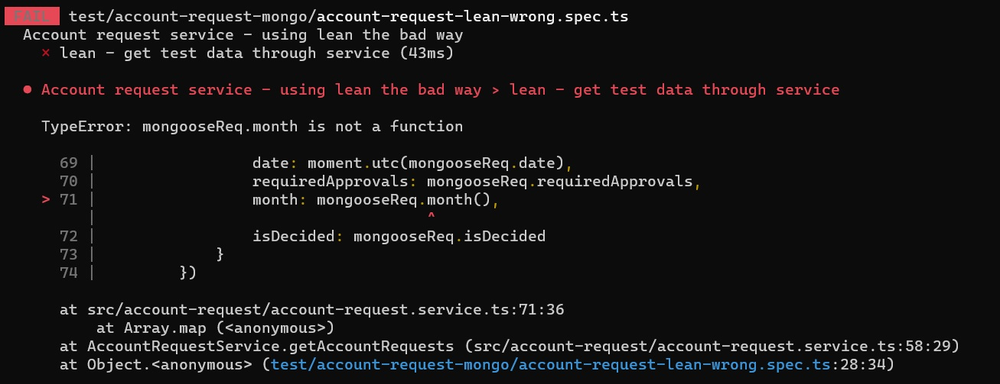

# Lean - Mongoose se corre a un costado
Como lo indicamos al [presentar las distintas técnicas para performance](./intro), la opción de `lean` permite ganar eficiencia en las operaciones que se hacen mediante Mongoose, en particular los `find`. Pero no es gratis, se pierden todos los agregados que se hagan al esquema.

La sintaxis para usar esta opción es muy sencilla: a la operación de búsqueda
``` typescript
await <model>.find(<opciones>);
```
sencillamente se le agrega `.lean()` _detrás. O sea:
``` typescript
await <model>.find(<opciones>).lean();
```

Y eso es todo. Veámoslo con un ejemplo, siempre sobre el ejemplo de las solicitudes de cuenta.


## Recordemos el contexto
Transcribimos el esquema y la interfaz que expone el servicio.
``` typescript
export const AccountRequestSchema = new mongoose.Schema({
    customer: { type: String, required: true },
    status: { type: String, enum: Object.values(Status) },
    date: Number,
    requiredApprovals: { type: Number, default: 3 }
})

AccountRequestSchema.virtual('isDecided').get(
    function(): boolean { return [Status.ACCEPTED, Status.REJECTED].includes(this.status) }
);

AccountRequestSchema.method({
    hasDate: function(): boolean { return !!(this.date && this.date != 0) },
    month: function(): number | undefined {
        return this.hasDate() ? moment(this.date).utc().month() + 1 : undefined 
    },
})

export interface AccountRequest {
    customer: string,
    status: Status,
    date: moment.Moment, 
    requiredApprovals: number
    id: string,
    month: number, 
    isDecided: boolean
}
```

Este es el método en el servicio.
``` typescript
async getAccountRequests(): Promise<AccountRequest[]> {
    const mongooseData = await this.accountRequestModel.find({});
    return mongooseData.map(mongooseReq => {
        return {
            id: mongooseReq._id,
            customer: mongooseReq.customer,
            status: mongooseReq.status as Status,
            date: moment.utc(mongooseReq.date),
            requiredApprovals: mongooseReq.requiredApprovals,
            month: mongooseReq.month(),
            isDecided: mongooseReq.isDecided
        }
    })
}
```
Observamos que el servicio aprovecha `month()` e `isDecided`, definidos como un `method` y un `virtual` respectivamente en el esquema Mongoose.


## Aplicando _lean_ - primer intento
Aplicamos la mínima modificación necesaria para ganar eficiencia, en el método del servicio.
``` typescript
async getAccountRequests(): Promise<AccountRequest[]> {
    const mongooseData = await this.accountRequestModel.find({}).lean();
    return mongooseData.map(mongooseReq => {
        return {
            id: mongooseReq._id,
            customer: mongooseReq.customer,
            status: mongooseReq.status as Status,
            date: moment.utc(mongooseReq.date),
            requiredApprovals: mongooseReq.requiredApprovals,
            month: mongooseReq.month(),
            isDecided: mongooseReq.isDecided
        }
    })
}
```
Compila perfectamente, no da problema de tipos. Pero el test falla (¡qué bueno que teníamos tests!).



El error se produce porque al usar `lean`, no se aplican los `virtual` y `method` agregados al esquema Mongoose.  

El efecto del `lean` es que Mongoose _prácticamente no interviene_, se limita a pasarle la consulta a MongoDB, devolviéndole al servicio la información que obtiene de la base sin procesarla, modificarla ni hacerle agregados. 
En particular, no se activan ni los `method` ni los `virtual`. Por eso, los objetos que devuelve el `find` no incluyen ni la función `month()` ni el atributo `isDecided`, sólo se incluyen el `_id` y los atributos que forman parte del documento Mongo, en nuestro caso, `customer`, `status`, `date` y `requiredApprovals`; en el formato en el que están en la base.

Por eso, cuando el servicio le pide el `month()` al resultado del `find`, se genera el error: al hacer la búsqueda en "modo `lean`", los documentos se obtienen en una versión no "retocada" por Mongoose, y por lo tanto,  `mongooseReq.month()` es `undefined`.
