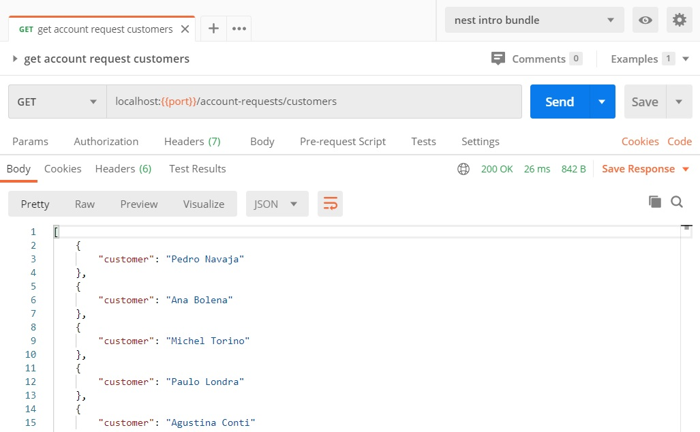

# Proyección - incluir solamente algunos atributos
Terminamos este pequeño "tour de performance" con una técnica que puede servir para accesos a colecciones con muchos atributos: indicar al hacer una consulta, que la respuesta debe incluir sólo algunos de los atributos de cada documento en el resultado.  
A esto se lo conoce como obtener una _proyección_ de cada documento.

> **Nota matemático-histórica**  
> Aquí "proyección" se considera en el sentido de la proyección de un vector sobre una dimensión, quienes recuerden lo que vieron de álgebra lineal. La palabra revela el origen algebraico de la teoría de las bases de datos.

Para esto, se agrega un segundo parámetro a la operación `find`, que especifica qué atributos se desean, o cuáles no se desean. 
En particular, el `_id` se incluye siempre, si no nos interesa, hay que indicar esto explícitamente.

Creo que con un ejemplo se entiende fácilmente. Para obtener únicamente el nombre de cada cliente que hizó una solicitud de cuenta, podemos armar este método en el provider correspondiente.
``` typescript
async getCustomers(): Promise<{ customer: string }[]> {
    return (await this.accountRequestModel.find({}, { customer: true , _id: false}).lean());
}
```
Si solamente se indican atributos `false`, entonces el resultado incluye los restantes. En este caso queremos solamente el atributo `customer`, e indicamos explícitamente que no incluya el `_id`.

Obsérvese también que es un caso ideal para combinar con `lean`, porque no nos interesan las características agregadas por Mongoose.

El resultado es el esperado.



## Para practicar
Algunas propuestas.

Una fácil: agregar un filtro por rango de fechas y/o status.

Una más difícil: armar un endpoint en el que se indica qué atributos se quieren obtener, se puede usar un query param `fields` donde van separados por coma. P.ej. 
``` 
GET /account-requests?fields=customer,date&status=accepted
```
