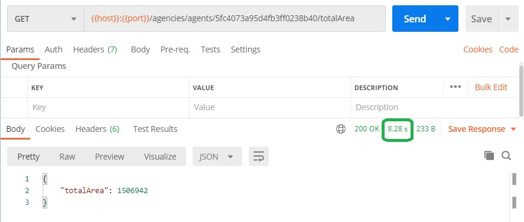
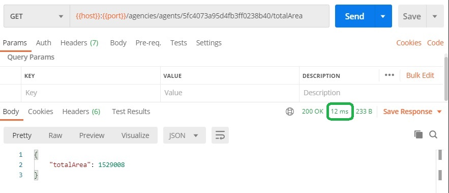

# MongoDB/Mongoose - índices sobre arrays
Volvamos al modelo de evaluaciones, que están embebidas dentro de las solicitudes. Supongamos que queremos acceder a todas las solicitudes que evaluó un determinado oficial. Podría pensarse que esta operación es necesariamente costosa, porque hay que recorrer secuencialmente todas las solicitudes para seleccionar aquellas que incluyan una evaluación cuyo `agent` coincida con el id del oficial.

MongoDB incluye la posibilidad de definir _índices sobre atributos embebidos_ dentro de arrays, para acelerar estas búsquedas. Para acelerar las búsquedas de solicitudes evaluadas por un oficial, se puede ejecutar este comando que crea un índice en la colección de solicitudes
```typescript
db.accountrequests.createIndex({ "evaluations.agent": 1 })
```
Ver [la página sobre multikey indexes en la doc de MongoDB](https://docs.mongodb.com/manual/core/index-multikey/index.html).


## Un ejemplo
Para ver un ejemplo (ejem) que me fue más fácil armar, se definió el siguiente índice sobre la colección de sucursales
```typescript
db.manyagencies.createIndex({ agents: 1 })
```
Se crearon dos colecciones de sucursales con 12 millones de documentos, a una se le agregó el índice, a la otra no. En ambas, se asignó un determinado oficial en una de cada 10000 sucursales, por lo tanto el oficial está asignado a 1200 sucursales.

Se armó un endpoint que es resuelto por el siguiente método de provider
```typescript
async getTotalAreaByAgent(agentId: string): Promise<{ totalArea: number }> {
    const summaryInfo = await this.agencyModel.aggregate([
        { $match: { agents: Types.ObjectId(agentId) } },
        { $group: { _id: 1, totalArea: { $sum: "$area" } } }
    ]);
    return { totalArea: summaryInfo.length > 0 ? summaryInfo[0].totalArea : 0 }
}
```
en el que se obtiene la suma de las superficies de las sucursales asociadas a un oficial.  
Tres aclaraciones sobre el código
1. los `aggregate` _siempre_ devuelven un array, en este caso de un elemento ... o ninguno, si es que no hay ninguna sucursal asociada al oficial.
1. por esto es que hay que verificar si el resultado del `aggregate` tiene elementos en el `return`.
1. la etapa `$group` requiere de un atributo `_id` que usa para discriminar. Como en este caso se quiere generar un único grupo, se asignó un valor constante.

Veamos la performance de este endpoint. Utilizando la colección que _no_ tiene creado un índice, se obtiene lo siguiente.  


Usando la colección que _sí_ tiene un índice sobre los oficiales asignados a las sucursales, este es el resultado.


Notamos que la utilización de este índice _es transparente_, o sea, no fue necesario cambiar la query para que lo aproveche. Ver lo que se indicó al respecto en [la página que introduce los índices de MongoDB](../mongoose-performance/indices), y también las consideraciones finales en esa misma página, en particular que _los índices no son gratis_.


## Para practicar
Realizar el siguiente refactor en el modelo de solicitudes: colocar las solicitudes como un array en cada sucursal. A su vez, cada solicitud va a incluir el array de sus evaluaciones. Por lo tanto, la colección de sucursales va a tener "tres niveles".   
Definir los índices necesarios para acceder ágilmente a una solicitud dado su id, y a las evaluaciones hechas por un oficial.