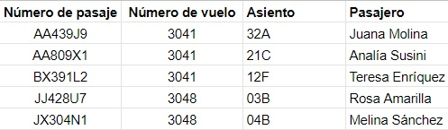

# Llegando a Mongoose

## Bases de datos y librerías
Dentro del recorrido que estamos haciendo, llega el momento de interactuar con _bases de datos_.   

El acceso a bases de datos desde una aplicación, se hace (al menos casi-casi-siempre) mediante librerías.  
Algunas de estas librerías son básicamente conectores que permiten ejecutar las operaciones de BD desde un programa, digamos que son librerías de _bajo nivel_. Un ejemlo es la venerable librería [JDBC](https://www.javatpoint.com/java-jdbc) de Java.  
Hay otras librerías de más _alto nivel_, que incluyen funcionalidades que simplifican la interacción con bases de datos, en distintos aspectos que pueden incluir
- el modelado de datos, incluyendo validaciones y transformaciones.
- el manejo de transacciones.
- el manejo de sesiones.
- la definición de caches.
- herramientas para tests.

En esta capacitación vamos a usar dos librerías de alto nivel. Para describirlas, tenemos que hablar del tipo de base de datos al que aplica cada una.


## Bases de datos relacionales
Hay varios _modelos de bases de datos_.  

El más difundido sigue siendo el _modelo relacional_, que es el que más probablemente hayan aprendido en la facultad.  
En este modelo, para decirlo ultra-rápidamente (estamos resumiendo un libro en dos frases), en este modelo una base de datos es un conjunto de tablas, y cada tabla es como una hoja de planilla de cálculo, con filas y columnas, donde en cada celda va un dato simple.  
Para representar p.ej. los vuelos de una aerolínea y los pasajes que se venden, se necesitan dos tablas, una de vuelos y otra de pasajes.

Esta sería una posible tabla de vuelos


y esta una de pasajes



Las dos tablas se pueden vincular mediante el dato de número de vuelo, que _identifica unívocamente_ el vuelo (o sea, no puede haber dos vuelos con el mismo número).  
A partir de estas ideas de identificador unívoco y de vinculación, surgen varios de los principales conceptos del modelo relacional
- clave primaria (primary key - PK) y clave foránea (foreign key - FK).
- consultas con `JOIN` para obtener datos de tablas vinculadas.
- índice (para acelerar el acceso).
- restricciones de integridad referencial.

En este caso, tenemos:
- la PK de vuelos es el número de vuelo, la PK de pasajes es el número de pasaje.
- En pasajes, tenemos una FK a la tabla de vuelos.
- Esta sería una consulta que trae algunos datos de los pasajes del vuelo 3041, incluyendo los que están en la tabla de vuelos
``` sql
SELECT vuelos.numero_de_vuelo, vuelos.origen, vuelos.destino, pasajes.asiento
FROM pasajes
JOIN vuelos ON vuelos.numero_de_vuelo = pasajes.numero_de_vuelo
WHERE vuelos.numero_de_vuelo = 3041
``` 
- para acelerar esta consulta, se puede definir en la tabla de pasajes, un índice sobre la columna de número de vuelo.
- una posible restricción de integridad referencial es que no se puede borrar un vuelo que tenga pasajes. En el ejemplo, no se podría borrar el 3041 pero sí el 3043.


## Bases de datos de documentos
En los últimos años creció con fuerza el uso de otros modelos de bases de datos.
Uno es el de las _bases de datos de documentos_.  
En este modelo (contado tan ultra-rápidamente como hicimos con el modelo relacional) una base de datos es un conjunto de _colecciones_, y cada colección tiene _documentos_. Un documento puede pensarse como un XML o JSON, tiene _atributos_.

**Pero** ...  
¿no es _lo mismo_ que el modelo relacional, con los nombres cambiados de esta forma?

| En el modelo relacional se dice | En el modelo de documentos se dice |
| :---: | :---: |
| Tabla | Colección |
| Fila | Documento |
| Columna | Atributo |

No, no es lo mismo, porque hay diferencias.  
Tal vez la más relevante es que el valor de un atributo en el modelo relacional puede ser un dato compuesto: un sub-documento, un array, o combinaciones. En una celda sólo puede ir un dato simple: un string, un número, OK también un [BLOB](https://en.wikipedia.org/wiki/Binary_large_object) y ahí se puede poner cualquier cosa, pero una base relacional (al menos en principio) no puede interpretar qué hay adentro de un BLOB.

Para almacenar la información de vuelos y pasajes, podemos usar una sola colección de vuelos, donde cada vuelo tiene un atributo compuesto `pasajes`.

``` json
[
    {
        numero_de_vuelo: 3041, fecha: '12/10/2020', origen: 'Calcuta', destino: 'Madrás',
        pasajes: [
            { numero_de_pasaje: 'AA439J9', asiento: '32A', pasajero: 'Juana Molina' },
            { numero_de_pasaje: 'AA809X1', asiento: '21C', pasajero: 'Analía Susini' },
            { numero_de_pasaje: 'BX391L2', asiento: '12F', pasajero: 'Teresa Enríquez' }
        ]
    },
    {
        numero_de_vuelo: 3043, fecha: '15/10/2020', origen: 'Bombay', destino: 'Nueva Delhi', pasajes: []
    },
    {
        numero_de_vuelo: 3048, fecha: '17/10/2020', origen: 'Bangalore', destino: 'Calcuta',
        pasajes: [
            { numero_de_pasaje: 'JJ428U7', asiento: '03B', pasajero: 'Rosa Amarilla' },
            { numero_de_pasaje: 'JX304N1', asiento: '04B', pasajero: 'Melina Sánchez' }
        ]
    },
    {
        numero_de_vuelo: 3114, fecha: '02/11/2020', origen: 'Jaipur', destino: 'Agra', pasajes: []
    }
]
``` 

