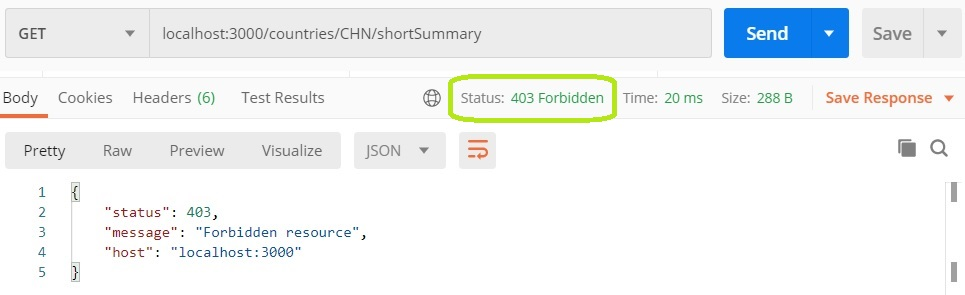
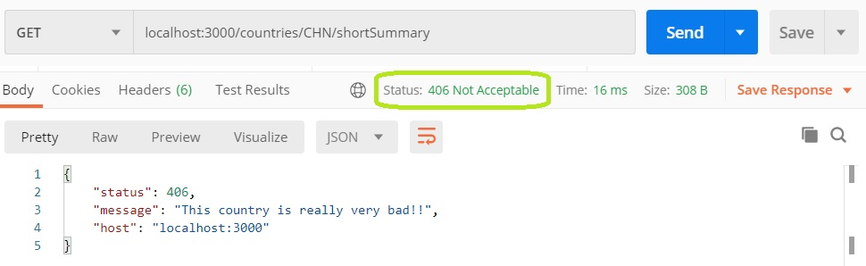
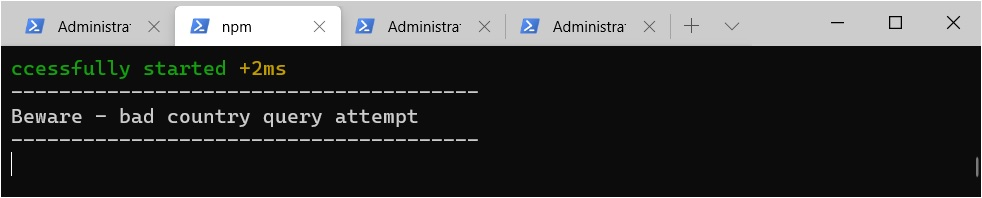

# Guards

Un _Guard_ es un middleware pensado para implementar control de acceso. Si un request no cumple con lo requerido por un Guard que está activado para ese endpoint, entonces el request **no llega** al request handler, y se lanza una excepción.

Tal vez es más sencillo contarlo a partir de un ejemplo. En varios de los endpoints que brindan datos sobre un país, queremos impedir que se soliciten datos sobre países "sensibles".
Esta es una implementación de Guard que realiza este control.
``` typescript
const dangerousCountries = ["CHN", "AUT"]

@Injectable()
export class ForbidDangerousCountries implements CanActivate {
    canActivate(context: ExecutionContext): boolean {
        const request = context.switchToHttp().getRequest();
        const country = request.params.countryCode
        const isDangerousCountry = dangerousCountries.includes(country)
        return !isDangerousCountry
    }
}
``` 
Como vemos, un Guard es una clase que debe implementar la interface `CanActivate` e incluir el decorator `@Injectable`. La interface define un único método que devuelve un booleano. Si el método devuelve `false`, quiere decir que el Guard no acepta al request.  
Dentro del método, se accede al request mediante el `ExecutionContext` que llega por parámetro. Este `ExecutionContext` es similar al `ArgumentsHost` que recibe un `ExceptionFilter`, que se describe en [la página sobre manejo de errores](./manejo-de-errores.md).  
Los detalles sobre la implementación de Guards pueden consultarse en [la página de Guards en la documentación de NestJS](https://docs.nestjs.com/guards).

Un Guard se activa para un endpoint o controller, mediante el decorator `@UseGuards`.
``` typescript
@UseGuards(ForbidDangerousCountries)
async getShortSummary(@Param() params: { countryCode: string }): Promise<CountryShortSummary> {
    // implementacion
}
```

Si un Guard activado rechaza el request, sale con `403 - Forbidden` y un mensaje standard, sin llegar al request handler.


## Error particular

Si se quiere que el status code y/o la response sean distintos, se puede: o manejar la `ForbiddenException` que lanza el Guard en un `ExceptionFilter`, o _salir con excepción_ del Guard en lugar de devolver `false`.

A modo de ejemplo, cambiemos el comportamiento del Guard definido, para que lance la `BadBadCountryException` descripta en la [página sobre manejo de errores](./manejo-de-errores.md).

Variamos un poco la definición de la excepción. En particular, la hacemos extender de `NotAcceptableException`, que es la excepción que provee NestJS para el status codd `406 - Not Acceptable`.
``` typescript
export class BadBadCountryException extends NotAcceptableException {
    constructor() {
        super('This country is really very bad!!')
    }
}
```

Recordamos que el Exception Filter extiende de oto que definimos, genérico para todas las `HttpException`; agrega un log específico.
``` typescript
@Catch(BadBadCountryException)
export class BadBadCountryExceptionFilter extends HttpExceptionFilter implements ExceptionFilter<BadBadCountryException> {
    constructor() { super({ includeHostInResponse: true }) }
    catch(exception: BadBadCountryException, host: ArgumentsHost) {
        console.log("---------------------------------------")
        console.log("Beware - bad country query attempt")
        console.log("---------------------------------------")

        super.catch(exception, host)
    }
}
```

Cambiemos ahora el Guard para que lance una `BadBadCountryException`
``` typescript
const dangerousCountries = ["CHN", "AUT"]

@Injectable()
export class ForbidDangerousCountries implements CanActivate {
    canActivate(context: ExecutionContext): boolean {
        const request = context.switchToHttp().getRequest();
        const country = request.params.countryCode
        const isDangerousCountry = dangerousCountries.includes(country)
        if (isDangerousCountry) {
            throw new BadBadCountryException()
        }
        return true
    }
}
``` 

Ahora lanza la excepción especificada, en lugar de la `ForbiddenException` con mensaje genérico

y muestra la información indicada por consola



## Desafíos

### Control de acceso
Uno de los desafíos en la [página sobre manejo de errores](./manejo-de-errores.md), es validar los requests para un endpoint tienen que incluir un header `userId`, rechanzando los que no tengan con un `401 - Unauthorized`.  
Pasar esta validación a un Guard, y habilitarlo para todos los endpoints de una aplicación.

### Cuotas de acceso por usuarios
Otro de los desafíos en la página sobre manejo de errores, es establecer cuotas de acceso para usuarios a un determinado endpoint.  
Hacer este control mediante un Guard. Que la cuota sea específica para un endpoint determinado, que se obtiene mediante el request.

### Configurar la lista de países peligrosos
Permitir que se pueda configurar la lista de países peligrosos del Guard `ForbidDangerousCountries` _mediante accesos a la aplicación_ (o sea, sin tocar código).  
Una forma es habilitar un `Post` que agregue un país, y un `Delete` que elimine uno. Dejar todo en memoria por el momento, en breve viene la integración con bases de datos.

