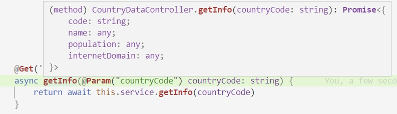
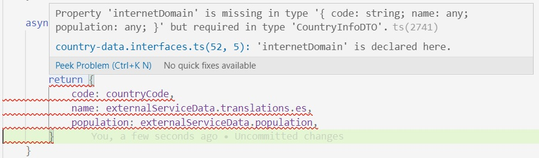

## Arranquemos por algún lado - datos de un país

Empecemos con el desarrollo de una aplicación NestJS que brinde información sobre países. Por ahora que atienda solamente a un endpoint `countries/:countryCode` que devuelva información sobre el país de acuerdo a esta ejemplo (para la consulta `countries/ARG` )
``` javascript
{
    code: 'ARG',
    name: 'Argentina', 
    population: 43590400,
    internetDomain: '.ar'
}
```
La info se obtiene consultando al servicio externo `http://restcountries.eu/` que mencionamos en [el ejercicio integrador sobre asincronismo](../async/ejercicio-integrador).

Repasemos qué elementos tenemos que incluir en nuestra app.
- El módulo inicial `AppModule`, en `app.module.ts`. Este ya lo crea el script de inicialización de Nest, ver en la [página inicial de la doc](https://docs.nestjs.com/first-steps).
- Una carpeta donde vamos a implementar el `CountryDataModule`. Ahí vamos a tener tres clases: un módulo, un controller y un provider.  
El provider hace la llamada al servicio externo, el controller llama al provider.  
No olvidar la inyección del provider en el constructor del controller. Y de importar el `CountryDataModule` en el `AppModule`. 

En el método del controller tenemos que poder acceder al valor del parámetro de path `:countryCode`.  
Para acceder a los parámetros de un request hay varios decorators de parámetro, que están listados en la sección "Request object" en la [página sobre controllers en la doc](https://docs.nestjs.com/controllers#request-object).  
En este caso podría ser
``` typescript
    @Get(':countryCode/info')
    getInfo(@Param("countryCode") countryCode: string) // ...
```
o
``` typescript
    @Get(':countryCode/info')
    getInfo(@Param() params: { countryCode: string }) // ...
```
(en esta variante, para acceder al valor hay que usar `params.countryCode`)

Listo, con esto deberíamos estar. 


## Aplicando lo que aprendimos 1 - procesamiento asincrónico
El código en el método del provider podría arrancar así
``` typescript
const url = /* URL */
const externalServiceResponse = axios.get(url)
const externalServiceData = externalServiceResponse.data
```
si lo pongo así, la tercer línea no compila

y hasta tiene la gentileza de marcar qué pasa: la llamada a `axios.get` es asincrónica, por lo tanto devuelve una `Promise`. 
Y lo que tiene un `data` es el "contenido" de la `Promise`. Por eso hay que "desempaquetar" usando `await` (o `.then` si uno prefiere).

``` typescript
const url = /* URL */
const externalServiceResponse = await axios.get(url)
const externalServiceData = externalServiceResponse.data
```
ahora sí (micro-desafío: ¿cómo harían para mergear la segunda línea con la tercera, ahorrándose la definición de `externalServiceResponse`?).

Recordemos que en el controller, si **lo único** que hacemos es llamar al servicio, podemos ahorrarnos el `async` y el `await`
``` typescript
@Get(':countryCode/info')
getInfo(@Param("countryCode") countryCode: string) {
    return this.service.getInfo(countryCode)
}
```
(en estos casos, yo tiendo a -igualmente- _poner_ el `async` y el `await`, para que quede claro que la operación es asincrónica)


## Aplicando lo que aprendimos 2 - tipos e interfaces
Fíjense que el método de controller no especifica el tipo de respuesta. Se podría hacer lo mismo con el servicio.
``` typescript
async getInfo(countryCode: string) {
    /* implementation */
}
```
TS infiere correctamente los tipos de los dos métodos

pero ... ¿qué pasa si me olvido un componente, o me equivoco de nombre, o algo? Estoy perdiendo el chequeo de tipos. TS va a _inferir_ el tipo a partir del código, pero no tiene cómo _validar_ que el código sea correcto.

Por eso se estila definir una _interface_ que especifique el tipo de respuesta
``` typescript
export interface CountryInfoDTO {
    code: string,
    name: string,
    population: number,
    internetDomain: string
}
```
esto se suele hacer en un archivo aparte `country-data.interfaces.ts`. Ahora puedo especificar correctamente el tipo de respuesta en servicio y controller.
``` typescript
async getInfo(countryCode: string): Promise<CountryInfoDTO> {
    /* implementation */
}
```
y (además de que documenté la interfaz) ahora sí tengo chequeo de tipos



## Dónde hacer las transformaciones - qué es eso de "DTO" 
La sigla "DTO" tal vez les suene: _Data Transfer Object_. O sea, un objeto que sirve para una interfaz, en este caso la response del request.  
Visto así, es lógico que el método _del controller_ tenga com tipo de respuesta `CountryInfoDTO`.

En el _servicio_ ... tal vez no siempre sea así.  
Un mismo método de servicio podría usarse en distintos lugares.
En este ejemplo, podría haber varios métodos de controller que expongan distintos datos de un país, que siempre salen del mismo lado, pero puede ser que dependa del caso, a veces se quiere exponer algunos datos y a veces otros.  
En tal caso, aparecen dos opciones.
1. hacer _un método de servicio distinto_ para cada variante de info sobre un país, o 
1. hacer un solo método que nos dé un conjunto de info más grande, y que sea p.ej. _el controller_ el que se queda con la info que necesita.

La verdad ... no me queda claro qué conviene, y tal vez depende del caso. Ahora, si se elige la opción 2 (que a mí en principio no me hace ruido), el método del controller hace algo más que _solamente_ llamar al servicio: selecciona qué datos va a exponer.  
En tal caso va a haber _dos_ interfaces: una (digamos `CountryInfo`) más extensa (y que podría tener alguna diferencia de estructura) que devuelve el servicio, y otra `CountryInfoDTO` que deuvelve el controller. P.ej. 
``` typescript
export interface CountryInfoDTO {
    code: string,
    name: string,
    population: number,
    internetDomain: string
}

export interface CountryInfo {
    code: string,
    names: { en: string, es: string },
    population: number,
    internetDomain: string,
    currencyCode: string
}
```
O sea: de los dos dos nombres que incluye la respuesta del servicio queremos exponer uno solo (pongamos, en español), y no nos interesa el `currencyCode`.  
Cambió el tipo de retorno del servicio
``` typescript
async getInfo(countryCode: string): Promise<CountryInfo> {
    /* implementation */
}
```


Les dejo para resolver cómo sería el método del controller, que tendría esta forma
``` typescript
@Get(':countryCode/info')
async getInfo(@Param("countryCode") countryCode: string): Promise<CountryInfoDTO> {
    const serviceData: CountryInfo = await this.service.getInfo(countryCode)
    return  /* esta parte se las dejo */
}
```
para poder hacerlo en una expresión y sin poner los atributos uno por uno, usé la función `pick` que viene en Lodash. Si se cargan `@types/lodash`, tipa de una forma in-cre-í-ble.

