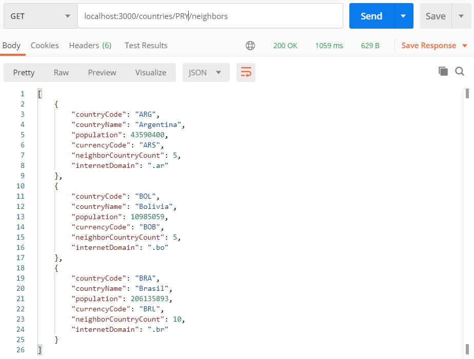
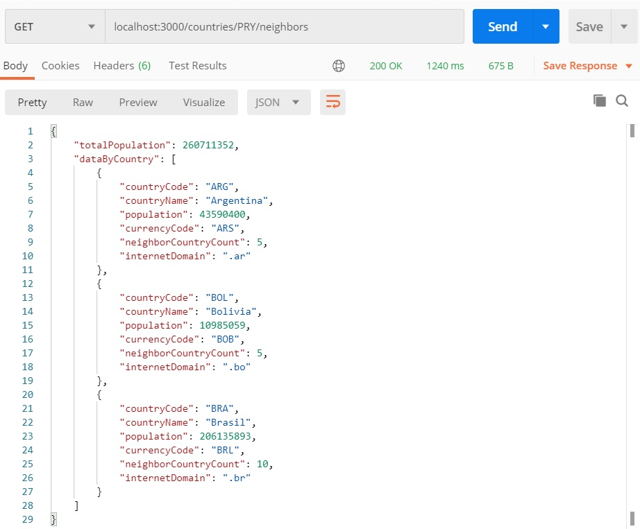
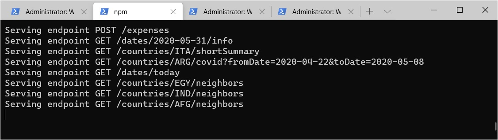

# Interceptors

Un _Interceptor_ es un middleware que responde a la idea que describimos en la [introducción a middleware](./middleware-intro.md): le llega un parámetro `next` que representa la cadena de ejecución del request, y puede
- agregar comportamiento _a la entrada_, o sea antes de dar curso al `next`. En particular, puede modificar el request.
- agregar comportamiento _a la salida_, o sea luego de dar curso al `next`. En particular, puede modificar la response.
- evitar que se dé curso al `next`, en tal caso funcionaría en forma similar a un [Guard](./guards.md).

Los interceptors actúan en combinación con el package [RxJS](https://github.com/ReactiveX/rxjs). En particular, esto facilita la realización de distintas manipulaciones a la salida.

En esta página nos vamos a limitar a mostrar algunos ejemplos para ilustrar distintas formas de usar Interceptors. 
Los detalles completos sobre esta forma de middleware pueden consultarse en [la página de Guards en la documentación de NestJS](https://docs.nestjs.com/interceptors).  


## Agregado de totales
En este ejemplo, partimos de un endpoint que dado un código de país, brinda información sobre sus países limítrofes.


Vamos a utilizar un interceptor para agregar el _total de población_ de los países listados. Queremos que la respuesta tenga esta forma:
``` json
{ 
    totalPopulation: <...total...>,
    dataByCountry: [
        <...la respuesta actual...>
    ]
}
```

Como lo indicamos para los [Guards](./guards.md), es más sencillo arrancar mostrando el código.
``` typescript
type ObjectWithPopulation = { population: number } 
type ListWithPopulations = ObjectWithPopulation[]
type AugmentedResult = {totalPopulation: number, dataByCountry: ListWithPopulations}

function injectTotalPopulation(value: ListWithPopulations): AugmentedResult {
    return {
        totalPopulation: _.sumBy(
            value, (country: ObjectWithPopulation) => country.population
        ),
        dataByCountry: value
    }   
}

@Injectable()
export class SumPopulationInterceptor 
implements NestInterceptor<ListWithPopulations, AugmentedResult> {
    intercept(context: ExecutionContext, next: CallHandler): Observable<AugmentedResult> {
        return next
            .handle()
            .pipe(map(injectTotalPopulation));
    }
}
``` 
Un Interceptor puede implementarse como una clase que implementa `NestInterceptor`, interface que define un único método `intercept`.  
Este método recibe el `next`, y lo puede invocar haciendo `next.handle()`. La respuesta que se obtiene es un `Observable` (tipo definido por RxJS) sobre la respuesta. Utilizando operadores de RxJS, se pueden realizar distintas acciones a partir de la respuesta. Aquí usamos `map`, que permite realizar una transformación.

Aprovechamos para mostrar que se puede asignar un tipo a cada valor que se está manejando, y también la definición de una función auxiliar, que se podría haber obviado, pero a costa de hacer el código un poco más confuso.
``` typescript
@Injectable()
export class SumPopulationInterceptor implements NestInterceptor {
    intercept(context: ExecutionContext, next: CallHandler): Observable<any> {
        return next
            .handle()
            .pipe(map((responseData: ListWithPopulations): AugmentedResult => {
                return {
                    totalPopulation: _.sumBy(
                        responseData, 
                        (country: ObjectWithPopulation) => country.population
                    ),
                    dataByCountry: responseData
                }   
            }));
    }
}
``` 

La aplicación de interceptor se indica mediante un decorator a nivel de request handler o controller.
``` typescript
@Get(':countryCode/neighbors')
@UseInterceptors(new SumPopulationInterceptor())
async getNeighborsShortSummary(@Param() params: { countryCode: string }): Promise<CountryShortSummary[]> {
    // implementacion
}
``` 

Se obtiene el resultado esperado



## Log
Para hacer una descripción un poco más completa de lo que se puede hacer mediante interceptors, hagamos uno que simplemente loguee el endpoint.
``` typescript
@Injectable()
export class LogEndpointInterceptor implements NestInterceptor {
    intercept(context: ExecutionContext, next: CallHandler): Observable<any> {
        const httpContext = context.switchToHttp()
        const request = httpContext.getRequest();
        console.log(`Serving URL ${request.originalUrl}`)
        return next.handle()
    }
}
``` 
Hagamos que este endpoint tenga alcance global
``` typescript
async function bootstrap() {
    const app = await NestFactory.create(AppModule);
    // ... otras configuraciones
    app.useGlobalInterceptors(new LogEndpointInterceptor());
    await app.listen(/* port */);
}
```

Listo, funciona. 


Y en el caso del endpoint afectado por el `SumPopulationInterceptor`, se ejecutan _los dos_ interceptors. 


## Desafíos
Cerramos esta pequeña revisión de variantes de middleware disponibles en NestJS, con unos pequeños desafíos para implementar.

### Pregunta sencilla
¿Qué pasa si quiero "ahorrarme" una línea en la definición del `LogEndpointInterceptor`, de esta forma?
``` typescript
@Injectable()
export class LogEndpointInterceptor implements NestInterceptor {
    intercept(context: ExecutionContext, next: CallHandler): Observable<any> {
        const httpContext = context.switchToHttp()
        const request = httpContext.getRequest();
        console.log(`Serving URL ${request.originalUrl}`)
        // return next.handle()
    }
}
``` 
Antes de comentar la línea, pensar qué va a pasar.

### Interceptor selectivo
Supongamos que en el controller de datos de países, tenemos algunos endpoints, no todos, cuyo resultado es una lista de datos de países. Lograr que se pueda configurar el interceptor a nivel de controller, o sea poner en el controller 
``` typescript
@UseInterceptors(new SumPopulationInterceptor())
export class CountryDataController {
    // implementacion
}
``` 
En el interceptor, detectar si la respuesta es una `ListWithPopulations`. De ser así hay que aplicarle la transformación, caso contrario la response tiene quedar sin modificaciones.


### Agregar timestamp y un saludito en la response
Implementar un interceptor que agrega en todas las response un nuevo atributo `generalData`, con este formato
``` json
{ 
    "timestamp": "2019-12-28T00:00:00Z",
    "greeting": "Hi user <userId>"
}
```
Si la respuesta está vacía, no es un JSON, o ya tiene un atributo `generalData`, no hacer nada.


