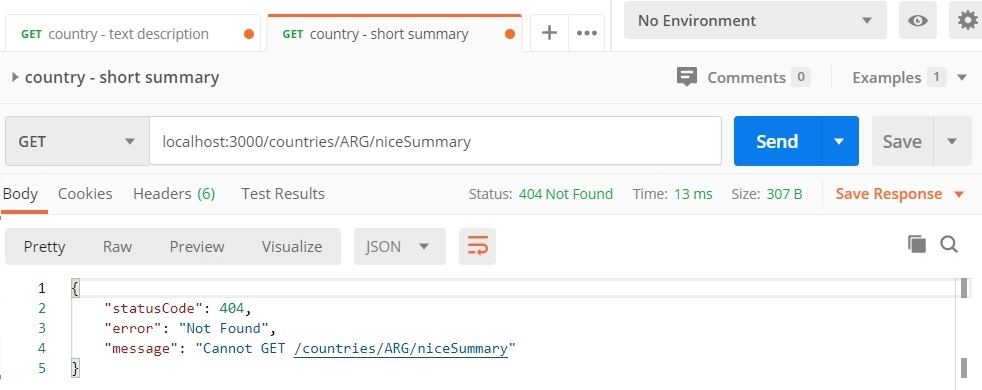

## Algo sobre manejo de errores

En esta página vamos a dar algunas indicaciones para el manejo de errores al desarrollar un backend sobre NestJS.

En [la página sobre el tema en la doc de NestJS](https://docs.nestjs.com/exception-filters) se describe este tema. Acá vamos a agregar un poco de contexto, y algunas aclaraciones particulares.

### Distintos casos de error

Esta es una posible estructura para un método de un provider que accede a un servicio externo.
``` typescript
async getInfo(countryIso3Code: string): Promise<CountryInfo> {
    const url = /* URL para obtener datos del país */
    const externalServiceResponse = await axios.get(url)
    const externalServiceData = externalServiceResponse.data
    return { 
        /* armo la respuesta a partir de la data 
            que obtengo del servicio externo */ 
    }
}
```

En este código pueden darse distintos errores, van algunos.
1. Tal vez el más evidente: la llamada al servicio externo termina con error, p.ej. un 404 (en este caso, un ejemplo sería si el `countryCode` no corresponde a un código de país), o un 400 (podría ser si le mandamos un código que tiene menos, o más, de 3 caracteres).
1. Podría ser que no querramos brindar información sobre uno o varios países, entonces si nos llega el código de uno de esos países, lo tenemos que considerar como un error.
1. Puede ocurrir un error en el armado de la respuesta.

NestJS viene con un manejo de errores **muy básico**. Si no hacemos nada, ante cualquiera de estos errores, un método de controller que use a este método de provider va a salir con un error 500, con un mensaje genérico.


Este error no se va a loguear en nigún lado. El que sí se loguea es el del servicio externo


Si ponemos una URL que no se corresponde con ningún método de controller (de acuerdo a los decorator `@Get`, `@Post`, etc.) va a generar un 404

De este error no se loguea nada.

Por lo general vamos a querer que haga algo distinto, y probablemente querramos generar nuestros propios 404 / 400 / etc..


### Tres acciones a tener en cuenta
NestJS maneja los errores usando **excepciones**. En cada caso que querramos manejar, vamos a tener que hacer al menos una de estas tres cosas.

1. _lanzar_ una excepción
1. _transformar_ una excepción, o sea, atraparla y lanzar otra distinta
1. _manejar_ las excepciones. Ya vimos que NestJS tiene un manejo básico, tenemos que cambiarlo por uno mejor que hagamos nosotros.


### HttpException - modelo de error de NestJS
NestJS incluye excepciones que modelan los distintos status HTTP de error, p.ej. `NotFoundException`, `BadRequestException`, `ForbiddenException`, etc.. A todas estas se les puede mandar un mensaje en el constructor.  
Si en la ejecución de un request handler se lanza una excepción de estas, el response va a tener el status correspondiente y el mensaje indicado.  
P.ej. supongamos que si el código de país es `TPT` queremos que el status de la response sea `418 - I'm a Teapot`. 
En este caso, tenemos que _lanzar_ una `ImATeapotException`.
``` typescript
async getInfo(countryIso3Code: string): Promise<CountryInfo> {
    if (countryIso3Code === 'TPT') {
        throw new ImATeapot('Teapot country not supported')
    }
    /* implementación del método de provider */
}
```


