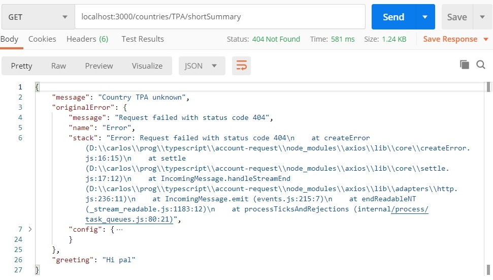
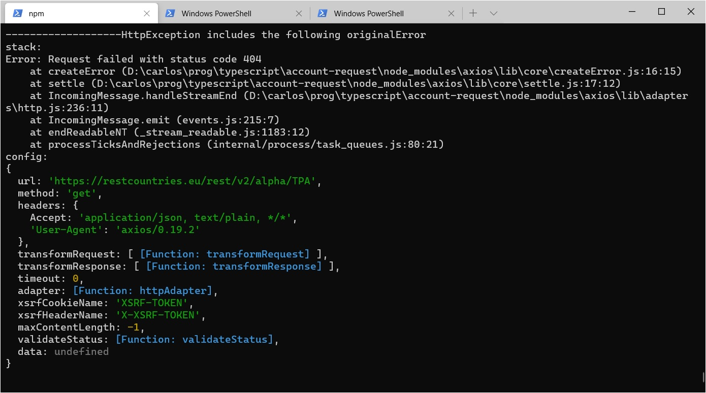

## Algo sobre manejo de errores
En esta página vamos a dar algunas indicaciones para el manejo de errores al desarrollar un backend sobre NestJS.

En [la página sobre el tema en la doc de NestJS](https://docs.nestjs.com/exception-filters) se describen las herramientas que ofrece el framework. 
En esta página, vamos a usar estas herramientas para manejar distintos casos.


### Distintos casos de error
Esta es una posible estructura para un método de un provider que accede a un servicio externo.
``` typescript
async getInfo(countryIso3Code: string): Promise<CountryInfo> {
    const url = /* URL para obtener datos del país */
    const externalServiceResponse = await axios.get(url)
    const externalServiceData = externalServiceResponse.data
    return { 
        /* armo la respuesta a partir de la data 
            que obtengo del servicio externo */ 
    }
}
```

En este código pueden darse distintos errores, van algunos.
1. Tal vez el más evidente: la llamada al servicio externo termina con error, p.ej. un 404 (en este caso, un ejemplo sería si el `countryCode` no corresponde a un código de país), o un 400 (podría ser si le mandamos un código que tiene menos, o más, de 3 caracteres).
1. Podría ser que no querramos brindar información sobre uno o varios países, entonces si nos llega el código de uno de esos países, lo tenemos que considerar como un error.
1. Puede ocurrir un error en el armado de la respuesta.

NestJS viene con un manejo de errores **muy básico**. Si no hacemos nada, ante cualquier error producido durante la ejecución de un request handler, la response va a tener un status 500 y un mensaje genérico. Va un ejemplo en el que el servicio externo responde con status 404.

Este error no se va a loguear en nigún lado. El que sí se loguea es el del servicio externo


Si ponemos una URL que no se corresponde con ningún método de controller (de acuerdo a los decorator `@Get`, `@Post`, etc.) va a generar un 404

De este error no se loguea nada.

Por lo general vamos a querer que haga algo distinto, y probablemente querramos generar nuestros propios 404 / 400 / etc..


### Tres acciones a tener en cuenta
NestJS maneja los errores usando **excepciones**. En cada caso que querramos manejar, vamos a tener que hacer al menos una de estas tres cosas.

1. _lanzar_ una excepción
1. _transformar_ una excepción, o sea, atraparla y lanzar otra distinta
1. _manejar_ las excepciones. Ya vimos que NestJS tiene un manejo básico, tenemos que cambiarlo por uno mejor que hagamos nosotros.


### HttpException - qué excepciones lanzamos
NestJS incluye excepciones que modelan los distintos status HTTP de error, p.ej. `NotFoundException`, `BadRequestException`, `ForbiddenException`, etc.. A todas estas se les puede mandar un mensaje en el constructor. Todas estas extienden una llamada `HttpException`.  
Si en la ejecución de un request handler se lanza una excepción de estas, el response va a tener el status correspondiente y el mensaje indicado.  
P.ej. supongamos que si el código de país es `TPT` queremos que el status de la response sea `418 - I'm a Teapot`. 
En este caso, tenemos que _lanzar_ una `ImATeapotException`.
``` typescript
async getInfo(countryIso3Code: string): Promise<CountryInfo> {
    if (countryIso3Code === 'TPT') {
        throw new ImATeapotException('Teapot country not supported')
    }
    /* implementación del método de provider */
}
```


### Un caso de transformación
Si la llamada al servicio externo da error, axios va a generar una excepción ... que no va a ser de las que maneja NestJS. Por lo tanto, si no hacemos nada, NestJS la va a procesar como cualquier otra excepción que no es suya, y el status del response va a ser 500.  
Es el caso del primer ejemplo que mostramos: el 404 que responde el servicio al que llamamos se loguea en la consola, pero nuestro endpoint responde un 500.

Una forma que tenemos de trabajar este caso es **transformar** la excepción que genera Axios, en una de las que maneja NestJS. 
Con "transformar", queremos decir atrapar la que viene de Axios, y lanzar la que maneja NestJS.

Podríamos querer transformar sólo algunos de los errores. En este caso, vamos a atrapar el status 404 para transformarlo en un `NotFoundException` de NestJS, y re-lanzar la misma excepción de Axios en cualquier otro caso.
``` typescript
async getInfo(countryIso3Code: string): Promise<CountryInfo> {
    const url = /* URL para obtener datos del país */
    const externalServiceResponse = await axios.get(url).catch((err) => { 
        if (err.response.status === HttpStatus.NOT_FOUND) {
            throw new NotFoundException(`Country ${countryCode} unknown`)
        } else {
            throw err
        }
    });
    /* etc */
}
```
(de paso, notar la clase `HttpStatus` que viene con NestJS)

Y este es el resultado

En lugar de responder un 500 como se ve al principio de esta página, responde un 404 con el mensaje que pusimos.

Quedan cosas por ajustar: tal vez querramos incluir más información, y/o sacar ese `error` que no dice gran cosa. Tal vez querramos hacer algo con la excepción que obtuvimos de `axios`, que en esta solución estamos perdiendo. Para esto vamos al aspecto que nos falta ...


### Manejar las excepciones
En las excepciones que define NestJS, se puede enviar un objeto en lugar de un String. Si se hace esto, ese objeto va derecho al response.
En este caso, supongamos que queremos mandar la excepción original, y un saludito para los amigos.
``` typescript
async getInfo(countryIso3Code: string): Promise<CountryInfo> {
    const url = /* URL para obtener datos del país */
    const externalServiceResponse = await axios.get(url).catch((err) => { 
        if (err.response.status === HttpStatus.NOT_FOUND) {
            throw new NotFoundException({ 
                message: `Country ${countryCode} unknown`,
                originalError: err,
                greeting: 'Hi pal'
            })
        } else {
            throw err
        }
    });
    /* etc */
}
```
El response se ve asi


En realidad, el `originalError` no se quiere incluir en la response, supongamos que lo queremos loguear. Y además nos gustaría que el status estuviera en el response body.

Para manejar qué incluimos, o qué no incluimos, en el response body, y para poder realizar otras acciones como p.ej. loguear, tenemos que agregar el **manejo** de excepciones. Para eso se usan los _exception filters_. El detalle sobre esto se puede ver en [la doc de NestJS](https://docs.nestjs.com/exception-filters), acá vamos a dar algunos datos y usarlos.

Un exception filter es una clase que tiene que implementar la interface `ExceptionFilter`. Esta interface es genérica, el parámetro es la clase de excepción (que tiene que ser un descendiente de `Error`,  la mega-super-clase de todo error en JS/TS hasta donde entiendo, ver [la doc de MSN](https://developer.mozilla.org/en-US/docs/Web/JavaScript/Reference/Global_Objects/Error).

Para _activar_ un exception filter hay que hacer dos cosas.
1. Ponerle a la clase un decorator `@Catch` que indique qué excepciones va a manejar, se le indica la clase de excepción. Sí, es el mismo valor que el parámetro de la clase genérica, no sé por qué hay que poner la misma info dos veces, pero es así.
1. Decirle a Nest que use el filtro. Esto se puede hacer global, por controller, o incluso por request handler. Esto lo vamos a ver en los ejemplos.

En la clase, se define un método `catch` que recibe la excepción a manejar, y un objeto raro de NestJS llamado `ArgumentsHost`. Acá vamos a usar la receta indicada en la doc de NestJS para obtener los objetos `request` y `response` a partir del misterioso `ArgumenntsHost`.

Vamos a definir un filtro que se encargue de las `HttpException`, que haga lo siguiente
- si hay un `originalError`, loguearlo.
- en el response body, tomar el message y el greeting (este último puede o no haber), y agregar el header `host` del request (sólo para mostrar que se puede usar el request).

Esta es la definición completa del filtro
``` typescript
@Catch(HttpException)
export class HttpExceptionFilter implements ExceptionFilter<HttpException> {
    catch(exception: HttpException, host: ArgumentsHost) {
        const httpContext = host.switchToHttp();
        const request = httpContext.getRequest<Request>();
        const response = httpContext.getResponse<Response>();

        const status = exception.getStatus()
        const exceptionResponse = exception.getResponse() as any

        // log
        if (exceptionResponse.originalError) {
            console.log("-------------------HttpException includes the following originalError")
            if (exceptionResponse.originalError.stack) {
                console.log("stack:")
                console.log(exceptionResponse.originalError.stack)
            }
            if (exceptionResponse.originalError.config) {
                console.log("config:")
                console.log(exceptionResponse.originalError.config)
            }
        }

        // build response
        const responseBody: any = { status, message: exceptionResponse.message }
        if (exceptionResponse.greeting) { responseBody.greeting = exceptionResponse.greeting }
        const requestHost = request.header('host')
        if (requestHost) {
            responseBody.host = requestHost
        }

        // send response
        response.status(status).json(responseBody)
    }
}
```

Para darle alcance global, se puede registrar en la función `bootstrap`, en `main.ts`
``` typescript
async function bootstrap() {
  const app = await NestFactory.create(AppModule);
  app.useGlobalFilters(new HttpExceptionFilter());
  await app.listen(3000);
}
```

El response body está como lo definimos en el filtro


y el log aparece en la consola


Obviamente que hay que mejorar ese log, usar una librería de log, tal vez configurarlo, seguramente sacarlo a una función. 
Aquí sólo queremos mostrar qué se puede hacer dentro de un exception filter.

<br/>

------
**Nota**{: style="color: SteelBlue"}:  
Fíjense que lo que se registra es una _instancia_. También podrío sea, que incluso se podría configurar, p.ej. 
``` typescript
  app.useGlobalFilters(new HttpExceptionFilter({ includeHostInResponse: false }));
```
En el filtro, tomamos las opciones en un constructor
``` typescript
@Catch(HttpException)
export class HttpExceptionFilter implements ExceptionFilter<HttpException> {
    constructor(private readonly options: HttpExceptionFilterOptions) { }

    catch(exception: HttpException, host: ArgumentsHost) {
        /* ... código del catch ... */
    }
}
```
y lo usamos en el código
``` typescript
    const requestHost = request.header('host')
    if (requestHost && this.options.includeHostInResponse) {
        responseBody.host = requestHost
    }
```

Este es un ejemplo de la flexibilidad que da configurar usando instancias en lugar de clases. Por otro lado, configurar usando clases también tiene una ventaja: el framework genera las instancias que necesita, cuando las necesita.  

------

### Varios filtros

Este filtro aplica solamente a las `HttpException`, el resto de las excepciones las está manejando el mecanismo genérico de NestJS. 

Podemos definir un "filtro universal" que atrapa todas las excepciones, para eso en el decorator `@Catch` no ponemos ninguna clase, y en el parámetro de la interface genérica tampoco.
``` typescript
@Catch()
export class GeneralExceptionFilter implements ExceptionFilter {
    catch(exception: Error, host: ArgumentsHost) {
        const httpContext = host.switchToHttp();
        const response = httpContext.getResponse<Response>();

        // log
        console.log("-------------------Non-HttpException occurred")
        if (exception.stack) {
            console.log("stack:")
            console.log(exception.stack)
        }

        // send response
        const status = HttpStatus.INTERNAL_SERVER_ERROR
        response.status(status).json({ status, message: exception.message })
    }
}
```

Tengo que agregar del registro de este nuevo filtro a la función función `bootstrap` en `main.ts`.
``` typescript
async function bootstrap() {
  const app = await NestFactory.create(AppModule);
  app.useGlobalFilters(new GeneralExceptionFilter());
  app.useGlobalFilters(new HttpExceptionFilter({ includeHostInResponse: true }));
  await app.listen(3000);
}
```
**Atención**  
Al revés de lo que al menos yo esperaba, hay que registrar _primero_ el filtro más genéricos, y _después_ el más específico; este orden hay que respetarlo. 
Si se hace al revés, el `GenericExceptionFilter` se encarga también de las `HttpException`.

<br/>

Ahora en el response muestra el mensaje de la excepción.


y el log aparece en la consola


### Filtros específicos
Un backend REST puede incluir varios módulos y controllers, y cada controller puede incluir varios request handlers.  
NestJS permite definir que un filtro se aplica sólo a un controller, o sólo a un request handler. Aunque no lo encontré en la doc de NestJS, tal vez también se pueda configurar exception filters a nivel de módulo.

Vamos a suponer que para un endpoint específico de información de país, queremos que no se pueda acceder a la información para Corea del Norte (código PRK). Queremos responder con Forbidden (status code 403) en este caso.

Una forma que ya conocemos es lanzar una excepción del tipo específico dentro de las `HttpException`.

``` typescript
@Get(':countryCode/shortSummary')
async getShortSummary(@Param() params: { countryCode: string }): Promise<CountryShortSummary> {
    if (params.countryCode === 'PRK') {
        throw new ForbiddenException('Country not allowed for this operation')
    }
    /* ... implementación ... */
}
```
Funciona perfecto, incluso lo procesa nuestro `HttpExceptionFilter` (notar que se agregó el host).


Pero también podríamos querer _manejar_ este error en una forma especial, por ejemplo logueándolo en otro lado, agregando/modificando la respuesta, u otra cosa. 
Para esto vamos a crear un nuevo filtro, que lo vamos a registrar _solamente_ para este

Supongamos que solamente queremos hacer un log especial. Miren lo que vamos a hacer, receta en tres pasos.

1 - Definimos una nueva excepción que _extiende_ `ForbiddenException`
``` typescript
export class BadBadCountryException extends ForbiddenException {}
``` 

2 - Definimos un nuevo exception filter específico para esta excepción. Como queremos que haga lo mismo que el que ya tenemos para `HttpException`, solamente queremos que agregue un log, _usamos herencia_.
``` typescript
@Catch(BadBadCountryException)
export class BadBadCountryExceptionFilter extends HttpExceptionFilter implements ExceptionFilter<BadBadCountryException> {
    constructor() { super({ includeHostInResponse: true }) }
    catch(exception: BadBadCountryException, host: ArgumentsHost) {
        console.log("---------------------------------------")
        console.log("Beware - bad country query attempt")
        console.log("---------------------------------------")

        super.catch(exception, host)
    }
}
``` 
Notar el constructor, en el que ya le pasamos la configuración. Digamos que para este caso, siempre queremos incluir el host.

3 - En el request handler, registramos el nuevo filtro, y lanzamos la excepción específica.
``` typescript
@Get(':countryCode/shortSummary')
@UseFilters(BadBadCountryExceptionFilter)
async getShortSummary(@Param() params: { countryCode: string }): Promise<CountryShortSummary> {
    if (params.countryCode === 'PRK') {
        throw new BadBadCountryException('Country not allowed for this operation')
    }
    /* ... implementación ... */
}
```
Acá un detalle: a nivel de request handlers, (y también de controllers), se puede configurar usando clase o instancia. Supongo que tiene que ver que la configuración se hace usando un decorator, no es por código como la configuración global en el `main.ts`. Se podría haber configurado por instancia
``` typescript
@UseFilters(new BadBadCountryExceptionFilter())
```
Pero **atención**, para poder configurar usando una clase, el constructor de la clase que se configura (en este caso, `BadBadCountryExceptionFilter`) _no pued tener parámetros_.
Para eso definí el constructor en la clase y le pasé el parámetro al llamar al `super`.


¡Listo! El response es igual que antes, y se agregó la info al log.


------
**Nota**{: style="color: SteelBlue"}:  

Este caso, de acuerdo a lo que se pide, calza justo para el uso de herencia. Puede no ser siempre así. Me gustó mostrarlo de esta forma, para dejar un ejemplo de cómo podemos usar herencia al configurar un módulo de NestJS.   
**Un aspecto interesante de NestJS** es que todos sus elementos son clases TS. Esto nos permite aplicar lo que sabemos de herencia, patrones de diseño, en general modelado con objetos, al armado de nuestros elementos Nest.

------

### ¿**Dónde** hacer el manejo de errores, en el provider o en el controller?

Al principio trabajamos con el manejo de un 404 en el servicio externo, recién el caso de un país que queremos rechazar.  
Hay una diferencia importante entre cómo manejamos estos dos casos de error: en el primero el manejo se hace _en el provider_, en el de recién, _en el controller_.

El **nivel** en el que se hace el manejo de errores puede ser un tema de debate, y en donde convenga tomar decisiones que se mantengan en forma coherente dentro del código de un microservicio, o incluso para todo un proyecto.  
P.ej., podría ser discutible que un provider lance una `HttpException`, en realidad un provider no sabe a priori quién lo va a llamar, si otro provider o un controller. Podría decidirse que los providers sólo lanzan excepciones de negocio, y que son los controllers quienes tengan que transformarlas en `HttpException`.  
En una visión distinta, esto puede ser considerado demasiado burocrático, y decidirse que cada nivel lance la mejor excepción posible. De última, si un controller quiere transformar una `NotFoundException` en otra cosa, nadie se lo impide.


### ¿Y si hay operaciones combinadas?
Supongamos que para resolver un request, se necesita combinar información de varias fuentes: puede ser consultar a la BD y a otro microservicio, o a varios microservicios, o a una combinación con servicios externos. Al consultar a cualquiera de estos, puede generarse un error.

Acá surge la pregunta: un error para obtener una parte de la información que hay que generar ¿implica que el request tiene que dar error? Otra opción es entregar la información que se tenga, "avisando" de alguna forma que hay información faltante.

Esto va a aparecer al trabajar [combinando información de distintas fuentes](./)

