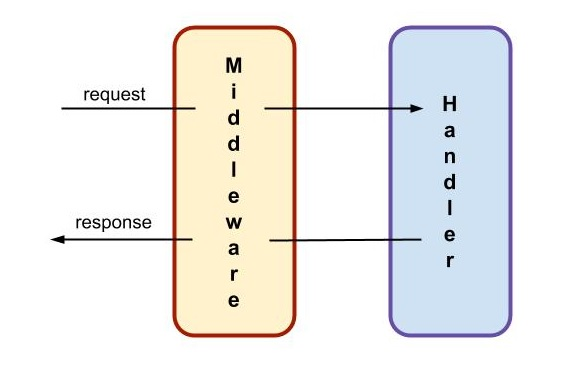
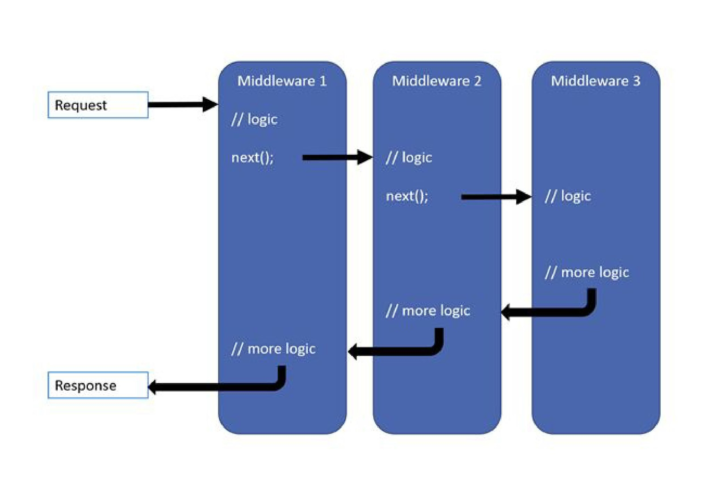

# Middleware
En este repaso de conceptos sobre cómo darle forma a un backend, llega el momento de incorporar la idea de _middleware_.

En rigor, este término tiene un significado muy general: _software que está en el medio_ de dos componentes.  
Una aplicación típica de esta idea es definir una capa intermedia entre un componente ligado a una interfaz, y otro ligado a la resolución de lógica de negocio. Este _middleware_ adapta los datos de entrada y salida, realiza validaciones y otras tareas que le pueden simplificar la vida a los dos componentes "de los extremos".  
Pero p.ej. cualquier implementación del pattern [Adapter](https://refactoring.guru/design-patterns/adapter) también es un middleware, entre un cliente que hace un pedido de acuerdo a una interfaz, y un servicio que puede responder al pedido, pero tiene una interfaz distinta. 

En el desarrollo de un backend basado en atender requests, el middleware se va a ubicar entre los requests y los request handlers. 


El middleware puede encargarse de varias funciones, que son comunes al tratamiento de distintos requests. Listemos algunos casos comunes.
- Validar autenticación.
- Validar los datos que vienen en el request.
- Transformar los datos del request para que lleguen en la forma en que los espera el handler.
- Realizar transformaciones o ajustes en el response.
- Alimentar los logs de operaciones.
- Adquirir recursos a la entrada, y liberarlos a la salida.
- Resolver el manejo de errores.

## Organización de middlewares en frameworks de backend

Por lo general, los frameworks que se utilizan para construir backends, se basan en el pattern [Chain of responsibility](https://refactoring.guru/design-patterns/chain-of-responsibility) para permitir que se configuren varios middleware, que se encargan cada uno de una tarea distinta.


De esta forma, podemos tener un middleware que se encarga de la autenticación, otro para log, otro para validar datos del request, etc..

Este es el esquema que ofrece p.ej. Express: se pueden configurar varios middleware, y Express se encarga de pasarle a cada uno una referencia al siguiente eslabón de la cadena al que se accede mediante `next()`. 


## NestJS: elementos de middleware de propósito específico
NestJS permite la definición y configuración de elementos de middleware que se corresponden, exactamente, con la misma lógica de Express. Ver la [página al respecto en la documentación](https://docs.nestjs.com/middleware).

Por otra parte, NestJS especifica _componentes más específicos_, que apuntan directamente a varias de las problemáticas para las que se suele usar middleware. 
Para cada tipo de componente, se establece una interface que deben cumplir las clase TS que lo implementen, y una forma sencilla de integrarlo para que se aplique en uno o varios request handler.

Por ejemplo, define un tipo de componente `Guard`, que está orientado específicamente a las validaciones de autenticación y similares. 
Un Guard se implementa mediante una clase que tiene el decorator `@Injectable()` e implementa una interface `CanActivate` provista por NestJS. P.ej.
``` typescript
@Injectable()
export class CheckUserPermissionGuard implements CanActivate {
    // implementacion
}
```
En esta clase, no es necesario tener en cuenta la cadena de middleware, o sea, no es necesario invocar a un `next()`. Sólo se debe devolver `false`, o lanzar una excepción, si la condición que controla el `Guard` no se cumple (en este ejemplo, si el usuario no tiene los permisos necesarios).  
NestJS se encarga de orquestar la invocación a los distintos middleware definidos para un endpoint.

Para utilizar este `Guard` en un request handler, alcanza con aplicar al método correspondiente de Controller, el decorator `@UseGuards`, indicando la clase que implementa el `Guard` como parámetro del decorator. P.ej.
``` typescript
@UseGuards(ForbidDangerousCountries)
async getCountryShortSummary(@Param() params: { countryCode: string }): Promise<CountryShortSummary> {
    // implementacion
}
```

Otro ejemplo de middleware de propósito específico es el de los `ExceptionFilters` que describimos en la página sobre [manejo de errores](./manejo-de-errores). Los exception filters controlan la salida de un request handler en caso de error. De esta forma, permiten definir una forma de manejo de errores, delegando en Nest el manejo de la lógica de activación del, o de los, ExceptionFilters que se configuren para cada request handler.

Adicionalmente, NestJS provee implementaciones standard para algunos de los tipos de middleware que define, en particular para los relacionados con validación de datos de entrada.

Es interesante señalar que agregar un middleware resulta muy sencillo: el boilerplate code es muy reducido, y la configuración consiste en agregar un decorator, o bien una línea en la función `bootstrap`. Y eso es todo. Y andan.

Estas herramientas simplifican el manejo de varias de las problemáticas para las que se suele usar middleware; representan parte del valor agregado que se obtiene al utilizar NestJS.  
Algunas de ellas son utilizadas en los microservicios de Banco del Sol.


## Qué sigue
En las páginas siguientes, vamos a trabajar con tres tipos específicos de middleware definidos por NestJS. Indicamos en cada caso la página correspondiente en la documentación.
1. Los llamados [Pipes](https://docs.nestjs.com/pipes), que se encargan de la validación de datos del request, y de algunas transformaciones.
1. Los [Guards](https://docs.nestjs.com/guards) ya mencionados, orientados al control de acceso a los endpoints.
1. Los [Interceptors](https://docs.nestjs.com/interceptors), que utilizaremos para realizar ajustes en la response.

En ningún caso pretenderemos dar explicaciones abarcativas. Nos limitaremos a dar un panorama de la utilidad de cada tipo de middleware, ilustrada con algunos ejemplos concretos, más algunos desafíos que (esperamos) les ayuden a completar la incorporación de estas herramientas.

Describimos aquí una característica en común de los tres tipos de middleware (y también de los `ExceptionFilter`): las **opciones para activarlos** son
- para un endpoint específico, mediante un decorator en el método correspondiente del controller, como mostramos en el ejemplo de `Guard`.
- para todos los endpoints de un controller, colocando el mismo decorator en la clase del controller.
- para toda una aplicacion, para esto hay que registrarlos en la función `bootstrap` que configura una aplicación NestJS. Esto es lo que hicimos con los `ExceptionFilter` genéricos en la página sobre [manejo de errores](./manejo-de-errores).

En los dos primeros casos, se puede optar por indicar el nombre de la clase (de la que NestJS creará instancias como lo considere oportuno) o un objeto ya creado, lo que permite realizar configuraciones específicas. Las configuraciones a nivel aplicación sólo pueden hacerse mediante objetos, no clases.

Extrañamente, NestJS no provee una forma de configurar un middleware para un módulo. En [la página sobre Guards](https://docs.nestjs.com/guards) se aclara que
>  Like pipes and exception filters, guards can be controller-scoped, method-scoped, or global-scoped.

sin hacer referencia a "module-scoped".
