# Pipes
En esta página vamos a comentar el rol de los _Pipes_, uno de los tipos específicos de middleware que provee NestJS. La información completa sobre este tema se puede consultar a partir [la página correspondiente en la documentación de NestJS](https://docs.nestjs.com/pipes).

El objetivo de los Pipes es hacer validaciones, y en algunos casos también transformaciones, sobre los _datos de entrada_, o sea los que llegan en el request: body, headers, parámetros de path y de query.

Si los datos no cumplen con las condiciones requeridas por un Pipe, el código del request handler no se llega a ejecutar, y se genera una respuesta con status code `400 - Bad Request`. El Pipe es el encargado de generar el mensaje de error correspondiente.  
Como ya vimos al revisar el [manejo de errores](./manejo-de-errores), en realidad lo que hace el Pipe es lanzar una excepción `BadRequestException`, con un determinado mensaje. Esta excepción puede ser gestionada por un `ExceptionHandler`, que puede realizar las transformaciones y acciones adicionales que se estimen convenientes.

_NestJS provee varias implementaciones operativas de Pipe_, que se pueden integrar en nuestras aplicaciones.  
También se permite la definición de _Pipes particulares_ (custom Pipes). 
Más abajo en esta página daremos un ejemplo de implementación de un Pipe para una validación/transformación particular.
Para más detalles sobre la implementación de Pipes particulares, remitimos a [la documentación](https://docs.nestjs.com/pipes). 


## ValidationPipe
Tal vez, el Pipe más valioso que provee NestJS es el `ValidationPipe`, que se describe en una [página separada](https://docs.nestjs.com/techniques/validation) en la documentación.  
Este componente es utilizado en varios microservicios del Banco del Sol.

Este Pipe funciona en conjunto con el package [class-validator](https://github.com/typestack/class-validator). En particular, resulta útil para validar request bodies.
Para utilizarlo, debe decorarse la clase que modela al body correspondiente, utilizando decorators provistos por `class-validator`.  
El `ValidatorPipe` utiliza las capacidades de validación de este package, y lanza la excepción correspondiente si los datos recibidos en un request no cumplen con las condiciones indicadas en los decorators.  
Por lo tanto, sólo hace falta: decorar la clase que modela el body, y activar el `ValidatorPipe` en el request handler.

Mostramos un ejemplo, que se requiere a un módulo en el que se registran gastos. Este módulo incluye un endpoint para agregar un gasto, al que decoramos para aplicarle el `ValidationPipe`.
``` typescript
@Post()
@UsePipes(new ValidationPipe())
addExpense(@Body() expenseData: AddExpenseRequestDTO): AddExpenseResponseDTO {
    // implementación
}
```

Las validaciones se realizan decorando la clase `AddExpenseRequestDTO`.
``` typescript
import { IsNotEmpty, IsNumber, IsString, IsOptional, Min, MinLength, IsDefined } from 'class-validator';

export class AddExpenseRequestDTO {
    @IsDefined({ message: 'Una fecha hay que poner che' }) 
    expenseDate: string
    @IsNotEmpty({ message: 'Es obligatorio indicar un responsable' })
    responsible: string
    @IsOptional() @IsString() @MinLength(5)
    description: string
    @IsNumber() @Min(0)
    amount: number
    @Allow()
    comments: string
}
```

> **Súper importante**  
> Para usar `class-validator`, hay que usar una _clase_ para modelar el request body. ¿Por qué? Porque las interfaces no pasan la transpilación, y se necesita una estructura que esté presente en el runtime para poder implementar las validaciones.  
Por esta razón, `AddExpenseRequestDTO` es una `class` y no una `interface`.

Este es un ejemplo de request que genera varios errores de validación.
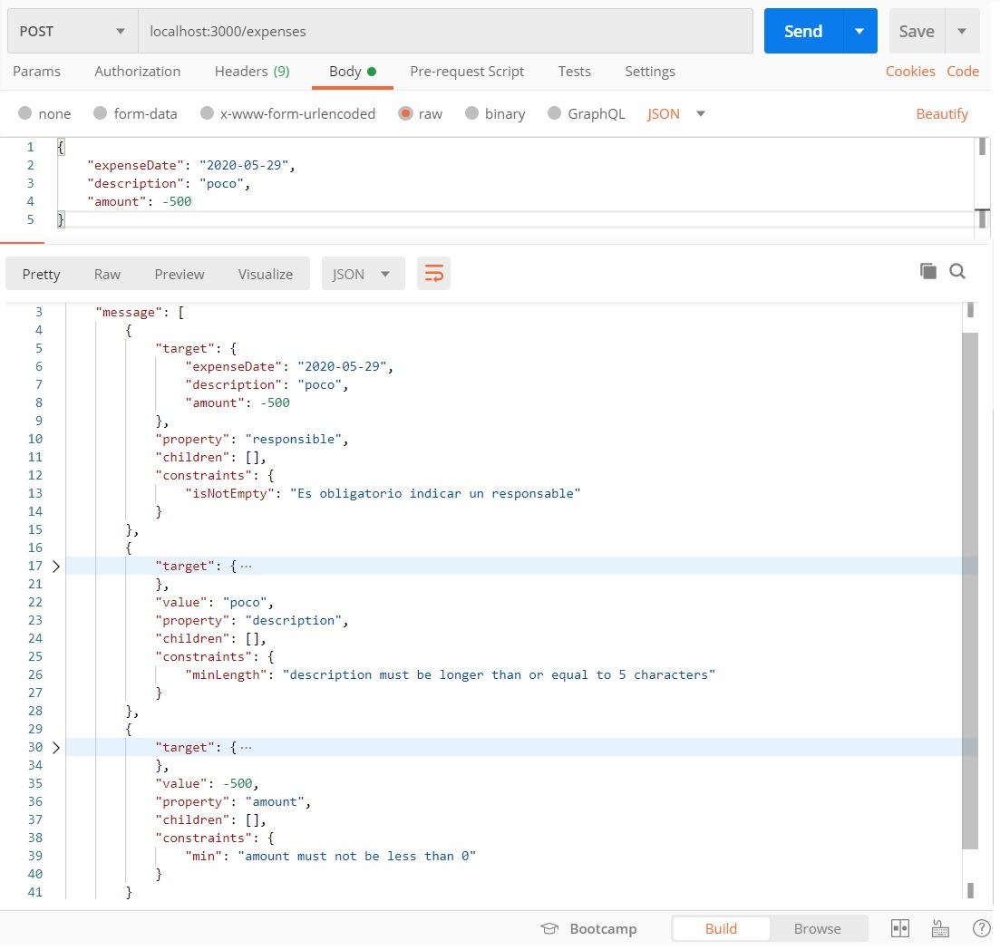

Aquí se ve que el `message` que genera `ValidationPipe` es extenso, y que se trata de una _lista_, en la que aparecen todos los errores detectados. Será función de un `ExceptionFilter` el extraer y manipular esta información para generar la response.
También se ve que los decorators de `class-validator` pueden ser configurados con un mensaje específico, proveyendo mensajes por defecto si no se configuran.

### Campos requeridos, opcionales y no definidos
Aunque entendemos que todos los decorators son autoexplicativos, preferimos hacer algunas puntualizaciones sobre `@IsDefined` e `@IsOptional`.

En el ejemplo anterior, el error del atributo `responsible` se generó por el decorator `@IsNotEmpty`: un atributo no incluido se considera vacío. Por otro lado, la ausencia del atributo `comments` no generó un error.  
Para pedir que un atributo sea incluido, sin hacer ninguna indicación sobre el valor, está el decorator `@IsDefined`. Es el caso del atributo `expenseDate` en el ejemplo.
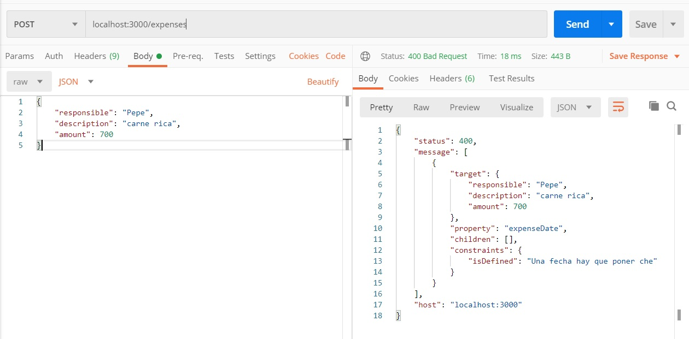

El atributo `@IsOptional` deshabilita todos los chequeos si el atributo no está presente. Es el caso de `description` en el ejemplo.
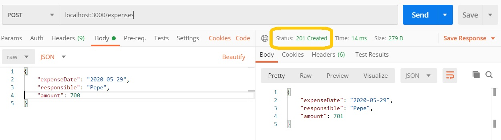

Obsérvese la diferencia con el campo `responsible` en el primer ejemplo de request: al no tener valor, se considera vacío y se aplica la validación. Por otro lado, el campo `comments`, que no tiene ninguna validación (el `@Allow` sólo "registra" el atributo para `class-validator`), puede o no estar.

Para este ejemplo, el comportamiento del servicio es responder con el request, haciéndole una mínima transformación.
``` typescript
@Post()
@UsePipes(new ValidationPipe())
addExpense(@Body() expenseData: AddExpenseRequestDTO): AddExpenseRequestDTO {
    return {...expenseData, amount: expenseData.amount + 1 }
}
```
Esta definición nos va a permitir analizar el comportamiento de `ValidationPipe` si el request incluye atributos que no están especificados en el DTO.  
El comportamiento por defecto es no rechazar el request y hacer llegar los datos "sobrantes" al request handler.
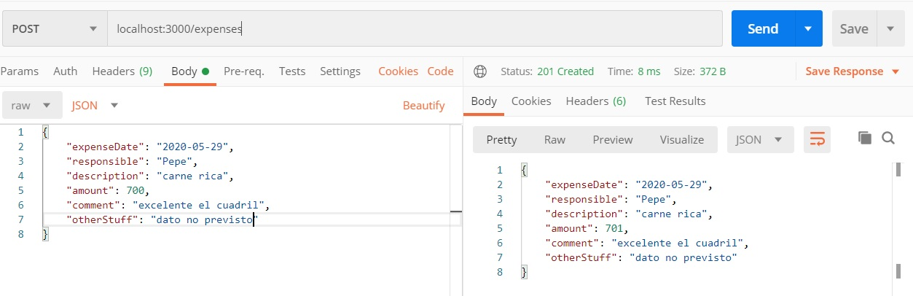

El `ValidationPipe` se puede configurar, pasando un parámetro en el constructor que incluye los atributos de configuración.  
Uno de estos atributos es `whitelist`, su efecto es que los datos no definidos en el DTO no lleguen al request handler. O sea, esta definición
``` typescript
@Post()
@UsePipes(new ValidationPipe({ whitelist: true }))
addExpense(@Body() expenseData: AddExpenseRequestDTO): AddExpenseRequestDTO {
    return {...expenseData, amount: expenseData.amount + 1 }
}
```
tiene el siguiente efecto
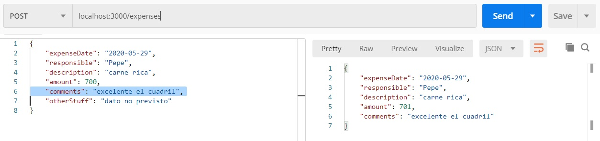

Si **además** de `whitelist`, se agrega `forbidNonWhitelisted`, entonces se rechazarán los request con datos no previstos. Por ejemplo, esta definición 
``` typescript
@Post()
@UsePipes(new ValidationPipe({ whitelist: true, forbidNonWhitelisted: true }))
addExpense(@Body() expenseData: AddExpenseRequestDTO): AddExpenseRequestDTO {
    return {...expenseData, amount: expenseData.amount + 1 }
}
```
genera este resultado
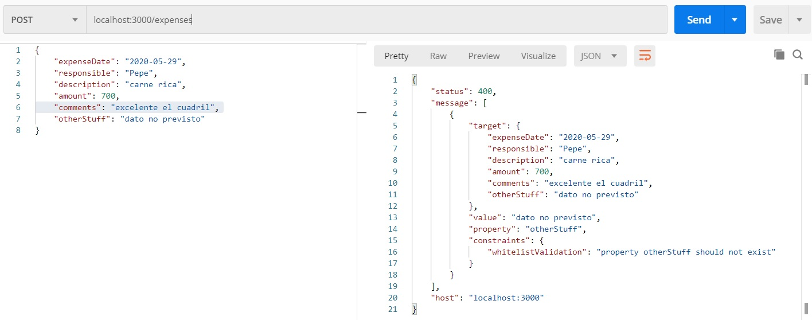

También mencionamos el atributo `skipMissingProperties`, que transforma todos los atributos en opcionales, excepto los que tengan marcado explícitamente `@IsDefined`. Si definimos
``` typescript
@Post()
@UsePipes(new ValidationPipe({ skipMissingProperties: true }))
addExpense(@Body() expenseData: AddExpenseRequestDTO): AddExpenseRequestDTO {
    return {...expenseData, amount: expenseData.amount + 1 }
}
```
podemos no incluir p.ej. el atributo `responsible`, que generó un error en el primer request.
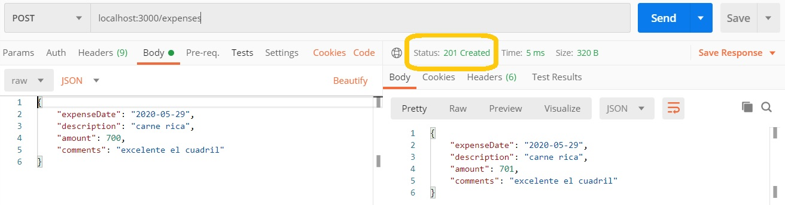


### Validaciones particulares
Una validación interesante es `@Matches`, que recibe una [expresión regular](https://docs.python.org/3/library/re.html) como parámetro. Por ejemplo, para validar que la fecha tenga formato `YYYY-MM-DD` (sin validar que en rigor sea una fecha válida), se puede especificar de esta forma
``` typescript
    @IsDefined({ message: 'Una fecha hay que poner che' }) 
    @Matches(/[0-9]{4}-[0-9]{2}-[0-9]{2}/, {message: 'No cumple el formato de fecha'})
    expenseDate: string
```
y se comporta como uno espera
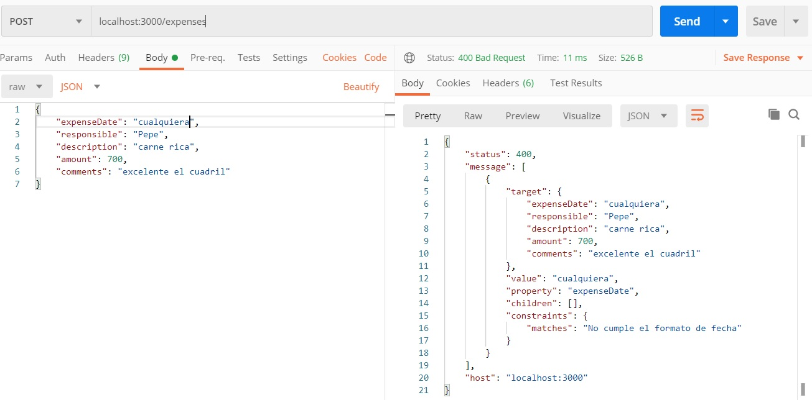

Finalmente, mencionamos que se pueden definir _custom validators_, ver los detalles en la [documentación de class-validator](https://github.com/typestack/class-validator#custom-validation-classes) o en [este post en Stack Overflow](https://stackoverflow.com/questions/60451337/password-confirmation-in-typescript-with-class-validator).


### Comentario - integración de packages
Una característica que creo muy positiva de NestJS es que confía en otros packages para algunas tareas que integra en el framework.  
Desde el principio, no pretende implementar un Web server, para eso confía en Express; se concentra en dar un modelo que facilita y organiza el desarrollo.  
La integración con `class-validator` es otro ejemplo: no repite funcionalidad que está desarrollada en otro package, sino que lo integra a los conceptos que define para brindar una solución de validación sencilla y potente.


## Pipes de tipos particulares
Para usar el `ValidatorPipe`, hay que definir una clase que modele a los datos de request (body / parámetros de path o query / headers) que se quieran validar.  
A veces es cómodo trabajar con datos de tipos básicos. P.ej. tenemos este endpoint de un servicio sobre fechas, que devuelve el resultado de sumarle una cantidad de días a una fecha.
``` typescript
@Get(':date/plus/:days')
getDatePlusDays(@Param("date") rawDate: string, @Param("days") days: number): DateDTOPlus {
    const theDate = moment.utc(rawDate, stdDateFormat)
    return { 
        date: moment(theDate).add(days, 'days').format(stdDateFormat),
        daysPlusOne: days + 1
    }
}
```
Uno puede pensar, ingenuamente, que al ponerle el tipo `number` al segundo parámetro, va a haber una magia de NestJS que transforme el string que llega en el request en un número. Pero no, para verificar esto es que agregamos el atributo `daysPlusOne` en el response. Veamos un ejemplo.
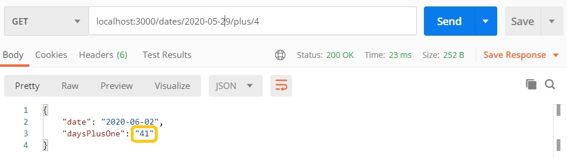
pero ¿¿cómo?? si defino un parámetro como `number`, ¿cómo es que se porta desvergonzadamente como un String? Recordemos que los tipos no permanecen al transpilar a JavaScript, y este dato llega por un request, está claro que la conversión no es automática.  
La siguiente pregunta es cómo es que anda la suma de fechas. La respuesta es que `moment` soporta que en el `add` se le pase un String en el parámetro en el que se indica la cantidad de días a sumar, y lo pasa a número. Si se le pasa un String que no representa un número, lo toma como 0. 
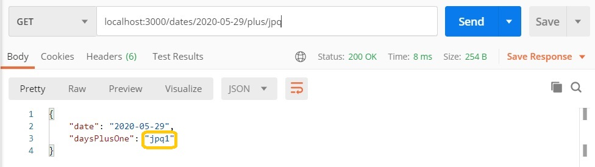

NestJS incluye un pipe llamado `ParseIntPipe` que parece inventado exactamente para  este caso. La forma de usarlo es muy sencilla.
``` typescript
@Get(':date/plus/:days')
getDatePlusDays(@Param("date") rawDate: string, @Param("days", ParseIntPipe) days: number): DateDTOPlus {
    const theDate = moment.utc(rawDate, stdDateFormat)
    return { 
        date: moment(theDate).add(days, 'days').format(stdDateFormat),
        daysPlusOne: days + 1
    }
}
```
Este pipe hace las dos cosas que queremos: transforma
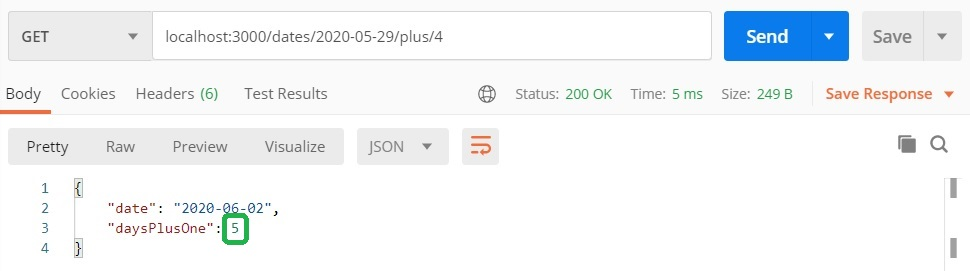
y valida
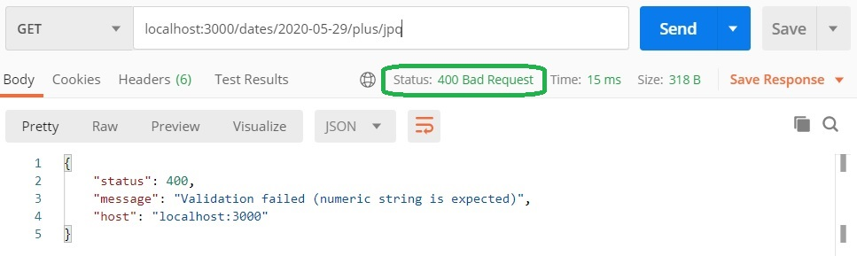


### Definir un custom Pipe no es difícil
Nos gustaría hacer algo semejante con el otro parámetro de path, la fecha. Que valide que sea una fecha válida en el formato que elegimos, que es `YYYY-MM-DD`, y que transforme en `moment.Moment`.  
Para eso, alcanza con implementar un Pipe. Resultó ser llamativamente fácil.
``` typescript
@Injectable()
export class ParseDatePipe implements PipeTransform<string, moment.Moment | null> {
    // eslint-disable-next-line @typescript-eslint/no-unused-vars
    transform(value: string, metadata: ArgumentMetadata) {
        const theMoment = moment.utc(value, stdDateFormat)
        if (!theMoment.isValid()) {
            throw new BadRequestException(`Value ${value} is not a valid date`)
        }
        return theMoment
    }
}
```
Los detalles, incluso para qué puede ser útil la `metadata`, se pueden consultar en [la página sobre Pipes en la documentación](https://docs.nestjs.com/pipes). Aquí sólo señalamos que si el valor no pasa la validación, lo que corresponde hacer es lanzar una `BadRequestException` con un mensaje adecuado.

Este Pipe es tan fácil de usar como el que provee NestJS
``` typescript
@Get(':date/plus/:days')
getDatePlusDays(
    @Param("date", ParseDatePipe) theDate: moment.Moment, 
    @Param("days", ParseIntPipe) days: number): DateDTOPlus 
{
    return { 
        parsedDate: theDate,
        date: moment(theDate).add(days, 'days').format(stdDateFormat),
        daysPlusOne: days + 1
    }
}
```
(agregamos `parsedDate` para que se vea la fecha en el response)  
obsérvese que ahora el parámetro se define como de tipo `moment.Moment`, y que no se realiza la conversión dentro del request handler, porque de esto se encarga el Pipe.  

Este pipe también se comporta correctamente en la transformación:
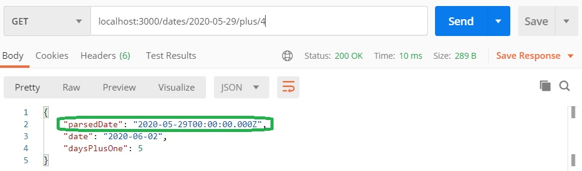
y en la validación:
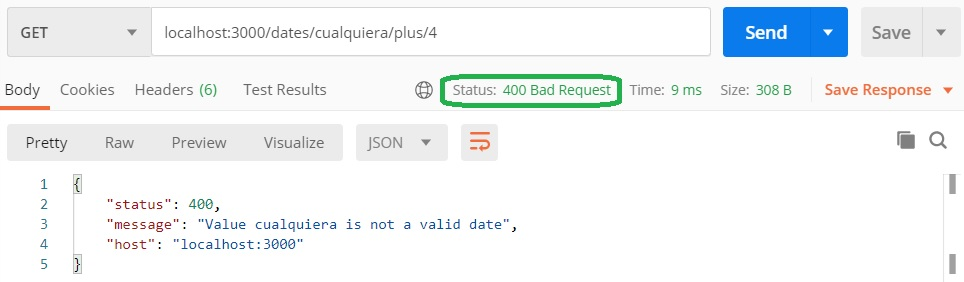


## Desafíos

### Valores en un `enum`
Definir un `enum` para los valores posibles de `responsible`. Usar la validación `@IsEnum` para validar que el valor que llega en el request es correcto.

### Descuento menor al importe
Agregar un atributo `discount`, que si está, su valor tiene que ser menor al de `amount`. Definir un custom validator para esto.

### Procesar los errores que lanza el ValidationPipe
Configurar un `ExceptionFilter` que maneje los errores que lanza el `ValidationPipe`, para que el response sea más resumido, p.ej. que incluya sólo los `constraints` de cada mensaje.
