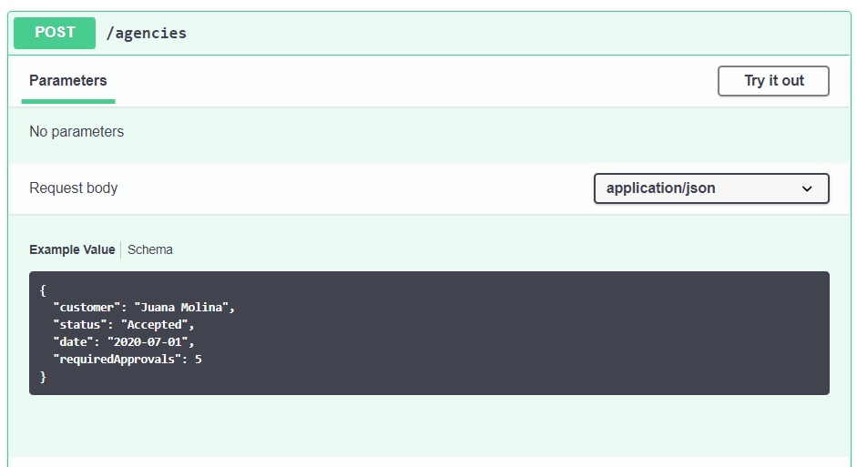
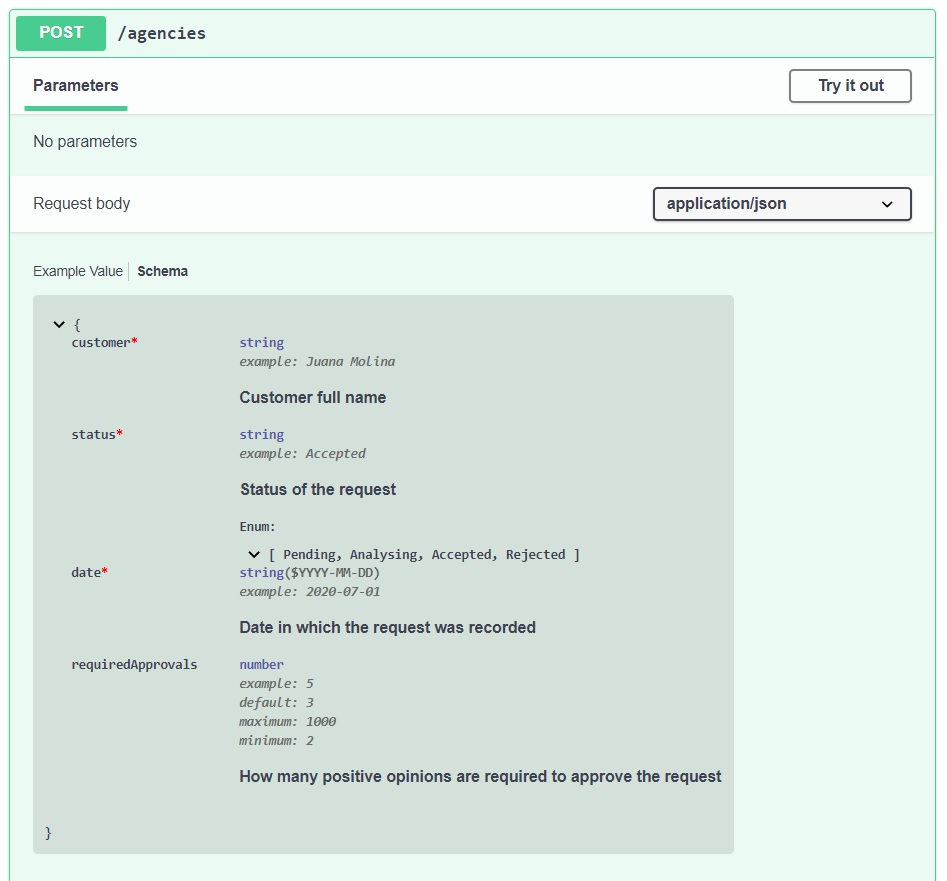
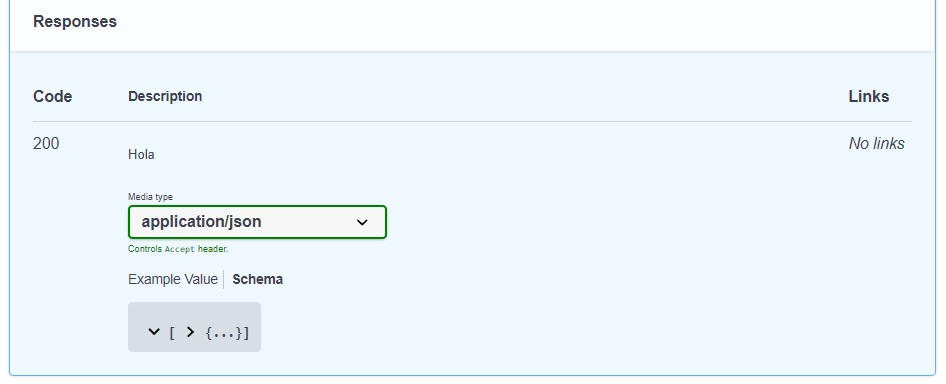
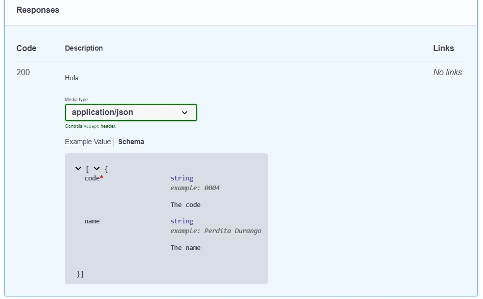
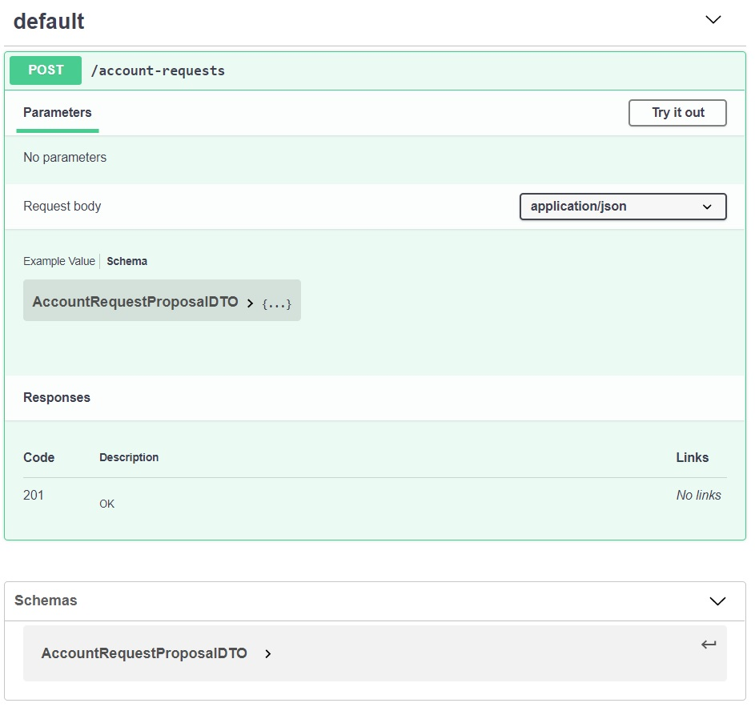

# Swagger - pequeña anatomía
En esta página vamos a describir los elementos principales de la especificación OpenApi, a la que se conoce como Swagger, en su versión 3.0. Los detalles completos se pueden consultar en [la doc sobre OpenApi 3](https://swagger.io/specification/).

Vamos a dar los ejemplos en YAML, aprovechando que es un poco más compacto y que se pueden intercalar comentarios, van desde `#` hasta el final de la línea.


## Estructura básica: encabezado + paths
En principio, un documento Swagger tiene un encabezado que define versión de OpenApi más título, versión y otros datos generales de la API; seguido por la definición de cada o endpoint. Cada endpoint se define por _path_ (o sea, URL relativa) más método.  
La definición de un path considera los _parámetros de path_, p.ej. `GET /agencies/{code}` es un solo endpoint, con un parámetro de path `code`.

**Los endpoints se agrupan por paths**. P.ej., para una API que incluye los endpoints
- `GET /agencies`
- `POST /agencies`
- `GET /agencies/{code}`

esta es la estructura del documento Swagger.
``` yaml
openapi: 3.0.0               # esta es la versión de OpenApi
info:
    title: Agencies
    # otros datos generales de la API
paths:
    '/agencies':
        get:
            # especificación de GET /agencies
        post:
            # especificación de POST /agencies
    '/agencies/{code}':
        get:
            # especificación de GET /agencies/{code}
```

Los datos generales de la API van en el atributo raíz `info`.
Destacamos `title`, `description` y `version`. Parece haber un `contact` que es obligatorio, reconozco que nunca lo usé. 
``` yaml
info:
    title: Agencies
    version: 0.0.1
    description: Manage agencies
    contact: {}
```

## Descripción de un endpoint: parameters + request body + responses
Los atributos principales de la definición de un endpoint son **`parameters`**, **`requestBody`** y **`responses`**. Obviamente, `requestBody` es solamente para los endpoints que incluyan body, típicamente los `POST`.

### Parameters
El parámetro `parameters` es una lista, que incluye path, headers, query, y cookie parameters. Cada elemento es un objeto, las propiedades principales son 

| Nombre | Descripción |
| --- | --- |
| _name_ | el identificador del parámetro, p.ej. `code` en `/agencies/{code}` o `/agencies?code=xxxx&name=yyyy`. Para headers, el nombre del header. |
| _description_ | una descripción en texto. |
| _in_ | qué tipo de parámetro es: `path`, `query`, `header`, `cookie`. |
| _required_ | `true` o `false`. |
| _example_ | eso, un ejemplo de un valor posible. |
| _schema_ | de qué tipo es el valor. Más información abajo. |

Esta es la especificación de los parámetros de query para buscar por cliente y ciudad, p.ej. para `GET account-requests?customer=xxxx&city=yyyy`.

``` yaml
parameters:
    -
        name: customer
        description: Part of the customer name
        in: query
        required: false
        schema:
            type: string
        example: 'Molina'
    -
        name: city
        description: Name of the city where the customer lives
        in: query
        required: false
        schema:
            type: string
        example: 'Yavi'
```

> **Nota sobre YAML**  
> los guiones marcan una lista, cada guión marca un elemento. Esto en JSON sería (se incluye sólo `name`,  `in` y `schema` para abreviar un poco)
> ```json
> "parameters": [
>     {
>         "name": "customer",
>         "in": "query",
>         "schema": { "type": "string" }
>     },
>     {
>         "name": "city",
>         "in": "query",
>         "schema": { "type": "string" }
>     }
> ]
> ```
>
> Para listas sencillas, p.ej. de strings, se puede usar la notación "à la JS", p.ej.  
> `enum: [Accepted, Rejected, Analysing]`  
> Este también es un YAML válido, la forma larga sería
> ``` yaml
> enum:
>     - Accepted
>     - Rejected
>     - Analysing
> ```


### Responses
Los `responses` son un objeto, con **una propiedad para cada status code** que puede devolver el endpoint.
Dentro de cada status code, va un objeto del cual estas son las propiedades principales.

| Nombre | Descripción |
| --- | --- |
| _description_ | una descripción en texto. |
| _required_ | `true` o `false`. |
| _content_ | descripción del payload, _por cada media type que se acepta_. |

Recordemos que un endpoint puede contemplar distintos formatos para brindar información, esto apareció al estudiar distintas representaciones de un mismo recurso entre las [variantes de API REST](../api-rest/api-rest-varios).  
Al invocar a un endpoint, se puede indicar (o sugerir) el formato o representación preferido en el header `Accept`, especificando un _media type_ (o varios). Entre los _media types_ standard tenemos `application/json`, `application/xml`, y `text/plain`.  
Por lo general, nuestros endpoints van a admitir un solo _media type_ que es `application/json`. 

Dentro de cada media type, definimos un `schema` para indicar el formato de la respuesta. También podemos agregar un `example`.

Así queda la especificación de los responses para un endpoint que puede devolver 200 (OK), 404 (Not Found) o 400 (Bad Request), y en donde no indicamos formato del contenido para los casos de error.
``` yaml
responses:
    '200':
        description: Data delivered
        content:
            application/json:
                schema:
                    ## especificación del formato del JSON
    '400':
        description: Malformed request
    '404':
        description: Information not found
```


### Request body 
El `requestBody` es un objeto, estos son sus atributos principales

| Nombre | Descripción |
| --- | --- |
| _description_ | una descripción en texto. |
| _required_ | `true` o `false`. |
| _content_ | descripción del payload, _por cada media type que se acepta_. |

El `content` tiene la misma lógica que el que se describió recién para las responses.

Este es un ejemplo de request body, supongamos para un `POST`.
``` yaml
requestBody:
    description: Data of the object to be added
    required: true
    content:
        application/json:
            schema:
                ## especificación del formato del JSON
```


## Esquemas
El `schema` es un objeto.
_Por ahora_, su atributo principal, y casi único, es `type`; después veremos variantes.

El `type` puede ser: un tipo simple (como `string` o `number`), un `object`, o un `array`.


### Tipos simples
Para tipos simples se pueden especificar algunas propiedades adicionales.
- `format`: para `string` o `number`. P.ej. se puede indicar `YYYY-MM-DD` para un string que representa una fecha.
- `example`: un ejemplo, que puede mostrar en la UI.
- `enum`: se especifica una lista de valores.
- `default`: valor por defecto si el dato no es requerido.
- `minimum`, `maximum`: rangos para valores numéricos.

Ponemos ejemplos más abajo.


### Object
Para los `object` hay que especificar las `properties`, un objeto donde cada key es el nombre de la propiedad, y el value es la especificación, que es un `type`. En otro atributo aparte, llamado `required`, se indica cuáles de los atributos son requeridos.

Tal vez se ve más fácil con un ejemplo. Esta es la especificación del esquema para el body del alta de solicitudes de cuenta. Tiene cuatro propiedades simples, de las cuales tres son requeridas. En las propiedades, incluimos varios atributos de tipos simples de los descriptos arriba.
``` yaml
schema:
    type: object
    required:
        - customer
        - status
        - date
    properties:
        customer:
            description: Customer full name
            type: string
            example: Juana Molina
        status:
            description: Status of the request
            type: string
            enum:
                - Pending
                - Analysing
                - Accepted
                - Rejected
            example: Accepted
        date:
            description: Date in which the request was recorded
            type: string
            example: '2020-07-01'
            format: 'YYYY-MM-DD'
        requiredApprovals:
            description: How many positive opinions are required to approve the request
            type: number
            example: 5
            default: 3
            maximum: 1000
            minimum: 2
```

En la interfaz gráfica más usual, el ejemplo de esta definición de esquema para el body se ve de la siguiente manera


Notar que arriba del ejemplo hay dos opciones, `Example Value` y `Schema`. Si cambiamos a `Schema`, vemos el detalle de acuerdo a lo que especificamos.


Ya podemos empezar a apreciar que el Swagger realmente da información útil para utilizar una API.


### Array
Un array incluye la propiedad `items`, que especifica el tipo de los elementos, que es un `type`.

Por ejemplo, el formato de una respuesta como un array de objetos que incluyen `code` y `name` se especifica de esta forma.
``` yaml
schema:
    type: array
    items:
        type: object
        required:
            - code
        properties:
            code:
                description: The code
                type: string
                example: '0004'
            name:
                description: The name
                type: string
                example: Perdita Durango
```

En la UI puede aparecer contraido


podemos expandir el `>`, aparece esto


la indicación de "array" es bastante sutil, se limita a los corchetes que encierran al objeto.


## Componentes - definición separada de esquemas
La especificación de Swagger también permite definir los esquemas complejos por separado, dentro de un atributo raíz llamado `components`.  
O sea, que un documento Swagger tiene tres atributos principales: `info`, `paths`, y `components`.

El único atributo que conozco de `components` es `schemas`. Este es un objeto, las keys son los nombres de cada esquema, el value es un esquema con el mismo formato que vimos recién.

Para hacer referencia a un esquema definido dentro de `components`, en `schema` usamos `$ref` en lugar de `type`, y lo asociamos al nombre que le dimos al esquema.

Para dar un ejemplo, demos la definición completa de un `POST` cuyo response body se define en `components`.

``` yaml
paths:
    '/account-requests':
        post:
            requestBody:
                content:
                    application/json:
                        schema:
                            $ref: '#/components/schemas/AccountRequestProposalDTO'
            responses:
                '201':
                    description: OK
components:
    schemas:
        AccountRequestProposalDTO:
            type: object
            required:
                - customer
                - status
                - date
            properties:
                customer:
                    description: Customer full name
                    type: string
                    example: Juana Molina
                status:
                    description: Status of the request
                    type: string
                    enum:
                        - Pending
                        - Analysing
                        - Accepted
                        - Rejected
                    example: Accepted
                date:
                    description: Date in which the request was recorded
                    type: string
                    example: '2020-07-01'
                    format: 'YYYY-MM-DD'
                requiredApprovals:
                    description: How many positive opinions are required to approve the request
                    type: number
                    example: 5
                    default: 3
                    maximum: 1000
                    minimum: 2

```

En la UI, dentro del endpoint se ve casi igual, sólo que aparece el nombre. La diferencia principal es que abajo de los endpoints, aparecen los esquemas.



## Tags
Para terminar esta presentación comprimida de Swagger, mencionemos los tags. Se pueden indicar para cada endpoint, y son una lista de strings. P.ej. 
``` yaml
paths:
    '/account-requests':
        post:
            tags: [Account requests]
            requestBody:
                content:
                    application/json:
                        schema:
                            $ref: '#/components/schemas/AccountRequestProposalDTO'
            responses:
                '201':
                    description: OK
``` 
De paso, usamos la notación comprimida para listas YAML.

y se ve así (destacando donde aparece el tag)


## Para practicar
Ver qué pasa si se cambia el nombre de atributo `components`, en forma consistente, o sea en cada `$ref` y en el atributo; y sacar conclusiones.

Definir los endpoints para
- un endpoint al que se le pasa un código de país, y entrega la información que se indica en el [ejemplo integrador de procesamiento asincrónico](../async/ejercicio-integrador).
- el endpoint de búsqueda de datos de un país, con opciones de representación de la información, que trabajamos al estudiar [variantes de API REST](../api-rest/api-rest-varios).
- los endpoints de un CRUD de sucursales con el formato definido al trabajar con [índices en MongoDB/Mongoose](../mongoose-performance/indices). Se puede suponer que la búsqueda se puede especificar un rango de superficies y/o parte de la dirección y/o nombre, como parámetros de query.
- algunos de los endpoints del [ejercicio de API REST](../api-rest/api-rest-ejercicio).


