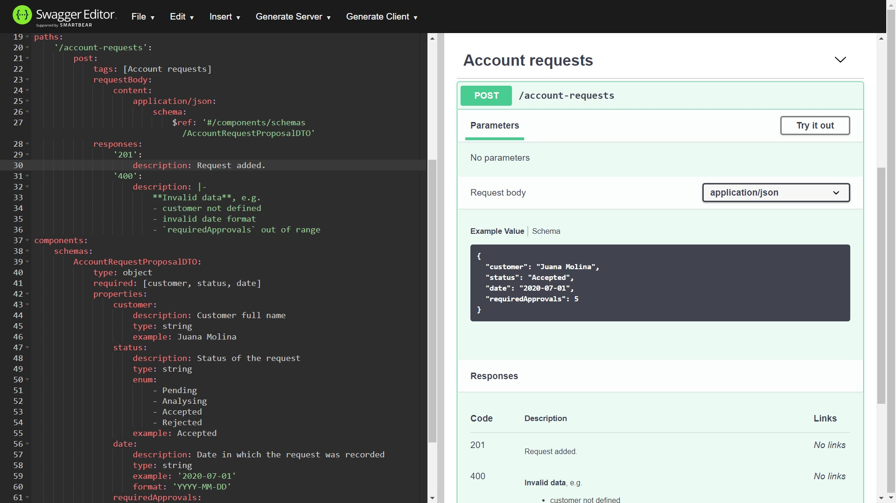
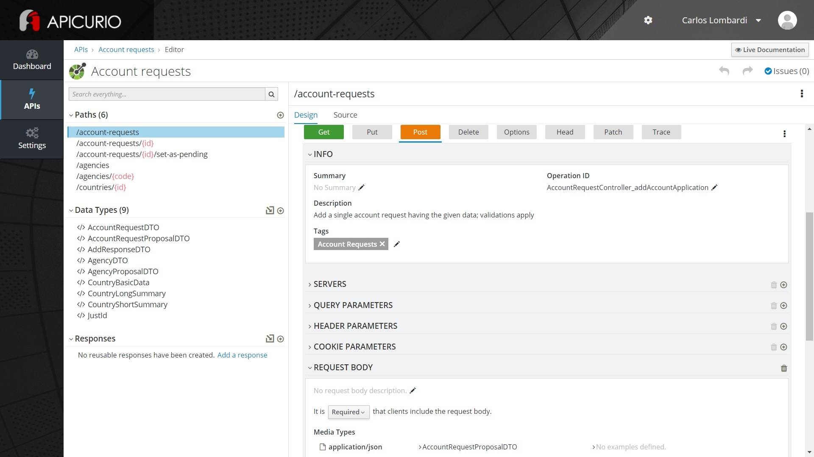
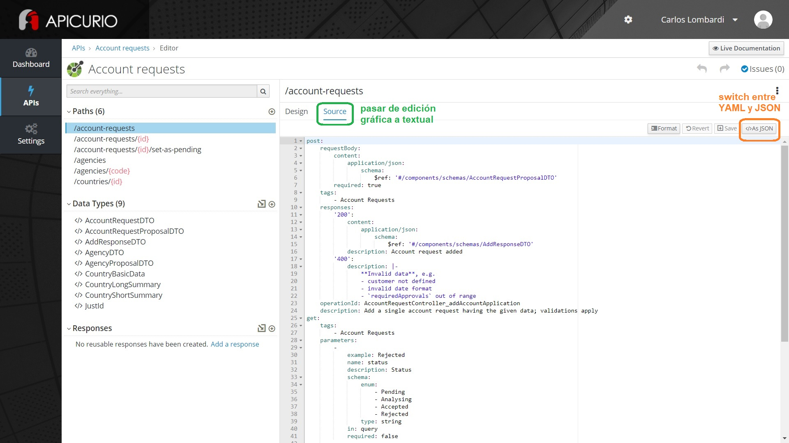
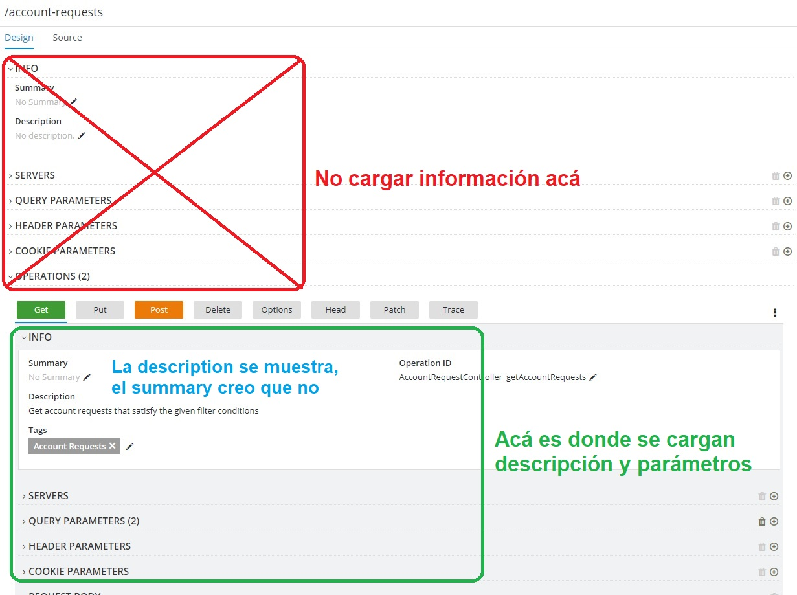
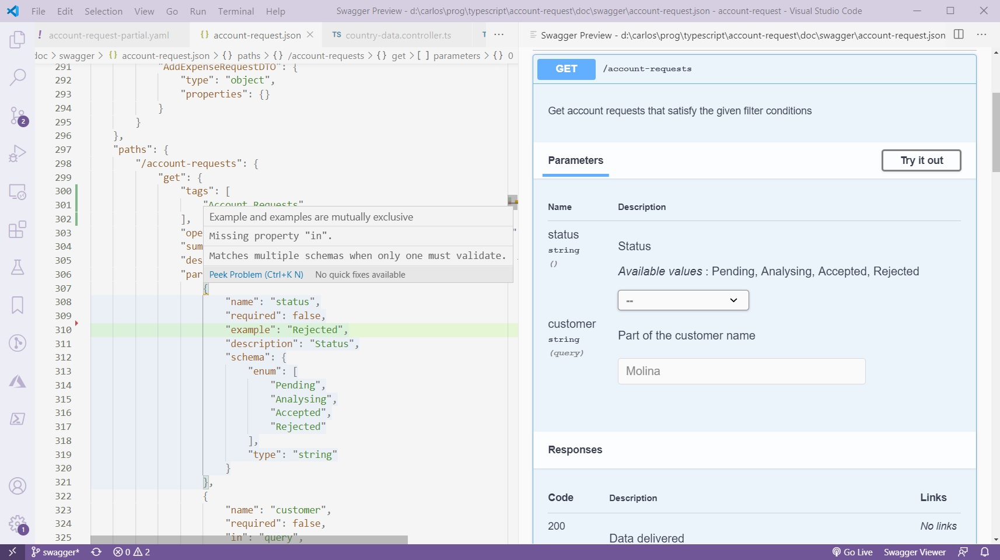

# Swagger - herramientas para edición
Como dijimos, Swagger no es ni más (ni menos) que una especificación de la estructura de un documento en formato YAML o JSON, que son formatos de texto plano.  
Por lo tanto, _cualquier editor de texto sirve_ (al menos en emergencia) para editar documentos Swagger.  
Si el editor reconoce y sabe manejar los formatos YAML y JSON, ya nos da un primer nivel de soporte.

Por sobre esta base, una herramienta que apunte específicamente a la edición de Swagger puede ofrecer
- preview "en vivo" de la vista gráfica, mientras se va editando un documento.
- en la edición de texto, validaciones e intellisense específicos de Swagger.
- edición simplificada (aunque probablemente más pesada) mediante formularios en donde se registran los datos específicos de un path o component Swagger.

## Panorama de las alternativas existentes
Existen varias herramientas específicas para la edición de documentos Swagger, muchas de ellas se pueden usar (o al menos probar) online.
Encontré una lista en [esta página](https://openapi.tools/#gui-editors).

También existen plugins para VSCode, por ejemplo [Swagger Viewer](https://marketplace.visualstudio.com/items?itemName=Arjun.swagger-viewer) y [OpenAPI (Swagger) Editor](https://marketplace.visualstudio.com/items?itemName=42Crunch.vscode-openapi).

En lo que sigue, describimos brevemente algunas de estas alternativas.

## Swagger editor
Es un editor online para YAML (no soporta edición en JSON, sí exportar a JSON), que al lado muestra la UI de lo que se va editando.

Maneja intellisense y detección de errores específicos de Swagger.

Personalmentelo uso para pruebas rápidas.
Me da confianza que es parte de `swagger.io`, el mismo sitio donde está la versión oficial de la especificación OpenAPI.

## Apicurio Studio
Es una especie de IDE para Swagger, con versiones online e instalable.
En la versión online, mantiene una o varias API (o sea, documentos Swagger) para cada usuario.
Para entrar a la edición de API, pulsar el botón "Try Live" en [la página de la herramienta](https://www.apicur.io/studio/). Pide usuario y password, después da acceso a las API asociadas al usuario.

Propone una edición simplificada de un documento Swagger, a través de formularios específicos para un path (permitiendo definir uno o varios endpoints para ese path), y para un componente (dentro de Apicurio Studio, se llama "Data types" a los componentes).  
En esta imagen se muestra la edición del endpoint `POST` para un path que tiene definidos `GET` y `POST`

Se puede switchear entre edición simplificada y edición del texto en YAML o JSON, como se muestra en la siguiente imagen.

> **Nota sobre Apicurio**  
> En la edición de paths, se pueden editar varios datos, o bien a nivel de path, o bien dentro de cada method (Apicurio llama "Operation" a los methods). 
> La UI sólo toma los datos definidos _a nivel method_, esos son los que hay que cargar. 
> Adicionalmente, donde ofrece cargar `summary` y/o `description`, yo elijo `description`.  
> La siguiente imagen resume estas sugerencias. 
> 

Mencionamos algunas características interesantes
- En la versión online, permite que varios usuarios puedan compartir una misma API.
- Permite descargar la versión de texto de una API, también tiene una forma de subirla directamente en un repo Git.
- Tiene un preview que se abre en una pestaña aparte del navegador. Para accederlo, buscar el botón "Live documentation"; en los screenshots anteriores está arriba a la derecha.

## Swagger viewer
Es un plugin para VSCode. Tiene un preview "en vivo", el funcionamiento parece ser un poco rudimentario pero igualmente útil. Incluye detección de errores e intellisense específicos de Swagger. Se ve así.

