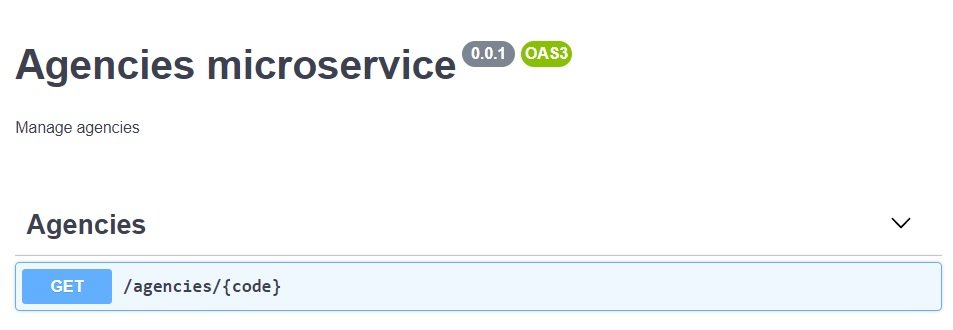
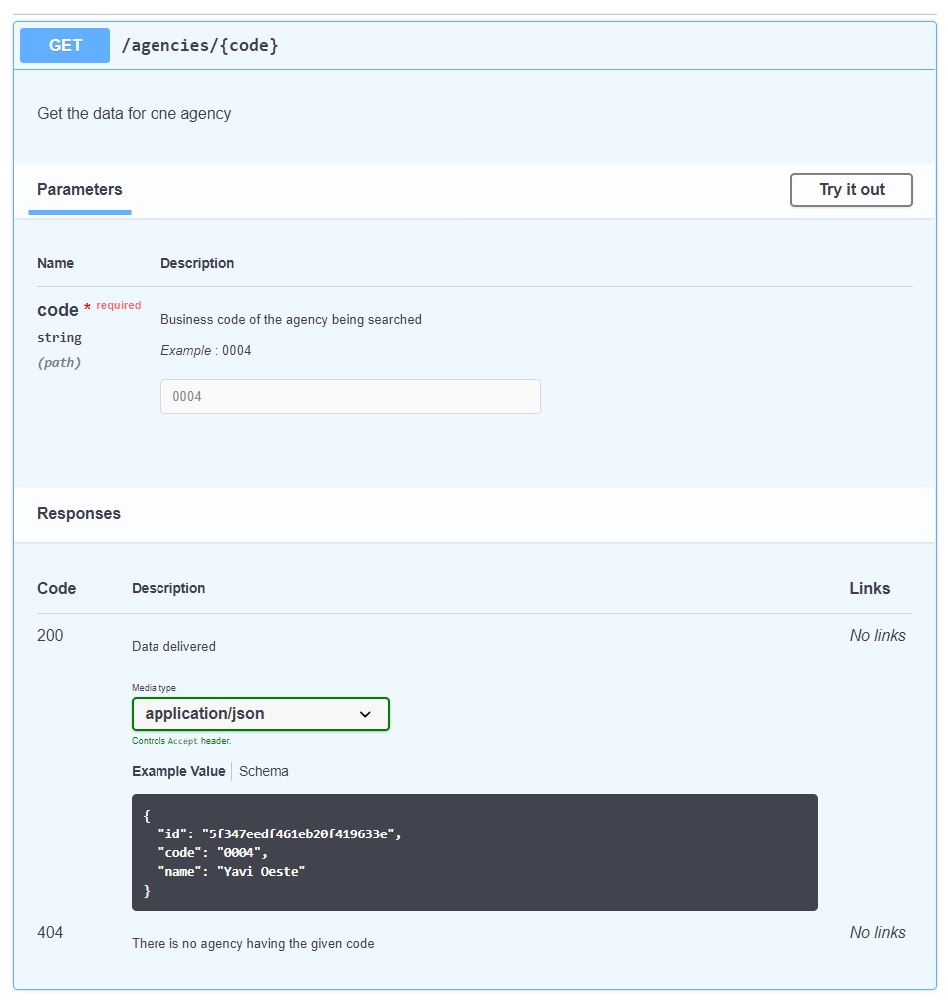

# Qué es Swagger

## Un poquito de contexto
Hace ya un tiempo, debatimos sobre buenas prácticas para **definir la interfaz** de un microservicio, al tratar el tema de [API REST](../api-rest/api-rest-intro).  
Ahora vamos a estudiar cómo **documentar** una API HTTP. Ahí es donde entra _Swagger / Open Api Specification_, dos términos que son sinónimos o casi. En lo que sigue, diremos siempre "Swagger". 

Como veremos, podemos 
- armar la documentación de la API _antes_ de desarrollarla, como una especificación, y/o
- generar la documentación _a partir del código_, agregando elementos al código fuente que indiquen las descripciones y otros detalles de la documentación.

El principal propósito para documentar una API es que otras personas sepan cómo usarla, _sin necesidad de mirar el código_.
Esto es particularmente útil para desarrolladoras que trabajen en lenguajes / framework / tecnologías distintos, y que quieran/necesiten acceder al microservicio que estamos desarrollando.  
En particular, Swagger permite generar, y consultar, una interface sin tener que escribir/leer más texto del imprescindible, es bastante ágil y va a lo práctico. Mucho más ágil que escribir documentos, eso seguro. Incluso está pensada para ofrecer una interfaz gráfica Web, como veremos en breve.

> **Nota arquitectónica**  
> Parte del objetivo de las arquitecturas basadas en microservicios, es justamente no forzar el uso de un mismo stack tecnológico en todos los servicios que van a integrarse en un proyecto. Mientras todos puedan exponer y consumir interfaces HTTP, se pueden comunicar e integrar.  
> Contar con una documentación ágil contribuye al éxito de esta forma de trabajo, porque hace más fácil la interacción entre microservicios.


## De qué se trata Swagger
Es una especificación para describir una API HTTP, en un _formato de intercambio de información_. Ni más ni menos que eso.   
Como formatos, se usan tanto YAML como JSON. A JSON lo conocemos de memoria. De YAML, va [un tutorial rápido](https://learnxinyminutes.com/docs/yaml/) para ponerse en órbita.

Este es un ejemplo de doc Swagger en formato YAML, para una app que incluye un único endpoint, un `GET` para obtener datos de una sucursal.
``` yaml
openapi: 3.0.0
info:
    title: Agencies microservice
    version: 0.0.1
    description: Manage agencies
    contact: {}
paths:
    '/agencies/{code}':
        get:
            description: Get the data for one agency
            tags:
                - Agencies
            parameters:
                -
                    example: '0004'
                    name: code
                    description: Business code of the agency being searched
                    schema:
                        type: string
                    in: path
                    required: true
            responses:
                '200':
                    description: Data delivered
                    content:
                        application/json:
                            schema:
                                type: object
                                properties:
                                    id:
                                        description: DB-created id
                                        type: string
                                        example: 5f347eedf461eb20f419633e
                                    code:
                                        description: Business code of the agency
                                        type: string
                                        example: '0004'
                                    name:
                                        description: Name given to the agency by the bank
                                        type: string
                                        example: Yavi Oeste
                '404':
                    description: There is no agency having the given code
```

Hagamos una primera vista rápida del formato Swagger.
1. Para cada endpoint, identificado por _path_ (o sea URL relativa) y método, se indican los parámetros y las respuestas. 
1. Un endpoint puede tener varias respuestas, que se distinguen por el status code. 
1. De cada cosa se indica el tipo, usando el atributo `schema`, que adentro tiene un `type`. Se puede pensar que hay una duplicación entre `schema` y `type` , ya vamos a ver que tiene sentido que existan los dos.
1. Si el tipo es compuesto, se pone `type: object`, y se especifican las propiedades en un atributo `properties`.
1. De cada atributo se pueden poner ejemplos.
1. De cada cosa se puede agregar una descripción.

### YAML vs JSON
Va la descripción del mismo endpoint en JSON.
``` json
{
  "openapi": "3.0.0",
  "info": {
    "title": "Agencies microservice",
    "version": "0.0.1",
    "description": "Manage agencies",
    "contact": {}
  },
  "paths": {
    "/agencies/{code}": {
      "get": {
        "tags": [ "Agencies" ],
        "parameters": [
          {
            "example": "0004",
            "name": "code",
            "description": "Business code of the agency being searched",
            "schema": { "type": "string" },
            "in": "path",
            "required": true
          }
        ],
        "description": "Get the data for one agency",
        "responses": {
          "200": {
            "description": "Data delivered",
            "content": {
              "application/json": {
                "schema": {
                  "type": "object",
                  "properties": {
                    "id": {
                      "description": "DB-created id",
                      "type": "string",
                      "example": "5f347eedf461eb20f419633e"
                    },
                    "code": {
                      "description": "Business code of the agency",
                      "type": "string",
                      "example": "0004"
                    },
                    "name": {
                      "description": "Name given to the agency by the bank",
                      "type": "string",
                      "example": "Yavi Oeste"
                    }
                  }
                }
              }
            }
          },
          "404": {
            "description": "There is no agency having the given code"
          }
        }
      }
    }
  }
}
```

El YAML queda un poco más compacto y liviano, porque
- por lo general, las comillas para delimitar strings no son necesarias. Sí se pueden poner, son opcionales.  
Son necesarias cuando  podría haber confusión con otro tipo de datos, p.ej. los status code van entre comilla para que no los tome como números (lo que es necesario para poder transformar a JSON, donde los nombres de atributo _tienen_ que ser String).
- no hay que poner las llaves que abren y cierran cada nivel.

Además, al contrario de JSON, YAML _sí_ admite comentarios.

Hay un millón de conversores online, entre los que aparecen primero al googlear me gustó [este](https://codebeautify.org/yaml-to-json-xml-csv).


### Salida Web gráfica
Hay varios formatos de interfaz Web para Swagger, que toman una especificación y generan una página. 
Así se ve la especificación de la app con un único endpoint de sucurales, en el formato más común.



Para cada endpoint, se incluye un recuadro.

La palabra "Agencies" que está arriba del recuadro es el `tag` que definimos para el endpoint. Si en una app tenemos muchos endpoints, los podemos separar usando tags.


Al expandir el endpoint, se ve de esta forma


En la descripción de la respuesta, se ven los ejemplos que pusimos para cada property.


## Aclaración antes de seguir
El material de las páginas que sigue no pretende ser una descripción completa de Swagger, ni mucho menos. Se van a incluir los elementos más usados, que deberían ser suficientes para documentar una API a menos que aparezcan características particulares. 

Análogamente, vamos a comentar _algunas_ formas de _manejar_ esta documentación, debe haber muchas más, que este escriba desconoce. 
Entre las que sí vamos a cubrir, está el soporte para Swagger incluido en la versión 6 de Nest, que se describe (un poco) en [la doc](https://docs.nestjs.com/v6/recipes/swagger).
