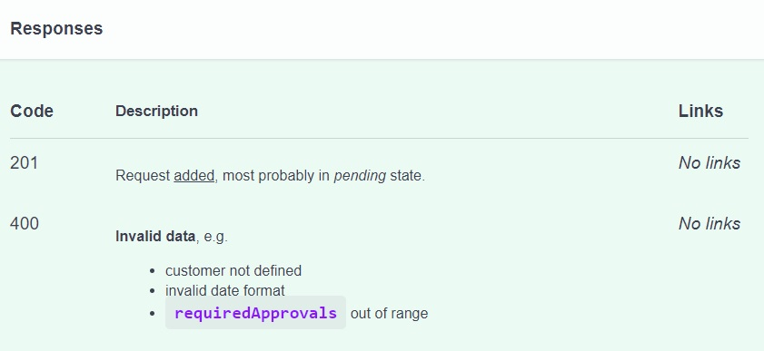
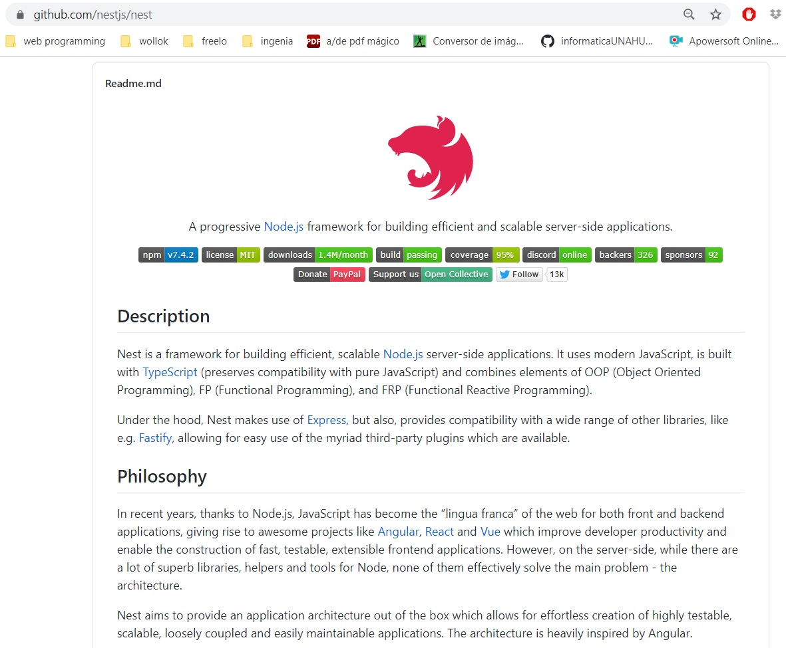
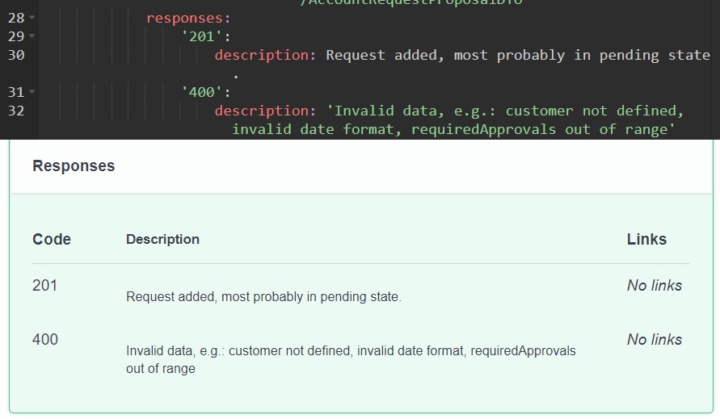
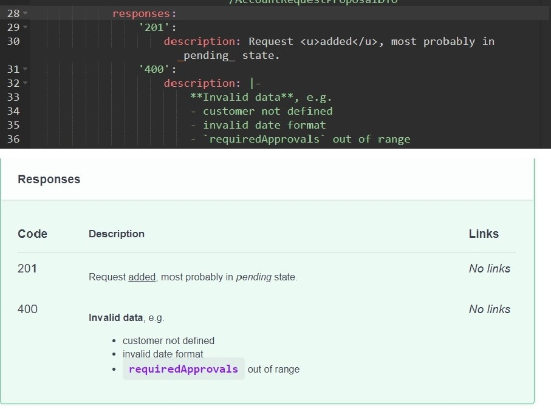
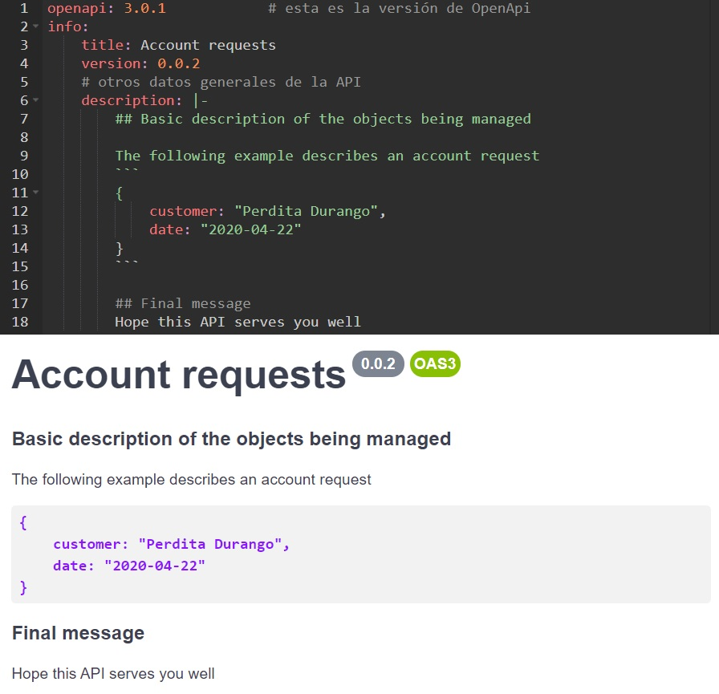

# Markdown - formato para las descripciones
En la descripción de cualquier elemento de un documento Swagger, podemos aplicar varias opciones de formato: negrita, listas, tablas, títulos, etc..  
Esto es posible porque las UI que renderizan documentos Swagger soportan (alguna de las múltiples versiones de) [Markdown](https://en.wikipedia.org/wiki/Markdown).

La siguiente imagen muestra un ejemplo de descripción de dos respuestas de un endpoint, con algo de formato.



## Brevísima intro a Markdown
**Markdown** es una especificación de señalizaciones sobre un texto plano, para definir formas básicas de formato. 
P.ej, para poner un texto en negrita, se lo encierra entre dobles asteriscos; el siguiente texto
```
lo que sigue es **muy importante**, atención.
```
se verá así:


Para que el Markdown se vea con formato, se requiere un entorno gráfico que interprete y renderice correctamente el texto formateado, o bien de un compilador que traduzca los archivos a p.ej. HTML.

Aunque los browsers no soportan (¿todavía?) el formato Markdown; varias herramientas sí lo hacen. Lo que vamos a aprovechar a continuación es que las UI que renderizan documentos Swagger soportan Markdown.


### El archivo README.md
Otro uso de Markdown, que tiene mucho impacto en el ámbito de desarrollo de software, es que los principales proveedores de Git, o sea GitHub, GitLab y BitBucket, soportan Markdown en la UI de los repositorios. Cualquier archivo de terminación `.md` se renderiza como Markdown al consultar un repo desde un browser.  
En particular, al accederse a la página inicial de un repo, se muestra el contenido del archivo `./README.md`. Por lo tanto, este archivo se utiliza para la documentación de packages y otros repositorios. Vaya como ejemplo el repo del package `@nestjs/core`.

El gráfico de arriba, los títulos, y los links están especificados en Markdown.

Es una _buena práctica_ de desarrollo, utilizar en **nuestros proyectos** esta misma característica. 
Esto es, aprovechar el archivo `./README.md` del repositorio de cada proyecto, para dar una descripción general, y comentar las funcionalidades principales que brinda; aprovechando las características de Markdown para darle un poco de formato al texto.  
Otra convención es incluir una historia de versiones en el archivo `./CHANGELOG.md`.


### GitHub Pages
En particular, GitHub ofrece un servicio llamado [GitHub Pages](https://pages.github.com/) que permite generar un sitio Web a partir de un repo compuesto por archivos Markdown. Así es como está generado el sitio que estás leyendo.


## Markdown en acción
La descripción de los elementos que componen Markdown se pueden encontrar en una multitud de tutoriales y _cheat sheets_, por ejemplo [este](https://www.markdownguide.org/cheat-sheet/). 
Aquí solamente indicamos que muchas herramientas que soportan Markdown, aceptan elementos básicos de HTML, entre ellos el `<u>...</u>` para subrayado.

Mostramos la descripción de las dos respuestas que mostramos arriba, antes y después de aplicar Markdown.

Así es sin Markdown.


Así es agregando Markdown.


De paso, vemos un ejemplo de un contenido multilínea en YAML: se indica con `|-` y se ponen las líneas indentadas debajo.

Repasamos los elementos de Markdown utilizados
- formato de texto: `**negrita**`, `_cursiva_`, `<u>subrayado</u>`, `` `código` ``.
- lista de bullets usando el guión `-`.

> **Comentario sobre listas en Markdown**  
> Las listas numéricas se indican encabezando cada línea con un número seguido de un punto, o sea 
> ```
> 1. chocolate
> 2. leche
> 3. maicena
> ```
> Ahora, si reordenamos los ítems, tenemos que cambiar los números.   
> Un pequeño truco es saber que Markdown numera solo, entonces si ponemos
> ```
> 1. chocolate
> 3. maicena
> 2. leche
> ```
> el resultado va a ser
> 1. chocolate
> 3. maicena
> 2. leche
>
> Notar que puso "2" en maicena, aunque está indicado como `3.`. Esto es porque el que establece los números es Markdown; los números específicos que se indican son ignorados.
>
> Una buena práctica al respecto es poner `1.` _en todos los ítems_, y confiar en Markdown para que ponga los números que corresponde. En este caso sería
> ```
> 1. chocolate
> 1. maicena
> 1. leche
> ```


### Títulos, bloque de código
Para mostrar dos características adicionales de Markdown, agregamos una descripción general al documento.


Aquí vemos: _títulos_ en líneas que comienzan con numerales (de acuerdo a la cantidad, es la jerarquía de título), y _bloques de código_, que se demarcan con líneas que tienen _únicamente_ `` ``` ``, tres backticks.


