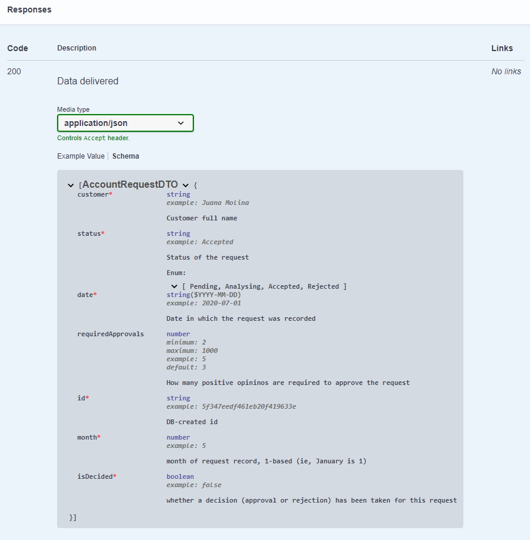

# Swagger en NestJS - empezamos
De las dos estrategias para generar documentación Swagger que describimos en [la intro](./swagger-intro), hata ahora exploramos la que consiste en generar una documentación Swagger _independiente del código_.

En lo que sigue, vamos a trabajar con la otra estrategia: generar la documentación y la UI Swagger _a partir_ del código, agregando en el mismo código los elementos necesarios para que la documentación quede completa.

NestJS incluye un soporte para trabajar con Swagger de esta forma, que se detalla en [la doc](https://docs.nestjs.com/v6/recipes/swagger) (recordamos que estamos trabajando con la versión 6 de Swagger).
A continuación, vamos a describir las características principales, y tal vez alguna otra, de este soporte.


## Primeros pasos
Arrancamos con una aplicación que incluye dos módulos: uno de solicitudes de cuentas, otro de sucursales.

Damos los primeros parsos indicados en [la doc](https://docs.nestjs.com/v6/recipes/swagger): incorporamos los packages necesarios, y agregamos la configuración en el archivo `main.ts`. Esta es nuestra configuración de Swagger
``` typescript
const options = new DocumentBuilder()
    .setTitle('Example NestJS App')
    .setDescription('Example NestJS application, with several modules')
    .setVersion('0.0.1')
    .build();
const document = SwaggerModule.createDocument(app, options);
SwaggerModule.setup('apidoc', app, document);  
```

El `apidoc` es el path relativo que va a tener la UI de Swagger.

Estos pasos son suficientes para tener una UI de Swagger levantada incluyendo todos los endpoints.
Para esto hay que _levantar la aplicación_, supongamos que local, y acceder a `http://localhost:<puerto>/apidoc`. Aparece lo siguiente.

Está claro que es _la misma aplicación_ que sirve la UI de Swagger.


El "default" de arriba es porque no se especificaron tags.

Al abrir los distintos endpoints, vemos que no se incluye casi ningún detalle.
.


## Dónde y cómo agregar información para alimentar a Swagger
Para entender dónde es que hay que agregar la información que complete la documentación Swagger, pensemos de dónde obtiene NestJS la información que le permite armar la lista de endpoints que ya está mostrando.

Esta información está en los **controllers**, es ahí donde se definen los endpoints mediante _decorators_.
La información para completar los paths se incorpora en los controllers, mediante decorators específicos para Swagger.
Los nombres de estos decorators van a empezar siempre con `@Api`.  
Algunos ejemplos: `@ApiOperation`, `@ApiParam` (para parámetros de path), `@ApiQuery` (para parámetros de query), `@ApiResponse`.

Estos decorators van a tener un objeto como parámetro, ahí se especifican las propiedades asociadas a cada elemento. P.ej. esta es la descripción de un parámetro de query.
``` typescript
@ApiQuery({ 
    name: 'customer', required: false, example: 'Molina', type: 'string',
    description: 'Part of the customer name'
})
```
esta estructura es compartida por todos los decorators `@ApiXXX`.


## Agregamos información a un endpoint
Empecemos por el `GET /account-requests`. Este endpoint tiene dos query params: `customer` y `status`; recordemos que una solicitud maneja cuatro datos: `customer`, `date`, `status`, y `requiredApprovals`.

Utilizamos el decorator `@ApiOperation` para indicar la descripción del endpoint, y `@ApiQuery` para describir los query params.  
También agregamos `@ApiTags`, como decorator _en la clase del controller_, para agregar un tag a _todos los endpoints_ definidos en el mismo.

Nos queda este código.
``` typescript
@ApiTags('Account Requests')
@Controller('account-requests')
export class AccountRequestController {
    constructor(private readonly service: AccountRequestService) { }

    @ApiOperation({ description: 'Get account requests that satisfy the given filter conditions' })
    @ApiQuery({ 
        name: 'customer', required: false, example: 'Molina', type: 'string',
        description: 'Part of the customer name'
    })
    @ApiQuery({
        name: 'status', required: false, example: 'Rejected', enum: Status,
        description: 'Status'
    })
    @Get()
    async getAccountRequests(@Query() conditions: AccountRequestFilterConditions): Promise<AccountRequestDTO[]> {
        /* ... implementación ... */
    }

    /* ... otros métodos ... */
}
```

Notar en particular, que al indicar `enum` en un query param, no es necesario indicar que el tipo es `string`, esto lo deduce NestJS.

Ahora, la UI incluye más información sobre el endpoint `GET`, y además apareció el tag.


## Agregamos un componente
Vemos que aparece la respuesta con status code 200, pero sin indicar _qué datos_ incluye la respuesta.
Para incorporar esta información, hay que usar el decorator `@ApiResponse`, indicando descripción y tipo. 

El request handler queda así.
``` typescript
@ApiTags('Account Requests')
@Controller('account-requests')
export class AccountRequestController {
    constructor(private readonly service: AccountRequestService) { }

    @ApiOperation({ description: 'Get account requests that satisfy the given filter conditions' })
    @ApiResponse({ 
        status: HttpStatus.OK, description: 'Data delivered', 
        type: AccountRequestDTO, isArray: true 
    })
    @ApiQuery({ 
        name: 'customer', required: false, example: 'Molina', type: 'string',
        description: 'Part of the customer name'
    })
    @ApiQuery({
        name: 'status', required: false, example: 'Rejected', enum: Status,
        description: 'Status'
    })
    @Get()
    async getAccountRequests(@Query() conditions: AccountRequestFilterConditions): Promise<AccountRequestDTO[]> {
        /* ... implementación ... */
    }

    /* ... otros métodos ... */
}
```
Notar que se especifica `isArray` en un atributo aparte.

> **Nota sobre los límites del soporte de NestJS**  
NestJS no incorpora automáticamente el tipo de respuesta del método, en este caso `AccountRequestDTO[]`, como contenido de la response para status code de éxito; hay que repetir esta información al especificar la respuesta.

Veamos cómo queda la UI


Toma `application/json` como _media type_, este es el default de NestJS (veremos más adelante cómo indicar otros media types de ser necesario).  
En el esquema, se indica que es un array, aparece el nombre `AccountRequestDTO` como tipo de los elementos de ese array, pero no aparece qué datos forman parte de un `AccountRequestDTO`. 

Para que se incorpore la estructura, hay que agregar decorators al _tipo que representa los datos_, en este caso `AccountRequestDTO`.
Como ya comentamos, esto implica tener que transformar este tipo en una `class`, si es actualmente una `interface`, porque una `interface` no puede tener decorators.
Para esto se utiliza el decorator `@ApiProperty`, y eventualmente `@ApiPropertyOptional` en lugar de incluir `required: false` entre los atributos.

La (ahora) clase `AccountRequestDTO` queda así.
``` typescript
export class AccountRequestDTO {
    @ApiProperty({ 
        description: `DB-created id`, type: 'string', example: exampleId 
    })
    id: string

    @ApiProperty({
        description: 'Customer full name', example: 'Juana Molina'
    })
    customer: string

    @ApiProperty({ 
        description: 'Status of the request', enum: Status, example: Status.ACCEPTED 
    })
    status: string

    @ApiProperty({ 
        description: 'Date in which the request was recorded', 
        type: 'string', format: 'YYYY-MM-DD', example: '2020-07-01'
    })
    date: string

    @ApiPropertyOptional({ 
        description: 'How many positive opinions are required to approve the request', 
        type: 'number', minimum: 2, maximum: 1000, example: 5, default: 3
    })
    requiredApprovals: number

    @ApiProperty({ 
        description: 'month of request record, 1-based (ie, January is 1)', type: 'number', example: 5 
    })
    month: number

    @ApiProperty({ 
        description: 'whether a decision (approval or rejection) has been taken for this request', 
        type: 'boolean', example: false
    })
    isDecided: boolean
}
```

Ahora la UI muestra el tipo de la response correctamente.


El ejemplo también se ve correctamente, está armado a partir de los ejemplos indicados en cada atributo.


