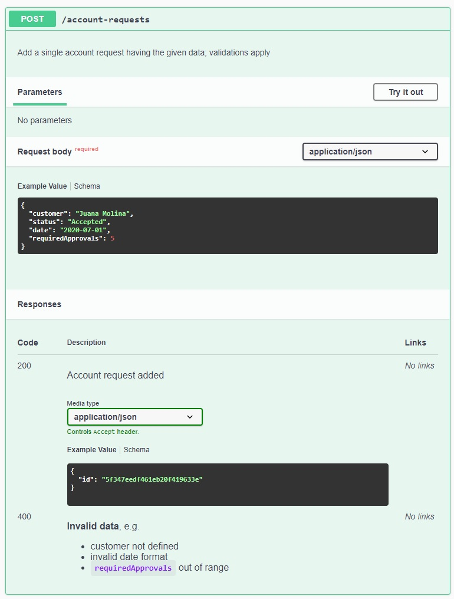
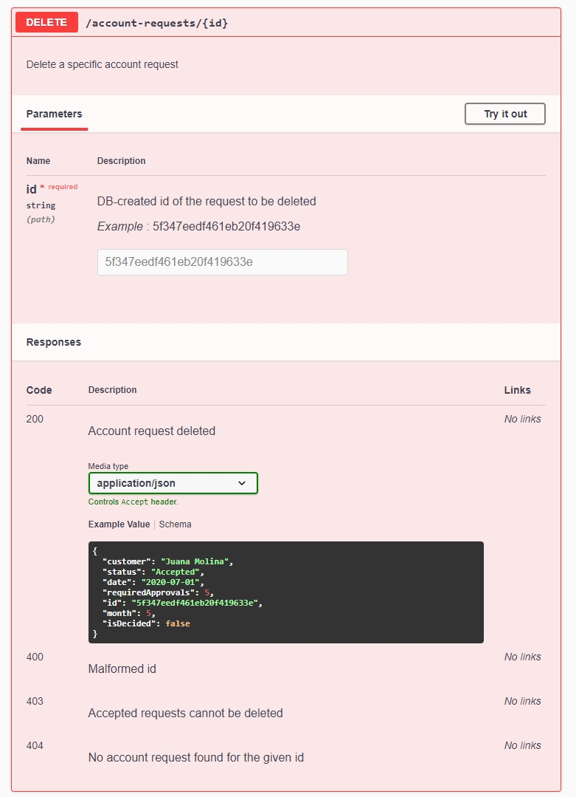

# Swagger en NestJS - más operaciones
En esta página, vamos a avanzar en la documentación Swagger de nuestro servicio.
En concreto, se agregará la información necesaria para que se gener de forma correcta la documentación Swagger para dos nuevos endpoints: un `POST` que permite agregar una solicitud de cuenta, y un `DELETE` que permite eliminarla.  
Esto nos llevará a resolver situaciones que no están presentes en el endpoint `GET` que describimos [anteriormente](./swagger-nestjs-empezamos).


## POST - request body y más de una response
Este es el request handler para el endpoint `POST`.
``` typescript
@Post()
async addAccountApplication(@Body() newRequestData: AccountRequestProposalDTO): Promise<AddResponseDTO> {
    /* ... implementación ... */
}
```

Al contrario de lo que ocurre con el tipo de retorno, NestJS sí toma el tipo del body, no es necesario agregar un decorator `@ApiBody` o similar. Sí hay que verificar que el tipo del body sea una `class` (en contraposición a `interface`), y agregar las decoraciones pertinentes en sus atributos.

Como es habitual, este POST hace validaciones sobre los datos de entrada, y si no se cumplen, sale con un status code distinto a 201. En este caso, sale con un 400 - Bad Request, si: no se define un atributo obligatorio, el formato de la fecha es inválido, o la cantidad de aprobaciones requeridas está fuera de rango.

Por lo tanto, vamos a tener que incorporar dos decoradores, uno para cada respuesta. En lugar de usar `@ApiResponse`, usamos decoradores adicionales que provee NestJS, uno para status code, simplemente para ahorrarnos la definición del atributo `status`. 
En el de `BadRequest`, vamos a usar un poco de [Markdown](./swagger-markdown) para darle formato al texto.

La definición nos queda así.
``` typescript
@ApiOperation({ description: 'Add a single account request having the given data; validations apply' })
@ApiOkResponse({ description: 'Account request added', type: AddResponseDTO })
@ApiBadRequestResponse({ description: 
    [
        '**Invalid data**, e.g.', '- customer not defined', 
        '- invalid date format', '- `requiredApprovals` out of range'
    ].join('\n') 
})
@Post()
async addAccountApplication(@Body() newRequestData: AccountRequestProposalDTO): Promise<AddResponseDTO> {
    /* ... implementación ... */
}
```

Si se agregan los decorators necesarios en `AccountRequestProposalDTO` y `AddResponseDTO`, la documentación de este endpoint queda completa.



### Comentario importante - se pueden evaluar expresiones dentro de la definición de decoradores
Nótese que la descripción del `@ApiBadRequestResponse`, no es un string constante, sino que es una expresión, el `join` de una lista de strings. El valor que va a tomar el decorador es _el resultado_ de esa expresión, que es un string multilínea.  
En general, es sano recordar que los atributos de los decoradores son objetos, y por lo tanto, en los valores se puede incluir cualquier expresión ... que pueda evaluarse cuando arranca la aplicación, claro, p.ej. no se puede confiar en información que sale de la BD. Esto provee cierta flexibilidad, que nos puede ayudar a evitar código repetido dentro de la definición de los decoradores.


## DELETE - path param, varios status code
El request handler para el endpoint `DELETE` tiene esta forma.
``` typescript
@Delete(':id')
async deleteAccountRequest(@Param("id") requestId: string): Promise<AccountRequestDTO> {
    /* ... implementación ... */
}
```

Este endpoint incluye el path param `id`. Para indicar la documentación de estos parámetros, se utiliza el decorator `@ApiParam`.  
También tiene varios posibles status code en la salida: 
- `200 - OK` si la operación se pudo realizar
- `400 - Bad Request` si el id no tiene el formato correcto (hexa de 24 posiciones)
- `404 - Not Found` si el id tiene el formato correcto, pero no corresponde a ninguna solicitud registrada.
- `403 - Forbidden` si el status de la solicitud es `Accepted`, en cuyo caso no se puede eliminar.

Se hace necesario incluir _varios_ decoradores para esta operación. Nos queda esto.
``` typescript
@ApiOperation({ description: 'Delete a specific account request' })
@ApiParam({ 
    name: 'id', description: `DB-created id of the request to be deleted`, 
    type: 'string', example: '5f347eedf461eb20f419633e'
})
@ApiOkResponse({ description: 'Account request deleted', type: AccountRequestDTO })
@ApiBadRequestResponse({ description: 'Malformed id' })
@ApiNotFoundResponse({ description: 'No account request found for the given id' })
@ApiForbiddenResponse({ description: 'Accepted requests cannot be deleted' })
@Delete(':id')
async deleteAccountRequest(@Param("id") requestId: string): Promise<AccountRequestDTO> {
    /* ... implementación ... */
}
```

Pero nos queda una UI bien completa.

