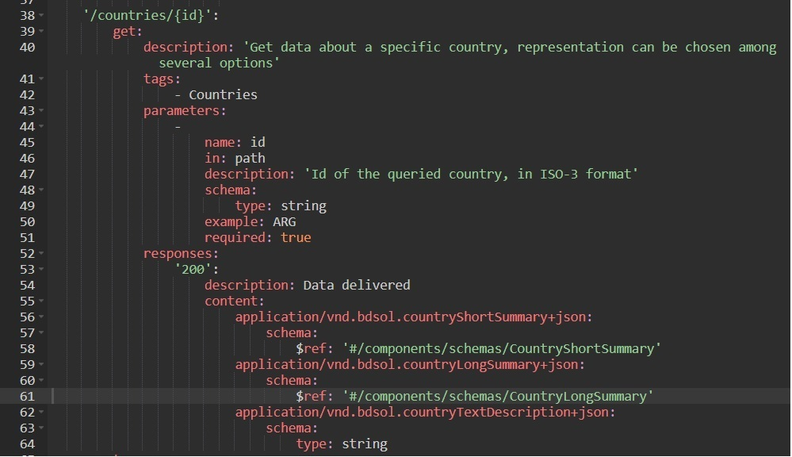

# Swagger en NestJS - saliendo un poco de lo básico
El material incluido en las páginas anteriores incluye (o al menos eso esperamos) los elementos necesarios para completar la documentación Swagger de un microservicio desarrollado usando NestJS, cuya interfaz sea sencilla y sin elementos que salgan de lo usual.

En esta página reseñamos algunos elementos adicionales que pueden ser de utilidad  en situaciones menos habituales, y para organizar el código que debe agregarse en relación a la documentación.


## Opción entre distintas representaciones
Como se indicó al presentar [algunas particularidades de las intefaces API REST](../api-rest/api-rest-varios), en un endpoint (típicamente, un `GET`) se pueden ofrecer distintas representaciones de la información que se brinda en la response; en cada invocación, se puede elegir la representación deseada asignando el valor correspondiente en el header `Accept`.  
Se describió esta característica mediante un endpoint sobre información de países, en el que se da la opción entre tres representaciones: un string, un JSON resumido, y un JSON extendido. 

En la especificación Swagger, esta característica puede describirse con precisión, definiendo varios _media types_ en la respuesta con status code `200 - OK`.


Esto se ve correctamente en la UI, donde aparece un combo para elegir la representación, y se muestran los datos correspondientes a la opción elegida.


Para que NestJS genere esta documentación, debemos cambiar la forma en la que describimos el response. En lugar de usar un `type` y referenciar a la clase que describe la (única) response, definimos directamente un `content`, con el mismo formato del documento Swagger, y teniendo un par de cuidados adicionales.

Mostramos el código, y luego lo comentamos.
``` typescript
    @ApiOperation({ description: 
        'Get data about a specific country, representation can be chosen among several options' 
    })
    @ApiResponse({ 
        status: HttpStatus.OK, description: 'Data delivered', content: { 
            'application/vnd.bdsol.countryShortSummary+json': { 
                schema: { $ref: getSchemaPath(CountryShortSummary) } 
            } ,
            'application/vnd.bdsol.countryLongSummary+json': { 
                schema: { $ref: getSchemaPath(CountryLongSummary) } 
            } ,
            'application/vnd.bdsol.countryTextDescription+json': { 
                schema: { type: 'string' } 
            }
        } })
    @ApiParam({ name: 'countryCode', type: 'string', 
                    description: 'Id of the queried country, in ISO-3 format'})
    @Get(':countryCode')
    async getCountryData(
        @Headers() headers, @Req() request, @Param("countryCode") countryCode: string
    ): Promise<any> {
        /* ... implementación ... */
    }
```

Notar que la definición del `content` en la `@ApiResponse`, tiene la misma estructura que el documento Swagger: varios media types, cada uno con su `schema`, cuyo único elemento es un `$ref`. Para llegar a esto me basé en la correspondencia entre los atributos de los decorators de NestJS y la especificación Swagger.

Hay dos detalles adicionales a tener en cuenta.  
Uno es que al usar un `$ref`, hay que utilizar la función `getSchemaPath` que está en el mismo package que los decorators, esto es, en `@nestjs/swagger`. Ninguna de las dos opciones siguientes funciona
``` typescript
// opción 1, que no funciona
'application/vnd.bdsol.countryShortSummary+json': { type: CountryShortSummary }

// opción 2, que tampoco funciona
'application/vnd.bdsol.countryShortSummary+json': { schema: { type: CountryShortSummary } }
```

El segundo detalle es que como las clases `CountryShortSummary` y `CountryLongSummary` no se están usando directamente como `type`, el soporte de NestJS para Swagger no las detecta automáticamente. Hay que declararlas explícitamente usando el decorator `@ApiExtraModels` _a nivel del controller_. En este ejemplo, queda así:
``` typescript
@ApiTags('Countries')
@ApiExtraModels(CountryLongSummary, CountryShortSummary)
@Controller('countries')
export class CountryDataController {
    /* ... implementación ...*/
}
```


## Componentes compuestos
Esta es una parte de la definición de la clase `CountryLongDescription` en el ejemplo anterior.
``` typescript
export class CountryLongSummary extends CountryBasicDataPlusInternet {
    @ApiProperty({ description: 'ISO-3 code of the country', example: 'ARG', type: 'string' })
    countryCode: string

    @ApiProperty({ description: 'Country name in Spanish', example: 'Argentina', type: 'string' })
    countryName: string

    @ApiProperty({ 
        description: 'Country population as of recent estimate', example: 45200000, type: 'number' 
    })
    population: number

    @ApiProperty({ 
        description: 'Main internet domain assigned to this country', example: '.ar', type: 'string' 
    })
    internetDomain: string

    currency: { code: string, name: string, byUSD: number }

    /* ... otros atributos ...*/
}
```

La pregunta es cómo describir al atributo `currency`, que es compuesto. 
En un documento Swagger, describir un atributo compuesto es sencillo: se le pone `type: object`, y se describen las propiedades.
``` yaml
currency:
    description: Data about the main currency of the country
    type: object
    properties:
        code:
            description: Currency ISO code
            type: string
            example: ARS
        name:
            description: Currency name
            type: string
            example: Peso argentino
        byUSD:
            description: Rate in units for one US Dollar
            type: number
            example: 82.5
```

### Qué hacer en el código TS / NestJS
En el código, podríamos definir una clase aparte para la descripción de la moneda, y referenciarlo en la documentación ... _aunque no se use en el código ejecutable_.
``` typescript
class CurrencyDescription {
    @ApiProperty({ description: 'Currency ISO code', example: 'ARS', type: 'string' })
    code: string
    @ApiProperty({ description: 'Currency name', example: 'Peso argentino', type: 'string' })
    name: string 
    @ApiProperty({ description: 'Rate in units for one US Dollar', example: 82.50, type: 'number' })
    byUSD: number
}

export class CountryLongSummary {
    @ApiProperty({ 
        description: 'Data about the main currency of the country', 
        type: CurrencyDescription
    })
    currency: { code: string, name: string, byUSD: number }

    /* ... el resto de los atributos ...*/
}
```

Esto genera un doc Swagger correcto, y que se ve bien en la UI, pero que no es exactamente como lo que describimos recién, sino algo así.
``` yaml
currency:
    allOf
        - 
            "$ref": "#/components/schemas/CurrencyDescription"
        - 
            "description": "Data about the main currency of the country"
```
donde el `CurrencyDescription` se incluye entre los `components\schemas`.

> **Detalle sobre Swagger**  
> El `allOf` es necesario porque `$ref` no puede estar acompañado por otra propiedad, se hace la unión con otra representación que en realidad está vacía, incluye solamente la descripción.

Podemos lograr que genere **el mismo** documento Swagger descripto más arriba, repitiendo la estructura de Swagger en la definición del `@ApiProperty`.

``` typescript
export class CountryLongSummary {
    @ApiProperty({ 
        description: 'Data about the main currency of the country', 
        properties: { 
            code: {description: 'Currency ISO code', example: 'ARS', type: 'string' },
            name: { description: 'Currency name', example: 'Peso argentino', type: 'string' },
            byUSD: { description: 'Rate in units for one US Dollar', example: 82.50, type: 'number' }
        }
    })
    currency: { code: string, name: string, byUSD: number }

    /* ... el resto de los atributos ...*/
}
```

NestJS deduce que el tipo Swagger del atributo es `object`.

Esta variante de descripción puede utilizarse si por alguna razón se prefiere, o se necesita, evitar la transformación de `interface` a `class` necesaria para poder decorar el tipo de un body o de respuesta.


## Definir constantes y funciones para los elementos que se repiten
Puede haber descripciones de atributos o respuestas, que se repitan entre distintos endpoints. P.ej. en muchos endpoints de países se repite un path param `countryCode`, la descripción es siempre la misma.
``` typescript
@ApiParam({ name: 'countryCode', type: 'string', 
                description: 'Id of the queried country, in ISO-3 format'})
```

Hay que repetir esta definición en cada endpoint. 
Como destacamos previamente al armar una [descripción multilínea usando Markdown](./swagger-nestjs-mas-operaciones), los parámetros de un decorator son código TS, no están restringidos a literales. 

En este caso, podemos definir una constante con la estructura completa del parámetro, y utilizarla en la definición del parámetro en cada endpoint.
``` typescript
const countryCodeDescription = { 
    name: 'countryCode', type: 'string', 
    description: 'Id of the queried country, in ISO-3 format'
}

// en cada endpoint
@ApiParam(countryCodeDescription)

// si quiero cambiar la descripción
@ApiParam({...countryCodeDescription, description: 'Id of the country to be deleted, in ISO-3 format'})
```

Supongamos un escenario ligeramente más complejo: el parámetro se repite, pero se le quiere dar una descripción ligeramente distinta dependiendo del endpoint, p.ej. 
- `Id of the queried country, in ISO-3 format`
- `Id of the country to be deleted, in ISO-3 format`
- `Id of the desired country, in ISO-3 format`
- etc.

Las descripciones parecen ser todas de la forma  
`Id of the <parte_variable>, in ISO-3 format`

Si este es el caso, podemos definir una **función** que construya la descripción, tomando como parámetro la parte variable del mensaje.

``` typescript
function countryCodeDescription(variableText: string = 'queried country') { 
    return { 
        name: 'countryCode', type: 'string', 
        description: 'Id of the ${variableText}, in ISO-3 format'
    } 
}

// en un endpoint con la descripción standard
@ApiParam(countryCodeDescription())

// en un endpoint con el texto variable distinto
@ApiParam(countryCodeDescription('country to be deleted'))
```


## Más elementos del soporte de NestJS para Swagger
El soporte de NestJS para Swagger incluye algunos elementos que no hemos descripto, y que podrían ser útiles. Destacamos tres, todos se describen en la [página sobre Swagger de doc de NestJS versión 6](https://docs.nestjs.com/v6/recipes/swagger).

Uno es la posibilidad de que NestJS infiera automáticamente los tipos de respuesta y parámetros a partir del código, haciendo innecesarios los decorators. Ver la sección "Plugin" en la doc de NestJS.

El segundo elmento a mencionar, es el soporte para endpoints cuyo body es un archivo del que se hace upload. Ver la sección "File upload" en la doc de NestJS.

Finalmente, mencionamos que para microservicios extensos, se le puede solicitar a NestJS que divida la doc Swagger en distintos sitios, cada uno con parte de la documentación. Esto se describe en la sección "Multiple specifications" en la doc de NestJS.