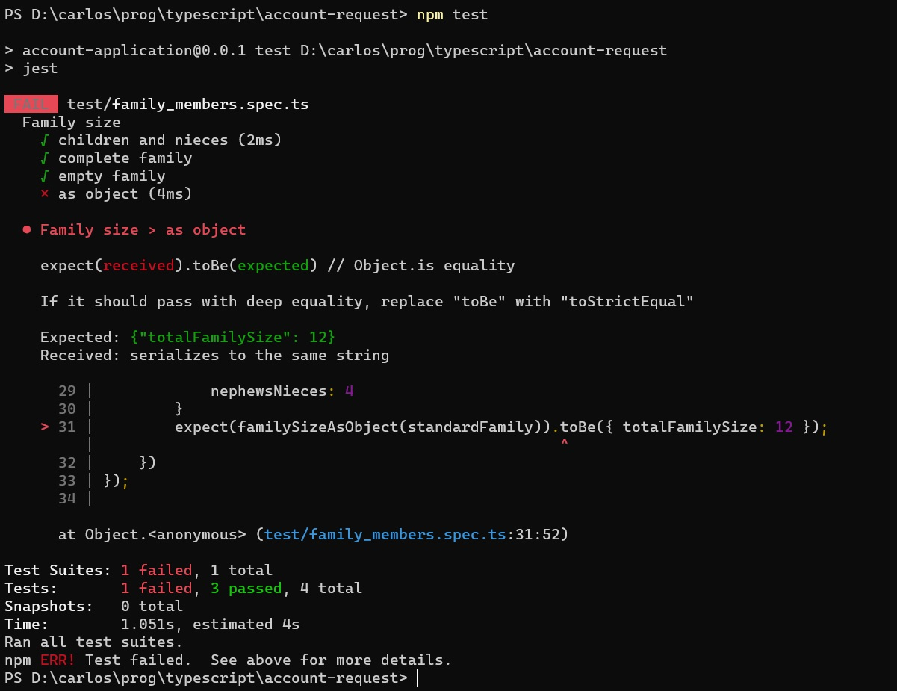

# Más sobre el testeo de una función sencilla
Transcribimos la función `familySize`, a la que le hicimos un primer test en la [página anterior](./un-test-chiquito).

``` typescript
import { defaultTo } from 'lodash';

export interface FamilyMembers {
    children?: number,
    nephewsNieces?: number,
    cousins?: number
}
export function familySize(family: FamilyMembers): number {
    return defaultTo(family.children, 0) + defaultTo(family.nephewsNieces, 0) 
}
```

Armamos un primer test, que dio verde.
``` typescript
describe('Family size', () => {
    it('children and nieces', () => {
        const standardFamily: FamilyMembers = {
            children: 8,
            nephewsNieces: 4
        }
        expect(familySize(standardFamily)).toBe(12);
    });
});
``` 


## Mejorando el nivel de test
¿Ya está, puedo estar tranquilo que la implementación es correcta?  
En rigor, _sabemos_ que al código le falta algo, o sea, que _no_ es correcto.  
Entonces ¿cómo es que el test da verde si en el código hay un error?

Lo que está pasando es la función tiene el comportamiento esperado _en el caso que probamos_. Para estar más tranquilos respecto de nuestra función, puede convenir _armar más tests_ que correspondan a casos distintos.

Algunas (tal vez muchas) veces, para armar tests, conviene pensar en _casos límite_. Para esta función, que trabaja sobre un objeto en el que cada atributo es opcional, se podría pensar que los "casos límite" son:
- todos los atributos están definidos.
- ningún atributo está definido.

Tenemos dos casos nuevos, el que tenemos lo queremos conservar. Tres casos, corresponde armar tres tests.

``` typescript
describe('Family size', () => {
    it('children and nieces', () => {
        const standardFamily: FamilyMembers = {
            children: 8,
            nephewsNieces: 4
        };
        expect(familySize(standardFamily)).toBe(12);
    });

    it('complete family', () => {
        const completeFamily: FamilyMembers = {
            children: 8,
            nephewsNieces: 4,
            cousins: 7
        };
        expect(familySize(completeFamily)).toBe(19);
    });

    it('empty family', () => {
        const emptyFamily: FamilyMembers = {};
        expect(familySize(emptyFamily)).toBe(0);
    });
});
``` 

Ahora tenemos una test suite, que está compuesta por tres tests. A ver qué pasa.


De los tres tests, falló uno. El reporte nos da bastante información.
- qué tests se ejecutaron. Acá se ve bien la indentación de test suite a tests individuales.
- Cuáles anduvieron OK, cuáles fallaron. Esto se ve en los tildes y las cruces.
- exactamente, cuál fue la verificación que falló: la del resultado de `familySize(completeFamily)`.
- Un poco más arriba, los valores **esperado** (lo que nosotros decimos que tiene que ser el resultado) y **recibido** (el resultado de la función como está programada).
- un resumen al final.


## Qué hacer ante un test rojo
Un test que no da verde es una señal de algo incorrecto ... que puede estar, o bien en el test, o bien en el componente que estamos testeando.  
Aclaramos esto porque hay que revisar _las dos_ cosas, programa y test. Es probable que se haya armado incorrectamente el caso de test, o que se haya calculado mal el resultado esperado. 

En este caso, los tests son correctos, el problema está en la función. La arreglamos.
``` typescript
export function familySize(family: FamilyMembers): number {
    return defaultTo(family.children, 0) + defaultTo(family.nephewsNieces, 0) 
        + defaultTo(family.cousins, 0)
}
``` 
Probamos de nuevo.


Perfecto, un caso "de manual": los tests ayudaron a encontrar un problema en el código.


## _Atención_ al comparar objetos
Hasta ahora, el resultado esperado siempre fue un número. Para verificar objetos más complejos, hay que tener un pequeño cuidado, que veremos con un ejemplo: un test sobre esta función.

``` typescript
export function familySizeAsObject(family: FamilyMembers): FamilySize {
    return { totalFamilySize: familySize(family) }
}
```
el algoritmo es el mismo, cambia el formato en que se brinda la información.

Un test sobre esta función debería ser muy similar a los que venimos haciendo
``` typescript
it('as object', () => {
    const standardFamily: FamilyMembers = {
        children: 8,
        nephewsNieces: 4
    }
    expect(familySizeAsObject(standardFamily)).toBe({ totalFamilySize: 12 });
});
```
Veamos qué pasa si agregamos este test en la misma suite que los anteriores.



Por qué falla: porque la verificación `toBe` chequea que los resultados obtenido y esperado sean **el mismo** objeto. No que sean iguales, que sea _el mismo_. Dicho rapidísimamente, que ocupen "el mismo lugar en la memoria".  
El objeto que devuelve la función `familySizeAsObject`, _no puede_ ser el mismo que el que está como literal en el código del test; pensar p.ej. en cuándo se crea cada uno.

Este criterio es el que se valida usando `===`, que es _casi_ lo mismo que `Object.is` (ver aclaración abajo). Esto le da sentido a la aclaración `// Object.is equality` en la respuesta de Jest.

Después aclara que si lo que queremos es verificar que los objetos (esperado y recibido) son iguales, aunque no necesariamente sean _el mismo_, entonces conviene usar la verificación `toStrictEqual` en lugar de `toBe`.

Yo suelo usar una variante aún más flexible que es `toEqual`.
``` typescript
it('as object', () => {
    const standardFamily: FamilyMembers = {
        children: 8,
        nephewsNieces: 4
    }
    expect(familySizeAsObject(standardFamily)).toEqual({ totalFamilySize: 12 });
});
```
Este test sí pasa.

> **Nota "teórica"**  
> Este es el fenómeno que se describe al hablar de "igualdad e identidad de objetos", [este artículo](http://adripofjavascript.com/blog/drips/object-equality-in-javascript.html) habla sobre este tema con ejemplos en JS.  
> Aunque auch, en el mundo JS, "equality" se usa con un sentido distinto, relacionado con diferencias sutiles entre `===` y `Object.is`, ver [la referencia en MDN](https://developer.mozilla.org/en-US/docs/Web/JavaScript/Equality_comparisons_and_sameness).


## Un poco de ejercitación
Ver en la [documentación de Jest](https://jestjs.io/docs/en/api) cómo hacer para que se ejecute solamente uno de los tests, o se "saltee" un test.

Separar el test de la función que devuelve un objeto en una suite aparte, para practicar un poco cómo se ve una ejecución con varios test suites. También puede indicarse que solamente se ejecute una suite, o se saltee una suite.

Para les curioses acerca de `toBe` vs `toEqual`: para esta función JS
``` javascript
function makeObj(x) {
  return {a: x}
}
```
evaluar
```
makeObj(5) === makeObj(5)
```
e interpretar el resultado.


