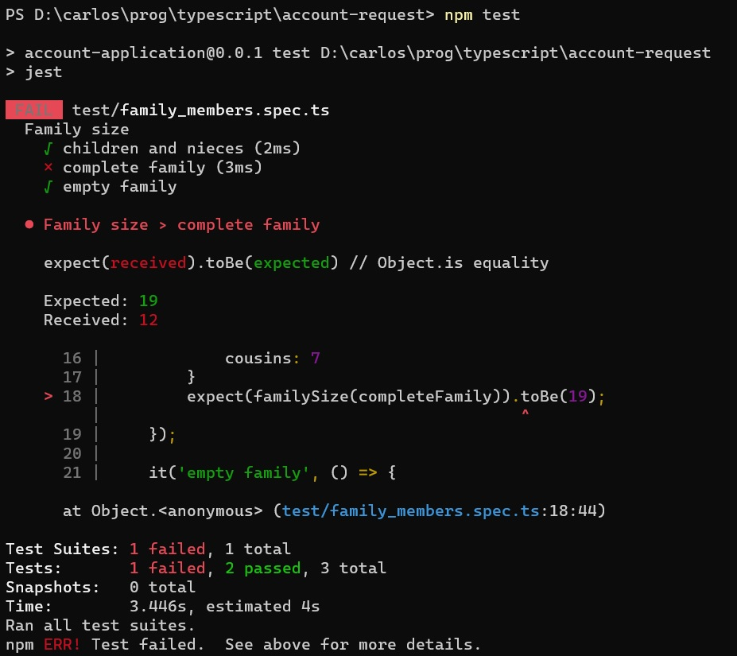
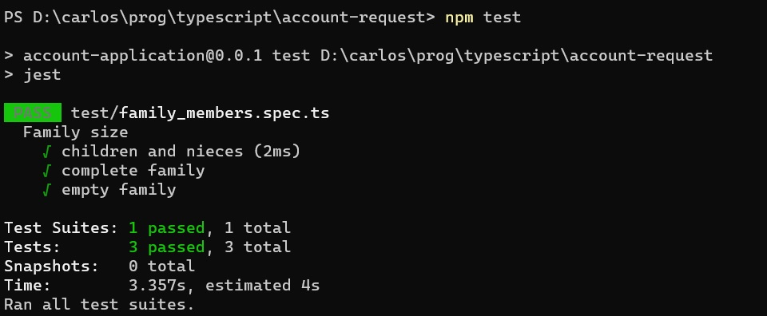

# Más sobre el testeo de una función sencilla
Transcribimos la función `familySize`, a la que le hicimos un primer test en la [página anterior](./un-test-chiquito.md).

``` typescript
import { defaultTo } from 'lodash';

export interface FamilyMembers {
    children?: number,
    nephewsNieces?: number,
    cousins?: number
}
export function familySize(family: FamilyMembers): number {
    return defaultTo(family.children, 0) + defaultTo(family.nephewsNieces, 0) 
}
```

Armamos un primer test, que dio verde.
``` typescript
describe('Family size', () => {
    it('children and nieces', () => {
        const standardFamily: FamilyMembers = {
            children: 8,
            nephewsNieces: 4
        }
        expect(familySize(standardFamily)).toBe(12);
    });
});
``` 


## Mejorando el nivel de test
¿Ya está, puedo estar tranquilo que la implementación es correcta?  
En rigor, _sabemos_ que al código le falta algo, o sea, que _no_ es correcto.  
Entonces ¿cómo es que el test da verde si en el código hay un error?

Lo que está pasando es la función tiene el comportamiento esperado _en el caso que probamos_. Para estar más tranquilos respecto de nuestra función, puede convenir _armar más tests_ que correspondan a casos distintos.

Algunas (tal vez muchas) veces, para armar tests, conviene pensar en _casos límite_. Para esta función, que trabaja sobre un objeto en el que cada atributo es opcional, se podría pensar que los "casos límite" son:
- todos los atributos están definidos.
- ningún atributo está definido.

Tenemos dos casos nuevos, el que tenemos lo queremos conservar. Tres casos, corresponde armar tres tests.

``` typescript
describe('Family size', () => {
    it('children and nieces', () => {
        const standardFamily: FamilyMembers = {
            children: 8,
            nephewsNieces: 4
        };
        expect(familySize(standardFamily)).toBe(12);
    });

    it('complete family', () => {
        const completeFamily: FamilyMembers = {
            children: 8,
            nephewsNieces: 4,
            cousins: 7
        };
        expect(familySize(completeFamily)).toBe(19);
    });

    it('empty family', () => {
        const emptyFamily: FamilyMembers = {};
        expect(familySize(emptyFamily)).toBe(0);
    });
});
``` 

Ahora tenemos una test suite, que está compuesta por tres tests. A ver qué pasa.



De los tres tests, falló uno. El reporte nos da bastante información.
- qué tests se ejecutaron. Acá se ve bien la indentación de test suite a tests individuales.
- Cuáles anduvieron OK, cuáles fallaron. Esto se ve en los tildes y las cruces.
- exactamente, cuál fue la verificación que falló: la del resultado de `familySize(completeFamily)`.
- Un poco más arriba, los valores **esperado** (lo que nosotros decimos que tiene que ser el resultado) y **recibido** (el resultado de la función como está programada).
- un resumen al final.


## Qué hacer ante un test rojo
Un test que no da verde es una señal de algo incorrecto ... que puede estar, o bien en el test, o bien en el componente que estamos testeando.  
Aclaramos esto porque hay que revisar _las dos_ cosas, programa y test. Es probable que se haya armado incorrectamente el caso de test, o que se haya calculado mal el resultado esperado. 

En este caso, los tests son correctos, el problema está en la función. La arreglamos.
``` typescript
export function familySize(family: FamilyMembers): number {
    return defaultTo(family.children, 0) + defaultTo(family.nephewsNieces, 0) 
        + defaultTo(family.cousins, 0)
}
``` 
Probamos de nuevo.



Perfecto, un caso "de manual": los tests ayudaron a encontrar un problema en el código.


## Un poco de ejercitación
Ver en la [documentación de Jest](https://jestjs.io/docs/en/api) cómo hacer para que se ejecute solamente uno de los tests, o se "saltee" un test.

