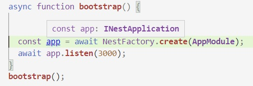

# Test de middleware - end-to-end test
Ya hicimos varios tests de endpoints de controller, [primero sobre un endpoint sencillo](./un-test-de-controller-nest), después [otro que involucra listas](./testeando-listas).

En esta página, vamos a hacer un test que apunta a los elementos de [middleware](../nestjs-basics/middleware-intro) que permite definir NestJS.  
En este caso vamos a testear un [guard](../nestjs-basics/guards), pero la misma técnica aplica a los otros tipos de middleware.


## A qué nivel testear
Los tests que armamos hasta ahora se basan en la invocación "manual" de request handlers.  
O sea: se obtiene una referencia a un controller, y se invoca a un método del controller elegido que es un request handler, con los mismos parámetros que le enviaría NestJS cuando lo activa ante un request HTTP.

Esta estrategia es adecuada para desarrollar _tests de controllers_, esto es, tests que apuntan a verificar el correcto funcionamiento de las transformaciones e integraciones implementadas en los controllers.  
Como veremos, una estrategia similar puede ser útil para desarrollar _tests de providers_, en este caso utilizaríamos los providers reales que querramos testear en lugar de mockearlos.

Por otro lado, un test que invoca directamente a un método en un controller, no sirve para testear middleware, porque la ejecución de middleware está controlada por el framework Nest. Por más que se incluyan decorators en un controller, p.ej. 
``` typescript
@Controller('countries')
@UseGuards(ForbidDangerousCountries)
export class MockCountryDataController {
    // request handlers y métodos internos
}
``` 
si el test tiene esta forma
``` typescript
const theController = testModule.get(CountryDataController);
const theData = await theController.getCountryData("SHR")
``` 
los middleware declarados (en este caso, el guard `ForbidDangerousCountries`) _no_ se van a activar al ejecutarlo.

Para testear middleware, hay que ir "más arriba", lograr una forma de ejecución en la que se logre que NestJS active los middleware definidos para cada request handler.  


## End-to-end test
Con el objetivo que mencionamos recién, vamos a implementar un test _end-to-end_, o sea, vamos a 
- _levantar una aplicación Nest completa_ (como la que se crea en el `main.ts`), incorporando algunos elementos del soporte para test de NestJS, y 
- _simular un request HTTP_, aquí es donde actúa el package [Supertest](https://github.com/visionmedia/supertest).

De esta forma, va a ser el framework Nest quien va a atender el request, y por lo tanto, los elementos de middleware que estén configurados se van a activar.


## Qué vamos a testear
Antes de arrancar con la construcción del test, veamos qué tenemos que testear. Se trata de un guard que rechaza algunos códigos de países, similar a uno de los ejemplos que usamos para presentar guards.
``` typescript
const dangerousCountries = ["CHN", "AUT"]

@Injectable()
export class ForbidDangerousCountries implements CanActivate {
    canActivate(context: ExecutionContext): boolean {
        const request = context.switchToHttp().getRequest();
        const country = request.params.countryCode;
        const isDangerousCountry = dangerousCountries.includes(country);
        if (isDangerousCountry) {
            throw new NotAcceptableException('This country is really very bad!!');
        }
        return true
    }
}
```

Vamos a plantear dos tests para un request que incluya este guard, uno en el que debe rechazar al país, otro en el que no. Se verificará el status code obtenido en cada caso.


## Una aplicación Nest para testear un middleware
La parte de Nest es muy sencilla: a un `TestingModule` se le puede pedir `createNestApplication()`, eso devuelve un objeto que cumple con la interface `INestApplication`, que es la misma del objeto que representa a una app Nest "real".



O sea, en el código de configuración, una vez creado el `TestingModule`, alcanza con hacer lo siguiente.
``` typescript
let app: INestApplication;
app = testModule.createNestApplication();
await app.init();
``` 

**Atención**  
Hay que acordarse, al terminar el test, de cerrar la app.
``` typescript
await app.close();
``` 


### Qué _controller_ usar
Como los tests apuntan al código _en el middleware_, **el comportamiento del controller es irrelevante**.  
Lo único necesario es que _haya_ un controller que defina un request handler que aplique al request que vamos a simular. Ese request handler debe incorporar el guard que queremos probar.

Teniendo esto en cuenta, vamos a construir un _mock de controller_, o sea un controller sólo-para-test, que no requiera de ningún provider. Le vamos a poner un solo request handler, el del endpoint que vamos a usar en el test.

Este es un posible mock de controller apto para testear nuestro guard.
``` typescript
@Controller('mock-countries')
@UseGuards(ForbidDangerousCountries)
class MockCountryDataController {
    @Get(':countryCode')
    async getCountryData(@Param("countryCode") countryCode: string): Promise<{ countryCode: string }> {
        return { countryCode };
    }
}
``` 

El módulo-para-test lo vamos a configurar con este controller, y sin providers.
``` typescript
const testModule: TestingModule = await Test.createTestingModule({
    controllers: [MockCountryDataController]
}).compile();
``` 


## La estructura de la test suite
Veamos cómo nos va quedando la test suite
``` typescript
describe('ForbidDangerousCountries guard', () => {
    let app: INestApplication;

    beforeAll(async () => {
        const testModule: TestingModule = await Test.createTestingModule({
            controllers: [MockCountryDataController]
        }).compile();

        app = testModule.createNestApplication();
        await app.init();
    });

    afterAll(async () => {
        await app.close();
    })

    // acá van los tests
});
``` 
En el `beforeAll` configuramos la aplicación-para-test y la inicializamos. Agregamos el análogo `afterAll` para que haga el `close` de la aplicación luego de ejecutar todos los tests.


## Simulación de un request HTTP usando SuperTest
En cada test vamos a simular un request. Para esto tenemos que importar el package SuperTest.
``` typescript
import * as supertest from 'supertest';
``` 

La idea de SuperTest es proveer una interface para la ejecución de requests HTTP, similar a la del package [Superagent](https://github.com/visionmedia/superagent), pero donde los requests los atiende un HTTP server local. 
Superagent es una alternativa a [Axios](https://github.com/axios/axios).


La simulación de un request es muy sencilla, describámosla a partir de un ejemplo.
``` typescript
it('does apply', async () => {
    // creamos una instancia de supertest ligada a la app-para-test de Nest
    const testHttpExecutor = supertest(app.getHttpServer());

    // hacemos un request normalmente.
    const response = await testHttpExecutor.get('/mock-countries/CHN');

    // a partir de este punto, podemos hacer afirmaciones sobre la response,
    // usando todos los matches que proveen Jest y jest-extended
    expect(response.status).toBe(HttpStatus.NOT_ACCEPTABLE);
});
``` 

Listo, eso es todo. Puede leerse algo más sobre el uso de SuperTest con Jest en [este post](https://zellwk.com/blog/endpoint-testing/), donde no se usa NestJS.


### Alternativa - aclaración
En los ejemplos de test end-to-end incluidos en la [doc de NestJS](https://docs.nestjs.com/fundamentals/testing), se usan métodos que provee _SuperTest_ para hacer las afirmaciones. El mismo test que mostramos arriba, quedaría así.
``` typescript
it('does apply', async () => {
    const testHttpExecutor = supertest(app.getHttpServer());
    return testHttpExecutor.get('/mock-countries/CHN').expect(HttpStatus.NOT_ACCEPTABLE);
});
``` 
El `return` es necesario porque Jest parece procesar este resultado para definir si el test fue exitoso o falló.

Aunque usando las afirmaciones de SuperTest más corto, prefiero el método que sugiero más arriba por varias razones
1. Quedan todos los tests parecidos.
1. No se corre el riesgo de olvidarse el `return`.
1. La forma en que se muestran los errores da menos información en el manejo que hace SuperTest.
1. Para validar el body, SuperTest sólo permite una validación del body completo, análoga al matcher `toEqual`. Usando las afirmaciones de Jest, tenemos acceso a todos los matchers.


## ¿Será cierto todo esto?
Hay que probar.  

En principio, armar el test indicado en esta página, hacerlo andar.  No es necesario incorporar el package SuperTest, esto lo hace NestJS al crear un proyecto.

Después, agregar un test de un caso en que el guard no se active. 
Notar que se está repitiendo la definición de `testHttpExecutor`, subirla al `beforeAll`.

### Para seguir practicando
Se pueden desarrollar tests de algunos de los middleware descriptos en la presentación de Nest. Van algunas sugerencias
- el guard que controla que haya un header `userId`. Ver en la [doc de superagent](http://visionmedia.github.io/superagent/) cómo mandar valores de header.
- el interceptor que agrega timestamp y un saludito.

La estrategia definida en esta página también puede servir para testear [exception handlers](../nestjs-basics/manejo-de-errores). Se puede probar con alguno a elección.

En cada caso, incorporar primero el middleware elegido a la aplicación donde se están armando los tests, probar que anda, y después armar el test.


### Otro proyectito
Podríamos incorporar el interceptor que agrega la suma de la población de cada país, que definimos [al presentar interceptores](../nestjs-basics/interceptors), al endpoint que obtiene los datos de los países vecinos de un país, y armar un test del mismo.  
Pero sería interesante agregarle al interceptor, la posibilidad de setearle un nombre de atributo, en este caso va a asumir que la lista de información de países va a estar en ese atributo, en lugar de ser toda la respuesta.  
De esta forma, podemos modificar el endpoint de países vecinos, para que la response tenga tres atributos: `country` (datos del país del que se pidieron los vecinos), `neighbors` (lo que ahora es la respuesta), `notFoundNeighborCodes` (los códigos de vecinos para los que no se encontró información). El interceptor aplica al atributo `neighbors`.  
Creo que esto mejora la interface de nuestro servicio de información de países.

