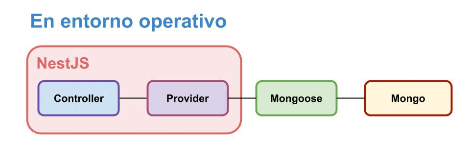
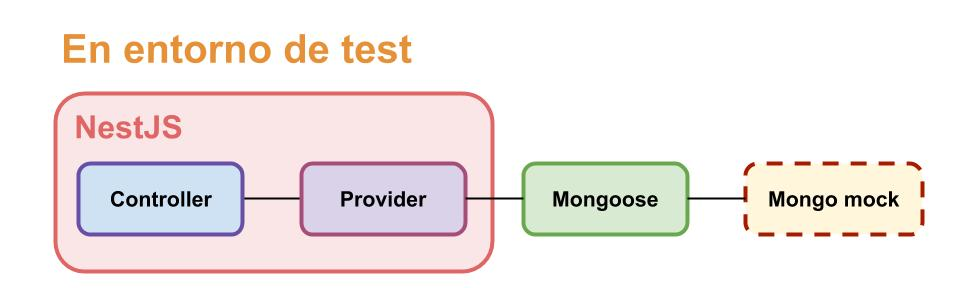

# Test de providers - mockeando Mongo
En secciones anteriores, definimos tests que apuntan a la lógica implementada en _controllers_ y _middleware_.  
En esta página, vamos a plantear tests que se focalicen en el código de los **providers**.

En particular, vamos a desarrollar tests para un provider que accede a un BD Mongo mediante Mongoose. 
Para lograr tests aislados (o sea, que no dependan del contenido que tenga una BD) y rápidos (o sea, que no tengan que crear una BD cada vez que se ejecutan), vamos a utilizar un _mock de MongoDB_.

En concreto, vamos a incorporar el package [MongoDB In-Memory Server](https://github.com/nodkz/mongodb-memory-server), que permite definir una base Mongo que reside en memoria, y que por lo tanto es volátil (además de muy rápida).  
Esta estrategia permite que en los tests se verifique, no solamente la lógica que se aplica a partir del resultado de un query, sino también la forma en que se define el query, y también las definiciones de esquemas de Mongoose.  
Destacamos que se está ejecutando el mismo código de Mongoose que en producción, solamente reorientándolo a una base en memoria, que tiene la misma interface que una base MongoDB "normal".


## El provider a testear
Para este test, vamos a cambiar de dominio: vamos a trabajar con un módulo sobre solicitudes de cuentas (`AccountRequest`).  
Este módulo se apoya en una colección de Mongo, a la que se accede mediante Mongoose. Se utiliza el soporte para Mongoose que provee Nest, descripto en una [sección anterior](../mongoose-nest/mongoose-en-nest.md). El dominio es muy similar al que utilizamos en esa sección.

### El modelo de datos
Esta es la definición del esquema Mongoose para las solicitudes de datos.
``` typescript
export const AccountRequestSchema = new mongoose.Schema({
    customer: { type: String, required: true },
    status: { type: String, enum: Object.values(Status) },
    date: Number,
    requiredApprovals: { type: Number, default: 3 }
})

AccountRequestSchema.virtual('isDecided').get(
    function(): boolean { return ['Accepted', 'Rejected'].includes(this.status) }
);

AccountRequestSchema.method({
    hasDate: function(): boolean { return !!(this.date && this.date != 0) },
    month: function(): number | undefined {
        return this.hasDate() ? moment(this.date).utc().month() + 1 : undefined 
    },
})
```
Observamos que hay datos que residen en la base, y otros calculados mediante definiciones agregadas en el esquema.

### El provider
El provider define dos métodos. 
Uno permite acceder a las solicitudes registradas, pudiendo filtrar por cliente y/o status.
El otro permite agregar una solicitud.
``` typescript
@Injectable()
export class AccountRequestService {
    constructor(@InjectModel('AccountRequest') private accountRequestModel: Model<AccountRequestMongoose>) {}

    async getAccountRequests(conditions: AccountRequestFilterConditions): Promise<AccountRequest[]> {
        // implementación
    }

    async addAccountRequest(req: AccountRequestProposal): Promise<string> {
        // implementación, devuelve el id del nuevo AccountRequest
    }
}
```

Se utilizan estas interfaces.
``` typescript
export interface AccountRequestProposal {
    customer: string,
    status: Status,
    date: moment.Moment, 
    requiredApprovals: number
}

export interface AccountRequest extends AccountRequestProposal {
    id: string,
    month: number, 
    isDecided: boolean
}

export interface AccountRequestFilterConditions {
    customer?: string,
    status?: string
}
```
Una `AccountRequestProposal` incluye los datos necesarios para registrar una nueva solicitud, una `AccountRequest` incluye todos los datos asociados a una solicitud.

En ambos casos, el provider hace las transformaciones necesarias entre "sus" interfaces, y el formato definido en el esquema Mongoose.


### El controller
El controller define dos endpoints, que se corresponden con las dos operaciones del provider.
``` typescript
@Controller('account-requests')
export class AccountRequestController {
    constructor(private readonly service: AccountRequestService) { }

    @Get()
    async getAccountRequests(@Query() conditions: AccountRequestFilterConditions): Promise<AccountRequestDTO[]> {
        // implementacion
    }

    @Post()
    async addAccountApplication(@Body() newRequestData: AccountRequestProposalDTO): Promise<AddResponseDTO> {
        // implementacion
    }
}
```
donde se utilizan estas interfaces.

``` typescript
export interface AccountRequestProposalDTO {
    customer: string,
    status: string,
    date: string,
    requiredApprovals: number
}

export interface AccountRequestDTO extends AccountRequestProposalDTO {
    id: string,
    month: number,
    isDecided: boolean
}

export interface AddResponseDTO {
    id: string
}
```

La única responsabilidad propia del controller es realizar las transformaciones entre las interfaces DTO y las que maneja el provider.

### Antes de seguir
Tener andando el módulo de solicitudes de cuenta de acuerdo a lo que se describe en esta página. 


## Estrategia - mock de la base
Los tests apuntan a verificar el código incluido en los métodos del provider. 
Este código tiene dos responsabilidades: acceder a la base mediante Mongoose, y realizar las transformaciones de datos de acuerdo a su interface.

Como lo indicamos al principio, los tests que definamos van a activar una base MongoDB que va a trabajar en memoria, utilizando el package [MongoDB In-Memory Server](https://github.com/nodkz/mongodb-memory-server).  
Para utilizar este package, se le solicita que cree una base Mongo en memoria; esta base soporta _las mismas operaciones_ que una base Mongo "real" de modificaciones y búsquedas sobre una colección.  
Una vez creada la "base virtual", puede obtenerse una URI para acceder a la misma.
``` typescript
import { MongoMemoryServer } from 'mongodb-memory-server';

const mongoServer = new MongoMemoryServer();
const memoryMongoUri = await mongoServer.getConnectionString();
```
Esta URI puede ser utilizada para configurar Mongoose. Si utilizamos Mongoose mediante el soporte de NestJS, podemos configurar el `MongooseModule` de esta forma.
``` typescript
MongooseModule.forRoot(
    memoryMongoUri, { useNewUrlParser: true, useUnifiedTopology: true }
)
```
Al final (en nuestro caso, en el `afterAll`) hay que detener el server Mongo.
``` typescript
await mongoServer.stop();
```

Destacamos (nuevamente) que se está utilizando la versión **operativa** de Mongoose, que ejecutará operaciones sobre la base Mongo de la que se indica la URI en la configuración. La única diferencia de la operación en los tests, es que la base Mongo a la que accede Mongoose es "virtual". Pero de esto, Mongoose ni se entera.  
El código del provider, y eventualmente del controller, también son los operativos.

Los siguientes esquemas muestran los elementos involucrados en un entorno operativo y en la ejecución de test. 




Se observa que el único que cambia es la BD Mongo. Esta estrategia maximiza el código operativo que interviene en los tests.


> **Nota**  
> En la documentación del package `mongodb-memory-server`, se aclara que realiza una instalación **completa** de MongoDB en `./node_modules`.  
> Si se va a utilizar `mongodb-memory-server` en varios proyectos, tal vez convenga instalarlo de forma tal que realice una única instalación "propia" de MongoDB. Para esto, hay que instalar una variante de `mongodb-memory-server`, p.ej. `mongodb-memory-server-core`.  
Los detalles se pueden consultar en la [doc del package](https://github.com/nodkz/mongodb-memory-server).


### La base está vacía
Al utilizar esta estrategia, cada test se ejecutará contra una base de datos que en principio está vacía. 
Si el funcionamiento de un test depende de la existencia de ciertos datos en la base, entonces estos datos deben agregarse como parte de la configuración del escenario de test, que describimos [al armar nuestro primer test](./un-test-chiquito.md). Este es el caso para uno de los tests que vamos a armar a continuación.


### Una alternativa - mockear Mongoose
Una estrategia alternativa para armar un test de provider es mockear Mongoose.  
Esto quiere decir, reemplazar Mongoose por un mock al cual se le indica explícitamente qué debe responder ante cada consulta, tal como hicimos con el mock de servicio en los tests de provider.  
La librería [Mockingoose](https://github.com/alonronin/mockingoose) hace exactamente esto.

Como punto a favor (en nuestra opinión) de la estrategia de mockear Mongo, mencionamos que permite verificar que la interacción con la base de datos funciona correctamente, p.ej. que se están manejando adecuadamente los filtros en una consulta, o que los endpoints que agregan, modifican y/o eliminan documentos, efectivamente realizan las modificaciones esperadas en la base de datos; sin necesidad de implementar estrategias sofisticadas de mock (que p.ej. al agregarse un documento, lo registren en alguna lista que luego se tiene en cuenta en las consultas).

Como punto a favor de mockear Mongoose, se puede señalar que en algunos casos se simplifica la configuración del escenario de prueba: definir directamente el resultado de los queries puede ser más sencillo que agregar documentos en una base. 


## Estructura de la suite
La suite tiene la misma estructura descripta en los [tests de middleware](./test-de-middleware.md), agregando los elementos necesarios para que el módulo real interactúe con la base mock de Mongo.  
``` typescript
describe('Account request service', () => {
    let testApp: INestApplication;
    let mongoServer: MongoMemoryServer;

    beforeAll(async () => {
        mongoServer = new MongoMemoryServer();
        const memoryMongoUri = await mongoServer.getConnectionString();

        const testAppModule = await Test.createTestingModule({
            imports: [
                AccountRequestModule,
                MongooseModule.forRoot(
                    memoryMongoUri, { useNewUrlParser: true, useUnifiedTopology: true }
                )
            ]
        }).compile();

        testApp = testAppModule.createNestApplication();
        await testApp.init();
    });

    afterAll(async () => {
        await testApp.close();
        await mongoServer.stop();
    });
});
```
O sea: el `TestingModule` importa el `MongooseModule` configurado con la URI del mock de la base Mongo, y directamente importa el módulo real sin mockear nada.

Como lo hicimos en varios tests anteriores, mediante el `testAppModule` podemos obtener la instancia de controller o la de provider.
``` typescript
const accountRequestController = testApp.get(AccountRequestController);
const accountRequestService = testApp.get(AccountRequestService);
```


## Un primer test: se obtiene lo que se ingresa
A partir de lo indicado hasta aquí, desarrollar un test en el que se agrega una solicitud de cuenta utilizando `addAccountRequest`, y luego se obtienen todas las solicitudes mediante `getAccountRequests` con un filtro vacío.  
Se puede verificar que
- se obtiene exactamente una solicitud.
- el id de esta solicitud coincide con el resultado de `addAccountRequest`.
- los otros datos de la solicitud tienen los valores esperados.

Se pueden hacer dos tests, uno interactuando con el provider, el otro interactuando con el servicio.


## Datos iniciales - varias estrategias
En muchas situaciones, vamos a querer hacer tests que supongan que ya hay datos en la base al arrancar el test. Como ya indicamos, la incorporación de estos datos tiene que formar parte de la configuración del caso de test. 
Hay que agregar estos datos _en el mock de Mongo_.

Algunas estrategias para lograr esto son
1. utilizar la interface de Mongo para JS / TS, agregando documentos directamente en las colecciones sin utilizar Mongoose.
1. crear una conexión separada de Mongoose a partir de la URI del mock de Mongo.
1. crear un _provider para test_ que incorporamos a la aplicación Nest. En el constructor de este provider se pueden recibir los modelos de Mongoose de los datos que se quiera agregar.
1. si el módulo que estamos testeando provee una forma de incorporar la información que necesitamos, entonces podemos usarlo directamente.

De la última podría criticarse que estamos usando para el test lo mismo que queremos testear. Desde otro punto de vista, se puede preferir esta opción porque evita la duplicación de código entre aplicación operativa y test.  
En este material, nos limitamos a indicar las opciones y puntos de vista, sin tomar partido.

A continuación, vamos a describir brevemente dos estrategias: utilizar la interface de Mongo, y crear un módulo de test.


## Utilizar la interface de Mongo
Para esto debemos incorporar el package de acceso directo a Mongo, sólo para test. Incorporemos también la información de tipos para TS.
```
npm install mongodb --save-dev
npm install @types/mongodb --save-dev
```

Este package incluye una clase `MongoClient`, a la que se le puede pedir una conexión. Utilizaremos la URI generada por el mock de Mongo.
``` typescript
const mongoServer = new MongoMemoryServer();
const memoryMongoUri = await mongoServer.getConnectionString();
const mongoDirectConnection = await MongoClient.connect(
    memoryMongoUri, { useNewUrlParser: true, useUnifiedTopology: true }
);
```

Al final hay que cerrar la conexión
``` typescript
await mongoDirectConnection.close();
``` 

Para agregar un documento, debemos obtener una referencia a la colección, e invocar `insertOne` sobre la misma.
``` typescript
const addTestAccountRequest = async (
    customer: string, status: string, dateAsString: string, requiredApprovals = 3
) => {
    const collection: Collection = 
        await mongoDirectConnection.db().collection('accountrequests');
    await collection.insertOne(
        { customer, status, requiredApprovals, 
          date: moment(dateAsString, stdDateFormat).valueOf() }
    );
}
```

Aquí definimos una función que agrega un documento, para simplificar la tarea de crear varios documentos.
``` typescript
const addTestData = async () => {
    await addTestAccountRequest("Juana Molina", Status.ACCEPTED, "2020-04-08", 8)
    await addTestAccountRequest("Pedro Almodóvar", Status.REJECTED, "2020-06-15", 2)
    // ... etc ...
}
```

Las funciones necesarias para la creación de datos de test, pueden definirse _dentro_ de la suite
``` typescript
describe('Account request service', () => {
    let testApp: INestApplication;
    let mongoServer: MongoMemoryServer;
    let mongoDirectConnection: MongoClient;

    const addTestAccountRequest = async (
        customer: string, status: string, dateAsString: string, requiredApprovals = 3
    ) => {
        // ... el código descripto más arriba
    }
    const addTestData = async () => {
        // ... el código descripto más arriba
    }

    // beforeAll / afterAll / tests
});
```

### Su turno
Armar un test que, a partir de algunos documentos agregados en la base, verifique que el método de búsqueda del provider funciona correctamente. Ejemplos de verificaciones posibles:
- la cantidad de documentos obtenidos.
- cuántos hay con un determinado status.
- la lista de nombres de clientes.
- que exista alguno con un determinado nombre.
- que no exista ninguno con un determinado nombre.
- la estructura completa de un documento, buscando por nombre de cliente.
- la estructura parcial de un documento, buscando por nombre de cliente. Aquí se puede hacer énfasis en los datos calculados, `month` e `isDecided`.

Todo esto se sugiere para practicar los matches de Jest y `jest-extended`. 

Adicionalmente, se pueden armar tests que incluyan valores de filtros de cliente y/o status.


## La conveniencia de limpiar los datos

> **Nota previa**  
> Es importante entender que Jest _no_ garantiza el orden en que se van a ejecutar los tests. De hecho, creo que Jest tiene soporte para ejecución _paralela_ de tests, aunque nunca la investigué.  
> Esto les va a pasar con (casi) cualquier framework de test que usen.
> En [esta página de la doc de Jest](https://jestjs.io/docs/en/setup-teardown) habla algo sobre el orden de ejecución.  

Imaginemos que en la suite hay varios tests, algunos modifican la base (agregando, eliminando y/o modificando elementos) y otros sólo la consultan.
Los tests que consultan la base, necesitan que haya en la misma **exactamente** los datos de test que se agreguen, ni más ni menos.   
Si se ejecutan tests que modifican la base antes de los de consulta, en estos últimos podrían fallar algunas verificaciones: podría haber más, o menos, resultados de los esperados; o no estar más un documento que se está buscando.

Para evitar esto, aprovechando que el mock de la base es veloz, vamos a **limpiar** los datos entre test y test. Para eso vamos a usar el `beforeEach` de Jest, una función que se ejecuta antes de cada test (a diferencia del `beforeAll`, que se ejecuta una sola vez antes de arrancar la suite).

``` typescript
const clearData = async () => {
    const collections = await mongoDirectConnection.db().collections();

    for (const key in collections) {
        const collection = collections[key];
        await collection.deleteMany({});
    }
}

beforeEach(async () => {
    await clearData();
    await addTestData();
})
```
Notar que movimos la invocación a `addTestData()` del `beforeAll` al `beforeEach`.


## Crear un provider de test
Vamos a incorporar a la `testApp`, un provider específico para crear los datos de test. 
``` typescript
beforeAll(async () => {
    mongoServer = new MongoMemoryServer();
    const memoryMongoUri = await mongoServer.getConnectionString();

    const testAppModule = await Test.createTestingModule({
        imports: [
            AccountRequestModule,
            MongooseModule.forRoot(
                memoryMongoUri, { useNewUrlParser: true, useUnifiedTopology: true }
            )
        ],
        providers: [TestDataService]  // <--- provider que se va a encargar de agregar datos
    }).compile();

    testApp = testAppModule.createNestApplication();
    await testApp.init();
});
```
Esto es análogo a lo que hicimos para [testear middleware](./test-de-middleware.md), donde incorporamos un mock de controller.  

El provider lo podemos definir en el mismo archivo de test (o en uno separado si fuera a ser usado en varias suites).  
Como dijimos antes, puede incorporar los modelos Mongoose que necesite en el constructor.  
A este provider también le vamos a agregar un método para limpiar los datos. Para esto necesitamos la conexión a Mongoose que está usando Nest; por suerte podemos incorporarla también en el constructor del provider.
``` typescript
@Injectable()
class TestDataService {
    constructor(
        @InjectModel('AccountRequest') private accountRequestModel: Model<AccountRequestMongoose>,
        @InjectConnection() private readonly connection: Connection 
    ) {}


    async clearData(): Promise<void> {
        const collections = this.connection.collections;

        for (const key in collections) {
            const collection = collections[key];
            await collection.deleteMany({});
        }
    }

    // método/s para agregar data
}
```

### A probar
Con estos elementos, se pueden armar tests similares a los armados antes, pero que en lugar de agregar datos de prueba accediendo directamente a Mongo, utilizan un provider de test.

Aquí pueden elegir entre que el provider genere la data para test, o bien que sólo provea un servicio mínimo (p.ej. agregar un documento) y que sea el test el que decide qué data agregar.
