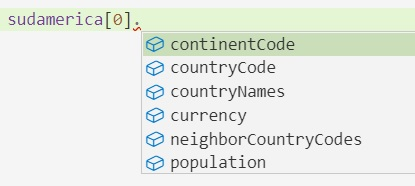
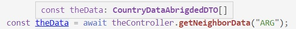

# Testeando listas
En el [ejemplo anterior](./un-test-de-controller-nest.md), cada elemento trata con un solo objeto: el mock del provider devuelve siempre el mismo objeto, y el resultado del request handler, sobre el que se hacen las verificaciones, también es un objeto. No es necesario manejar listas, ni en el mock del provider, ni en el código del test.

Pasemos a un ejemplo un poco más complejo: un test para un request handler con la siguiente firma.
``` typescript
@Get(':countryCode/neighbors')
async getNeighborData(@Param("countryCode") countryCode: string): Promise<CountryDataAbridgedDTO[]> {
    // implementación 
}
``` 
En este caso, se está devolviendo una **lista** de versiones resumidas de la información sobre un país.
``` typescript
export interface CountryDataAbrigdedDTO {
    countryCode: string
    countryName: string
    population: number
}
``` 

Este es un ejemplo de request HTTP, y la respuesta que brinda el controller. Se solicita la información sobre los países limítrofes de Argentina.
```
GET /ARG/neighborgs
``` 
La respuesta incluye una información resumida sobre cada uno de los cinco vecinos de Argentina.
``` json
[
    { "countryCode": "BOL", "population": 10985059, "countryName": "Bolivia" },
    { "countryCode": "BRA", "population": 206135893, "countryName": "Brasil" },
    { "countryCode": "CHL", "population": 18191900, "countryName": "Chile" },
    { "countryCode": "PRY", "population": 6854536, "countryName": "Paraguay" },
    { "countryCode": "URY", "population": 3480222, "countryName": "Uruguay" }
]
```

En la implementación que nos piden testear, se invoca _varias veces_ al mismo método de servicio que describimos en el ejemplo anterior. 
``` typescript
export class CountryDataService {
    async getCountryData(countryCode: string): Promise<CountryData> {
        // implementación que no nos interesa
    }
}

export interface CountryData {
    countryCode: string
    countryNames: { es: string, en: string, br: string }
    population: number
    currency: { code: string, name: string, symbol: string }
    neighborCountryCodes: string[]
    continentCode?: string
}
``` 
No se hace ninguna modificación al provider, toda la integración se hace en el controller.

En el ejemplo sobre países vecinos de la Argentina, el request handler invoca al servicio para Argentina, `"ARG"`. Entre los datos que obtiene, están los códigos de los países vecinos: `["BOL", "BRA", "CHL", "PRY", "URY"]`. 
Después, vuelve a llamar al mismo servicio para cada uno de estos países, para acceder a la información que necesita para armar la respuesta.

_Otro aspecto importante_:  
si al pedir la información de un país vecino, el provider sale por excepción, esto no invalida el request. La decisión es no incluir al país limítrofe del que no se tiene información en la respuesta.  
Si no se encuentra información _sobre el país por el que se consultó_ (Argentina en el ejemplo), ahí sí el controller sale con excepcion.


## Ejercitación antes del test
Implementar el request handler de acuerdo a lo indicado. Usar `Promise.all` para poder lanzar en paralelo las consultas para los países limítrofes.  
Tener en cuenta que el provider puede salir por excepción para algunos de los países limítrofes, hay que manejar esta excepción para que el controller igualmente brinde una respuesta. Vimos un caso similar al [integrar distintas fuentes de información](../nestjs-basics/distintas-fuentes.md).

La definición del endpoint tiene algunos aspectos que se prestan al debate, algún aspecto de la implementación también.  
Puede ser un buen ejercicio pensar en cuáles pueden ser estos aspectos, y pensar en alternativas sobre el diseño del endpoint (en conjunto con el definido antes, que brinda información sobre un país) y también acerca de cómo está organizada la implementación entre controller y provider.


## Implicancias en el test
En la construcción de un test (o mejor, una test suite) para este request handler, aparecen dos elementos nuevos respecto de los ejemplos anteriores.

Uno es que ya no nos sirve que el _mock del provider_ devuelva siempre la misma información o contemple sólo un país. Para probar este endpoint, hay que contemplar varios países, e idealmente entregar información distinta dependiendo de para qué país se pide. 

Otro es que el _resultado del controller_, o sea el objeto sobre el que hacemos las verificaciones, es una lista de objetos.  
Podemos armar la lista entera de resultados y hacer una única afirmación `toEqual` (en rigor, algo más flexible que `toEqual`, que discutiremos en breve), pero también podemos hacer afirmaciones más puntuales sobre distintas características de la lista obtenida: cuántos elementos tiene, si tiene o no un elemento con ciertas condiciones, etc..  
Vamos a hacerlo de esta última forma, para revisar algunas verificaciones más que brindan Jest, y un compañero llamado `jest-extended`. 


## Mock con vitaminas - levantando información de un JSON externo
Abordemos primero el mock de provider. Recordemos qué forma tiene el mock que usamos en los tests anteriores.

``` typescript
const fakeCountryDataService = {
    getCountryData: (countryCode: string): CountryData => {
        if (countryCode === 'SHR') {
            return {
                countryCode: "SHR",
                countryNames: { es: "La Comarca", en: "The Shire", br: "Condado" },
                population: 8500,
                currency: { code: "CRZ", name: "Cerezas de la Comarca", symbol: "JPQ" },
                neighborCountryCodes: ["LIN", "CAR", "OLW"],
                continentCode: "AM"
            };
        } else {
            throw new NotFoundException(`country ${countryCode} unknown`);
        }
    }
}
```
Ahora tenemos que poder brindar información de distintos países. Podríamos hacerlo con un "switch" de esta forma.
``` typescript
const fakeCountryDataService = {
    getCountryData: (countryCode: string): CountryData => {
        if (countryCode === 'ARG') {
            return { /* información de Argentina */ };
        } else if (countryCode === 'PRY') {
            return { /* información de Argentina */ };
        // así con cada país que querramos contemplar
        } else {
            throw new NotFoundException(`country ${countryCode} unknown`);
        }
    }
}
```
pero se nos hace muy extenso, y un poco delicado si después queremos incluir otro país. Si lo hacemos así, definitivamente conviene mover la función a un archivo separado.

Una alternativa es definir _los datos_ de prueba en un JSON que se guarda en un archivo separado. Para esto se suele crear una subcarpeta `test-data`. Podemos crear en esta carpeta, un archivo `sudamerica.json` con información de varios países en el formato `CountryData`.
``` json
[
    {
        "countryCode": "ARG",
        "countryNames": { "es": "Argentina", "en": "Argentine Republic", "br": "Argentina" },
        "population": 43590400,
        "currency": { "code": "ARS", "name": "Argentine peso", "symbol": "$" },
        "neighborCountryCodes": [
            "BOL", "BRA", "CHL", "PRY", "URY"
        ],
        "continentCode": "AM"
    },
    {
        "countryCode": "PRY",
        "countryNames": { "es": "Paraguay", "en": "Paraguay", "br": "Paraguai" },
        "population": 6854536,
        "currency": { "code": "PYG", "name": "Paraguayan guaraní", "symbol": "₲" },
        "neighborCountryCodes": [
            "ARG", "BOL", "BRA"
        ],
        "continentCode": "AM"
    }
    ... información sobre los otros países ...
]
```
Usando un `import`, podemos incorporar la información incluida en este archivo dentro del archivo de test, asignándola a una constante.
``` typescript
import sudamerica = require("./test-data/sudamerica.json");
```
Esto define `sudamerica` con el valor correspondiente a parsear el JSON. Es interesante notar que reconoce la estructura del JSON como tipo de la constante, eso se puede ver en el Intellisense.


> **Nota técnica**  
para que este import funcione, hay que agregar `"resolveJsonModule": true` a las opciones de compilador en el `tsconfig.json`. Esta opción está comentada en [este post](https://mariusschulz.com/blog/importing-json-modules-in-typescript).

El mock del provider busca en esta lista "levantada" desde un JSON por `countryCode`.
``` typescript
const fakeCountryDataService = {
    getCountryData: (countryCode: string): Promise<CountryData> => {
        const country = findCountry(sudamerica,countryCode);
        if (country) {
            return Promise.resolve(country);
        } else {
            throw new NotFoundException(`country ${countryCode} unknown`);
        }
    }
}
```
La función `findCountry` es sencilla, pero la definimos aparte porque la vamos a usar también en el test.

> **Otra nota técnica**  
> En este caso, es necesario forzar a que el provider sea asincrónico. Con una implementación ingenua como la de los ejemplos anteriores, me saltó el test cuando el controller quiere usar este provider.  
> Esto está relacionado con la necesidad de manejar el caso en que el provider salga con excepción, que en realidad va a a ser una Promise de `reject`. Yo usé `.catch` en el controller, tal vez armándolo con un `try / catch` no hace falta; no probé.


## Tests sobre lista
En el test, después de configurar el módulo de test como se muestra en el [ejemplo anterior](./un-test-de-controller-nest.md), se invoca al controller (que va a usar al mock de provider).
``` typescript
const theData = await theController.getNeighborData("ARG");
``` 
El resultado va a ser **una lista**.


Como dijimos al principio, una alternativa a armar toda la lista de resultados y hacer una sola afirmación, también se pueden hacer muchas afirmaciones, verificando distintas características de la lista obtenida. Para esto, vamos a usar varios de los verificadores ("matchers") que provee Jest ... y uno que sacamos de otro lado.  
Veamos algunos ejemplos

**Longitud** 
``` typescript
expect(theData).toHaveLength(5);
``` 
Este es claro: estamos verificando la longitud de la lista, tiene que tener cinco elementos.

**Inexistencia de un elemento** 
``` typescript
expect(findCountry(theData, "ARG")).toBeUndefined();
``` 
Acá estamos verificando que la lista no tiene ningún elemento para el mismo país para el que se preguntó. Notar que estamos usando la misma función `findCountry`, que devuelve el elemento con el `countryCode` indicado, o `undefined` si no encuentra. En este caso, estamos verificando que el resultado del `findCountry` es `undefined`.

**Existencia de un elemento** 
``` typescript
expect(findCountry(theData, "BRA")).toBeDefined();
``` 
Similar al anterior, ahora estamos verificando que el resultado del `findCountry` **no** es `undefined`.

**Verificación sobre lista** 
``` typescript
expect(theData.map(someCountry => someCountry.countryCode)).toIncludeSameMembers(
    ["CHL", "BOL", "PRY", "BRA", "URY"]
);
``` 
Acá estamos obteniendo la lista de códigos, y afirmando qué elementos tiene que tener.  
Usamos `toIncludeSameMembers` en lugar de p.ej. `toEqual`, porque no nos importa _en qué orden_ estén los elementos. P.ej. si los países limítrofes de la Argentina vienen en orden alfabético, entonces al obtener los `countryCode` el resultado va a ser 
`["BOL", "BRA", "CHL", "PRY", "URY"]`   
Comparado con lo que pusimos, `toEqual` da false porque para que dos listas sean iguales, deben coincidir elemento-con-elemento en el mismo orden (primero con primero, segundo con segundo, etc.). El matcher `toIncludeSameMembers` verifica si las listas esperada y recibida tienen los mismos elementos, aceptando que estén en distinto orden.

Este matcher está en un package aparte, llamado `jest-extended`. Estuve un ratito para que tomara el `import`, va así
``` typescript
import "jest-extended";
```
[Este package](https://github.com/jest-community/jest-extended) incluye _muchos_ matchers adicionales a los que provee Jest. Antes de hacer una verificación compleja armando el código, conviene revisar si lo que viene en `jest-extended` puede dar una mano.

**Inclusión de un elemento** 
``` typescript
expect(theData).toContainEqual({
    countryCode: "PRY",
    countryName: "Paraguay",
    population: 6854536
})
``` 
El matcher `toContainEqual` verifica que la lista tenga un elemento que verifique el `toEqual` con el valor esperado.

**Verificación contra una descripción parcial**
``` typescript
expect(findCountry(theData, "URY")).toMatchObject({
    countryCode: 'URY',
    countryName: 'Uruguay'
});
```
El matcher `toMatchObject` aplica a un objeto (por eso hubo que buscarlo previamente), verifica que incluya al menos las propiedades y valores indicados. El valor recibido puede incluir más propiedades.

Recordemos que podemos consultar [la doc de Jest](https://jestjs.io/docs/en/expect) para ver la lista de matchers que provee.


## Al trabajo
A partir de estos elementos, podemos armar **varios** tests para el endpoint de datos de países limítrofes.

### Vecinos de la Argentina
Armar el test descripto más arriba, ensamblando el armado del módulo-para-test descripta en el [ejemplo anterior](./un-test-de-controller-nest.md), con las afirmaciones indicadas acá arriba.  
Agregar las siguientes afirmaciones, usando matches de Jest o `jest-extended`.
- que los nombres de países incluyen `Brasil` y `Uruguay`. Para esto vale hacer un `map` como el que se hizo para los códigos.
- que la población de todos los países supera un millón de habitantes. Para eso hay un matcher específico en `jest-extended`.

Un desafío particular es tipar la función `findCountry`, que recibe una lista, donde el tipo _del elemento_ puede ser o bien `CountryData` o bien `CountryDataAbrigdedDTO`, y debe devolver un elemento de esa lista.

Armar un JSON que incluya la info de Argentina y de todos sus vecinos, y nadie más. Yo la armé accediendo a la data de REST countries para cada país, y copiando/pegando las partes que interesan. El continente es `'AM'` para todos los países.

### Otros tests
Pensar otros tests que puedan tener sentido, considerando en particular qué pasa si el pais por el que se pregunta es desconocido, o si algún limítrofe es desconocido.  
También se puede considerar Australia (código `AUS`) que no tiene vecinos. Vale incluir ese país, y/o los que se considere necesario, en el JSON que alimenta al fake provider.

Implementar los tests definidos. Recordar la posibilidad de definir código que se ejecuta antes de empezar la suite o antes de cada test, como se indica [en la página anterior](./before-all.md).

### Retomando lo que hablamos sobre API
Tal vez el endpoint de datos de países vecinos sea un buen ejemplo para pensar las ideas de [HATEOAS](https://dzone.com/articles/rest-api-what-is-hateoas). Pensar qué links puede convenir agregar, y si hay muchas ganas, implementar una versión HATEOAS-powered del endpoint.  
Siempre se puede permitir que el usuario elija en qué formato quiere la info, según lo que vimos al debatir sobre API REST.