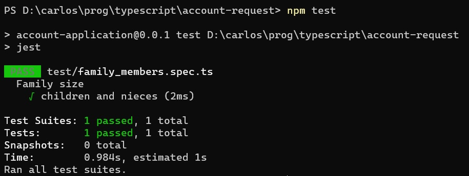
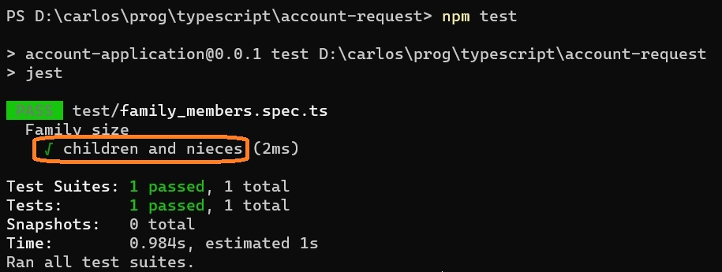
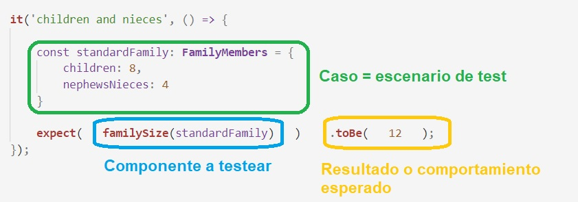

# Un test chiquito
Para hacer una nivelación mínima, hagamos un test de un componente bien chiquito e independiente. 

El componente que proponemos para nuestros primeros tests, es una función que calcula la cantidad total de parientes a partir de un objeto que indica cantidades de distintos tipos de parientes, donde cada valor puede aparecer o no.

Se contemplan tres tipos de parientes: hijes, sobrines y primes. Les primes es medio "por las dudas", en principio se va a trabajar sobre todo con hijes y sobrines.

``` typescript
import { defaultTo } from 'lodash';

export interface FamilyMembers {
    children?: number,
    nephewsNieces?: number,
    cousins?: number
}
export function familySize(family: FamilyMembers): number {
    return defaultTo(family.children, 0) + defaultTo(family.nephewsNieces, 0) 
}
```
El `defaultTo` creo que apareció en algún ejemplo anterior. Nótese la belleza de cómo tipa.

> Sí, está mal, faltan les primes. Está hecho a propósito, para que se luzca el test.


En este escenario es fácil determinar qué se puede testear: que el resultado de la función `familySize` sea el esperado. Para probar esto, tenemos que armar un objeto que tenga la interface `FamilyMembers`. 

Así nos queda un test de Jest para una familia con info "standard".
``` typescript
describe('Family size', () => {
    it('children and nieces', () => {
        const standardFamily: FamilyMembers = {
            children: 8,
            nephewsNieces: 4
        }
        expect(familySize(standardFamily)).toBe(12);
    });
});
``` 
8 hijes, 4 sobrines, primes no hay, da 12 ¿no?.

Veamos. Para _ejecutar_ el test, vamos a la línea de comandos e indicamos
``` typescript
npm test
``` 

Esto es lo que aparece.


¡Perfecto! El test "dio verde".

Antes de seguir, detengámonos un poco en lo que hicimos.


## Un test en Jest
Un test básico en Jest tiene esta forma
``` typescript
it(<nombre-del-test>, <funcion-de-test>);
``` 

donde al menos en principio, la función no lleva parámetros. Por eso, la estructura habitual es
Un test básico en Jest tiene esta forma
``` typescript
it(<nombre-del-test>, () => {
    // codigo del test
});
``` 

El nombre es simplemente para que aparezca en el reporte.

(ya veremos de dónde sale la leyenda `Family size` que se ve arriba)


### Anatomía de un test
Veamos qué incluye el código de un test. Lo que viene ahora lo vemos en Jest, pero sirve para cualquier test automático no importa qué herramienta se use. 

Dentro del código (o en algún otro lado, ya veremos) tiene que haber tres cosas
1. la configuración del caso de test, o escenario.
1. la invocación a lo que estamos testeando.
1. la indicación de cuál es el resultado esperado.

Señalemos las tres cosas en el test definido.

- el caso de testeo es una familia con 8 hijes, 4 sobrines, y cantidad de primes no especificada.
- se invoca a la función `familySize`, el componente que estamos testeando.
- se indica que lo que se espera es que el resultado de la invocación sea el número 12.

> **Pregunta para curioses**  
> ¿por qué un test se tiene que definir _como una función_? ¿qué ventaja proporciona _para Jest_ que se defina así, en lugar de como sigue?
> ``` typescript
>    it('children and nieces', {
>        const standardFamily: FamilyMembers = {
>            children: 8,
>            nephewsNieces: 4
>        }
>        expect(familySize(standardFamily)).toBe(12);
>    });
>```
> (o sea, sin el `() =>` que transforma un bloque de código en una función)


### Afirmaciones, resultado esperado y recibido
En esta línea 
``` typescript
expect(familySize(standardFamily)).toBe(12);
```
se está usando una estructura que provee Jest para hacer una **afirmación**: afirmamos que el resultado de la expresión `familySize(standardFamily)` debe ser `12`.  
La forma general es 
``` typescript
expect(<expresion>).toBe(<resultado_esperado>);
```
Distingamos entre resultado **esperado**, que es el que nosotros afirmamos que es correcto, y **recibido** (u **obtenido**), que es el que entrega la expresión cuando lo evaluamos.

El objetivo del test es verificar que el resultado recibido coincide con el esperado. Si son distintos, entonces hay un problema.  
Más sobre esto en la [página siguiente](./mas-sobre-family-size.md).

Cualquier framework de test va a incluir alguna forma de 
> **Nota sobre Jest**  
> En Jest, el `toBe` es _una_ de las verificaciones que se pueden hacer sobre el resultado de una expresión.  
> Puede ser interesante verificar otras cosas. P.ej. si el resultado es un array, que incluya cierto elemento.  
> Se pueden chequear varias opciones en la [doc de Jest](https://jestjs.io/docs/en/expect).


## Test suites
En el ejemplo, el test está dentro de una estructura llamada `describe`, que define lo que se llama un _test suite_ en la terminología del testing automático. En criollo, un agrupamiento de tests.  
La definición de un test suite tiene el mismo formato que un test.
``` typescript
describe(<nombre-de-la-suite>, () => {
    // tests
});
``` 

En este ejemplo, el _único_ efecto de poner nuestro test dentro de una suite es la leyenda con el nombre de la suite, `Family size`, arriba del nombre del test.  
Hay un indentado que sugiere que el test forma parte de esa suite, ya veremos que eso se respeta cuando una suite incluye varios tests y/o cuando en un archivo se incluyen varias suites. Esto se puede hacer simplemente poniendo una suite debajo de la otra.

``` typescript
describe("Suite 1", () => {
    // tests
});

describe("Suite 2", () => {
    // tests
});
``` 
Más adelante veremos algunas facilidades adicionales que nos da la definición de test suites.

> **Nota**  
> Jest es un mundo, en este material vamos a trabajar con lo que vayamos necesitando.  
> En particular, tal vez incluya otras sintaxis para definir tests, que (humildemente) desconozco.


