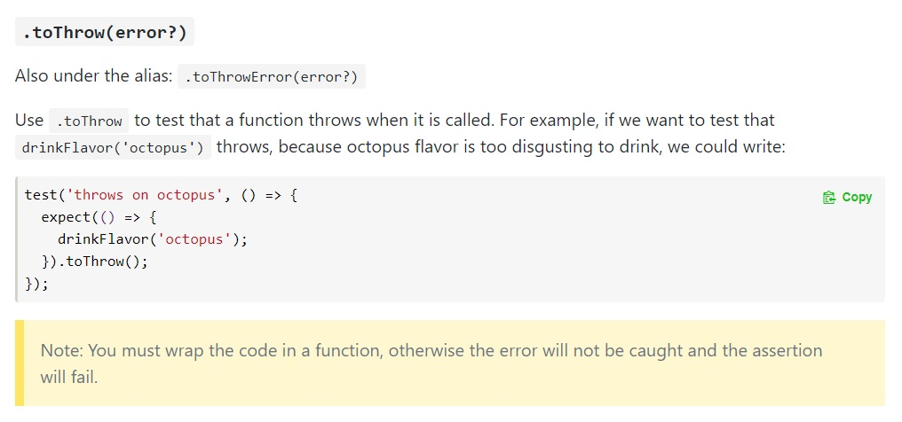

# Un test de controller NestJS
Vamos a volver al dominio de la información sobre países, con el que trabajamos hace un tiempo. 

El módulo que vamos a testear, define estas interfaces.
``` typescript
export interface CountryData {
    countryCode: string
    countryNames: { es: string, en: string, br: string }
    population: number
    currency: { code: string, name: string, symbol: string }
    neighborCountryCodes: string[]
    continentCode?: string
}

export interface CountryDataDTO {
    countryCode: string
    countryName: string
    population: number
    currency: { code: string, name: string, symbol: string }
    continent?: string
}
``` 

El controller tiene un único método `@Get` que llama a un provider para que le brinde un `CountryData`. A su vez, el controller devuelve un `CountryDataDTO`. 

Aún sin ver nada de código, sólo mirando las dos interfaces, podemos entender qué transformaciones hace el controller.
- "elimina" el atributo `neighborCountryCodes`.
- de los `countryNames`, se queda con uno, o los combina de alguna forma, para generar el `countryName`.
- transforma el código de continente en ¿el nombre?

El análisis del código del controller nos permite confirmar estas sospechas.
``` typescript
const continents = {
    "AF": "África",
    "AM": "América",
    "AS": "Asia",
    "EU": "Europa",
    "OC": "Oceanía"
}

@Controller('countries')
export class CountryDataController {

    constructor(private readonly countryDataService: CountryDataService) { }

    @Get(':countryCode')
    async getCountryData(@Param("countryCode") countryCode: string): Promise<CountryDataDTO> {
        if (countryCode === 'ZZZ') {
            throw new NastyCountryException("I just don't like the country ZZZ")
        }
        const serviceData = await this.countryDataService.getCountryData(countryCode);
        const finalData: CountryDataDTO = {
            ..._.pick(serviceData, ["countryCode", "population", "currency"]),
            countryName: serviceData.countryNames.es
        }
        if (serviceData.continentCode) { 
            const continentName: string | undefined = continents[serviceData.continentCode];
            if (continentName) { finalData.continent = continentName }
        }
        return finalData;
    }
}
``` 

OK, lo que dijimos, más una excepción para un código específico de país.

El objetivo es armar tests en los que se pruebe el código que estamos viendo. 
En estos tests, lo _único_ que nos va a interesar del `CountryDataService` es su _interface_. En principio es esta.
``` typescript
export const SERVICE_NAME = 'CountryData cool service';

export class CountryDataService {
    async getCountryData(countryCode: string): Promise<CountryData> {
        // implementación que no nos interesa
    }
}
``` 
Lo de "en principio" es porque en realidad también puede interesarnos **qué excepciones** puede lanzar el provider. En este caso, son dos.

Si el `countryCode` es `TPT`, entonces lanza esta excepción  
`throw new ImATeapotException('Teapot country not supported')`.

Si no encuentra información para el código de país que se suministra, lanza una excepción de esta forma  
``` typescript
throw new NotFoundException({
    message: `Country ${countryCode} unknown`,
    originalError: /* un error */,
    serviceName: SERVICE_NAME
})
```


## Uso del controller con un provider mockeado
Para probar el código del controller, en lugar de que acceda al provider real, armamos uno que devuelve siempre el mismo objeto fijo.

``` typescript
const fakeCountryDataService = {
    getCountryData: (countryCode: string): CountryData => {
        return {
            countryCode: "SHR",
            countryNames: { es: "La Comarca", en: "The Shire", br: "Condado" },
            population: 8500,
            currency: { code: "CRZ", name: "Cerezas de la Comarca", symbol: "JPQ" },
            neighborCountryCodes: ["LIN", "CAR", "OLW"],
            continentCode: "AM"
        }
    }
}
```

Para tener corriendo al controller usando este servicio en lugar del que está configurado en el módulo, el [soporte para test de NestJS](https://docs.nestjs.com/fundamentals/testing) provee la posbilidad de configurar un módulo para test. Este se define como un módulo "normal", con sus `controllers`, sus `providers`, también se pueden importar otros módulos. Después, se le puede reemplazar uno cualquiera de los componentes definidos por una implementación fake, de esta forma estamos mockeando el componente. 
Al final, hay que poner `.compile()`.

Todo junto, queda así.
``` typescript
const testModule: TestingModule = await Test.createTestingModule({
    controllers: [CountryDataController],
    providers: [CountryDataService],
})
    .overrideProvider(CountryDataService)
    .useValue(fakeCountryDataService)
    .compile();
```

> **Pregunta**  
> ¿Por qué es necesario configurar el `CountryDataService`, que no se va a usar? ¿No se puede hacer directamente esto?
> ``` typescript
> const testModule: TestingModule = await Test.createTestingModule({
>     controllers: [CountryDataController],
>     providers: [fakeCountryDataService],
> }).compile();
> ```
> Piensen qué podría no gustarle a NestJS. Después prueben y vean qué les dice.

Al `testModule` se le puede pedir un componente, y usarlo.
``` typescript
const theController = testModule.get(CountryDataController);
const theData = await theController.getCountryData("SHR");
```

Listo, ya tenemos un controller que usa el provider "para test".


## Manos a la obra
Armar una implementación real del controller, usando la [API abierta de REST Countries](https://restcountries.eu/), que ya mencionamos en el [ejercicio integrador sobre procesamiento asincrónico](../async/ejercicio-integrador.md).  

Después, armar un test integrando los elementos indicados en la sección anterior, que verifique el resultado que entrega el controller. Este test puede tener un solo `expect`, que compare `theData` con la respuesta esperada.
Recordar lo mencionado acerca de la [comparación de objetos compuestos](./mas-sobre-family-size.md).  
**Atención**: como el controlador es asincrónico, entonces la función que se le pasa al test debe ser `async`, o sea, tener esta forma: `async () => {/* codigo */}`.

Después un pequeño desafío: al armar el `testingModule`, estamos repitiendo de alguna forma la definición del `CountryDataModule`. Cambiar la definición para evitar esta repetición.  
**Hint**: usar directamente el módulo.


## Comportamiento ante errores
¿Cuál es el comportamiento esperado del controller si el provider sale por excepción? 
Mirando el código, vemos que _no hace nada_, o sea, no hace ningún manejo de excepciones. Por lo tanto, debería obtenerse la misma excepción "recibida" desde el provider.  
Esto también es parte del comportamiento del controller, podría tener sentido un test específico. Hagámoslo.

Para esto, necesitamos que nuestro provider-para-test genere una excepción 
``` typescript
const fakeCountryDataService = {
    getCountryData: (countryCode: string): CountryData => {
        if (countryCode === 'SHR') {
            return {
                // lo mismo que antes
            };
        } else {
            throw new NotFoundException(`country ${countryCode} unknown`);
        }
    }
}
```

Ahora, en nuestro test, queremos verificar que al evaluar
``` typescript
await theController.getCountryData("JPQ");
```
se genere un error. 

En rigor, este escenario presenta _dos_ particularidades para armar una verificación: lo que queremos verificar es que se genera un error, _y además_, es código asincrónico.

Para verificar errores, Jest provee la verificación `toThrow`; ver [la doc de Jest](https://jestjs.io/docs/en/expect#tothrowerror). Esto lo vamos a usar, _combinado con el manejo de procesamiento asincrónico_ que [tiene su página en la doc de Jest](https://jestjs.io/docs/en/asynchronous).

Hasta ahora, el manejo de asincronismo lo maneja Jest, alcanza con poner los `await` donde van y que las funciones de test sean `async`.  
Cuando **además** lo que queremos verificar es que se genera un error, ya tenemos que ser más conscientes del asincronismo. En particular, recordar que lo que devuelve el controller es una promesa.
Entre las distintas formas que propone la documentación, la que me pareció más clara es la siguiente.
``` typescript
await expect(theController.getCountryData("XXX")).rejects.toThrow();
```
El `rejects` (ver [en la doc de Jest](https://jestjs.io/docs/en/expect#rejects)) verifica que la `Promise` que devuelve `getCountryData` es un rechazo (que es lo que pasa, en particualr, con las excepciones en funciones `async`), y le "transmite" el valor asociado al rechazo a lo que se ponga detrás en la afirmación.  
Con el `toThrow()` posterior, verificamos que efectivamente el rechazo corresponde a una excepción.  
Finalmente, **no olvidar** el `await` de adelante, para que el test no salga antes que termine el análisis.

<!-- Para esto, Jest provee la verificación `toThrow`. Miremos la documentación.

El código que se quiere testear, en este caso `drinkFlavor('octopus')`, se envolvió (_wrap_) en una función. El mismo test no "wrappeado" sería así
``` typescript
test('throws on octopus', () => {
  expect(drinkFlavor('octopus')).toThrow();
});
```
Después se aclara que el wrap es necesario. O sea, que si escribimos el test como pusimos recién, _no_ va a funcionar como esperamos.

> **Nota "teórica"**  
>
> Para entender por qué es necesario wrappear el código en una función, volvamos a la primer verificación que estudiamos  
> `expect(familySize(standardFamily)).toBe(12);`  
> Recordando cómo se evalúa el código, de adentro para afuera (y de izquierda a derecha), al `expect` le llega **el resultado** de `familySize(standardFamily)`. Eso le alcanza para verificar si ese resultado es `12` o no, Jest no conoce la expresión, solamente maneja su resultado.  
>
> Si evaluamos
> `expect(drinkFlavor('octopus')).toThrow();`, 
> lo primero que se va a evaluar es `drinkFlavor('octopus')`. Si eso genera un error, el `expect` no se va a ejecutar, lo que va a pasar es que se va a lanzar ese error.  
> Para que Jest pueda verificar errores, tiene que ser el mismo Jest quien _ejecute_ el código. En este caso, no le alcanza con el resultado, le tiene que llegar **el código** a ejecutar. Eso es lo que logramos envolviéndolo en una función, ahora a Jest le llega _una función_ que puede evaluar como lo necesite. -->


### Hora de implementar
Escribir un test en el que se invoque al servicio, y se verifique que se genera un error. Notando que `toThrow` puede recibir una clase por parámetro, verificar que en particular la excepción que se genera es una `NotFoundException`. 

Verificar que si el controller **no sale por excepción**, entonces el test falla. Interpretar el mensaje.

Armar otro test, que verifique que se genera una `NastyCountryException` si se pasa `ZZZ` como código de país.


