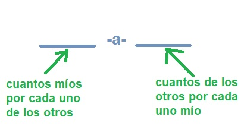

# Mapeo de relaciones
Una de las características principales de las BD relacionales son (justamente) las herramientas que ofrece, orientadas a establecer, usar y mantener _relaciones_ entre entidades. Entre estas herramientas encontramos: el concepto de FK, las restricciones de integridad, las operaciones en cascada.

TypeORM incluye herramientas para especificar relaciones, y para usarlas. Estas herramientas hacen que algunas correspondencias entre el código y la base sean menos rígidas. En particular
- en las clases que se mapean a tablas, van a aparecer atributos con decorators de TypeORM, para los cuales no se define una columna en la tabla correspondiente.
- las operaciones que se realizan mediante un repositorio, pueden afectar a otras tablas, además de la relacionada con la entidad del repositorio.


## Relaciones many-to-one
Agreguemos las _sucursales_ como un segundo tipo de entidad, al modelo que hasta ahora tiene solamente las solicitudes de cuenta. 
```typescript
@Entity({ name: 'agencies' })
export class Agency {
    @PrimaryGeneratedColumn()
    id: number

    @Column({ length: 10 })
    code: string

    @Column({ length: 120 })
    name: string

    @Column({ nullable: true })
    address: string

    @Column({ nullable: true })
    area: number
}
```

Queremos asociar cada solicitud de cuenta con la sucursal donde se generó, en el programa y también en la BD.

En el código, alcanza con agregar un atributo en la clase `AccountApplication`.
```typescript
@Entity({ name: 'account_applications' })
export class AccountApplication {
    // ... otros atributos ...

    agency: Agency
```

En la BD, debe establecerse una **relación** entre las entidades `account_application` y `agency`. 
Mirado desde las solicitudes, esta relación es del tipo _muchos-a-uno_, o _many-to-one_, porque:
- puede haber _muchas_ solicitudes relacionadas con una misma sucursal, pero
- cada solicitud está relacionada con _una sola_ sucursal.

El decorator `@ManyToOne` de TypeORM define una relación de este tipo. Queda así:
```typescript
@Entity({ name: 'account_applications' })
export class AccountApplication {
    // ... otros atributos ...

    @ManyToOne(() => Agency)
    agency: Agency
}
```
El parámetro le indica a TypeORM cuál es la clase que mapea la entidad relacionada. Por razones que desconozco, se define como una función.

Esta relación se implementa en la BD, agregando una columna en la tabla `account_applications` cuyo valor es _la primary key_ (el id numérico por como venimos definiendo las PK) de la sucursal asignada. Esta columna se marca en la BD como una FK a la tabla `agencies`. 
Si en las opciones de conexión tenemos `synchronize = true`, entonces al levantar el programa o aplicación, TypeORM va a crear la columna y la FK. En este ejemplo, agrega a la tabla `account_applications` la columna `agencyId`.

Para las solicitudes que se agreguen, es conveniente asignarles una sucursal obtenida desde la BD:
```typescript
const agency22 = await agencyRepository.findOneOrFail({ code: '022' });

const newApplication = new AccountApplication();
newApplication.customer = "Felicitas Guerrero";
newApplication.status = Status.PENDING;
newApplication.requiredApprovals = 3;
newApplication.agency = agency22;
const savedApplication = await applicationRepository.save(newApplication);
```

En la nueva fila de `account_applications`, el valor de `agencyId` es el `id` de la sucursal asignada.


## Relaciones al obtener datos
Hagamos una búsqueda cuyo resultado sea la solicitud recién creada.
```typescript
await applicationRepository.findOneOrFail({ customer: "Felicitas Guerrero" });
```
El resultado va a tener esta forma
```typescript
AccountApplication {
  id: 8,
  customer: 'Felicitas Guerrero',
  status: 'Pending',
  date: null,
  requiredApprovals: 3
}
```
... la sucursal que le asignamos ¡no aparece!

La razón es que en principio, cuando TypeORM obtiene una entidad desde la BD, no incluye a las entidades relacionadas. 
Tal como mencionamos en la introducción a TypeORM, el motivo está relacionado con la performance: obtener todos los objetos relacionados, directa o indirectamente, con el objeto que se está buscando, podría provocar un query con un resultado enorme, que implica mucho cálculo en la BD y mucho tráfico entre la BD y el programa / servicio / aplicación. 

Para que el resultado de un query incluya entidades relacionadas con las que se están buscando, hay que mencionarlo explícitamente usando la opción `relations`. Las opciones de búsqueda se definen por separado de los criterios (en el ejemplo que sigue, el criterio es el cliente, y la opción es `relations`). Una opción es pasar un objeto con las opciones, donde los criterios se definen como una opción llamada `where`.
```typescript
await applicationRepository.findOneOrFail({ 
    where: { customer: 'Felicitas Guerrero' }, 
    relations: ["agency"] 
});
```

El resultado de esta query sí va a incluir la sucursal.
```typescript
AccountApplication {
  id: 8,
  customer: 'Felicitas Guerrero',
  status: 'Pending',
  date: null,
  requiredApprovals: 3,
  agency: Agency {
    id: 5,
    code: '022',
    name: 'Yavi',
    address: 'Av. San Martín 42',
    area: null
  }
}
```

Notamos que en este query sobre el repositorio de solicitudes, se integra la tabla de solicitudes con otras tablas. Por lo tanto, al hacer queries sobre un repositorio, el resultado va a ser información que esté en la tabla correspondiente ... y en las relacionadas.


### Cadenas de relaciones
Supongamos ahora que agregamos una entidad `City`, y asignamos la ciudad en la que está cada sucursal.
```typescript
@Entity({ name: 'agencies' })
export class Agency {
    // ... otros atributos ...

    @ManyToOne(() => City)
    city: City;
}
```

Para incluir los datos de la agencia _y los de la ciudad_ en un query, podemos especificar la búsqueda de esta forma.
```typescript
await applicationRepository.findOneOrFail({ 
    where: { customer: 'Felicitas Guerrero' }, 
    relations: ["agency", "agency.city"] 
});
```
obteniendo el siguiente resultado
```typescript
AccountApplication {
  id: 8,
  customer: 'Felicitas Guerrero',
  status: 'Pending',
  date: null,
  requiredApprovals: 3,
  agency: Agency {
    id: 5,
    code: '022',
    name: 'Yavi',
    address: 'Av. San Martín 42',
    area: null,
    city: City { id: 1, name: 'Yavi', province: 'Jujuy', population: 500 }
  }
}
```


## El otro lado de las relaciones
Con el código y los mapeos TypeORM como están, para obtener las solicitudes asignadas a una sucursal, hay que hacer una consulta sobre solicitudes. 
```typescript
const agency22 = await agencyRepository.findOneOrFail({ code: '022' });
const applications = await applicationRepository.find({ 
    where: { agency: agency22 },
    relations: ["agency"] 
});
``` 

No podemos acceder a este conjunto de solicitudes a partir de la sucursal.  
Dicho de otra forma, la relación es de acceso _unidireccional_: podemos acceder a esta relación sólo en una dirección, desde las solicitudes hacia las sucursales, pero no al revés. 

Para habilitar el acceso _bidireccional_ a esta relación, en el código deberíamos agregar un atributo en `Agency`, cuyo valor es _una lista_ de solicitudes:
```typescript
@Entity({ name: 'agencies' })
export class Agency {
    // ... otros atributos ...

    accountApplications: AccountApplication[]
}
```
Obviamente, es responsabilidad nuestra mantener la coherencia entre este atributo, y el valor del atributo `agency` en cada solicitud.

Para que TypeORM pueda manejar la relación en forma bidireccional, tenemos que agregarle a este atributo el decorator `@OneToMany`, y agregar _en cada uno de los extremos_, la forma de acceder a la relación en el otro. Se ve más fácil en el código.
```typescript
@Entity({ name: 'account_applications' })
export class AccountApplication {
    // ... otros atributos ...

    @ManyToOne(() => Agency, agency => agency.accountApplications)
    agency: Agency
}

@Entity({ name: 'agencies' })
export class Agency {
    // ... otros atributos ...

    @OneToMany(() => AccountApplication, app => app.agency)
    accountApplications: AccountApplication[]
}
```

¿Por qué _OneToMany_? Porque vista desde la sucursal, la relación es _uno-a-muchos_.
- puede haber _una sola_ sucursal que se relaciona con una solicitud, y
- para cada sucursal, puede haber _muchas_ solicitudes relacionadas.

--- 
**Nota**  
Para pensar la _cardinalidad_ de una relación, me "paro" en uno de los extremos, y hago el razonamiento que trato de describir en este gráfico.  


En el último ejemplo, "los míos" son las sucursales, "los otros" son las solicitudes.

---

Estas definiciones permiten acceder a la relación desde cualquiera de sus extremos: desde las solicitudes hacia las sucursales como ya vimos, y también desde las sucursales hacia las solicitudes.  
```typescript
await agencyRepository.findOneOrFail(
    { where: { code: '022' }, relations: ["accountApplications"] }
);
```

El resultado es el que esperamos.
```typescript
Agency {
  id: 5,
  code: '022',
  name: 'Yavi',
  address: 'Av. San Martín 42',
  area: null,
  accountApplications: [
    AccountApplication {
      id: 1,
      customer: 'Juana Molina',
      status: 'Pending',
      date: null,
      requiredApprovals: 8
    },
    AccountApplication {
      id: 8,
      customer: 'Felicitas Guerrero',
      status: 'Pending',
      date: null,
      requiredApprovals: 3
    }
  ]
}
```

Notamos que el atributo `accountApplications` en `Agency` **no se corresponde con ninguna columna** en la tabla `agencies`. TypeORM obtiene la información para darle valor al atributo, a partir de la columna `agencyId` que está en la tabla `account_applications`. _La misma columna_ permite manejar el atributo en `Agency` y también el atributo `agency` en `AccountApplication`.

Por lo tanto, vemos que no siempre vamos a encontrar una columna por cada atributo mapeado. Las excepciones siempre van a estar relacionadas con relaciones. 
En las relaciones `@OneToMany` / `@ManyToOne` que se mapean en forma bidireccional, va a haber una columna _solamente en la tabla del extremo "many"_, en este ejemplo en la tabla correspondiente a las solicitudes.

Por esta misma razón, se puede mapear en forma unidireccional una relación `@ManyToOne` (es como estaba esta relación antes de agregar y mapear el atributo en `Agency`), pero no una `@OneToMany`. Siempre que mapee una relación `@OneToMany`, _es necesario_ hacerlo en forma bidireccional.


## Relaciones one-to-one
Para estudiar relaciones con características distintas a las que vimos, agreguemos a nuestro modelo un nuevo tipo de entidad, los análisis crediticios.
```typescript
@Entity({ name: 'credit_assessments' })
export class CreditAssessment {
    @PrimaryGeneratedColumn()
    id: number

    @Column({ length: 120 })
    customer: string

    @Column({ type: "decimal", precision: 15, scale: 2})
    creditLimit: number
}
```

Supongamos que para cada solicitud de cuenta se hace un análisis crediticio, no más de uno. Por lo tanto, existe una relación entre las solicitudes y los análisis. 

Esta relación es _uno-a-uno_ vista desde cualquier extremo: para cada solicitud hay un análisis relacionado, para cada análisis hay una solicitud. Por eso, vamos a describirla mediante el decorator `@OneToOne`. 
Para establecer la relación en forma bidimensional, agregamos los atributos en las dos entidades, y le ponemos a ambas el decorator con los datos de la entidad relacionada. Queda así.

```typescript
@Entity({ name: 'account_applications' })
export class AccountApplication {
    // ... otros atributos ...

    @OneToOne(() => CreditAssessment, assessment => assessment.accountApplication)
    creditAssessment: CreditAssessment
}

@Entity({ name: 'credit_assessments' })
export class CreditAssessment {
    // ... otros atributos ...

    @OneToOne(() => AccountApplication, app => app.creditAssessment)
    accountApplication: AccountApplication
}
```

Como vimos con las relaciones muchos-a-uno, para describir esta relación en la BD alcanza con agregar una columna en _una_ de las tablas involucradas. 
En una relación uno-a-uno, la columna se puede agregar en cualquiera de las dos tablas. En el ejemplo, se puede agregar `creditAssesmentId` en `account_application`, o bien `accountApplicationId` en `credit_assessment`. 
TypeORM exige que la decisión la tomemos nosotros. Para indicar en cuál de las tablas agregar la columna, hay que agregar el decorator `@JoinColumn()` en la clase correspondiente.
Si decidimos que la columna va en `account_application`, entonces tenemos que ajustar la definición en `AccountApplication` de esta forma.
```typescript
@Entity({ name: 'account_applications' })
export class AccountApplication {
    // ... otros atributos ...

    @OneToOne(() => CreditAssessment, assessment => assessment.accountApplication)
    @JoinColumn()
    creditAssessment: CreditAssessment
}

@Entity({ name: 'credit_assessments' })
export class CreditAssessment {
    // ... otros atributos ...

    @OneToOne(() => AccountApplication, app => app.creditAssessment)
    accountApplication: AccountApplication
}
```

Las relaciones se pueden usar en consultas, igual que como lo vimos con las relaciones muchos-a-uno.


## Relaciones muchos-a-muchos
En el diseño de BD relacionales pueden aparecer relaciones _muchos-a-muchos_. Un ejemplo podría ser la relación entre clientes y sucursales respecto del registro de firmas: un cliente puede tener registrada la firma en muchas sucursales (p.ej. porque tiene cajas de seguridad, o cuentas, en varias), una sucursal mantiene el registro de firmas de muchos clientes.

No vamos a entrar en los detalles de este tipo de relaciones; les interesades pueden consultar [la página al respecto en la doc](https://typeorm.io/#/many-to-many-relations).


## Preguntas y consignas
En una relación muchos-a-uno / uno-a-muchos ¿se puede agregar la columna que describe la relación en la BD en cualquiera de las dos tablas, o solamente puede estar en una de ellas?

Al diseñarse la BD de solicitudes de cuenta, se definió darle a los campos de texto una longitud de 120 caracteres. Por eso se repite la indicación `{length: 120}` en varios decorators `@Column`.
¿Cómo se puede hacer para no repetir este dato, que en el código diga una sola vez que los campos de texto tienen longitud 120?  
Hay (al menos) dos formas: en una se evita que se repita el número 120, en otra se evita que se repita la opción `{length: 120}` completa.

Otra definición es que todas las PK son identificadores numéricos autoincrementales, y que el nombre de atributo es siempre `id`. ¿Cómo se puede hacer para que esta definición esté una sola vez en el código?  
**Hint**: usar _herencia_.  
Para averiguar más sobre el tratamiento que hace TypeORM de herencia entre entidades, se puede leer [esta página en la doc](https://typeorm.io/#/entity-inheritance).

Agregar al modelo las evaluaciones de solicitudes de cuenta. Para cada evaluación se sabe quién la hizo (es un string con el nombre), y si la decisión de esta persona es aprobar la solicitud o no (un booleano). Esta entidad tiene una relación "cantada" con otra, definirla haciéndola bidimensional.

