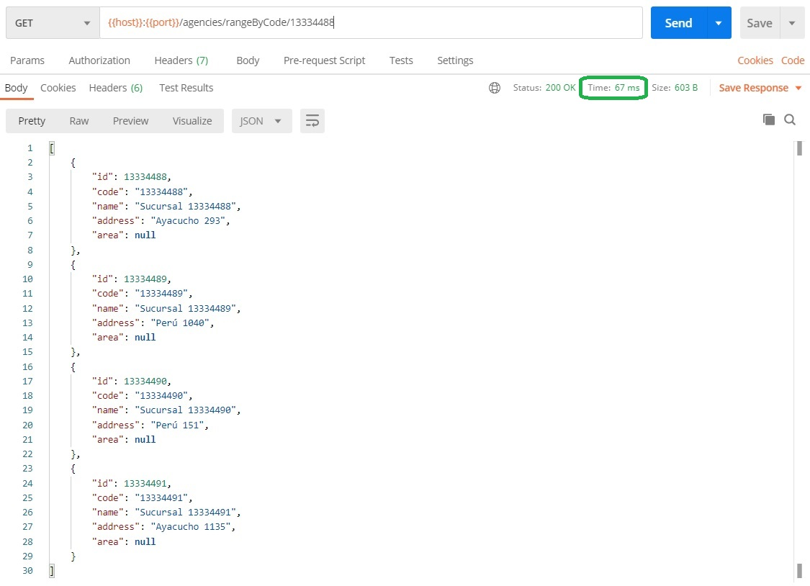

# TypeORM - algunas técnicas para mejorar la performance
En esta página vamos a repasar algunas ideas que pueden servir para mejorar la performance de las operaciones que involucran accesos a BD relacionales, y qué herramientas nos brinda TypeORM para implementarlas.

## Indices
La técnica más potente para agilizar las operaciones de lectura es la _definición de índices_, de acuerdo a los criterios de búsqueda que se necesiten en una aplicación o servicio. Los efectos del índice son apreciables para tablas grandes, en el orden de miles de registros o más.

Para evaluar el efecto de la definición de un índice en una tabla, se trabajó con este modelo de sucursales que describimos [al hablar de relaciones](./typeorm-mapeo-relaciones). Se generaron dos tablas con 15 millones de sucursales cada una, en un Postgres 11 local. A una de las tablas se le agregó un índice por `code`. Se implementó un servicio Nest con un endpoint `GET` que hace cuatro búsquedas de sucursal por código.
```typescript
/* en el controller */
@Get('rangeByCode/:initialCode')
async getAgencyRangeByCode(@Param("initialCode") initialCode: string): Promise<Agency[]> {
    return this.agenciesService.getAgencyRangeByCode(initialCode, 4);
}

/* en el provider */
async getAgencyRangeByCode(initialCode: string, count: number): Promise<Agency[]> {
    const initialCodeAsNumber = Number(initialCode);
    // la función padStart es gentileza de lodash
    const numberToCode = number => padStart(String(number), 8, '0');
    const result: Agency[] = []
    for (let index = 0; index < count; index++) {
        result.push(await this.getAgencyByCode(numberToCode(initialCodeAsNumber + index)));
    }
    return result;
}
```

Este es el resultado de acceder al endpoint apuntando a la tabla **sin** índice.


Al cambiar a la tabla **con** índice, se obtiene lo siguiente.


Para endpoints de acceso frecuente, se pueden lograr ganancias importantes de performance si se definen índices que se correspondan con el criterio de búsqueda.


### Soporte para índices en TypeORM
Los índices son _recursos propios de las BD_. Los programas que acceden a la BD desconocen (al menos en la generalidad de los casos) qué índices están definidos, y no necesitan esta información para hacer consultas. El SQL de la consulta que se envía a la base es el mismo, haya o no índices que apliquen. Es la BD la que detecta la existencia de índices, y los aprovecha para dar una respuesta más rápida.

TypeORM brinda soporte para indicar qué índices deben contemplarse en la tabla que modele cada entidad, para esto define el decorator `@Index`. P.ej. en la definición de la entidad `Agency`, se puede indicar que debe crearse un índice sobre el atributo `code` de esta forma.
```typescript
@Entity({ name: 'agencies' })
export class Agency {
    @PrimaryGeneratedColumn()
    id: number

    @Column({ length: 10 })
    @Index()
    code: string

    @Column({ length: 120 })
    name: string

    @Column({ nullable: true })
    address: string

    @Column({ nullable: true })
    area: number

    @ManyToOne(() => City)
    city: City;
}
```
Esta información se utiliza **únicamente** en la sincronización que hace TypeORM, cuando levanta la aplicación, entre las definiciones de entidades, y el esquema de la BD a la que se está conectando. Si la entidad incluye la definición de índices que no están en la BD, entonces TypeORM le indica a la BD que cree índices que cumplan con la definición.

Este soporte incluye varias variantes (p.ej. índices que involucran varias columnas), que se pueden consultar [en la página sobre índices de la doc de TypeORM](https://typeorm.io/#/indices).

Los índices también pueden ser creados en la misma BD, mediante la sentencia `CREATE INDEX`. En Postgresql, esta expresión crea un índice sobre la columna `code`.
```sql
CREATE INDEX ix_code ON agencies (code);
```
Pero **atención**, si se levanta una aplicación que usa TypeORM, que no tiene definido el índice en el mapeo de entidad, y que tiene `synchronize=true` en las opciones de conexión, TypeORM va a _borrar_ el índice al levantarse la app (o al menos eso es lo que indica la doc de TypeORM).
Para evitar esto, se pueden declarar "índices a respetar" en la definición de la entidad. Para el ejemplo del índice `ix_code`, queda así.
```typescript
@Entity({ name: 'agencies' })
@Index("ix_code", { synchronize: false })
export class Agency {
    /* ... properties ... */
}
```


### Otros comentarios sobre índices
**Distintos tipos de índices**  
Al trabajar con [índices en MongoDB](../mongoose-performance/indices), mencionamos la existencia de distintos tipos de índices. En el caso de las BD relacionales, los tipos de índice que se pueden definir van a depender fuertemente del motor de BD que se utilice (MySQL/MariaDB, Postgresql, Oracle, SQLServer, etc.).  
TypeORM puede manejar sólo índices "clásicos" (como el que describimos sobre el código de las sucursales) y espaciales. Para utilizar índices con características que TypeORM no maneja, deberán definirse estos índices sobre la BD, e indicar en el mapeo de entidad de TypeORM que "respete" los índices definidos.

**Frecuencia de lectura vs frecuencia de escritura**  
La definición de índices no es gratuita. Los índices son recursos adicionales que debe manejar el motor de BD. En particular, para cada operación que involucre modificaciones en la BD (altas, bajas o modificaciones de entidades), la BD debe actualizar los índices de las tablas modificadas. 
En consecuencia, al mismo tiempo que los índices brindan ventajas que pueden ser considerables respecto de las _operaciones de lectura_, afectan negativamente la performance de las _operaciones de escritura_.

Es por esto que para decidir si se va a crear o no un índice en una tabla, conviene comparar la frecuencia de operaciones de lectura que se ven beneficiadas, con la de operaciones de escritura que se ven perjudicadas.  
En una tabla que se escribe mucho y se lee poco (como podría ser el caso de tablas de log), agregar muchos índices puede generar más perjuicio que beneficio. En el otro extremo, en tablas con mucha lectura y poca escritura (como podría ser el padrón electoral en la aplicación de consulta de padrones), agregar índices es particularmente conveniente.

**Herramientas para generar índices**  
Para cerrar lo que vamos a decir sobre índices, mencionamos que existen herramientas que recolectan estadísticas sobre el uso de una BD, y a partir de esta información recomiendan qué índices conviene crear para mejorar la performance.  
Este redactor sólo sabe que tales herramientas existen, nunca experimentó con tales artefactos. Por eso se limita a mencionar su existencia.


## Operaciones masivas
La sintaxis de SQL incluye la posibilidad de que una única operación afecte a muchas filas. Veamos algunos casos, y qué herramientas nos da TypeORM para manejarlos.


### Actualizaciones masivas mediante un único UPDATE
Volviendo a las solicitudes de cuenta que describimos [al presentar los conceptos básicos de TypeORM](./typeorm/typeorm-bases), podemos p.ej. modificar el valor de la propiedad `requiredApprovals` para todas las solicitudes que estén en estado `Pending`, con esta única sentencia
```sql
UPDATE account_applications 
SET "requiredApprovals" = "requiredApprovals" + 1 
WHERE status = 'Pending'
```
Esta sentencia es mucho más eficiente que obtener primero la lista de solicitudes en estado `Pending`, y luego aplicar un `UPDATE` a cada una, identificándolas p.ej. por el `id`.

TypeORM permite expresar estas operaciones masivas, mediante QueryBuilders. En el caso particular del `UPDATE` recién mencionado, podemos definirlo como se ve en este método de servicio.
```typescript
async makePendingApplicationsMoreDemanding(): Promise<MassiveOperationDTO> {
    const massiveUpdateResult = await this.applicationRepository
        .createQueryBuilder()
        .update()
        .set({ requiredApprovals: () => '"requiredApprovals" + 1' })
        .where(`status = '${Status.PENDING}'`)
        .execute();
    return { count: massiveUpdateResult.affected }
}
```
Notamos que al QueryBuilder se le indica que debe realizar un `update()`, y a continuación las cláusulas `set(...)` y `where(...)`. En el `set`, se pasa un objeto indicando los atributos a modificar, y el valor a asignarle a cada uno. Cuando el nuevo valor depende del estado actual de la entidad, se indica mediante una función como se ve en el ejemplo.  
El resultado incluye al atributo `affected`, que indica la cantidad de filas modificadas.  
Los QueryBuilder para armar sentencias `UPDATE` puede incorporar otros elementos mencionados [en la página sobre búsqueda](./typeorm-busqueda), p.ej. subqueries.

Estos usos de QueryBuilder se describen en páginas de la doc de TypeORM, que se refieren al [update](https://typeorm.io/#/update-query-builder), [insert](https://typeorm.io/#/insert-query-builder) y [delete](https://typeorm.io/#/delete-query-builder).


### Altas masivas - método insert
Los repositorios incluyen la operación `insert`, que recibe como parámetro una lista de objetos planos (o sea, que no necesitan ser instancias de las clases que modelan la entidad correspondiente), e implementan el alta de todos ellos _en una única sentencia INSERT_.  
P.ej. este código TypeScript
```typescript
await cityRepository.insert([
    { name: 'Yavi', province: 'Jujuy', population: 500 },
    { name: 'Rosario', province: 'Santa Fe', population: 2100000 },
    { name: 'Córdoba', province: 'Córdoba', population: 2200000 },
    { name: 'CABA', province: 'CABA', population: 3100000 },
    { name: 'Bell Ville', province: 'Córdoba', population: 25000 },
    { name: 'Río Cuarto', province: 'Córdoba', population: 190000 },
    { name: 'Barreal', province: 'San Juan', population: 5500 },
    { name: 'Londres', province: 'Catamarca', population: 2500 }
]);
```
se resuelve en esta sentencia SQL
```
 INSERT INTO "cities"("name", "province", "population") 
 VALUES ($1, $2, $3), ($4, $5, $6), ($7, $8, $9), ($10, $11, $12), ($13, $14, $15), 
 ($16, $17, $18), ($19, $20, $21), ($22, $23, $24) RETURNING "id" 
 -- PARAMETERS: 
 -- ["Yavi","Jujuy",500,"Rosario","Santa Fe",2100000,"Córdoba","Córdoba",2200000,
 -- "CABA","CABA",3100000,"Bell Ville","Córdoba",25000,
 -- "Río Cuarto","Córdoba",190000,"Barreal","San Juan",5500,"Londres","Catamarca",2500]
 ```
Esto resulta mucho más eficiente que generar sentencias `INSERT` separadas para cada entidad.

La operación `insert` se describe [en la API de Repository de la doc de TypeORM](https://typeorm.io/#/repository-api).

**Atención**  
La operación `insert` no tiene en cuenta las [cascadas](./typeorm-cascada) que pudieran estar definidas en la entidad. P.ej. si se usa `insert` para hacer un alta masiva de solicitudes de cuenta, no va a agregar los análisis crediticios, por más que se especifiquen en los objetos que se le envían al `insert`.

## Para practicar
Agregar un endpoint `PATCH` que pase todas las solicitudes con menos de 3 `requiredApprovals` y que estén en estado `Analysing`, al estado `Accepted`.

Agregar un endpoint `POST` que reciba en el body una lista `[{ customer, creditLimit }]` y haga el alta masiva de los análisis crediticios correspondientes, usando la operación `.insert(/* ... */)` del repositorio correspondiente.


