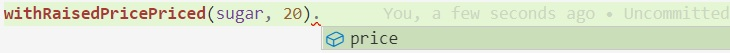
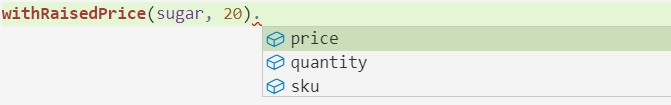
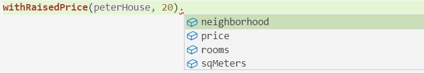

## Generics acotados

Este código
``` typescript
interface Priced {
    price: number
}

interface StockItem {
    sku: string,
    price: number,
    quantity: number
}

interface House extends Priced {
    sqMeters: number,
    neighborhood: string,
    rooms: number
}
``` 
define la interface `Priced`, y otras dos interfaces la extienden.

Para definir una función que **recibe** un `Priced`, no necesita ser genérica.

``` typescript
function doubledPrice(stuff: Priced) { return stuff.price * 2 }
```

Ahora, ¿qué pasa si queremos definir una función que **devuelve** un Priced? Supongamos que tenemos esta función
``` typescript
function withRaisedPricePriced(p: Priced, amount: number): Priced {
    return {...p, price: p.price + amount}
}
```

funciona ... pero "achica"  (en inglés, "narrows") el tipo de lo que devuelve a `Priced`
``` typescript
withRaisedPricePriced(sugar, 20).sku        // no compila
```
El mismo efecto se ve en el IntelliSense.


La solución es que esta función sea genérica ... pero no demasiado. Esta versión
``` typescript
function withRaisedPriceUnbound<T>(p: T, amount: number): T {
    return { ...p, price: p.price + amount }
}
```
no compila porque no puede garantizar que funcione `p.price`. Queremos decir que ese `T` tiene que ser `Priced`.  
En este punto viene en nuestro auxilio el concepto de definición genérica acotada ("bounded genericicity" o "generics with constraint" en inglés). 
``` typescript
function withRaisedPrice<T extends Priced>(p: T, amount: number): T {
    return { ...p, price: p.price + amount }
}
```
esta versión tiene toda la felicidad que le podemos pedir, en los chequeos y en el IntelliSense.





### Para jugar
En rigor, hay una pequeña ventaja en definir `doubledPrice` así
``` typescript
function doubledPrice<T extends Priced>(stuff: T) { return stuff.price * 2 }
```
¿cuál es? (hint: la que se me ocurrió a mí está relacionada con literales)

¿Funcionará `withRaisedPrice({price: 30, city: "Tunuyán"})`? ¿Cuál es el `T` en este caso?

Pensar cómo tipar esta función
``` typescript
function mostExpensive(o1, o2) {
    return (o1.price >= o2.price) ? o1 : o2
}
```
Esta da para debatir.

¡Miren esto!
``` typescript
function setPrice<T>(obj: T, amount: number): T & Priced {
    return {...obj, price: amount}
}
```
¿qué se gana poniendo `& Priced` en el tipo de respuesta?  
¿Cómo hacer para que acepte sólo objetos que tengan una propiedad `quantity` que sea un número?  
¿Y si no quiero especificar el tipo de `quantity`? (hint: usar dos variables de tipo).

Ya que estamos con los tipos intersección (o sea el `&`), ¿qué efecto tendrán en los parámetros? O sea, ¿cuál es el efecto de poner p.ej?
``` typescript
function doubledPrice<T extends Priced>(stuff: T & <...algo...>) { return stuff.price * 2 }
```
