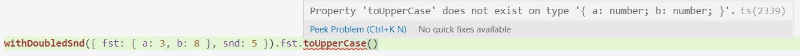
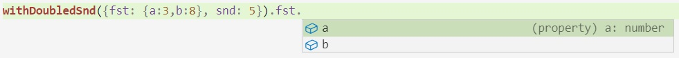

## Arrays - estructura genérica, funciones genéricas

En TS, no puedo definir que algo es un array, sin decir "un array _de qué_". Es decir, hay que especificar qué tipo deben tener los elementos que voy a agregar.
``` typescript
interface AccountApplication {
    customer: string,
    status: string,
    date?: string,
    requiredApprovals: number
}

function createNewApplication(customer): AccountApplication {
    return { customer, status: 'Pending', date: '2020-04-12', requiredApprovals: 4 }
}

const applications: AccountApplication[] = [
    createNewApplication('Nepomuceno Benítez'), createNewApplication("Fabiola Luzuriaga")
]
```

Esto es muy útil para el _intellisense_, p.ej. si tipeo `applications[0].`, va a proponer los atributos de AccountApplication.  
También para el _chequeo_, probar p.ej. `applications.push("hola")`.


### Tipos en la interface "funcional" de Array

Si un Array puede ser Array "de cualquier cosa' ¿cuál es el tipo del método `filter`? Seguro que tiene una flecha, porque `filter` es una función.  
A su vez, el parámetro de `filter` también es una función. La estructura nos queda así:
``` typescript
filter: ( callbackfn: (value: _1_ => _2_) ) => _3_
```
o sea, es una función que espera una función (el `callback`) por parámetro. El `value` es el parámetro de _esa_ función.

Nos falta definir los "casilleros" 1, 2 y 3.  
Hay uno que es fácil: la función que se le pasa al `filter` debe devolver un booleano.  
Además, de lo que devuelve, sabemos que es un array.
Refinemos un poco el tipo, poniendo lo que sabemos.
``` typescript
filter: ( callbackfn: (value: _1_ => boolean) ) => _3_[]
```
El casillero 1 corresponde a lo que va a recibir la función que se le pasa al `filter`, que es un elemento del array original.  
A su vez, el `filter` devuelve una sublista, o sea, algo del mismo tipo del array original. 

Entonces, los tipos de los casilleros 1 y 3 coinciden, y dependen de "de qué" es el array. Para un array de `AccountApplication` tendremos
``` typescript
Array<AccountApplication>.filter: ( callbackfn: (value: AccountApplication => boolean) ) => AccountApplication[]
```
si fuera un array de números tendríamos
``` typescript
Array<number>.filter: ( callbackfn: (value: number => boolean) ) => number[]
```

Obviamente, no hay muchas definiciones de `filter`, hay una sola. Si tuviera que dar el tipo _de lo que está definido_, o sea sin saber dónde se va a usar, ¿cómo quedaría? Así:

``` typescript
Array<T>.filter: ( callbackfn: (value: T => boolean) ) => T[]
```

O sea, que `filter` es una **función genérica**: aplica a arrays de cualquier tipo, recibe una función que va de valores de _ese_ tipo en `boolean`, y devuelve otro array del _mismo_ tipo.  
La `T` es el nombre que le estamos dando al tipo de los elementos del array. Es una _variable de tipo_.

A su vez, los arrays son **estructuras genéricas**, pueden manejar elementos de cualquier tipo.


### Preguntas y desafíos

Si agrego `createNewApplication(4)` a la definición de `applications` ... ¿qué pasa?  
Armar una expresión de la forma `applications.<algo_que_puede_ser_largo>`, que con este agregado, compila pero da `TypeError`.  
¿Dónde está el problema? Relacionar con lo que vimos sobre los peligros del tipo `any`. Arreglar para que `createNewApplication(4)` no compile.

Mirar el tipo de `filter` como lo muestra VSCode. Estudiar las diferencias con lo que dice acá arriba.  
En particular, dice `unknown` en lugar de `boolean` porque en realidad la función puede devolver _cualquier_ valor, que se va a interpretar como booleano de acuerdo a lo que dijimos sobre valores _truthy_ y _falsy_.  
Si puede ser cualquier cosa ¿por qué `unknown` y no `any`? En TS, `unknown` es un "primo simpático" de `any`, ver detalles en [este artículo que me gustó](https://mariusschulz.com/blog/the-unknown-type-in-typescript).

¿Qué diferencia hay si el tipo de `filter` lo pienso así?
``` typescript
Array<any>.filter: ( callbackfn: (value: any => boolean) ) => any[]
```
**Hint**  
poner `applications.filter((n: number) => n > 5)` y ver qué pasa.  
Idem para `applications.filter(req => req.customer.startsWith("Fabi"))[0].toUpperCase()`.

Escribir el tipo de la función `map`, y _después_{: style="color: Crimson"} verificar en VSCode.

¿Qué tipo tienen todos los arrays, pero solamente los arrays?

Definir el tipo más específico posible para `[3,5,createNewApplication("Perdita Durango")]`. O sea, un tipo que me permita agregarle números, `AccountApplication`, y ninguna otra cosa.

### Una curiosidad

Si tengo un array como en el último ejemplo y me quiero quedar con las `AccountApplication` usando un `filter`, ... podría, pero el tipo de lo que obtengo no va a ser `AccountApplication[]`.

Googleando otra cosa, surgió este caso, y cómo manejarlo usando una sutileza de TS llamada _type guards_.
Les curioses pueden ver [este post en StackOverflow](https://stackoverflow.com/questions/43010737/way-to-tell-typescript-compiler-array-prototype-filter-removes-certain-types-fro) y [esta página de la doc de TS](https://www.typescriptlang.org/docs/handbook/advanced-types.html#type-guards-and-differentiating-types).

## Maps - las variables de tipo se hacen explícitas

Los `Map` son otra estructura de datos que viene con TS (y con JS también). Un `Map` es ... un mapa clave-valor. Están definidos como una clase.  
Los `Map` no tienen la felicidad de los literales como los Arrays, o sea, para crear un `Map` hay que usar `new`:

``` typescript
const myMap = new Map()
```
El tipo que infiere TS para `myMap` es `Map<any,any>`. Los mismos corchetes que al lado de `Array` en la definición del tipo de `filter`. La clase `Map` es una **clase genérica**, en rigor es `Map<K,V>`. Las definiciones genéricas incluyen variables de tipo, la clase Map incluye dos, que son los tipos de clave (`K`) y valor (`V`). Como no especificamos estos tipos, TS los asume como `any`.

¿Cómo especificamos los tipos? Así:
``` typescript
const myMap: Map<number, AccountApplication> = new Map()
```

### Para mirar
Las dos operaciones básicas de un `Map<K,V>` son `set(key,value)` (para agregar un par clave-valor), y `get(key)` (para obtener el valor relacionado con una clave).  
Pensar los tipos para estos métodos, y _después_{: style="color: Crimson"} verificar en VSCode.

La clase `Map` tiene un constructor en el que se le pueden pasar valores, ver [la doc MDN para JS](https://developer.mozilla.org/en-US/docs/Web/JavaScript/Reference/Global_Objects/Map/Map). Ver qué tipo infiere si se usa este constructor.


## Definamos un tipo genérico nosotres
Para hacer definiciones genéricas, lo **único** que tenemos que hacer es incluir variables de tipo, así como las indicamos en `Map<K,V>`.

Vamos con un ejemplo rápido: esta definición
``` typescript
interface RestrictedPair {
    fst: string,
    snd: number
}
```
describe pares  ... donde siempre el primer componente es un número y el segundo un string. 
Puedo definir esta función
``` typescript
function withDoubledSndR(pair: RestrictedPair) { return { ...pair, snd: pair.snd * 2 } }
```
y va a detectar correctamente el tipo del resultado
``` typescript
withDoubledSndR({fst: 'Juana', snd: 28}).fst.toUpperCase()
```


Mediante esta **definición genérica**{: style="color: MediumSeaGreen"}
``` typescript
 interface Pair<T1,T2> {
    fst: T1,
    snd: T2
}
```
podemos armar funciones que trabajen sobre valores más genéricos, **sin perder el tipado**
``` typescript
function withDoubledSnd<T>(pair: Pair<T, number>) { 
    return { ...pair, snd: pair.snd * 2 } 
}
function withUppercaseFst<T>(pair: Pair<string, T>) { 
    return { ...pair, fst: pair.fst.toUpperCase() } 
}
```
Definida de esta forma, la función `withDoubledSnd` acepta solamente los pares cuyo segundo componente sea un número, y respeta el tipo del primer componente. No acepta ninguna de estas entradas
``` typescript
withDoubledSnd({a:5,b:8})                       // esto no compila
withDoubledSnd("pepe")                          // esto no compila
withDoubledSnd({fst:"hola", snd: "hola"})       // esto no compila
```
acepta los usos correctos del `fst` a la salida
``` typescript
withDoubledSnd({fst: {a:3,b:8}, snd: 5}).fst.a                 // esto compila
withDoubledSnd({ fst: "pepe", snd: 4 }).fst.toUpperCase()      // esto compila
```
y no acepta los incorrectos
``` typescript
withDoubledSnd({ fst: { a: 3, b: 8 }, snd: 5 }).fst.toUpperCase()   // esto no compila
withDoubledSnd({ fst: "pepe", snd: 4 }).fst.a                       // esto no compila
```
con mensajes claros


También ayuda a que el IntelliSense sea más preciso



y permite encadenar invocaciones a funciones sin perder los tipos
``` typescript
withUppercaseFst(withDoubledSnd({ fst: "pepe", snd: 4 })).snd + 5  // esto compila
withUppercaseFst(withDoubledSnd({ fst: "pepe", snd: 4 })).snd.a    // esto no compila
```


Veamos la diferencia con usar `any`:
``` typescript
interface PairAny {
    fst: any,
    snd: any
}

function withDoubledSndAny(pair: PairAny) { 
    return { ...pair, snd: pair.snd * 2 } 
}
function withUppercaseFstAny(pair: PairAny) { 
    return { ...pair, fst: pair.fst.toUpperCase() } 
}
```
como ya hablamos, al poner `any` deja pasar cualquier valor como `fst` y `snd` ... pero perdemos el tipado
``` typescript
withDoubledSndAny({ fst: { a: 3, b: 8 }, snd: 5 }).fst.a                 // esto compila
withDoubledSndAny({ fst: { a: 3, b: 8 }, snd: 5 }).fst.toUpperCase()     // esto ¡también compila!
```
obviamente, el segundo se rompe con un miserable `TypeError` al ejecutarlo. También perdemos el chequeo a la entrada
``` typescript
withDoubledSndAny({ fst: { a: 3, b: 8 }, snd: "hola" })                 // esto compila
```
... como es operación numérica, no da `TypeError` sino que devuelve `{..., snd: NaN}` ... que creo que es peor. Esta sí da `TypeError`
``` typescript
withUppercaseFstAny({ fst: 4, snd: { a: 3, b: 8 } })                   // esto compila
```

## Un ejemplo de función genérica de _orden superior_
Aunque no estoy seguro de que sea académicamente exacto, digamos que una función es de _orden superior_ si recibe funciones por parámetro y/o devuelve otra función. O sea, que opera con funciones.

Esta función
``` typescript
let selfCompose = function (fn: (arg0: any) => any) { return function (n: any) { return fn(fn(n)) } }
```
recibe una función por parámetro, y devuelve otra; implementa la _composición_ de una función consigo misma.

Como nos pasó antes, la función `selfCompose` no va a preservar los tipos.
``` typescript
function removeHeadToEach(reg: { a: string, b: string }) { 
    return { a: reg.a.slice(1), b: reg.b.slice(1) } 
}
selfCompose(removeHeadToEach)(5)                                              // compila
selfCompose(removeHeadToEach)({ a: "Alicia", b: "Gris" }).c.toUpperCase()     // compila
```
y los dos se rompen al ejecutar.

Si cambiamos el `any` por una variable de tipo
``` typescript
let selfComposeT = function (fn: (arg0: <T>) => <T>) { return function (n: <T>) { return fn(fn(n)) } }
```
ahora sí respeta los tipos
``` typescript
selfComposeT(removeHeadToEach)(5)                                              // no compila
selfComposeT(removeHeadToEach)({ a: "Alicia", b: "Gris" }).c.toUpperCase()     // no compila
```


### Para jugar
Deducir el tipo de `selfComposeT(removeHeadToEach)`, después verificar con VSCode.

Ver qué ofrece el intellisense con `selfComposeT(removeHeadToEach)({ a: "Alicia", b: "Gris" })`, relacionar con lo anterior.

¿Por qué hay una sola `T` en la definición de `selfComposeT`?

Relacionado, ¿qué pasaría si definimos `Pair` con una sola variable de tipo? O sea `interface Pair<T> { ... }`, con una sola `T`.

Usando la idea de definiciones genéricas, podemos resolver el caso de las funciones
``` typescript
function sumaFn(f1, f2) { return (n: number) => f1(n) + f2(n) }
function sumaFnPrima(f1, f2) { return (s: string) => f1(s) + f2(s) }
```
o sea, tener una sola función `sumaFn` que trabaje con funciones cualesquiera ... siempre que devuelvan números. ¿Se le animan?


## Moraleja final

En ningún caso, agregando o cambiando tipos se va a generar una diferencia en el comportamiento del código en ejecución. Lo que estamos buscando es: 

- mejorar la eficiencia del chequeo de tipos, o sea, que las expresiones que van a dar `TypeError` directamente no compilen.
- mejorar el Intellisense, o sea, que muestre solamente las opciones que corresponden al tipo del valor que estoy manejando en cada caso.

Esta limitación es bastante natural, dado que el sistema de tipos de TS, lo único que hace es aceptar o no un programa; la info de tipos no pasa al JS que se genera, que es lo que se ejecuta.  

