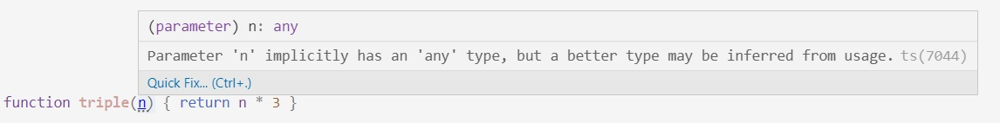

## Acerca de TypeScript
TypeScript es un compiler (¿o transpiler?), que _genera código JavaScript_.  
El `tsc` es el compilador de TypeScript a JavaScript. En este sentido, usar `tsc` es análogo a babelizar.

¿Por qué usamos TS en lugar de JS derecho viejo?  
- Lo más destacado que le agrega es un _sistema de tipos_ (de ahí la T de TypeScript), que permite hacer _chequeos estáticos_. Esto es, chequeos sobre el código antes que se ejecute. TS se puede ver como un mega-linter ...  
- ... pero **OJO** que también agrega otras cosas, en particular los _decorators_ que NestJS usa un montón, y de los que vamos a hablar.

En lo personal, creo que en rigor lo más valioso que brinda es la mejora al _intellisense_ de los editores.


### Atrás está JS
Es importante entender que el código que se ejecuta es JavaScript. Si p.ej. ejecutamos código generado desde TypeScript en Node, vemos que
- lo que se carga en Node es el `.js` que genera `tsc`, si cargamos directamente un `.ts` da error.
- en la consola de Node no podemos usar tipos.

Cuando probamos "desde NestJS", es Nest quien se encarga de la compilación. Pero la compilación siempre está, y siempre el código que se ejecuta-en-realidad es JS.

### Opciones de compilador
Por lo general, `tsc` toma las opciones de compilación de un archivo llamado `tsconfig.json`. El VS Code también tiene en cuenta ese archivo para mostrar errores.


## Un poquito sobre tipado
A **cada** identificador (var/let/const/parámetro/función/miembro de clase o interface/atributo de objeto), podemos asignarle o no un tipo. 

Si no asignamos el tipo de un identificador, TS hace una de estas dos cosas
1. le *infiere* un tipo
1. le asigna el tipo `any`, que es "cualquier cosa"

En particular, (creo que) a los parámetros de funciones siempre les asigna el tipo `any`. 


``` typescript
let a: number = 45
let b: any = 80
let c = 34       // infiere el tipo number
let d = c        // también

// TS sí infiere que el tipo de retorno de triple es number, pero deja
// el tipo de n en any
function triple(n) { return n * 3 }

// en este caso se indica explícitamente el tipo del parámetro
function cuadruple(n: number) { return n * 4 }

// acá como no es una operación aritmética, no puede inferir ni parámetro ni tipo de resultado
function arriba(s) { return s.toUpperCase() }
```

------
**Aclaración**{: style="color: SteelBlue"}:  

Los puntitos que aparecen en VSCode abajo del parámetro de `triple` son una sugerencia de TS: mirá que podrías indicar para `n` un tipo más interesante que `any`.

Hasta donde sé, el quick fix es de VSCode. Los editores agregan sus capacidades de inferencia a las de TS.


------


En cualquier asignación (a let/var/atributo, de argumento a parámetro) u operación, TS se fija que los tipos sean compatibles. Si no lo son, da error.  
Eso es el **error de tipo**, una de las principales contribuciones de TS.

Obviamente, TS sólo genera errores de tipo sobre los identificadores cuyo tipo (explícito o inferido) no sea `any`.

``` typescript
a = "hola"           // no compila
b = "hola"           // sí compila, se definió como any
triple("hola")       // sí compila, si no se dice nada del parámetro se asume any
cuadruple("hola")    // no compila
arriba(4)           // sí compila, análogo a triple("hola")
```

En el caso de `arriba(4)` salta un error de tipo al evaluar. En `triple("hola")` devuelve `NaN`, que casi siempre no es lo que queríamos.  
**Moraleja**: TypeScript no nos salva de _todos_ los errores de tipo. Para que detecte un error de tipo hay que especificar los tipos, o verificar que TS los infiera.


### El tipado te puede trabar

En este caso
``` typescript
function doble(n): (number | string) { return n * 2 }
cuadruple(doble(4))
```
la segunda línea no va a compilar, aunque mirando las funciones, es obvio que el resultado es un número.

Esto también te puede pasar en cualquier lenguaje con tipado explícito: que inhiba expresiones que en realidad sí se pueden ejecutar.

En general, hay formas de mejorar los tipos que se indican para lograr que compile. En este caso es obvio
``` typescript
function doble(n): number { return n * 2 }
cuadruple(doble(4))
```

Está la opción de último recurso de castear ... 
``` typescript
function doble(n): (number | string) { return n * 2 }
cuadruple(doble(4) as number)
```
... pero intentemos no hacerlo por favor.

En todo caso, recordemos que _el casteo no va a hacer transformaciones_, es sólo para que TS "deje pasar". Recordar que lo que se ejecuta es siempre JS.


### El tipo de las funciones
OK, si pongo `let a = 4`, está claro que el tipo es `number`. 

¿Qué pasa con `let f = cuadruple`? ¿Tienen tipo las funciones?

Claro que sí, a todo valor en TS se le puede asignar un tipo preciso.

Los tipos función son los que tienen flecha. En este caso es sencillo:
``` typescript
let f: (x: number) => number = cuadruple
```
no, no es necesario que el nombre del parámetro en el tipo coincida con el de la función.

Una vez que definí a `f` de ese tipo, solamente puedo asignarle valores de ese tipo.
``` typescript
f = (n: number) => n + 1             // compila
f = (s: string) => s.length + 1      // no compila, es una función pero no es compatible con recibir un número
f = 4           // no compila, no es una función
```

------
**Nota**{: style="color: SteelBlue"}:  
La compatibilidad entre tipos función es un tema ... un día nos sentamos y lo estudiamos.

------

Los tipos función se pueden complicar, porque una función puede _recibir_ funciones y/o _devolver_ una función.

``` typescript
function sumaFn(f1, f2) { return (n: number) => f1(n) + f2(n) }
```

¿Qué tipo inferirá VSCode para `f1` y `f2`? 
Tomando estos tipos, ¿cuál será el tipo de `sumaFn`?  
Tratar de pensarlo antes de probar en VSCode.
(... en este caso, VSCode se quedó un poco corto respecto de lo que esperaba ...)

¿y ahora?
``` typescript
function sumaFnPrima(f1, f2) { return (s: string) => f1(s) + f2(s) }
```

------
**Para pensar**{: style="color: SteelBlue"}:  
¿Vamos a definir una versión de `sumaFn` para cada tipo del parámetro? Si no es así, ¿cómo garantizamos que `f1` y `f2` reciban un parámetro _del mismo tipo_, si _no sabemos_ qué tipo puede ser?.

------


### Tipos y tipos
Volvamos a 
``` typescript
function doble(n): (number | string) { return n * 2 }
```
como ya vimos, no puedo usar `doble(4)` donde se espera un `number`. Tampoco donde se espera un `string`. Entonces ¿qué ventaja me da este tipo por sobre `any`?

Si tengo una _variable_ con este tipo, se restringe un poco lo que le puedo asignar. Para algo me ayuda. Pero tal vez, no para mucho.

**Moraleja**  
El sistema de tipos de TypeScript es **muy** (pero muy) complejo.  
Así como tiene el "or", tiene muchos otros chiches, que a veces nos van a ayudar, y a veces no tanto.  
Creo que conviene considerar a TS como un amigo bien intencionado, pero que no siempre llega a ayudarnos tanto como le gustaría. Lo tomamos como es, y listo.
